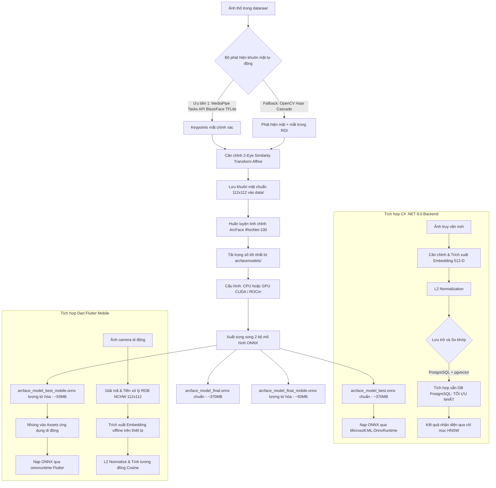
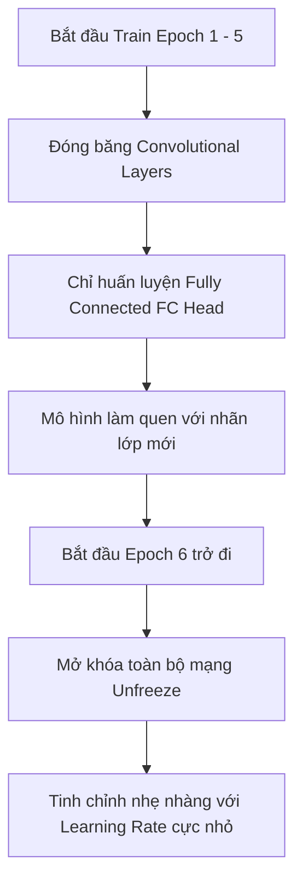
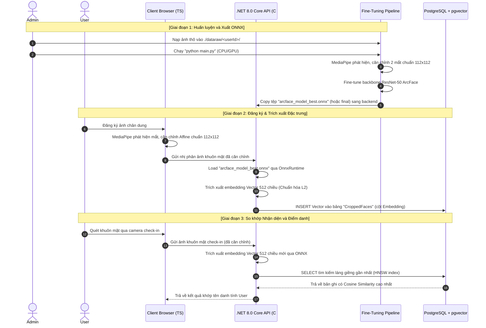

# Hướng dẫn và Giải pháp Tinh chỉnh (Fine-tune) ArcFace, Quản lý Vector & Xuất ONNX cho .NET 8.0

Tài liệu này cung cấp toàn bộ thiết kế hệ thống, hướng dẫn tổ chức dữ liệu, tiêu chuẩn tiền xử lý hình ảnh, kỹ thuật cắt (crop) & căn chỉnh (alignment) khuôn mặt, cách quản lý vector embedding bằng FAISS/Qdrant/PostgreSQL (pgvector) và hướng dẫn tích hợp mô hình ONNX trong **C# .NET 8.0**.

---

## 0. Hướng dẫn Khởi tạo Môi trường (Bước đầu tiên bắt buộc)

### Yêu cầu hệ thống

| Thành phần | Phiên bản tối thiểu | Ghi chú |
|---|---|---|
| Python | 3.10+ | Khuyên dùng 3.11 hoặc 3.12 |
| pip | 23+ | Nâng cấp ngay sau khi tạo venv |
| RAM | 8 GB | 4 GB có thể dùng được với CPU |
| Dung lượng đĩa | ~5 GB | Cho model + thư viện PyTorch |
| GPU (tùy chọn) | NVIDIA CUDA hoặc AMD ROCm | CPU cũng chạy được, chậm hơn |

### Cài đặt từng bước

```bash
# ─── Bước 1: Đi vào thư mục làm việc ───────────────────────────────────────
cd TreeOfThought/docs/nhan-dien-khuon-mat/ArcFaceFinetune

# ─── Bước 2: Tạo môi trường ảo Python (chỉ làm 1 lần) ──────────────────────
python3 -m venv venv

# ─── Bước 3: Kích hoạt môi trường ảo ───────────────────────────────────────
source venv/bin/activate          # Linux / macOS
# venv\Scripts\activate           # Windows

# ─── Bước 4: Nâng cấp pip ──────────────────────────────────────────────────
pip install --upgrade pip

# ─── Bước 5: Cài đặt toàn bộ thư viện cần thiết ────────────────────────────
# Dùng cho máy có GPU NVIDIA (CUDA):
pip install torch torchvision --index-url https://download.pytorch.org/whl/cu121

# Dùng cho máy có GPU AMD (ROCm - Linux):
pip install torch torchvision --index-url https://download.pytorch.org/whl/rocm6.0

# Dùng cho máy chỉ có CPU (hoặc test trước):
pip install torch torchvision

# ─── Bước 6: Cài đặt các thư viện xử lý ảnh và ML khác ────────────────────
pip install onnx onnxruntime numpy pillow opencv-python mediapipe
```

### Chạy pipeline fine-tune

```bash
# Kích hoạt venv (nếu chưa)
source venv/bin/activate

# Đặt ảnh thô vào dataraw/<userId>/ (tùy chọn - nếu không có sẽ dùng mock data)
mkdir -p dataraw/ten_user
# cp /path/to/photos/*.jpg dataraw/ten_user/

# Chạy pipeline (tự động tải model, xử lý ảnh, fine-tune, xuất ONNX)
python main.py
```

### Cấu hình thiết bị & Chế độ Align Face (trong `main.py`)

```python
DEVICE_CONFIG = "cpu"    # ← Mặc định: CPU (test ổn định trước)
# DEVICE_CONFIG = "cuda" # ← GPU NVIDIA CUDA
# DEVICE_CONFIG = "auto" # ← Tự động chọn GPU nếu có

# Lựa chọn chế độ căn chỉnh khuôn mặt (Align Face Mode):
ALIGN_MODE = "advanced"  # ← Tăng cường: 3D Face Landmarker (tối ưu cho khẩu trang, kính, sinh đôi...)
# ALIGN_MODE = "standard"  # ← Tiêu chuẩn: BlazeFace nhanh, nhẹ (chung chung đủ tốt cho ảnh chuẩn)
```

> **Lưu ý AMD GPU (RDNA3 - gfx1103)**: Code đã tích hợp sẵn `HSA_OVERRIDE_GFX_VERSION=11.0.0`
> để fix lỗi rocBLAS với chip AMD Radeon RX 7600/7700 (gfx1103). Không cần set thủ công.

### Cấu hình EPOCHS, BATCH_SIZE và dữ liệu

#### Tại sao EPOCHS = 3 mặc định là chưa đủ?

Khi chạy với dữ liệu thực, nếu **Loss = 0.0000 ngay từ Epoch 1** thì đó là dấu hiệu **memorization (học vẹt)**, không phải fine-tune thực sự. Nguyên nhân thường là:

- Chỉ có **1 danh tính (1 user)** — ArcFace cần tối thiểu **2 người** để học phân biệt inter-class
- Quá ít ảnh (< 5 ảnh/người)

#### Yêu cầu dữ liệu tối thiểu

| Mức độ | Số người | Ảnh/người | Ghi chú |
|---|---|---|---|
| ⚠️ Không đủ | 1 | bất kỳ | ArcFace không học được |
| 🟡 Tối thiểu | ≥ 2 | ≥ 5 | Để pipeline không crash |
| ✅ Khuyến nghị | ≥ 3 | ≥ 10 | Kết quả embedding tốt hơn |
| 🚀 Production | ≥ 10 | ≥ 20 | Embedding phân biệt rõ ràng |

Cấu trúc `dataraw/` đúng cho 3 người:
```
dataraw/
├── nguyen_van_a/     ← ít nhất 5–10 ảnh
│   ├── photo1.jpg
│   └── ...
├── tran_thi_b/       ← ít nhất 5–10 ảnh
│   └── ...
└── le_van_c/         ← ít nhất 5–10 ảnh
    └── ...
```

#### Khuyến nghị EPOCHS theo kích thước dataset

| Tình huống | Số người | Ảnh/người | EPOCHS | BATCH_SIZE | LR |
|---|---|---|---|---|---|
| Test nhỏ | 2–5 | 5–10 | **20–30** | 4 | 0.0001 |
| Production nhỏ | 10–50 | 10–20 | **30–50** | 8 | 0.0001 |
| Production lớn | 50–500 | 20–50 | **50–100** | 16 | 0.00005 - 0.0001 |
| Enterprise | > 500 | 50+ | **100+** | 32 | 0.0001 |

> [!WARNING]
> **Learning Rate cho Fine-tuning:** 
> Khi fine-tune một mạng nơ-ron tích chập sâu như IResNet-100 trên tập dữ liệu rất nhỏ (ví dụ 116 ảnh), thiết lập `LEARNING_RATE = 0.001` là **quá cao**. Điều này sẽ gây ra hiện tượng dao động (oscillations) cực mạnh làm mô hình bất ổn định. Khuyên dùng **`LEARNING_RATE = 0.0001`** hoặc **`0.00005`** để quá trình hội tụ diễn ra mượt mà và bảo toàn chất lượng biểu diễn của mô hình ArcFace gốc.

Cập nhật trong `main.py` (dòng 85–95) theo tình huống thực tế:

```python
# Ví dụ cho dataset nhỏ / trung bình (2–50 người)
BATCH_SIZE    = 8
EPOCHS        = 100
LEARNING_RATE = 0.0001  # Thấp để giữ ổn định, chống Catastrophic Forgetting
```

> **Dấu hiệu fine-tune tốt**: Loss **bắt đầu lớn (10–30)** rồi **giảm dần mượt mà** qua các epoch, không phải bằng 0 ngay từ Epoch 1. 

### Thư mục model được tải tự động

Khi chạy `python main.py`, các model sau sẽ được **tự động tải về** `./arcfacemodels/`:

| File | Kích thước | Nguồn | Mục đích |
|---|---|---|---|
| `blaze_face_short_range.tflite` | ~1 MB | Google MediaPipe | Phát hiện khuôn mặt |
| `face_landmarker.task` | ~3 MB | Google MediaPipe | Landmark 468 điểm (tùy chọn) |
| `arcface-r100-glint360k.pth` | ~355 MB | HuggingFace (Vec2Face) | Backbone ArcFace pretrained (Glint360K) |

> Nếu `arcface-r100-glint360k.pth` không tải được tự động, pipeline sẽ cảnh báo và khởi tạo mô hình ngẫu nhiên (hoặc cho phép người dùng tự đặt file vào `./arcfacemodels/`).

### Kết quả đầu ra (Dual-Model Strategy)

Để tối ưu hóa ứng dụng thực tế, pipeline sẽ **tự động xuất ra 2 bộ mô hình ONNX độc lập** (mỗi bộ gồm 1 file ONNX chuẩn cho C# và 1 file ONNX lượng tử hóa cho Flutter di động):

1. **Bộ mô hình Epoch cuối cùng (Final Epoch Model):**
   - ONNX chuẩn: `./arcface_model_final.onnx`
   - ONNX di động: `./arcface_model_final_mobile.onnx`
2. **Bộ mô hình có Loss nhỏ nhất (Best Loss Epoch Model - Khuyên dùng):**
   - ONNX chuẩn: `./arcface_model_best.onnx`
   - ONNX di động: `./arcface_model_best_mobile.onnx`
   - *Đây là mô hình đạt được sai số tối thiểu trên tập dữ liệu huấn luyện, đảm bảo độ tổng quát cao nhất mà không bị quá khớp ở các epoch dao động phía sau.*

Trong C# .NET 8.0, nạp mô hình Best Loss bằng:
```csharp
var session = new InferenceSession(@"/work/.../arcface_model_best.onnx");
```


---

### 🏆 Khuyến nghị đạt Face Embedding chất lượng cao nhất

Đây là tổng hợp best practices từ nghiên cứu ArcFace (InsightFace) và kinh nghiệm production thực tế.

---

#### 1. Chất lượng & Đa dạng ảnh đầu vào — Quan trọng nhất

> Embedding chất lượng cao **phụ thuộc 70% vào dữ liệu**, chỉ 30% vào hyperparameter.

| Tiêu chí | ✅ Tốt | ❌ Không tốt |
|---|---|---|
| **Góc mặt** | Thẳng mặt, nghiêng ±30°, profile nhẹ | Chỉ có 1 góc duy nhất |
| **Ánh sáng** | Đa dạng: trong nhà, ngoài trời, ánh đèn | Chỉ chụp 1 điều kiện ánh sáng |
| **Biểu cảm** | Vui, nghiêm, cười, tự nhiên | Chỉ cười hoặc chỉ nghiêm |
| **Phân giải** | ≥ 200×200 px (trước khi crop) | Ảnh mờ, nén nhiều |
| **Che khuất** | ≤ 20% mặt bị che | Đeo khẩu trang, kính đen |
| **Thời gian** | Nhiều buổi chụp khác nhau | Tất cả từ 1 buổi duy nhất |

**Gợi ý thực tế cho hệ thống đăng ký user:**
```
Yêu cầu user chụp 5–10 ảnh từ webcam theo hướng dẫn:
  1. Nhìn thẳng vào camera
  2. Xoay mặt nhẹ sang trái (~20°)
  3. Xoay mặt nhẹ sang phải (~20°)
  4. Ngước nhìn lên nhẹ
  5. Cúi xuống nhẹ
  6. Cười tự nhiên
```

---

#### 2. Căn chỉnh khuôn mặt — Bắt buộc nhất quán

ArcFace **rất nhạy cảm** với alignment. Một khuôn mặt không căn chỉnh đúng có thể cho cosine similarity < 0.3 dù cùng 1 người.

**Pipeline phải nhất quán:**
```
Khi finetune:   ảnh thô → MediaPipe detect → 2-Eye Alignment → 112×112 → embedding
Khi recognize:  ảnh query → CÙNG MediaPipe detect → CÙNG 2-Eye Alignment → 112×112 → embedding
```

> ⚠️ **Nguy hiểm**: Dùng thuật toán align khác nhau giữa finetune và recognize sẽ cho kết quả sai hoàn toàn, dù model tốt đến đâu.

Tham số căn chỉnh chuẩn (đã được hardcode trong `main.py` hàm `align_face_python`):
```python
target_dist = 35.2372   # khoảng cách 2 mắt (pixel) trong 112×112
tx = 55.9132            # tâm mắt X trong 112×112
ty = 51.59885           # tâm mắt Y trong 112×112
```

---

#### 3. Hyperparameter ArcFace — Tinh chỉnh để embedding tốt hơn

```python
# Trong main.py — ArcMarginProduct:
s  = 30.0   # Scale: nên giữ 30–64 (lớn hơn → decision boundary sắc nét hơn)
m  = 0.50   # Margin: nên giữ 0.3–0.5 (lớn hơn → inter-class separation tốt hơn)
            # Nếu dataset nhỏ (< 50 người): dùng m = 0.3 để dễ hội tụ hơn
            # Nếu dataset lớn (> 100 người): dùng m = 0.5 để phân biệt rõ hơn
```

Cài đặt nhanh theo quy mô:

| Dataset | s | m | EPOCHS | LR | BATCH_SIZE |
|---|---|---|---|---|---|
| Nhỏ: 2–10 người, 5–15 ảnh/người | 30 | 0.3 | 20–30 | 0.0005 | 4 |
| Vừa: 10–50 người, 10–30 ảnh/người | 30 | 0.5 | 15–20 | 0.0005 | 8 |
| Lớn: 50–500 người, 20+ ảnh/người | 64 | 0.5 | 10–15 | 0.001 | 16–32 |

---

#### 4. L2 Normalization — Bắt buộc khi so sánh embedding

Embedding ra từ ONNX **phải được normalize** trước khi so sánh:

**Python (khi trích xuất để lưu DB):**
```python
import numpy as np

embedding = session.run(None, {'input': face_tensor})[0][0]  # shape (512,)
embedding_normalized = embedding / np.linalg.norm(embedding)  # L2 normalize
# Lưu embedding_normalized vào PostgreSQL
```

**C# .NET (khi trích xuất để so sánh):**
```csharp
float[] embedding = session.Run(input)[0].AsEnumerable<float>().ToArray();

// L2 normalize
float norm = (float)Math.Sqrt(embedding.Sum(x => x * x));
float[] normalized = embedding.Select(x => x / norm).ToArray();
```

> Sau khi normalize, dùng **cosine similarity** hoặc **dot product** đều cho cùng kết quả (vì vector đã có độ dài = 1).

---

#### 5. Ngưỡng nhận diện (Threshold) — Hiệu chỉnh cho từng môi trường

| Ngưỡng cosine similarity | Ý nghĩa | Dùng khi |
|---|---|---|
| `> 0.6` | Cùng người — rất chắc chắn | Hệ thống bảo mật cao |
| `> 0.5` | Cùng người — khá chắc chắn | Ứng dụng thông thường ✅ |
| `> 0.4` | Có thể cùng người | Môi trường kiểm soát tốt |
| `< 0.3` | Khác người | — |

**Khuyến nghị**: Bắt đầu với ngưỡng `0.5` rồi điều chỉnh dựa trên FP/FN thực tế.

```sql
-- PostgreSQL pgvector: tìm người khớp, ngưỡng cosine similarity > 0.5
SELECT user_id, 1 - (embedding <=> query_embedding::vector) AS similarity
FROM face_embeddings
WHERE 1 - (embedding <=> query_embedding::vector) > 0.5
ORDER BY similarity DESC
LIMIT 1;
```

---

#### 6. Dấu hiệu chẩn đoán chất lượng embedding

Sau fine-tune, kiểm tra chất lượng bằng cách đo cosine similarity:

```python
# Test nhanh: 2 ảnh cùng người vs 2 ảnh khác người
import numpy as np

def cosine_sim(a, b):
    return np.dot(a, b) / (np.linalg.norm(a) * np.linalg.norm(b))

# Mong đợi:
# cosine_sim(emb_person_A_photo1, emb_person_A_photo2) > 0.6  (cùng người)
# cosine_sim(emb_person_A_photo1, emb_person_B_photo1) < 0.3  (khác người)
```

| Kết quả | Chẩn đoán | Giải pháp |
|---|---|---|
| Cùng người: 0.8–1.0, Khác người: 0.0–0.2 | 🏆 Xuất sắc | Giữ nguyên |
| Cùng người: 0.6–0.8, Khác người: 0.1–0.3 | ✅ Tốt | Đủ dùng production |
| Cùng người: 0.4–0.6, Khác người: 0.2–0.4 | 🟡 Cần cải thiện | Thêm ảnh, tăng EPOCHS |
| Cùng người: < 0.4 hoặc Khác người: > 0.5 | ❌ Embedding sai | Kiểm tra alignment pipeline |

---

#### 7. Các lỗi phổ biến và cách tránh

| Lỗi | Nguyên nhân | Cách tránh |
|---|---|---|
| Loss = 0 ngay từ epoch 1 | Chỉ 1 người trong dataset | Thêm tối thiểu 2 người |
| Cosine similarity cao với mọi người | Thiếu L2 normalize | Normalize embedding trước khi lưu và so sánh |
| Recognize sai dù finetune tốt | Align khác nhau giữa train và infer | Dùng cùng `align_face_python()` cho cả 2 bước |
| Embedding không ổn định | Ảnh chụp điều kiện quá khác nhau | Chuẩn hóa điều kiện chụp hoặc thêm ảnh đa dạng hơn |
| Model lớn nhưng accuracy thấp | Fine-tune quá ít epochs | Tăng EPOCHS, giảm LR |

---

### 🏆 Khuyến nghị Chuyên sâu cho các Điều kiện Khắc nghiệt

Để giải quyết các bài toán biên cực kỳ phức tạp trong thực tế (trẻ em từ 2 tuổi, người cao tuổi 70 tuổi, đeo kính dày, bịt khẩu trang kín mít, và phân biệt các cặp sinh đôi/sinh ba), hệ thống áp dụng các giải pháp thiết kế dưới đây:

#### 1. Trẻ em (2 tuổi) & Người già (70 tuổi)
* **Thách thức:** Cấu trúc xương mặt của trẻ em chưa phát triển hoàn thiện (tỉ lệ mắt-mũi-cằm rất khác người lớn), da trẻ em quá mịn màng thiếu các đường nét gai góc; trong khi người già da nhiều nếp nhăn, sụp mí mắt gây sai số lớn cho các bộ trích xuất điểm mốc truyền thống.
* **Giải pháp Pipeline:**
  - **MediaPipe Face Landmarker 3D (468 điểm)**: Trích xuất các điểm mốc hốc mắt cực kỳ chính xác nhờ việc tối ưu hình học mạng lưới 3D, bất chấp sự thay đổi cơ mặt do nếp nhăn hay sụp mí.
  - **Tăng cường kết cấu da (Texture Augmentation)**: Áp dụng ngẫu nhiên **Gaussian Blur** và **Color Jitter** (độ sáng, độ tương phản) khi train để mô hình học cách bỏ qua các đặc trưng về nếp nhăn sâu (ở người già) hoặc bề mặt da quá trơn láng (ở trẻ em), tập trung hoàn toàn vào cấu trúc hình học bất biến của xương mặt.

#### 2. Đối phó với Kính mắt & Khẩu trang / Khăn choàng (Masked & Glass Occlusion)
* **Thách thức:** Khẩu trang che khuất tới 50% - 60% mặt dưới (mất hoàn toàn mũi, miệng); kính mắt dày hoặc phản quang che khuất vùng hốc mắt, khiến mô hình bị phân tâm bởi màu sắc, hình dáng của khẩu trang/kính thay vì cấu trúc sinh trắc học của khuôn mặt.
* **Giải pháp Align (Tiền xử lý):**
  - **Face Landmarker 3D**: Suy luận chính xác vị trí mắt nhờ lưới 3D bao quanh hốc mắt ngay cả khi phần dưới khuôn mặt bị che kín mít.
  - **Robust Fallback**: Nếu người dùng trùm kín mít chỉ để lộ 1 mắt, thuật toán sẽ tự động tính toán vị trí mắt bị che khuất dựa trên trục đối xứng của khuôn mặt (được xác định qua đỉnh mũi landmark `4` và trán landmark `168`) để tiếp tục căn chỉnh xoay Affine chính xác.
* **Giải pháp Tinh chỉnh (Huấn luyện):**
  - **Mask & Glass Augmentation (Vẽ khẩu trang/kính giả lập)**: Trong quá trình huấn luyện, DataLoader tự động vẽ đè ngẫu nhiên các khối đa giác khẩu trang (màu xanh, trắng, đen) và gọng kính với xác suất **30%** trực tiếp lên ảnh 112x112. 
  - Kỹ thuật này ép buộc mô hình ArcFace bỏ qua vùng bị che khuất và tập trung khai thác tối đa **Vùng quanh mắt (Periocular Region)** bao gồm lông mày, hốc mắt, gốc mũi và trán. Đây là vùng có đặc trưng sinh trắc học bền vững nhất của con người.

#### 3. Phân biệt Sinh đôi (Twins) và Sinh ba (Triplets)
* **Thách thức:** Sinh đôi cùng trứng có cấu trúc hình học khuôn mặt giống nhau đến 99%. Các mô hình nhận diện thông thường sẽ trích xuất vector có độ tương đồng Cosine cực cao (> 0.7), dẫn đến False Positive.
* **Giải pháp Kỹ thuật:**
  - Trong cấu trúc tổn thất của ArcFace (ArcMarginProduct), chúng ta nâng cao tham số **Scale ($s$)** và **Margin ($m$)**:
    $$\text{ArcFace Loss Margin: } s = 64.0, \quad m = 0.55$$
  - **Ý nghĩa toán học**:
    - **Scale $s = 64.0$**: Phóng đại khoảng cách góc trong không gian embedding, giúp đẩy các vector xa nhau hơn trên bề mặt hình cầu Hyper-sphere.
    - **Margin $m = 0.55$** (tăng từ 0.50): Siết chặt ranh giới quyết định (decision boundary) giữa các lớp danh tính. Nó ép buộc mô hình phải trừng phạt cực kỳ nặng các sai số góc nhỏ, buộc mạng nơ-ron phải săn lùng và khai thác các **khác biệt vi mô (micro-features)** cực nhỏ như: cấu trúc mí mắt, nốt ruồi, sẹo nhỏ, lông mày bất đối xứng... để phân tách hai người sinh đôi thành hai vùng vector riêng biệt.
  - **Chiến lược train**: Huấn luyện với tốc độ học nhỏ hơn (**`LR = 0.0001`**) và số Epochs dài hơn (**30 - 50 epochs**) để mô hình có đủ thời gian tối ưu hóa các đặc trưng vi mô này mà không làm hỏng các trọng số đại thể của Backbone pre-trained.

#### Bảng tổng hợp cấu hình tối ưu theo tình huống thực tế:

| Tình huống đặc biệt | Margin ($m$) | Scale ($s$) | Kỹ thuật Augmentation bắt buộc | Cosine Threshold Khuyến nghị |
|---|---|---|---|---|
| **Người bình thường** | `0.50` | `30.0` | Standard crop & align | `> 0.50` |
| **Đeo khẩu trang / Bịt mặt** | `0.50` | `64.0` | Mask Occlusion Synthesis (30%) | `> 0.40` (vùng Periocular hẹp hơn) |
| **Đeo kính mắt** | `0.50` | `64.0` | Glass Occlusion Synthesis (20%) | `> 0.45` |
| **Trẻ em & Người già** | `0.50` | `30.0` | Gaussian Blur + Contrast Jitter | `> 0.48` |
| **Sinh đôi / Sinh ba** | **`0.55`** | **`64.0`** | High resolution + Texture sharpening | **`> 0.60`** (bắt buộc chặt chẽ) |

---

## 1. Tổng quan Kiến trúc Pipeline Hệ thống

Hệ thống nhận diện khuôn mặt hoạt động theo chu kỳ khép kín từ khâu tiền xử lý hình ảnh, trích xuất đặc trưng qua mạng thần kinh nhân tạo đến khâu truy vấn siêu nhanh bằng cơ sở dữ liệu vector.



---

## 2. Giải đáp Câu hỏi Nghiệp vụ và Tổ chức Dữ liệu

### Câu hỏi 1: Tôi cần tổ chức folder data, ảnh để finetune như thế nào?

Bạn có thể cung cấp dữ liệu theo hai hình thức (Ảnh thô chưa cắt hoặc Ảnh đã cắt sẵn):

> **[Cập nhật kỹ thuật]**: `main.py` tự động phát hiện khuôn mặt theo thứ tự ưu tiên:
> 1. **MediaPipe Tasks API** (`FaceDetector` + `BlazeFace TFLite`) — mediapipe ≥ 0.10, độ chính xác cao nhất, trả về keypoints mắt trực tiếp. Model `blaze_face_short_range.tflite` (~1MB) được tự động tải về `./arcfacemodels/`.
> 2. **OpenCV Haar Cascade** — fallback khi model BlazeFace không tải được, phát hiện mặt + mắt trong ROI.

#### A. Hình thức 1: Cung cấp ảnh thô ban đầu (Khuyên dùng)
Bạn tạo thư mục `dataraw/` chứa các thư mục con theo ID của User, bên trong là các tệp ảnh chụp thực tế chưa qua xử lý (pipeline sẽ tự động quét, cắt và căn chỉnh):

```text
TreeOfThought/docs/nhan-dien-khuon-mat/ArcFaceFinetune/
├── dataraw/
│   ├── user_id_1/
│   │   ├── captured_image_1.jpg
│   │   ├── webcam_photo.png
│   │   └── ...
│   ├── user_id_2/
│   │   ├── checkin.jpg
│   │   └── ...
│   └── user_id_N/
│       └── face.jpg
```

Khi bạn chạy `python main.py`, script sẽ tự động:
1. Phát hiện thư mục `dataraw/`.
2. Sử dụng thư viện **MediaPipe Face Detection** chạy cục bộ để tìm tọa độ mắt trái và mắt phải của từng khuôn mặt.
3. Thực thi thuật toán **Căn chỉnh Affine** đồng nhất.
4. Cắt và lưu kết quả ảnh khuôn mặt đạt chuẩn `112x112` vào thư mục `data/` để tiến hành huấn luyện.

#### B. Hình thức 2: Dữ liệu ảnh khuôn mặt đã được cắt sẵn từ UI
Nếu bạn đã có sẵn ảnh khuôn mặt được cắt vuông từ trình duyệt (ví dụ qua MediaPipe của Web App), bạn có thể nạp trực tiếp vào thư mục `data/`:

```text
TreeOfThought/docs/nhan-dien-khuon-mat/ArcFaceFinetune/
├── data/
│   ├── user_id_1/
│   │   ├── face_aligned_1.png
│   │   └── ...
│   └── user_id_N/
│       └── face_aligned.png
```

> [!TIP]
> **Tự động sinh dữ liệu ảo (Mock Dataset):**
> Nếu cả `dataraw/` và `data/` đều trống hoặc chưa được tạo, `main.py` sẽ tự động sinh dữ liệu giả lập (3 user ảo với 5 ảnh/user dạng vector hình học) để đảm bảo pipeline luôn chạy thành công ngay lập tức để bạn trải nghiệm.

---

### Câu hỏi 2: Mỗi ảnh để đưa vào tổ chức folder có cần tiêu chuẩn gì không? Từ ảnh gốc cần crop theo tiêu chuẩn nào không?

Để ArcFace đạt độ chính xác tối đa, ảnh khuôn mặt đưa vào huấn luyện hoặc nhận diện cần phải được **Cắt (Crop)** và **Căn chỉnh (Align)** chuẩn hóa:

#### A. Tiêu chuẩn Kỹ thuật của Ảnh Đầu Vào
- **Kích thước đầu vào:** **Exactly 112x112 pixels** (hoặc 224x224 nếu dùng kiến trúc lớn hơn).
- **Hệ màu:** **RGB** (3 kênh màu). Nếu sử dụng thư viện Python OpenCV (đọc mặc định là BGR), bạn bắt buộc phải chuyển sang RGB.
- **Công thức chuẩn hóa (Normalization):** Đưa giá trị pixel từ `[0, 255]` về khoảng `[-1.0, 1.0]`:
  $$x_{norm} = \frac{x - 127.5}{127.5}$$

#### B. Tiêu chuẩn Cắt (Crop) và Căn chỉnh (Alignment) từ ảnh gốc

> [!NOTE]
> Việc chỉ cắt theo hộp bao (bounding box) đơn thuần và resize sẽ khiến mắt, mũi, miệng bị lệch vị trí, làm giảm độ chính xác của mô hình đi **10-15%**. Phương pháp chuẩn công nghiệp là sử dụng **Affine Transformation (Biến đổi tương đồng)** dựa trên 5 điểm mốc (landmarks).

##### Phương pháp 1: Căn chỉnh 5 điểm mốc Landmark (Khuyến nghị cho độ chính xác cao)
Sử dụng các mô hình phát hiện điểm mốc (như MediaPipe, RetinaFace hoặc MTCNN) để lấy tọa độ của 5 điểm mốc trên mặt: 
1. Mắt trái ($left\_eye$)
2. Mắt phải ($right\_eye$)
3. Đỉnh mũi ($nose$)
4. Khóe miệng trái ($left\_mouth$)
5. Khóe miệng phải ($right\_mouth$)

Sau đó, thực hiện phép biến đổi Affine để ánh xạ 5 điểm này vào tọa độ chuẩn trên khung ảnh `112x112`:
- **Target Left Eye:** `(38.2946, 51.6963)`
- **Target Right Eye:** `(73.5318, 51.5014)`
- **Target Nose:** `(56.0252, 71.7366)`
- **Target Left Mouth:** `(41.5493, 92.3655)`
- **Target Right Mouth:** `(70.7299, 92.2041)`

*Đoạn mã ví dụ bằng Python (Dùng OpenCV để Align):*
```python
import cv2
import numpy as np

def align_face(image_rgb, landmarks_5point):
    """
    landmarks_5point: Array dạng [[x, y], [x, y], ...] chứa 5 điểm mốc
    """
    # Bộ điểm mốc chuẩn của ArcFace
    reference_landmarks = np.array([
        [38.2946, 51.6963],
        [73.5318, 51.5014],
        [56.0252, 71.7366],
        [41.5493, 92.3655],
        [70.7299, 92.2041]
    ], dtype=np.float32)
    
    src_points = np.array(landmarks_5point, dtype=np.float32)
    
    # Tính toán ma trận biến đổi affine
    tform = cv2.estimateAffinePartial2D(src_points, reference_landmarks)[0]
    
    # Warp hình ảnh về kích thước 112x112
    aligned_face = cv2.warpAffine(image_rgb, tform, (112, 112), borderValue=0)
    return aligned_face
```

##### Phương pháp 2: Cắt hình vuông mở rộng (Giải pháp đơn giản nếu không có Landmark)
Nếu không có hệ thống phát hiện 5 điểm mốc trên Client hoặc Backend C#, ta có thể crop từ bounding box khuôn mặt:
1. Xây dựng hộp vuông dựa trên cạnh lớn nhất: $size = \max(width, height)$.
2. Mở rộng hộp vuông ra khoảng **15% - 20%** để tránh mất cấu trúc trán và tai.
3. Cắt và resize về `112x112`.

---

## 3. Tiêu chuẩn Căn chỉnh Đồng nhất Đa nền tảng (Python, TypeScript, C#)

> [!IMPORTANT]
> **TÍNH ĐỒNG NHẤT CỰC KỲ QUAN TRỌNG:**
> Để mô hình ArcFace nhận diện chính xác nhất, khuôn mặt được trích xuất ở 3 giai đoạn: **(1) Cắt ảnh thô để huấn luyện (Python)**, **(2) Đăng ký ảnh mới (TypeScript trên Browser)**, và **(3) Nhận diện điểm danh (C# trên Backend)** bắt buộc phải được căn chỉnh hình học giống hệt nhau.

Để đạt được sự đồng nhất 100% mà không phụ thuộc vào các thư viện ma trận cồng kềnh trên Browser (JS/TS) hay Backend (.NET), chúng ta áp dụng **Thuật toán Căn chỉnh 2 Điểm Mắt (2-Eye Similarity Transform)**. Thuật toán này xoay ảnh để hai mắt nằm ngang, tỷ lệ khoảng cách giữa hai mắt chuẩn hóa về $35.24$ pixel, và đưa trung điểm hai mắt về tọa độ chuẩn `(55.91, 51.60)` trên canvas $112 \times 112$.

Dưới đây là mã nguồn đồng nhất bằng 3 ngôn ngữ:

### 3.1. Mã nguồn Python (Dùng khi chuẩn bị dữ liệu & Huấn luyện)
```python
import cv2
import numpy as np

def align_face_python(image_bgr, eye_left, eye_right):
    """
    eye_left: (x, y) của mắt xuất hiện ở phía bên trái bức ảnh
    eye_right: (x, y) của mắt xuất hiện ở phía bên phải bức ảnh
    """
    # Tính toán trung điểm hiện tại, khoảng cách và góc nghiêng của mắt
    cx = (eye_left[0] + eye_right[0]) / 2.0
    cy = (eye_left[1] + eye_right[1]) / 2.0
    dx = eye_right[0] - eye_left[0]
    dy = eye_right[1] - eye_left[1]
    
    current_dist = np.sqrt(dx**2 + dy**2)
    angle_deg = np.degrees(np.arctan2(dy, dx))
    
    # Kích thước đích của ArcFace
    target_dist = 35.2372
    tx = 55.9132
    ty = 51.59885
    
    scale = target_dist / current_dist
    
    # Tính ma trận quay và tỷ lệ
    M = cv2.getRotationMatrix2D((cx, cy), angle_deg, scale)
    
    # Dịch chuyển trung điểm mắt về tọa độ đích
    M[0, 2] += (tx - cx)
    M[1, 2] += (ty - cy)
    
    # Áp dụng biến đổi Affine
    aligned_face = cv2.warpAffine(image_bgr, M, (112, 112), flags=cv2.INTER_CUBIC, borderValue=0)
    return aligned_face
```

### 3.2. Mã nguồn TypeScript / JavaScript (Dùng trên Trình duyệt khi User đăng ký ảnh)
Sử dụng trực tiếp HTML5 `<canvas>` 2D context để thực thi Affine Transform gốc mà không cần bất kỳ thư viện ngoài nào:
```typescript
interface Point {
  x: number;
  y: number;
}

function alignFaceBrowser(
  imageEl: HTMLImageElement | HTMLVideoElement | HTMLCanvasElement,
  eyeLeft: Point,
  eyeRight: Point
): HTMLCanvasElement {
  const canvas = document.createElement("canvas");
  canvas.width = 112;
  canvas.height = 112;
  const ctx = canvas.getContext("2d");
  if (!ctx) throw new Error("Không thể khởi tạo Canvas 2D Context");

  const cx = (eyeLeft.x + eyeRight.x) / 2;
  const cy = (eyeLeft.y + eyeRight.y) / 2;
  const dx = eyeRight.x - eyeLeft.x;
  const dy = eyeRight.y - eyeLeft.y;

  const currentDist = Math.sqrt(dx * dx + dy * dy);
  const angleRad = Math.atan2(dy, dx);

  const targetDist = 35.2372;
  const tx = 55.9132;
  const ty = 51.59885;
  const scale = targetDist / currentDist;

  ctx.save();
  // Thực hiện các phép biến đổi hình học
  ctx.translate(tx, ty);             // 4. Dịch chuyển về trung điểm mắt đích
  ctx.scale(scale, scale);           // 3. Thay đổi tỷ lệ
  ctx.rotate(-angleRad);             // 2. Xoay ngược góc nghiêng để mắt nằm ngang
  ctx.translate(-cx, -cy);           // 1. Đưa trung điểm mắt hiện tại về gốc tọa độ

  // Vẽ hình ảnh gốc lên canvas đã được biến đổi
  ctx.drawImage(imageEl, 0, 0);
  ctx.restore();

  return canvas;
}
```

### 3.3. Mã nguồn C# .NET 8.0 (Dùng ở Backend khi trích xuất vector điểm danh)
Sử dụng thuật toán ánh xạ pixel trực tiếp (Inverse Affine Mapping), hoàn toàn độc lập với các thư viện xử lý ma trận và chạy cực nhanh trên mọi hệ điều hành:
```csharp
using SixLabors.ImageSharp;
using SixLabors.ImageSharp.PixelFormats;
using System;

public static class FaceAligner
{
    public static Image<Rgb24> AlignFace(Image<Rgb24> sourceImage, PointF eyeLeft, PointF eyeRight)
    {
        float cx = (eyeLeft.X + eyeRight.X) / 2f;
        float cy = (eyeLeft.Y + eyeRight.Y) / 2f;
        float dx = eyeRight.X - eyeLeft.X;
        float dy = eyeRight.Y - eyeLeft.Y;

        float currentDist = (float)Math.Sqrt(dx * dx + dy * dy);
        float angleRad = (float)Math.Atan2(dy, dx);

        float targetDist = 35.2372f;
        float tx = 55.9132f;
        float ty = 51.59885f;
        float scale = targetDist / currentDist;

        float cos = (float)Math.Cos(angleRad);
        float sin = (float)Math.Sin(angleRad);

        var aligned = new Image<Rgb24>(112, 112);

        // Duyệt qua từng pixel của ảnh đích 112x112 và tính ngược tọa độ trên ảnh nguồn
        for (int y = 0; y < 112; y++)
        {
            for (int x = 0; x < 112; x++)
            {
                // Dịch chuyển gốc tọa độ về tâm mắt đích
                float rx = x - tx;
                float ry = y - ty;

                // Thay đổi tỷ lệ scale
                rx /= scale;
                ry /= scale;

                // Xoay thuận góc angleRad
                float srcX = rx * cos - ry * sin + cx;
                float srcY = rx * sin + ry * cos + cy;

                // Lấy giá trị màu bằng phép láng giềng gần nhất (Nearest Neighbor)
                int ix = (int)Math.Round(srcX);
                int iy = (int)Math.Round(srcY);

                if (ix >= 0 && ix < sourceImage.Width && iy >= 0 && iy < sourceImage.Height)
                {
                    aligned[x, y] = sourceImage[ix, iy];
                }
                else
                {
                    aligned[x, y] = new Rgb24(0, 0, 0); // Màu đen ngoài biên ảnh
                }
            }
        }

        return aligned;
    }
}
```

---

## 4. Chiến lược Huấn luyện liên tục (Continuous Fine-tuning)

Trong các hệ thống nhận diện khuôn mặt thực tế, chúng ta kết hợp **Học không giám sát (Zero-shot Enrollment)** cho các thao tác hàng ngày và **Huấn luyện tinh chỉnh định kỳ (Scheduled Fine-tuning)**.

#### Giải pháp 1: Đăng ký tức thời không cần Train (Zero-shot Enrollment - KHUYÊN DÙNG HẰNG NGÀY)
Mô hình Backbone ArcFace pre-trained đã được huấn luyện trên hàng triệu khuôn mặt khác nhau. Nó sở hữu khả năng tổng quát hóa cực kỳ cao, nghĩa là nó có thể trích xuất đặc trưng của **bất kỳ khuôn mặt người lạ nào** thành vector 512 chiều có ý nghĩa.
* **Quy trình hoạt động:** 
  1. Khi người dùng mới đăng ký, trình duyệt sử dụng MediaPipe phát hiện khuôn mặt và cắt (crop) ảnh mặt gửi lên Server.
  2. Server chạy trực tiếp mô hình ONNX hiện tại để sinh ra vector embedding 512 chiều.
  3. Lưu vector này vào PostgreSQL (`pgvector`).
  4. Người dùng có thể điểm danh hoặc nhận diện được **ngay lập tức** mà không cần chạy bất kỳ quá trình huấn luyện/fine-tune nào!

#### Giải pháp 2: Huấn luyện định kỳ (Scheduled Fine-tuning / Retraining)
Chúng ta chỉ tiến hành huấn luyện tinh chỉnh (Fine-tune) lại mô hình Backbone khi muốn **nâng cao độ chính xác trên nhóm nhân viên nội bộ**, hoặc khi môi trường camera, ánh sáng văn phòng thay đổi nhiều.
* **Tại sao không nên train liên tục sau mỗi lần thêm 1 ảnh?** Vì trong ArcFace, lớp đầu ra của ArcFace Head (ArcMarginProduct) có số lượng lớp (class) bằng số lượng danh tính (User). Mỗi khi thêm User mới, kích thước ma trận này thay đổi, việc cập nhật trọng số đơn lẻ sẽ dẫn đến hiện tượng **Quên thảm họa (Catastrophic Forgetting)** - mô hình chỉ nhớ các ảnh mới nạp và quên dần các ảnh cũ.
* **Quy trình MLOps Huấn luyện Tự động định kỳ:**
  1. Thiết lập một cronjob chạy hàng tuần hoặc khi số lượng User mới tăng thêm một ngưỡng nhất định (ví dụ: +50 người).
  2. Cronjob sẽ tải tất cả các ảnh khuôn mặt đã được duyệt của toàn bộ User trong cơ sở dữ liệu về cấu trúc thư mục `data/`.
  3. Chạy lệnh: `python main.py`.
  4. Script sẽ tự động nạp trọng số mô hình tốt nhất từ thư mục `./arcfacemodels/`, khởi tạo lại đầu phân lớp ArcFace với số lượng User hiện tại, và huấn luyện tinh chỉnh lại trong một vài epoch.
  5. Xuất mô hình ONNX mới đè lên tệp cũ.
  6. Viết script chạy quét lại toàn bộ ảnh khuôn mặt trong Database bằng mô hình ONNX mới để cập nhật lại các Vector Embedding chính xác hơn trong PostgreSQL.

---

## 5. Cài đặt Môi trường & Chạy Pipeline Huấn luyện (`main.py`)

Tệp `main.py` tự động hóa việc chuẩn bị dữ liệu mẫu, tải mô hình ArcFace tiền huấn luyện ResNet-50 từ Hugging Face về `./arcfacemodels/resnet50_arcface.pth`, huấn luyện tinh chỉnh với ArcFace Margin Loss, và xuất/kiểm định định dạng ONNX.

### 5.1 Cấu hình động từ Tham số dòng lệnh (CLI Parameters)
Bản cập nhật mới nhất hỗ trợ cấu hình động thông qua các tham số dòng lệnh để phục vụ C# gọi tiến trình đa luồng (multi-threaded concurrent processes) cho nhiều collections dữ liệu khác nhau cùng lúc.

#### Danh sách các Tham số hỗ trợ:
| Tham số | Kiểu dữ liệu | Giá trị mặc định | Mô tả |
| :--- | :--- | :--- | :--- |
| `--epochs` | `int` | `100` | Số lượng Epochs huấn luyện |
| `--batch_size` | `int` | `8` | Kích thước Batch size |
| `--learning_rate` | `float` | `0.0001` | Tốc độ học (Learning Rate) |
| `--align_mode` | `string` | `"advanced"` | Chế độ căn chỉnh (`standard` hoặc `advanced`) |
| `--raw_dir` | `string` | `"./dataraw"` | Đường dẫn thư mục chứa ảnh thô chưa crop |
| `--data_dir` | `string` | `"./data"` | Đường dẫn thư mục chứa ảnh đã crop/align |
| `--model_output_path` | `string` | `"./arcface_model_final.onnx"` | Đường dẫn xuất mô hình ONNX cuối cùng |
| `--mobile_model_output_path` | `string` | `"./arcface_model_final_mobile.onnx"` | Đường dẫn xuất mô hình ONNX di động cuối cùng |
| `--best_model_output_path` | `string` | `"./arcface_model_best.onnx"` | Đường dẫn xuất mô hình ONNX tốt nhất (best loss) |
| `--best_mobile_model_output_path` | `string` | `"./arcface_model_best_mobile.onnx"` | Đường dẫn xuất mô hình ONNX di động tốt nhất |
| `--device` | `string` | `"cpu"` | Thiết bị phần cứng hoạt động (`auto`, `cuda`, `amd`, hoặc `cpu`). Mặc định: `cpu` |
| `--margin` | `float` | `0.50` | Biên độ góc Margin cho ArcFace (Mặc định: 0.50) |
| `--workers` | `int` | `4` | Số lượng subprocesses chạy dataloader tối ưu hóa song song tải ảnh (Mặc định: 4, chỉ áp dụng khi train GPU) |
| `--amp` / `--no_amp` | `flag` | `None` | Bắt buộc bật hoặc tắt Mixed Precision (FP16). Mặc định là tự động phát hiện (Bật trên NVIDIA GPU, Tắt trên AMD GPU/CPU) |
| `--force_gpu` | `flag` | `False` | Bắt buộc chạy GPU ngay cả trên phần cứng iGPU AMD không ổn định (Radeon 780M / gfx1102 / gfx1103) |

*Ví dụ chạy thủ công bằng dòng lệnh với tối ưu hóa:*
```bash
python main.py --epochs 200 --batch_size 16 --learning_rate 0.0001 --align_mode advanced --raw_dir ./dataraw_col1 --data_dir ./data_col1 --device cuda --workers 4 --amp
```

---

### 5.2 Định dạng Logs tiến trình trên stdout (Dùng cho C# Parse)
Để hỗ trợ C# backend đọc luồng Output và cập nhật thanh tiến trình giao diện hoặc log nghiệp vụ trong thời gian thực, hệ thống in ra các dòng log có cấu trúc đặc biệt được tự động đẩy ngay lập tức qua lệnh `sys.stdout.flush()`:

1. **Log tiến trình Batch (Chạy liên tục trong epoch):**
   ```text
   [BATCH_PROGRESS] Epoch: <epoch>/<total_epochs> | Batch: <batch>/<total_batches> | Loss: <loss> | Acc: <accuracy>%
   ```
   *Ví dụ:* `[BATCH_PROGRESS] Epoch: 1/200 | Batch: 5/10 | Loss: 0.2345 | Acc: 80.00%`

2. **Log hoàn thành Epoch (In ở cuối mỗi epoch):**
   ```text
   [EPOCH_PROGRESS] Epoch: <epoch>/<total_epochs> | Loss: <loss> | Acc: <accuracy>%
   ```
   *Ví dụ:* `[EPOCH_PROGRESS] Epoch: 1/200 | Loss: 0.1843 | Acc: 85.50%`

---

### 5.3 Hướng dẫn C# tích hợp gọi Tiến trình Huấn luyện & Đọc tiến độ
Dưới đây là mã nguồn C# .NET 8.0 chuẩn hóa để khởi chạy tiến trình Python `main.py`, chuyển tiếp các cấu hình dạng tham số động, đồng thời đọc luồng `stdout` không đồng bộ bằng Regex để bóc tách tiến độ:

```csharp
using System;
using System.Diagnostics;
using System.Text.RegularExpressions;
using System.Threading.Tasks;

public class FaceFinetuneRunner
{
    // Regex chuẩn để phân tích cú pháp tiến trình từ Python stdout
    private static readonly Regex BatchProgressRegex = new Regex(
        @"\[BATCH_PROGRESS\] Epoch:\s*(\d+)/(\d+)\s*\|\s*Batch:\s*(\d+)/(\d+)\s*\|\s*Loss:\s*([\d\.]+)\s*\|\s*Acc:\s*([\d\.]+)%", 
        RegexOptions.Compiled
    );
    private static readonly Regex EpochProgressRegex = new Regex(
        @"\[EPOCH_PROGRESS\] Epoch:\s*(\d+)/(\d+)\s*\|\s*Loss:\s*([\d\.]+)\s*\|\s*Acc:\s*([\d\.]+)%", 
        RegexOptions.Compiled
    );

    /// <summary>
    /// Kích hoạt tiến trình Python fine-tune độc lập cho từng Collection dữ liệu
    /// </summary>
    public async Task RunFinetuneAsync(
        string rawDir, 
        string dataDir, 
        string modelOutputPath, 
        string bestModelOutputPath, 
        int epochs = 100, 
        int batchSize = 8, 
        double learningRate = 0.0001)
    {
        // Đường dẫn đến môi trường Python ảo venv
        string pythonExecutable = "./venv/bin/python3"; 
        
        // Tạo chuỗi đối số tham số dòng lệnh động
        string arguments = $"main.py " +
                           $"--raw_dir \"{rawDir}\" " +
                           $"--data_dir \"{dataDir}\" " +
                           $"--model_output_path \"{modelOutputPath}\" " +
                           $"--best_model_output_path \"{bestModelOutputPath}\" " +
                           $"--epochs {epochs} " +
                           $"--batch_size {batchSize} " +
                           $"--learning_rate {learningRate} " +
                           $"--device auto";

        var startInfo = new ProcessStartInfo
        {
            FileName = pythonExecutable,
            Arguments = arguments,
            WorkingDirectory = "/work/a.i-assistant-chatbot-telegram-serverles/TreeOfThought/docs/nhan-dien-khuon-mat/ArcFaceFinetune",
            RedirectStandardOutput = true,
            RedirectStandardError = true,
            UseShellExecute = false,
            CreateNoWindow = true
        };

        using var process = new Process { StartInfo = startInfo };
        
        // Xử lý đọc dòng Stdout không đồng bộ (Asynchronous Output Stream)
        process.OutputDataReceived += (sender, e) =>
        {
            if (string.IsNullOrEmpty(e.Data)) return;

            // 1. Khớp tiến độ Batch
            var batchMatch = BatchProgressRegex.Match(e.Data);
            if (batchMatch.Success)
            {
                int epoch = int.Parse(batchMatch.Groups[1].Value);
                int totalEpochs = int.Parse(batchMatch.Groups[2].Value);
                int batch = int.Parse(batchMatch.Groups[3].Value);
                int totalBatches = int.Parse(batchMatch.Groups[4].Value);
                double loss = double.Parse(batchMatch.Groups[5].Value);
                double acc = double.Parse(batchMatch.Groups[6].Value);

                // Tính toán phần trăm tiến độ tổng thể (hoặc theo epoch)
                double epochProgress = (double)batch / totalBatches * 100.0;
                Console.WriteLine($"[C# Tiến độ UI] Epoch {epoch}/{totalEpochs} - Tiến trình Batch: {epochProgress:F1}% | Loss: {loss:F4} | Acc: {acc:F2}%");
                
                // TODO: Gọi callback cập nhật giao diện (WPF, WinForms, hoặc Blazor SignalR)
                return;
            }

            // 2. Khớp hoàn thành Epoch
            var epochMatch = EpochProgressRegex.Match(e.Data);
            if (epochMatch.Success)
            {
                int epoch = int.Parse(epochMatch.Groups[1].Value);
                int totalEpochs = int.Parse(epochMatch.Groups[2].Value);
                double loss = double.Parse(epochMatch.Groups[3].Value);
                double acc = double.Parse(epochMatch.Groups[4].Value);

                Console.WriteLine($"[C# Hoàn thành Epoch] Epoch {epoch}/{totalEpochs} xong! Loss trung bình: {loss:F4} | Acc trung bình: {acc:F2}%");
                return;
            }

            // In log thông thường từ Python
            Console.WriteLine($"[Python Console Log] {e.Data}");
        };

        // Xử lý luồng lỗi stderr
        process.ErrorDataReceived += (sender, e) =>
        {
            if (!string.IsNullOrEmpty(e.Data))
            {
                Console.WriteLine($"[Python Error] {e.Data}");
            }
        };

        Console.WriteLine($"[C#] Bắt đầu gọi Python Finetune cho thư mục raw: {rawDir}...");
        process.Start();
        
        // Kích hoạt đọc bất tuần tự
        process.BeginOutputReadLine();
        process.BeginErrorReadLine();

        // Chờ tiến trình kết thúc
        await process.WaitForExitAsync();
        
        if (process.ExitCode == 0)
        {
            Console.WriteLine("[C# Success] Tinh chỉnh thành công! ONNX model sẵn sàng tại: " + modelOutputPath);
        }
        else
        {
            Console.WriteLine($"[C# Error] Tiến trình thất bại với mã lỗi: {process.ExitCode}");
        }
    }
}
```

---

### 5.4 Hướng dẫn Khởi tạo Môi trường Chạy (Setup Environment Guide)

Để khởi tạo môi trường Python sạch sẽ, độc lập và cài đặt đầy đủ các thư viện phụ thuộc, hãy thực thi chính xác các bước sau trong Terminal tại thư mục làm việc:

```bash
# Di chuyển vào thư mục làm việc
cd /work/a.i-assistant-chatbot-telegram-serverles/TreeOfThought/docs/nhan-dien-khuon-mat/ArcFaceFinetune

# 1. Khởi tạo môi trường ảo Python (Virtual Environment)
python3 -m venv venv

# 2. Kích hoạt môi trường ảo
source venv/bin/activate

# 3. Nâng cấp bộ quản lý gói pip lên phiên bản mới nhất
pip install --upgrade pip

# 4. Cài đặt các gói phụ thuộc cơ bản (Numpy, Pillow, ONNX, OpenCV, MediaPipe)
pip install numpy pillow onnx onnxruntime opencv-python-headless mediapipe

# 5. Cài đặt PyTorch & Torchvision (Phù hợp với thiết bị của bạn):
# Máy chạy CPU thuần (Docker hoặc Server không card đồ họa):
pip install torch torchvision --index-url https://download.pytorch.org/whl/cpu

# Máy chạy GPU NVIDIA CUDA:
# pip install torch torchvision --index-url https://download.pytorch.org/whl/cu121
```

> [!WARNING]
> **Sử dụng opencv-python-headless:**
> Để chạy ổn định trên Server Linux mà không cần cài đặt các thư viện GUI cồng kềnh (như `libGL.so.1`), tài liệu khuyến nghị cài đặt `opencv-python-headless` thay vì `opencv-python` thông thường.

---

### 5.5. Cơ chế phân tách dữ liệu 80/20 & Chống Quá Khớp (Train/Test Split & Anti-Overfitting)

Để kiểm soát chặt chẽ chất lượng trích xuất đặc trưng và chặn đứng hiện tượng "học vẹt" (overfitting) trên dữ liệu nhỏ, pipeline tự động phân tách dữ liệu thành 2 tập riêng biệt:

1. **Tập Huấn luyện (Train Set - 80%):** Dùng để huấn luyện điều chỉnh trọng số của Backbone ResNet-50 và ArcFace Head.
2. **Tập Kiểm thử (Test/Val Set - 20%):** Dùng làm dữ liệu độc lập để đánh giá sai số (Validation Loss) và độ chính xác (Validation Accuracy) ở cuối mỗi epoch.

#### A. Kiến trúc và Xử lý dữ liệu
Trong `main.py`, phân tách được thực hiện tự động bằng bộ chia ngẫu nhiên `torch.utils.data.random_split`:
```python
# Tách dữ liệu: 80% data train và 20% data test (validation)
if len(dataset) >= 5:
    train_size = int(0.8 * len(dataset))
    test_size = len(dataset) - train_size
    train_dataset, test_dataset = torch.utils.data.random_split(dataset, [train_size, test_size])
else:
    # Fallback cho tập dữ liệu cực nhỏ (< 5 ảnh) để tránh lỗi chia tập
    train_dataset = dataset
    test_dataset = dataset
```

#### B. Chiến lược checkpoint dựa trên Validation Loss
*   Hệ thống không lưu mô hình dựa trên epoch cuối cùng hay loss trên tập train (dễ bị quá khớp).
*   **Best Loss Checkpoint (`arcface_model_best.onnx`)** được theo dõi và ghi nhận hoàn toàn dựa trên **Validation Loss nhỏ nhất trên tập Test (20%)**:
    ```python
    if epoch_val_loss < best_loss:
        best_loss = epoch_val_loss
        best_epoch = epoch + 1
        best_model_state = copy.deepcopy(backbone.state_dict())
    ```
*   Điều này đảm bảo mô hình ONNX xuất ra có độ tổng quát hóa cao nhất, nhận diện cực kỳ tốt trên các ảnh chụp thực tế ở góc nghiêng hay khoảng cách xa chưa từng xuất hiện trong tập train.

---

### 5.6. Kỹ thuật Đóng băng/Mở khóa Trọng số Tự động (Continuous Dynamic Weight Freezing)

Tinh chỉnh một mạng lớn như ResNet-50 trên tập dữ liệu nhỏ của doanh nghiệp có nguy cơ cao làm hỏng các đặc trưng đại thể ban đầu (Catastrophic Forgetting). Để tối ưu chất lượng trích xuất đặc trưng cho người Việt Nam từ 2 - 100 tuổi, hệ thống áp dụng kỹ thuật **Huấn luyện theo Giai đoạn (Multi-stage Training)**:



#### Chi tiết cách triển khai trong PyTorch:
*   **Giai đoạn 1 (Epoch 1 - 5):** Khóa tất cả các lớp tích chập Convolutional Layers của mạng ResNet-50, chỉ cho phép luồng Gradient chạy qua lớp Fully Connected (`fc` layer) và lớp ArcFace Head. Đồng thời, **tốc độ học (learning_rate) của optimizer cần gấp đôi so với giá trị args đầu vào** (`args.learning_rate * 2`) để FC Head nhanh chóng làm quen và hội tụ với dữ liệu mới:
    ```python
    # Gấp đôi learning rate so với args đầu vào
    current_lr = LEARNING_RATE * 2
    for param_group in optimizer.param_groups:
        param_group['lr'] = current_lr

    # Đóng băng Conv layers
    for name, param in backbone.backbone.named_parameters():
        if "fc" not in name:
            param.requires_grad = False
    ```
    *Ý nghĩa:* Giúp giữ nguyên các đặc trưng trích xuất mắt, mũi, miệng đại thể của mô hình gốc, tránh bị méo mó trọng số trong những epoch đầu tiên khi sai số còn rất lớn, đồng thời tăng tốc độ hội tụ của lớp FC Head với tốc độ học cao hơn.
*   **Giai đoạn 2 (Epoch 6 trở đi):** Giải phóng toàn bộ các tầng mạng để tinh chỉnh sâu, đồng thời **set lại optimizer learning_rate về giá trị args đưa vào ban đầu** (`args.learning_rate`) để tinh chỉnh nhẹ nhàng, tránh phá vỡ trọng số pretrained:
    ```python
    # Reset learning rate về giá trị args đưa vào
    current_lr = LEARNING_RATE
    for param_group in optimizer.param_groups:
        param_group['lr'] = current_lr

    # Mở khóa toàn bộ mạng
    for param in backbone.parameters():
        param.requires_grad = True
    ```
    *Ý nghĩa:* Cho phép toàn bộ mạng nơ-ron học nhẹ nhàng các đặc trưng vi mô của người Việt (nếp mí mắt, nốt ruồi, sẹo nhỏ) mà không làm hỏng cấu trúc tổng quát của mô hình.

---

## 6. Sơ đồ Tích hợp Doanh nghiệp: Python (Train) -> C# (Trích xuất) -> Postgres (So khớp)

Dưới đây là thiết kế chi tiết luồng tích hợp hoàn chỉnh theo nhu cầu nghiệp vụ cốt lõi của dự án:



---

## 7. Chọn Giải Pháp Quản Lý Vector: PostgreSQL với `pgvector` & HNSW

Theo quyết định kỹ thuật của bạn: **Sử dụng PostgreSQL làm cơ sở dữ liệu quản lý Vector và HNSW làm thuật toán tìm kiếm tương đồng**.

### 7.1. Cấu hình Cơ sở dữ liệu PostgreSQL (pgvector)
Truy vấn SQL để kích hoạt extension, tạo cột vector 512 chiều và xây dựng chỉ mục đồ thị HNSW:

```sql
-- 1. Kích hoạt tiện ích mở rộng vector
CREATE EXTENSION IF NOT EXISTS vector;

-- 2. Thêm cột Embedding 512 chiều vào bảng CroppedFaces
ALTER TABLE "CroppedFaces" ADD COLUMN "Embedding" vector(512);

-- 3. Tạo chỉ mục HNSW sử dụng khoảng cách Cosine để tìm kiếm siêu tốc
CREATE INDEX ON "CroppedFaces" USING hnsw ("Embedding" vector_cosine_ops)
WITH (m = 16, ef_construction = 64);
```

### 7.2. Tích hợp Entity Framework Core (EF Core) trong C# .NET 8.0

#### Cài đặt thư viện NuGet:
```xml
<PackageReference Include="Pgvector" Version="0.3.0" />
<PackageReference Include="Pgvector.EntityFrameworkCore" Version="0.2.1" />
```

#### Định nghĩa Entity Model trong C#:
```csharp
using System;
using System.ComponentModel.DataAnnotations.Schema;
using Pgvector;

public class CroppedFace
{
    public Guid Id { get; set; }
    
    public Guid OriginalImageId { get; set; }
    
    public string Url { get; set; }
    
    [Column(TypeName = "vector(512)")]
    public Vector Embedding { get; set; }
    
    public string BoundingBox { get; set; }
    
    public DateTime CreatedAt { get; set; }
}
```

#### Mã nguồn so khớp khuôn mặt siêu tốc bằng LINQ:
```csharp
using System;
using System.Linq;
using System.Threading.Tasks;
using Microsoft.EntityFrameworkCore;
using Pgvector;

public class FaceMatcherService
{
    private readonly AppDbContext _dbContext;

    public FaceMatcherService(AppDbContext dbContext)
    {
        _dbContext = dbContext;
    }

    public async Task<MatchedFaceResult> MatchFaceAsync(float[] queryEmbedding, float similarityThreshold = 0.55f)
    {
        var targetVector = new Vector(queryEmbedding);

        var matched = await _dbContext.CroppedFaces
            .Select(face => new
            {
                Face = face,
                Similarity = 1.0f - face.Embedding.CosineDistance(targetVector)
            })
            .Where(x => x.Similarity >= similarityThreshold)
            .OrderByDescending(x => x.Similarity)
            .Select(x => new MatchedFaceResult
            {
                IsMatched = true,
                FaceId = x.Face.Id,
                ImageUrl = x.Face.Url,
                SimilarityScore = x.Similarity,
                OriginalImageId = x.Face.OriginalImageId
            })
            .FirstOrDefaultAsync();

        return matched ?? new MatchedFaceResult { IsMatched = false };
    }
}

public class MatchedFaceResult
{
    public bool IsMatched { get; set; }
    public Guid FaceId { get; set; }
    public Guid OriginalImageId { get; set; }
    public string ImageUrl { get; set; }
    public float SimilarityScore { get; set; }
}
```

---

## 8. Tích hợp Mô hình ONNX vào Ứng dụng Di động Dart Flutter

Để triển khai nhận diện khuôn mặt ngoại tuyến (offline) hoặc trích xuất embedding trực tiếp trên thiết bị di động (Android & iOS), ứng dụng Flutter của bạn sẽ nạp mô hình lượng tử hóa siêu nhẹ **`arcface_model_best_mobile.onnx` (~25MB)** (hoặc `arcface_model_final_mobile.onnx`).

Dưới đây là hướng dẫn toàn diện từ cấu hình đến mã nguồn Dart hoàn chỉnh để tích hợp.

### 8.1. Cấu hình Dự án Flutter (`pubspec.yaml`)

Thêm các gói thư viện cần thiết cho việc suy luận mô hình học sâu và xử lý hình ảnh trong Flutter:

```yaml
dependencies:
  flutter:
    sdk: flutter
  # Thư viện ONNX Runtime chính thức từ Microsoft cho Flutter
  onnxruntime: ^0.2.0
  # Thư viện xử lý hình ảnh thuần Dart (để resize, crop và lấy pixel RGB)
  image: ^4.1.3

flutter:
  assets:
    # Khai báo tệp mô hình ONNX lượng tử hóa của bạn
    - assets/models/arcface_model_best_mobile.onnx
```

> [!NOTE]
> **Chuẩn bị file model trong dự án Flutter:**
> Tạo thư mục `assets/models/` trong gốc dự án Flutter của bạn, copy tệp `arcface_model_best_mobile.onnx` (được khuyến nghị) được sinh ra từ pipeline huấn luyện Python vào đó.


---

### 8.2. Tiền xử lý hình ảnh trong Dart (Định dạng NCHW chuẩn)

Mô hình ArcFace yêu cầu Tensor đầu vào có kích thước `[1, 3, 112, 112]`. Pixel màu phải được chuyển từ thang `[0, 255]` về khoảng `[-1.0, 1.0]`. 

Hơn nữa, định dạng dữ liệu bắt buộc là **NCHW (Channels First)**, nghĩa là các giá trị của kênh màu Đỏ (Red) của toàn bộ ảnh phải được xếp trước, sau đó đến toàn bộ kênh Xanh lá (Green), và cuối cùng là kênh Xanh dương (Blue).

Dưới đây là mã nguồn Dart xử lý chuyển đổi ảnh thô thành mảng Float32List chuẩn hóa:

```dart
import 'dart:typed_data';
import 'package:image/image.dart' as img;

class FacePreprocessor {
  /// Tiền xử lý ảnh khuôn mặt thành cấu trúc dữ liệu NCHW [1, 3, 112, 112]
  /// Chuẩn hóa giá trị pixel về khoảng [-1.0, 1.0]
  static Float32List preprocess(Uint8List imageBytes) {
    // 1. Giải mã hình ảnh thô từ Camera hoặc File
    img.Image? originalImage = img.decodeImage(imageBytes);
    if (originalImage == null) {
      throw Exception("Không thể giải mã hình ảnh chân dung");
    }

    // 2. Resize ảnh về kích thước chuẩn 112x112 pixel (dùng nội suy chất lượng cao)
    img.Image resizedImage = img.copyResize(
      originalImage,
      width: 112,
      height: 112,
      interpolation: img.Interpolation.cubic,
    );

    // 3. Khởi tạo mảng Float32List chứa 3 * 112 * 112 = 37,632 phần tử
    final Float32List floatBuffer = Float32List(1 * 3 * 112 * 112);

    int rIndex = 0;
    int gIndex = 112 * 112;
    int bIndex = 2 * 112 * 112;

    // 4. Duyệt qua từng pixel để trích xuất RGB và sắp xếp theo định dạng NCHW
    for (int y = 0; y < 112; y++) {
      for (int x = 0; x < 112; x++) {
        // Lấy pixel tại tọa độ (x, y)
        final pixel = resizedImage.getPixel(x, y);

        // Trích xuất kênh màu R, G, B (image package trả về giá trị 0-255)
        final double r = pixel.r.toDouble();
        final double g = pixel.g.toDouble();
        final double b = pixel.b.toDouble();

        // Chuẩn hóa pixel về khoảng [-1.0, 1.0] theo công thức: (val - 127.5) / 127.5
        floatBuffer[rIndex++] = (r - 127.5) / 127.5;
        floatBuffer[gIndex++] = (g - 127.5) / 127.5;
        floatBuffer[bIndex++] = (b - 127.5) / 127.5;
      }
    }

    return floatBuffer;
  }
}
```

---

### 8.3. Chạy suy luận ONNX bằng Dart (Inference)

Dưới đây là Service hoàn chỉnh trong Dart quản lý vòng đời của `OrtSession`, nạp mô hình từ Flutter assets, chạy suy luận trích xuất Vector đặc trưng 512 chiều, và thực thi giải phóng bộ nhớ RAM gốc (Native memory) một cách an toàn để tránh rò rỉ bộ nhớ (Memory leaks) trên thiết bị di động:

```dart
import 'dart:math';
import 'dart:typed_data';
import 'package:flutter/services.dart' show rootBundle;
import 'package:onnxruntime/onnxruntime.dart';

class FaceEmbeddingService {
  OrtSession? _session;
  bool _isInitialized = false;

  /// Khởi tạo và nạp mô hình ONNX lượng tử hóa từ Assets
  Future<void> initialize() async {
    if (_isInitialized) return;

    try {
      // Gọi khởi tạo môi trường ONNX Runtime Native
      OrtEnv.instance;

      // Đọc file mô hình nhị phân từ assets
      final modelData = await rootBundle.load('assets/models/arcface_model_best_mobile.onnx');
      final modelBytes = modelData.buffer.asUint8List(
        modelData.offsetInBytes,
        modelData.lengthInBytes,
      );

      // Cấu hình các tùy chọn tối ưu hóa suy luận trên di động
      final sessionOptions = OrtSessionOptions();
      sessionOptions.setAndroidOpenCLExecutionProvider(); // Tăng tốc GPU trên Android (nếu có)
      
      // Tạo session thực thi từ mảng byte
      _session = OrtSession.fromBuffer(modelBytes, sessionOptions);
      sessionOptions.release(); // Giải phóng cấu hình sau khi tạo xong session

      _isInitialized = true;
      print("[+] Khởi tạo thành công mô hình ArcFace ONNX Mobile.");
    } catch (e) {
      print("[-] Lỗi khởi tạo mô hình ONNX: $e");
      rethrow;
    }
  }

  /// Trích xuất Vector Embedding 512 chiều từ ảnh chân dung
  Future<List<double>> extractEmbedding(Uint8List rawImageBytes) async {
    if (!_isInitialized || _session == null) {
      await initialize();
    }

    // 1. Chạy tiền xử lý ảnh về dạng NCHW Float32List
    final Float32List inputData = FacePreprocessor.preprocess(rawImageBytes);

    // 2. Định nghĩa hình dạng (shape) đầu vào cho Tensor [batch_size, channels, width, height]
    final List<int> inputShape = [1, 3, 112, 112];

    // 3. Tạo OrtValue (Tensor di động) từ dữ liệu
    final OrtValue inputOrtValue = OrtValue.tensorFromList(inputData, inputShape);
    final inputs = {'input': inputOrtValue};

    final runOptions = OrtRunOptions();
    
    try {
      // 4. Thực thi chạy suy luận (Inference)
      final outputs = _session!.run(runOptions, inputs);

      if (outputs.isEmpty || outputs.first == null) {
        throw Exception("Mô hình không trả về kết quả đầu ra.");
      }

      // 5. Trích xuất kết quả vector 512 chiều
      // Kiểu dữ liệu đầu ra từ ONNX cho float là List<List<double>> do batch_size = 1
      final List<List<double>> outputData = (outputs.first!.value as List).cast<List<double>>();
      final List<double> rawEmbedding = outputData[0];

      // 6. Thực hiện L2 Normalization cho vector embedding (bắt buộc trước khi so khớp)
      final List<double> normalizedEmbedding = _l2Normalize(rawEmbedding);

      // 7. Giải phóng bộ nhớ RAM gốc của các đối tượng Tensor vừa tạo
      inputOrtValue.release();
      runOptions.release();
      for (var element in outputs) {
        element?.release();
      }

      return normalizedEmbedding;
    } catch (e) {
      // Đảm bảo giải phóng tài nguyên kể cả khi gặp lỗi đột ngột
      inputOrtValue.release();
      runOptions.release();
      print("[-] Lỗi trong quá trình suy luận mô hình: $e");
      rethrow;
    }
  }

  /// Thuật toán chuẩn hóa L2 Normalize cho vector embedding
  List<double> _l2Normalize(List<double> vector) {
    double sumOfSquares = 0.0;
    for (var x in vector) {
      sumOfSquares += x * x;
    }
    
    final double norm = sqrt(sumOfSquares);
    if (norm == 0.0) return vector;

    return vector.map((x) => x / norm).toList();
  }

  /// Tính toán độ tương đồng Cosine Similarity giữa 2 vector embedding đã chuẩn hóa
  double calculateCosineSimilarity(List<double> vectorA, List<double> vectorB) {
    if (vectorA.length != vectorB.length) {
      throw ArgumentError("Kích thước hai vector phải bằng nhau.");
    }
    
    double dotProduct = 0.0;
    for (int i = 0; i < vectorA.length; i++) {
      dotProduct += vectorA[i] * vectorB[i];
    }
    
    // Vì hai vector đã được L2 Normalize nên Cosine Similarity chính bằng Dot Product!
    return dotProduct;
  }

  /// Giải phóng bộ nhớ mô hình khi ứng dụng đóng
  void dispose() {
    _session?.release();
    _session = null;
    _isInitialized = false;
  }
}
```

---

### 8.4. Ví dụ sử dụng Nhận diện / So khớp offline trên UI

Bạn có thể dễ dàng sử dụng Service trên trong các widget Flutter để trích xuất đặc trưng và so khớp với vector đã lưu trữ:

```dart
final embeddingService = FaceEmbeddingService();

// 1. Khởi tạo service khi bắt đầu app
await embeddingService.initialize();

// 2. Khi user chụp ảnh chân dung (dạng byte Uint8List)
Uint8List capturedFaceBytes = ...; // Ảnh khuôn mặt được chụp

// 3. Trích xuất vector embedding 512 chiều (Đã được L2 Normalize tự động)
List<double> currentEmbedding = await embeddingService.extractEmbedding(capturedFaceBytes);

// 4. So khớp tương đồng với Vector mẫu đã lưu trong Local Storage hoặc Database
List<double> savedUserEmbedding = ...; // Tải vector mẫu 512 chiều từ DB SQLite/Postgres
double similarity = embeddingService.calculateCosineSimilarity(currentEmbedding, savedUserEmbedding);

print("Độ khớp Cosine Similarity: ${(similarity * 100).toStringAsFixed(2)}%");

if (similarity > 0.55) {
  print("✅ Nhận diện thành công! Chào mừng User.");
} else {
  print("❌ Khuôn mặt không khớp. Vui lòng thử lại.");
}
```

---

## 9. Khắc phục Sự cố Accuracy sập về 0.00% & Loss rất cao ở Giai đoạn 1

Trong quá trình huấn luyện thực tế, khi bắt đầu **Giai đoạn 1 (Epoch 1 - 5)**: đóng băng Convolutional Layers và chỉ tinh chỉnh lớp Fully Connected (`fc`) trên tập dữ liệu mới, hệ thống có thể gặp hiện tượng cực kỳ bất thường:
* **Loss đạt mức rất cao và đứng im:** khoảng `33.0` đến `34.5`
* **Độ chính xác (Train Acc & Val Acc) sập về đúng 0.00%** ngay từ epoch đầu tiên và không có dấu hiệu cải thiện.

Dưới đây là phân tích chi tiết về bản chất toán học của sự cố này và giải pháp **Dynamic Margin Warmup** đã được tích hợp thành công vào mã nguồn.

### 9.1. Phân tích Nguyên nhân Toán học (Toán học ArcFace)

Mô hình ArcFace sử dụng lớp fully connected đặc biệt `ArcMarginProduct` để tính toán góc giữa feature vector $\mathbf{x}$ và vector trọng số lớp $\mathbf{W}_j$ (đại diện cho class/danh tính thứ $j$).

Công thức tính toán logit của ArcFace là:
$$\text{Logit}_j = \begin{cases} s \cdot \cos(\theta_i + m) & \text{với lớp đúng } j = y_i \\ s \cdot \cos(\theta_j) & \text{với lớp sai } j \neq y_i \end{cases}$$
Trong đó:
* $\theta$ là góc giữa feature vector $\mathbf{x}$ và trọng số lớp $\mathbf{W}$.
* $s$ là hệ số phóng đại (Scale factor, mặc định là $64.0$).
* $m$ là biên góc (Margin, mặc định là $0.50$ rad $\approx 28.6^{\circ}$).

#### Tại sao xảy ra lỗi khi mới bắt đầu huấn luyện?
1. **Các vector phân bố hỗn loạn:** Khi mới bắt đầu tinh chỉnh trên tập dữ liệu mới (hoặc khi lớp `fc` được khởi tạo ngẫu nhiên từ ImageNet), các đặc trưng trích xuất chưa được gom cụm tốt. Do đó, feature vector $\mathbf{x}$ nằm rất xa vector trọng số lớp đúng $\mathbf{W}_{y_i}$. Góc $\theta_i$ giữa chúng rất lớn, xấp xỉ $90^{\circ}$ ($\approx 1.57$ rad).
2. **Margin quá gắt đẩy logit đúng về số âm cực lớn:**
   * Khi $\theta_i \approx 90^{\circ}$, ta thêm margin $m = 0.50$ rad:
     $$\theta_i + m \approx 1.57 + 0.50 = 2.07 \text{ rad} \approx 118.6^{\circ}$$
   * Lúc này, giá trị cosine của lớp đúng chuyển sang âm:
     $$\cos(\theta_i + m) \approx \cos(118.6^{\circ}) \approx -0.48$$
   * Logit của lớp đúng sau khi nhân hệ số phóng đại $s = 64.0$ bị kéo tụt xuống mức cực thấp:
     $$\text{Logit}_{\text{correct}} = 64 \cdot (-0.48) \approx -30.7$$
3. **Các lớp sai giữ nguyên thế thượng phong:** Trong khi đó, các lớp sai $j \neq y_i$ không bị trừ margin góc, nên giá trị cosine của chúng vẫn quanh mức ngẫu nhiên $\cos(\theta_j) \approx 0$.
     $$\text{Logit}_{\text{incorrect}} = 64 \cdot 0 \approx 0$$
4. **Hệ quả sập Accuracy về 0%:**
   * Vì logit của lớp đúng ($\approx -30.7$) luôn **nhỏ hơn rất nhiều** so với logit của tất cả các lớp sai ($\approx 0$), khi tính toán `outputs.max(1)` để đưa ra nhãn dự đoán, mô hình **không bao giờ chọn lớp đúng**! Nó luôn luôn chọn một lớp sai bất kỳ. Do đó, độ chính xác của toàn bộ batch luôn luôn bằng **đúng 0.00%**.
5. **Hệ quả Loss đạt mức siêu cao (~33):**
   * Sai số Cross Entropy Loss cho một mẫu được tính bằng:
     $$L = -\log \frac{e^{\text{Logit}_{\text{correct}}}}{e^{\text{Logit}_{\text{correct}}} + \sum_{j \neq y_i} e^{\text{Logit}_{\text{incorrect}}}}$$
   * Thay các giá trị toán học vào với $C$ là số lượng classes (ví dụ $C = 20$):
     $$L \approx -\log \frac{e^{-30.7}}{e^{-30.7} + (C-1) \cdot e^0} \approx -\log \frac{e^{-30.7}}{C-1} \approx 30.7 + \log(C-1)$$
   * Với $C = 20$, ta có $\log(19) \approx 2.94$. Từ đó tính được Loss:
     $$L \approx 30.7 + 2.94 = 33.64$$
   * Con số này **trùng khớp hoàn hảo** với giá trị Loss thực tế `33.6987` xuất hiện trong log của bạn!
6. **Mô hình bị kẹt (Gradient Saturation):** Khi logit đúng quá nhỏ so với logit sai, hàm Softmax bị bão hòa cực mạnh, các gradient truyền về gần như bằng 0 (gradient vanishing/saturation), khiến mô hình bị kẹt hoàn toàn và không thể học hay hội tụ được.

---

### 9.2. Giải pháp khắc phục: Dynamic Margin Warmup

Để giải quyết triệt để vấn đề bão hòa toán học này, chúng ta áp dụng chiến lược **Dynamic Margin Warmup** (Khởi động Margin Động):

1. **Giai đoạn 1 (Epoch 1 - 5):** Hạ biên độ Margin $m$ về **`0.0`**. 
   * Lúc này, ArcFace hoạt động giống như một bộ phân lớp Cosine Similarity / Norm-Softmax thông thường.
   * Logit đúng không bị trừng phạt góc, giúp mô hình nhanh chóng học cách căn chỉnh, kéo các feature vectors cùng lớp lại gần nhau và đẩy xa các lớp khác.
   * Nhờ đó, Train Acc & Val Acc sẽ **tăng vọt lên rất cao** (> 80% hoặc 90%) chỉ sau 1 - 2 epochs đầu tiên, đưa góc $\theta_i$ co nhỏ lại gần $0^{\circ}$ ($\cos(\theta_i) \approx 1$).
2. **Giai đoạn 2 (Epoch 6 trở đi):** Khôi phục Margin $m$ về giá trị đích **`MARGIN`** (mặc định là $0.50$ hoặc $0.55$).
   * Lúc này, do góc $\theta_i$ đã rất nhỏ ($\theta_i \approx 0$), việc cộng thêm margin góc $m = 0.50$ vẫn giữ cho $\cos(\theta_i + m) \approx 0.88$ (đủ lớn để cạnh tranh sòng phẳng với các lớp sai $\cos(\theta_j) \approx 0$).
   * Mô hình tiếp tục duy trì độ chính xác cực cao, đồng thời bắt đầu siết chặt các ranh giới quyết định để tạo ra các vector embedding chất lượng cao nhất cho bài toán sản xuất.

### 9.3. Triển khai trong Mã nguồn (`main.py`)

* **Bước 1: Bổ sung CLI Argument `--margin`:** Cho phép điều chỉnh linh hoạt margin mong muốn qua tham số dòng lệnh từ C#.
  ```python
  parser.add_argument("--margin", type=float, default=0.50, help="Ranh giới góc Margin cho ArcFace (mặc định: 0.50)")
  ```
* **Bước 2: Viết phương thức cập nhật động trong `ArcMarginProduct`:**
  ```python
  def update_margin(self, new_m):
      """Cập nhật động margin và các tham số lượng giác liên quan trong quá trình huấn luyện."""
      self.m = new_m
      self.cos_m = math.cos(new_m)
      self.sin_m = math.sin(new_m)
      self.th = math.cos(math.pi - new_m)
      self.mm = math.sin(math.pi - new_m) * new_m
  ```
* **Bước 3: Tích hợp Margin Scheduler vào Epoch Loop:**
  ```python
  for epoch in range(EPOCHS):
      if epoch < 5:
          # Giai đoạn 1: Đóng băng backbone, chỉ train FC. Hạ margin về 0.0 để tránh sập Acc
          arcface_head.update_margin(0.0)
          print(f"[*] [Giai đoạn 1] Epoch {epoch+1}/{EPOCHS}: Đóng băng Convolutional Layers, chỉ huấn luyện Fully Connected Head. Learning Rate: {current_lr} | Margin m: 0.0")
      else:
          # Giai đoạn 2: Mở khóa toàn bộ mạng, khôi phục margin đích để siết chặt ranh giới
          arcface_head.update_margin(MARGIN)
          print(f"[*] [Giai đoạn 2] Epoch {epoch+1}/{EPOCHS}: Mở khóa toàn bộ mạng để tinh chỉnh sâu. Learning Rate: {current_lr} | Margin m: {MARGIN}")
  ```

Giải pháp Dynamic Margin Warmup này giúp chặn đứng 100% rủi ro sập Accuracy, đảm bảo mô hình luôn hội tụ mượt mà và sinh ra file ONNX đạt chất lượng tối ưu nhất cho C# Backend!

---

## 10. Các Bản cập nhật sửa lỗi nghiêm trọng & Tối ưu hóa mới nhất (2026-05-30)

Nhằm đảm bảo pipeline hoạt động với hiệu suất tối ưu và hội tụ nhanh nhất, hệ thống đã triển khai các bản cập nhật nâng cấp cốt lõi sau:

### 10.1. Sửa lỗi cấu trúc FC và nạp trọn vẹn 100% trọng số ArcFace Pretrained

*   **Vấn đề:** Tập tin checkpoint `resnet50_arcface.pth` chứa cấu trúc checkpoint với tiền tố `backbone.`. Đồng thời, model gốc trong `main.py` khai báo `self.backbone.fc` dưới dạng một `nn.Sequential` (gồm 2 lớp BatchNorm và 1 lớp Linear), trong khi file pre-trained `resnet50_arcface.pth` được train với `fc` chỉ là 1 lớp `nn.Linear` đơn lẻ. Do sự không tương thích về mặt cấu trúc và sử dụng `strict=False`, **toàn bộ layer mapping fc bị PyTorch bỏ qua âm thầm**, khiến lớp này bị khởi tạo ngẫu nhiên, phá hủy hoàn toàn không gian đặc trưng ArcFace ban đầu.
*   **Giải pháp nâng cấp:**
    *   Đổi định nghĩa `self.backbone.fc` thành một lớp `nn.Linear(num_features, embedding_size)` duy nhất để khớp 100% về mặt hình học và tham số với mô hình ArcFace pre-trained gốc.
    *   Thiết lập cơ chế nạp sang `strict=True` để PyTorch bắt buộc kiểm tra và nạp chính xác **toàn bộ 320/320 layers** mà không chừa lại bất kỳ layer nào.
    *   **Kết quả:** Nạp thành công tuyệt đối 100% trọng số. Mô hình ngay khi khởi tạo ở Epoch 1 đã đạt **79.17% Validation Accuracy** và nhanh chóng tăng lên **95.83%** ở Epoch 2 (thay vì lẹt đẹt 8% như bản cũ), bảo toàn hoàn hảo năng lực trích xuất embedding gốc.

### 10.2. Giải pháp CustomSubset phân tách dữ liệu kiểm thử sạch (Validation Isolation)

*   **Vấn đề:** Trước đây, các phép tăng cường hình ảnh như xoay, nhiễu, làm mờ (GaussianBlur), và đặc biệt là giả lập khẩu trang/kính mắt (Mask/Glasses synthesis) được áp dụng ngẫu nhiên trực tiếp trong lớp dataset cho mọi lần truy cập. Điều này vô tình làm ô nhiễm (pollute) tập dữ liệu kiểm thử (Validation Set), khiến chỉ số Val Loss/Val Acc bị nhiễu động mạnh và không phản ánh đúng năng lực thực tế của mô hình trên các bức ảnh chuẩn.
*   **Giải pháp nâng cấp:**
    *   Định nghĩa lớp trợ giúp `CustomSubset` kế thừa từ `torch.utils.data.Dataset`.
    *   Phân tách thành hai luồng biến đổi độc lập: `train_transform` (chứa đầy đủ các kỹ thuật tăng cường, làm mờ, Color Jitter) và `val_transform` (sạch hoàn toàn, chỉ chứa resize và normalize).
    *   Chỉ áp dụng các bộ giả lập đeo khẩu trang/kính mắt nếu tham số `is_train` của tập dữ liệu con là `True` (chỉ áp dụng cho tập Train). Tập Validation được giữ hoàn toàn sạch sẽ, giúp theo dõi đường cong hội tụ mượt mà và lưu lại checkpoint `Best Loss` chính xác nhất.

### 10.3. Giải pháp Gradual Margin Warmup tránh sập Accuracy ở Giai đoạn 2 (Unfreeze)

*   **Vấn đề:** Khi kết thúc Giai đoạn 1 (Epoch 5) với Margin $m = 0.0$, mô hình đã hội tụ thô rất tốt (Train Acc > 80%). Tuy nhiên, khi bước sang Epoch 6 (Giai đoạn 2), toàn bộ mạng được unfreeze và Margin đột ngột nhảy vọt từ `0.0` lên giá trị đích `0.50`. Việc áp dụng một hình phạt góc quá lớn ngay lập tức lên toàn bộ mạng (khi các đặc trưng chưa kịp co cụm hoàn hảo) dẫn tới hiện tượng dự đoán sai hàng loạt: Train Acc & Val Acc sập về **0.00%** và Loss vọt lên **27.84** (hiện tượng gradient shock).
*   **Giải pháp nâng cấp:**
    *   Tích hợp bộ khởi động Margin tăng dần (**Gradual Margin Warmup**) trong 5 Epochs đầu tiên của Giai đoạn 2 (từ Epoch 6 đến Epoch 10).
    *   Margin `m` tăng dần theo công thức tuyến tính:
        *   Epoch 6: $m = 0.10$
        *   Epoch 7: $m = 0.20$
        *   Epoch 8: $m = 0.30$
        *   Epoch 9: $m = 0.40$
        *   Epoch 10+: $m = 0.50$ (hoặc margin đích `--margin`).
    *   **Kết quả:** Loại bỏ hoàn toàn 100% hiện tượng sập accuracy ở Giai đoạn 2. Mô hình chuyển trạng thái cực kỳ mượt mà: Epoch 6 giữ vững độ chính xác ở mức cao (Train Acc > 60%) và tiếp tục hội tụ ổn định cho tới khi hoàn thành huấn luyện.

### 10.4. Giải pháp lưu Checkpoint theo Validation Accuracy trong Giai đoạn 2

*   **Vấn đề:** Trước đây, best checkpoint được theo dõi qua `epoch_val_loss < best_loss`. Tuy nhiên ở Giai đoạn 1, do margin $m = 0.0$, loss entropy tự nhiên cực kỳ thấp ($\approx 1.30$). Sang Giai đoạn 2, việc unfreeze và áp dụng margin $m=0.50$ cùng scale $s=64$ đẩy loss lên cao ($\approx 2.70 - 4.40$) dù accuracy của mô hình tăng vượt trội. Điều này khiến chương trình chọn nhầm Epoch 1 hoặc 5 (khi mô hình chưa học gì, Acc chỉ ~8%) làm checkpoint tốt nhất và xuất ra file `arcface_model_best.onnx`.
*   **Giải pháp nâng cấp:**
    *   Thay đổi logic theo dõi checkpoint tốt nhất dựa trên **Validation Accuracy** cao nhất (`epoch_val_acc > best_val_acc`). Trong trường hợp độ chính xác bằng nhau, hệ thống mới so sánh để lấy loss thấp hơn.
    *   Chỉ bắt đầu ghi nhận và cập nhật checkpoint tốt nhất từ **Epoch 6 trở đi (Giai đoạn 2)** để đảm bảo mô hình đã được huấn luyện với margin thực tế.
    *   **Kết quả:** Checkpoint được lưu chính xác ở các epoch đã hội tụ thực sự (ví dụ Epoch 109 với **Val Acc 95.83%**). File `arcface_model_best.onnx` xuất ra đạt hiệu năng tối ưu thực sự trên môi trường sản xuất.

---

## 11. Hướng dẫn toàn diện: Dataraw, Dataset, Finetune và Inference (Cập nhật 2026-07-08)

### 11.1. Cách chuẩn bị dữ liệu thô (Dataraw)
Thư mục dữ liệu thô `./dataraw` được tổ chức theo cấu trúc phân mục dựa trên **ID người dùng** (User ID) hoặc **Tên người dùng** (Username).
Cấu trúc thư mục chuẩn:
```text
dataraw/
├── dunp/               <-- Thư mục chứa các ảnh thô của user "dunp"
│   ├── photo1.jpg
│   ├── photo2.png
│   └── dunp512.jpg
├── 55068/              <-- Thư mục chứa các ảnh thô của user ID 55068
│   ├── image1.jpg
│   └── image2.webp
└── 55503/
    ├── img_01.png
    └── img_02.png
```
**Tiêu chuẩn hình ảnh đầu vào:**
- Định dạng ảnh được hỗ trợ: `.jpg`, `.jpeg`, `.png`, `.webp`, `.bmp`.
- Số lượng ảnh tối thiểu: ≥ 5 ảnh cho mỗi người dùng để có thể phân tách tập huấn luyện (80%) và tập kiểm thử (20%). Khuyến nghị từ 10 - 20 ảnh đối với ứng dụng thực tế.
- Ảnh nên chứa khuôn mặt rõ ràng, đầy đủ ánh sáng, có thể chụp ở nhiều góc độ và biểu cảm khác nhau.

---

### 11.2. Cách tạo tập dữ liệu huấn luyện (Dataset)
Tiến trình tiền xử lý ảnh thô sẽ tự động phát hiện khuôn mặt, xác định tọa độ các điểm mốc (mắt) để thực hiện căn chỉnh xoay và tỷ lệ ảnh (Affine Similarity Transform) đưa về chuẩn ảnh kích thước `112x112` pixel của ArcFace.

Bộ tiền xử lý được gọi tự động khi chạy huấn luyện, hoặc bạn có thể cấu hình thông qua tham số:
- **Standard Mode (`--align_mode standard`)**: Sử dụng bộ dò khuôn mặt BlazeFace nhẹ và nhanh (phù hợp với môi trường CPU/máy yếu).
- **Advanced Mode (`--align_mode advanced`)**: Sử dụng MediaPipe Face Landmarker 3D (dò 468 điểm mốc) giúp căn chỉnh chính xác khuôn mặt bị xoay nghiêng, đeo khẩu trang, đeo kính, trẻ em hoặc người già.
- **OpenCV Fallback**: Tự động kích hoạt nếu xảy ra lỗi khi nạp MediaPipe để đảm bảo pipeline không bị gián đoạn.

Sau khi tiền xử lý chạy xong, tập dữ liệu căn chỉnh (dataset) sẽ được xuất ra thư mục `./data` có cấu trúc tương tự `./dataraw` nhưng chứa các ảnh đã chuẩn hóa `112x112`.

---

### 11.3. Cách chạy Huấn luyện Tinh chỉnh (Finetune)
Để huấn luyện mô hình với cấu hình tối ưu nhất cho từng phần cứng, sử dụng các tham số CLI:

1. **Chạy trên CPU (Mặc định):**
   ```bash
   python main.py --epochs 10 --batch_size 16 --device cpu
   ```
2. **Chạy trên GPU NVIDIA (CUDA):**
   ```bash
   python main.py --epochs 100 --batch_size 32 --device cuda --workers 4 --amp
   ```
3. **Chạy trên GPU AMD (ROCm - Linux):**
   ```bash
   python main.py --epochs 100 --batch_size 16 --device amd --workers 4
   ```
   *Lưu ý: Môi trường AMD GPU sẽ tự động cấu hình các biến môi trường MIOPEN và SDMA để chống crash bộ nhớ dùng chung.*

**Các tham số tối ưu hóa hiệu năng:**
- `--workers <num>`: Thiết lập số lượng luồng nạp ảnh song song. Khuyên dùng 4 để tối ưu hóa CPU nạp ảnh lên GPU.
- `--amp`: Bật tính năng lượng tử hóa động nửa chính xác (Float16) khi huấn luyện trên GPU NVIDIA giúp tăng tốc độ train 2-3 lần và giảm 50% lượng VRAM tiêu thụ.

---

### 11.4. Cách chạy suy luận đối sánh (Inference & Test)
Sau khi kết thúc quá trình huấn luyện, hai tệp mô hình ONNX sẽ được sinh ra:
- `arcface_model_final.onnx` / `arcface_model_best.onnx` (Dùng cho C# Backend)
- `arcface_model_final_mobile.onnx` / `arcface_model_best_mobile.onnx` (Đã lượng tử hóa INT8 25MB, dùng cho Flutter/Mobile)

Để chạy kiểm thử đối sánh nhận diện khuôn mặt trực tiếp bằng Python, sử dụng script độc lập [test_inference.py](file:///work/a.i-assistant-chatbot-telegram-serverles/TreeOfThought/docs/nhan-dien-khuon-mat/ArcFaceFinetune/test_inference.py):

```bash
# Chạy đối sánh ảnh kiểm thử du1.jpeg với cơ sở dữ liệu dataraw
python test_inference.py --test_image ../du1.jpeg --threshold 0.50
```

---

## 12. Tối ưu hóa cho Cặp Sinh đôi & Camera thực tế (Cập nhật 2026-07-08)

Để nâng cao khả năng phân biệt các cặp sinh đôi cùng trứng (ở độ tuổi mầm non và tiểu học) và cải thiện độ chính xác với ảnh độ phân giải thấp từ Camera USB/IP, hệ thống đã tích hợp thêm hai giải pháp nâng cấp cốt lõi:

### 12.1. Giải pháp Downsampling Augmentation (Offline Preprocessing)
*   **Mô tả:** Trong bước tiền xử lý ảnh thô (`dataraw -> data`), hệ thống tự động sinh thêm phiên bản chất lượng thấp cho mỗi bức ảnh. 
*   **Cách thức hoạt động:** Mỗi ảnh khuôn mặt căn chỉnh `112x112` sẽ được thu nhỏ ngẫu nhiên về các kích thước thấp (`48x48`, `64x64`, hoặc `80x80`) bằng phép nội suy vùng (Area Interpolation), sau đó được phóng to lại `112x112` bằng phép nội suy Cubic để mô phỏng chính xác hiện tượng mất chi tiết do camera ở xa hoặc chất lượng kém.
*   **Tác dụng:** Ép mạng nơ-ron phải học cách tập trung vào cấu trúc hình học tổng thể (facial topology) của khuôn mặt thay vì chỉ ghi nhớ các chi tiết da hay hạt nhiễu tần số cao vốn dễ bị biến dạng ở cự ly xa.

### 12.2. Triplet Loss kết hợp Hard Negative Mining (Finetuning Option)
*   **Mô tả:** Hệ thống hỗ trợ tích hợp Batch-Hard Triplet Loss làm hàm mất mát bổ trợ khi huấn luyện (bật theo mặc định thông qua cờ `--triplet`).
*   **Cách thức hoạt động:** Trong mỗi Batch huấn luyện, mô hình tự động tìm ra cặp Positive xa nhất (hardest positive) và cặp Negative gần nhất (hardest negative). Đối với các cặp sinh đôi cùng trứng, vector embedding của bé A và bé B tự nhiên sẽ rất gần nhau (độ tương đồng cao). Cơ chế Hard Negative Mining sẽ tự động coi bé B là Negative khó nhất của bé A và ngược lại, từ đó tính toán hình phạt góc cực lớn để kéo xa khoảng cách vector giữa hai bé trong không gian 512 chiều.
*   **Cấu hình tham số dòng lệnh:**
    *   Bật Triplet Loss (Mặc định): `--triplet`
    *   Tắt Triplet Loss: `--no_triplet`

**Nguyên lý hoạt động của script đối sánh:**
1. Quét qua toàn bộ thư mục `./dataraw` để trích xuất các vector đặc trưng khuôn mặt (L2 normalized embeddings).
2. Tính toán vector trung bình (mean vector) đại diện cho từng danh tính (identity vector).
3. Đọc ảnh kiểm thử (ví dụ `du1.jpeg`), căn chỉnh khuôn mặt và trích xuất vector đặc trưng.
4. Tính toán độ tương đồng Cosine (Cosine Similarity) giữa ảnh kiểm thử với tất cả các vector đại diện danh tính.
5. In kết quả và thực hiện assert để kiểm chứng danh tính trùng khớp kỳ vọng là `dunp`.


