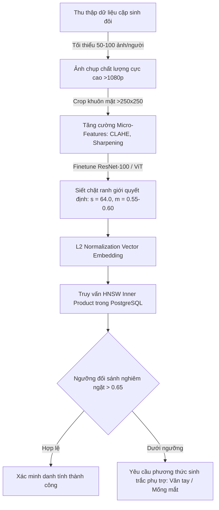
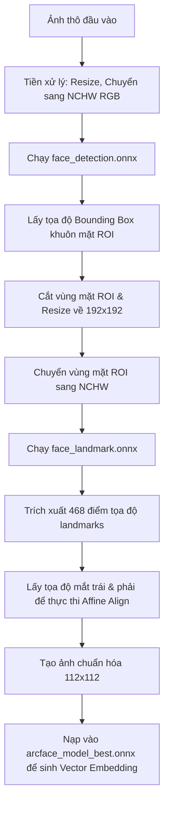
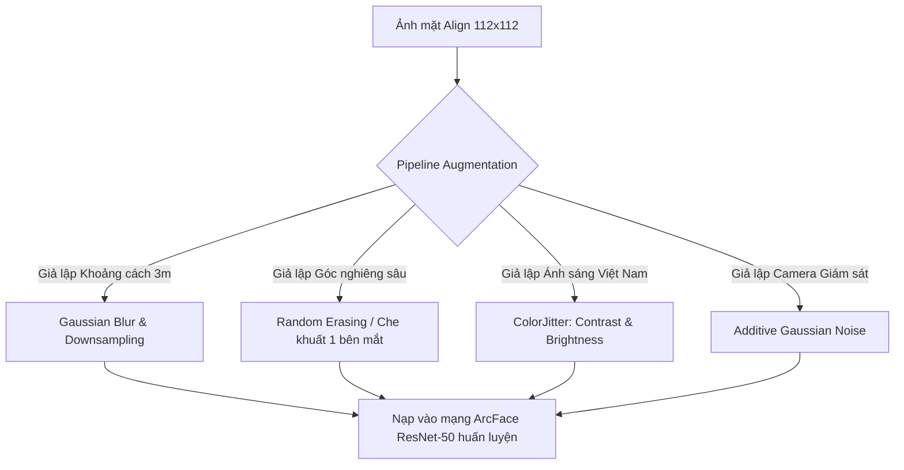
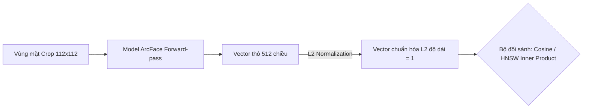

# Báo cáo Đánh giá Kỹ thuật: Tinh chỉnh ArcFace & Giải pháp cho các Bài toán Biên (Người Châu Á & Sinh đôi)

Tài liệu này ghi lại kết quả đánh giá chi tiết về mặt kỹ thuật đối với hệ thống tinh chỉnh (fine-tune) ArcFace hiện tại trong dự án, đồng thời đề xuất giải pháp và các yêu cầu tối thiểu nhằm tối ưu hóa việc nhận dạng khuôn mặt người Châu Á và phân biệt các cặp sinh đôi cùng trứng (Identical Twins).

---

## 1. Đánh giá Pipeline Finetune ArcFace hiện tại

Qua phân tích cấu trúc mã nguồn tại `main.py` và các tài liệu hướng dẫn `howtodo.md`, `whattodo.md`, pipeline tinh chỉnh hiện tại được thiết kế rất bài bản, thực dụng và có độ hoàn thiện cao cho môi trường sản xuất.

### 1.1. Các điểm sáng vượt trội (Pros)
*   **Đồng nhất hóa thuật toán Căn chỉnh (Alignment):** Việc triển khai thuật toán `2-Eye Similarity Transform` đồng bộ 100% bằng 3 ngôn ngữ (**Python** khi huấn luyện, **TypeScript/JavaScript** trên trình duyệt khi đăng ký ảnh mẫu, và **C# .NET 8.0** ở backend khi so khớp) là điểm cộng kỹ thuật cực kỳ lớn. Do ArcFace rất nhạy cảm với căn chỉnh hình học, sự nhất quán này chặn đứng việc tụt giảm độ tương đồng Cosine (thường tụt xuống dưới `0.3` nếu dùng sai lệch thuật toán).
*   **Chiến lược Tăng cường dữ liệu thực tế (Augmentation):** Tích hợp giả lập khẩu trang màu ngẫu nhiên (`Mask Synthesis` - 25%), gọng kính (`Glass Synthesis` - 15%), làm mờ (`GaussianBlur` - 30%) và biến đổi ánh sáng (`ColorJitter`) giúp mô hình chống chọi cực tốt với môi trường doanh nghiệp thực tế tại Việt Nam.
*   **MediaPipe Face Landmarker 3D (468 điểm):** Lựa chọn chế độ căn chỉnh `advanced` để định vị hốc mắt bằng lưới hình học 3D giúp pipeline hoạt động ổn định bất chấp sự thay đổi cơ mặt lớn do biểu cảm, góc nghiêng hoặc tuổi tác (trẻ em 2 tuổi đến người già 70 tuổi).
*   **Lượng tử hóa INT8 cho Mobile:** Pipeline tích hợp sẵn bước lượng tử hóa động (`quantize_dynamic`) giúp nén mô hình ONNX từ ~100MB xuống còn **~25MB** (`arcface_model_best_mobile.onnx`), sẵn sàng cho các ứng dụng di động chạy Flutter với hiệu năng CPU/NPU tối ưu.
*   **Dual-Model Strategy:** Tự động lưu mô hình có loss nhỏ nhất (`arcface_model_best.onnx`) giúp chống hiện tượng quá khớp (overfitting) so với việc chỉ lưu epoch cuối cùng.

### 1.2. Các điểm hạn chế & Rủi ro tiềm ẩn (Cons)
*   **Thiếu tập kiểm thử độc lập (Validation Set):** Pipeline hiện tại huấn luyện trên toàn bộ dữ liệu trong thư mục `data/` mà không tách riêng tập kiểm chuẩn (`Validation Set`). Khi tăng số lượng Epochs lên cao, mô hình dễ bị hiện tượng "học vẹt" (overfitting) trên tập huấn luyện mà không có cơ chế kiểm định độc lập để dừng sớm (Early Stopping).
*   **Rủi ro Fallback về ImageNet:** Trong `main.py`, nếu tiến trình tải file trọng số ArcFace tiền huấn luyện (`resnet50_arcface.pth` từ Hugging Face) bị thất bại, hệ thống sẽ tự động sử dụng trọng số ResNet-50 gốc của ImageNet. Điều này rất nguy hiểm vì ImageNet chỉ chứa tri thức phân loại vật thể chung chung (không có tri thức về sinh trắc học khuôn mặt). Việc tinh chỉnh trên tập dữ liệu nhỏ từ ImageNet sẽ cho kết quả rất kém.
*   **Giới hạn năng lực của ResNet-50:** ResNet-50 là mạng có kích thước trung bình. Đối với các bài toán biên cực kỳ phức tạp như phân biệt sinh đôi cùng trứng, dung lượng tham số của ResNet-50 và kích thước ảnh chuẩn `112x112` sẽ không đủ để ghi nhớ các chi tiết siêu vi mô (micro-features).

---

## 2. Yêu cầu Tối thiểu cho Khuôn mặt người Châu Á (Asian Faces)

Mô hình ArcFace pre-trained nguyên bản thường được huấn luyện trên các tập dữ liệu khổng lồ chứa tỷ lệ khuôn mặt phương Tây (Caucasian) rất lớn. Do đó, chúng bị ảnh hưởng bởi **Thiên vị chủng tộc (Racial Bias)**, dẫn đến độ chính xác suy giảm khi áp dụng trên người Châu Á (đặc trưng mắt nhỏ hơn, sống mũi thấp hơn, phân bố xương mặt phẳng hơn).

### Giải pháp và Yêu cầu Tối thiểu:
1.  **Sử dụng Trọng số Pretrained phù hợp (Bắt buộc):**
    *   Trọng số khởi tạo (`resnet50_arcface.pth`) bắt buộc phải được huấn luyện từ các tập dữ liệu đã làm sạch và cân bằng chủng tộc của InsightFace như **MS1MV3** hoặc tập dữ liệu thuần Châu Á khổng lồ như **Glint360K**.
    *   *Tuyệt đối không dùng mô hình ImageNet pre-trained làm fallback để huấn luyện trên tập dữ liệu nhỏ.*
2.  **Định vị hốc mắt bằng mô hình Landmarks 3D:**
    *   Người Châu Á khi cười có xu hướng híp mắt lại, hoặc có mắt một mí. Bộ phát hiện landmarks cần dùng **MediaPipe Face Landmarker 3D (468 điểm)** (chế độ `advanced` trong file `main.py`) để xác định hốc mắt và đồng tử cực kỳ chuẩn xác, thay vì chỉ phát hiện vùng mắt thô bằng OpenCV Haar Cascade.
3.  **Đa dạng hóa góc chụp khi đăng ký ảnh mẫu (Enrollment):**
    *   Khi đăng ký user mới, hệ thống cần yêu cầu chụp tối thiểu **5 - 10 ảnh** ở các góc mặt khác nhau (Nhìn thẳng, nghiêng trái/phải 20 độ, ngước lên, cúi xuống, cười tự nhiên) để bao phủ sự biến đổi cơ mặt và hình học mắt dưới các điều kiện ánh sáng khác nhau.

---

## 3. Giải pháp Chuyên sâu cho trường hợp Sinh đôi cùng trứng (Identical Twins)

Phân biệt sinh đôi cùng trứng (Identical Twins) là một trong những bài toán biên khó nhất của thị giác máy tính vì họ chia sẻ cấu trúc xương và cơ mặt giống nhau đến 99%. Các mô hình nhận diện khuôn mặt thông thường sẽ trích xuất vector embedding có độ tương đồng Cosine cực kỳ cao (thường từ **`0.75` đến `0.85`**), dẫn đến việc nhận dạng nhầm lẫn (False Positive).

### Giải pháp kỹ thuật và Yêu cầu Tối thiểu:



1.  **Độ phân giải ảnh cực cao (Micro-Features):**
    *   Không được dùng ảnh mờ, ảnh chụp từ camera chất lượng kém hoặc bị nén mạnh.
    *   Vùng khuôn mặt crop ra phải đạt độ phân giải tối thiểu **250x250 pixels** trước khi được resize về kích thước nạp mô hình.
    *   Mô hình cần học các **đặc trưng siêu vi mô (micro-features)** cực nhỏ: nốt ruồi, vết sẹo nhỏ, cấu trúc nếp mí mắt, dáng chân mày, các nếp nhăn biểu cảm độc bản.
2.  **Nâng cấp Kích thước Mô hình và Ảnh đầu vào:**
    *   Khuyên dùng backbone lớn hơn như **ResNet-100** hoặc các kiến trúc transformer chuyên sâu (**Vision Transformer - ViT**) với kích thước ảnh đầu vào lớn hơn (ví dụ: `224x224`) thay vì ResNet-50 `112x112` để đủ năng lượng tham số chứa các đặc trưng siêu vi mô.
3.  **Số lượng ảnh tối thiểu để Huấn luyện Tinh chỉnh (Finetuning):**
    *   *Không thể dùng cơ chế Zero-shot (không train)* để phân biệt sinh đôi. Bắt buộc phải đưa cả hai người sinh đôi vào tập huấn luyện (với 2 nhãn lớp/ID danh tính hoàn toàn khác nhau).
    *   Số lượng ảnh huấn luyện tối thiểu cho mỗi người sinh đôi là **50 - 100 ảnh chất lượng cao** chụp ở nhiều điều kiện ánh sáng, góc nghiêng mặt và các biểu cảm cơ mặt khác nhau (đây là lúc các điểm bất đối xứng nhỏ lộ ra rõ nhất).
4.  **Cấu hình siêu tham số ArcFace Margin Loss cực hạn:**
    *   Siết chặt ranh giới quyết định (decision boundary) bằng cách tăng Margin ($m$) và Scale ($s$) lên mức tối đa để ép mô hình trừng phạt các sai số góc nhỏ giữa hai vector của cặp sinh đôi:
        $$\text{ArcFace Hyper-parameters: } s = 64.0, \quad m = 0.55 \text{ hoặc } 0.60$$
    *   Sử dụng tốc độ học cực nhỏ (`LEARNING_RATE = 0.0001` hoặc `0.00005`) để quá trình tinh chỉnh diễn ra mượt mà và bảo toàn chất lượng biểu diễn của mô hình ArcFace gốc.
5.  **Thiết lập ngưỡng Cosine nghiêm ngặt (Strict Threshold):**
    *   Áp dụng **L2 Normalization** chuẩn hóa vector embedding về độ dài = 1 trước khi so khớp.
    *   Ngưỡng nhận diện (Threshold) đối với sinh đôi phải nâng lên mức tối thiểu **`> 0.65` hoặc `> 0.70`** (người bình thường chỉ cần `> 0.50`).
6.  **Phương án dự phòng vật lý (Hybrid Biometrics) cho môi trường High-Security:**
    *   Trong thực tế sản xuất cấp độ bảo mật cao (như thanh toán ngân hàng, mở khóa thiết bị bảo mật), công nghệ nhận diện khuôn mặt 2D đơn thuần **không bao giờ đảm bảo chính xác 100%** trong việc phân biệt các cặp sinh đôi cùng trứng dưới mọi điều kiện.
    *   Bắt buộc phải tích hợp thêm một lớp bảo mật sinh trắc học bổ sung như **Cảm biến vân tay (Fingerprint)** hoặc **Quét mống mắt (Iris scan)** để đảm bảo an toàn tuyệt đối.

---

## 4. Giải thích Cơ chế Fallback và Hướng dẫn Tải Trọng số Thủ công

### 4.1. Cơ chế Fallback hoạt động như thế nào trong mã nguồn?

Trong `main.py`, khi khởi tạo mô hình backbone `ArcFaceResNet50` (dòng 640), chương trình sẽ thực hiện kiểm tra sự tồn tại của tệp trọng số pre-trained cục bộ tại đường dẫn `arcfacemodels/resnet50_arcface.pth`:

*   **Trường hợp 1 (Thành công):** Nếu tệp tồn tại, chương trình sẽ nạp trực tiếp toàn bộ các trọng số mô hình đã được huấn luyện nhận dạng khuôn mặt người từ trước (qua `self.load_state_dict(...)`).
*   **Trường hợp 2 (Fallback - Tự động kích hoạt khi có lỗi):** Nếu không tìm thấy tệp cục bộ và việc kết nối Internet để tải tự động từ Hugging Face bị lỗi (do mất mạng, DNS hoặc do nhà mạng chặn), hàm `_fallback_to_imagenet` sẽ tự động được gọi.

#### Tại sao ImageNet Fallback lại là rủi ro cực lớn cho hệ thống nhận diện khuôn mặt?
*   Trọng số **ImageNet** (`models.ResNet50_Weights.DEFAULT`) được huấn luyện trên tập dữ liệu gồm hơn 1 triệu hình ảnh của **1.000 vật thể thông thường** (động vật, xe cộ, cây cối, vật dụng gia đình...).
*   Mạng nơ-ron ImageNet chỉ học được các đặc trưng hình ảnh chung chung như: đường biên, màu sắc, kết cấu bề mặt của đồ vật. Nó **hoàn toàn không có khái niệm sinh trắc học và cấu trúc hình học của khuôn mặt người** (facial prior).
*   Nếu dùng mô hình ImageNet pre-trained làm nền tảng và tiến hành tinh chỉnh (fine-tune) trên tập dữ liệu cực nhỏ (chỉ vài user nội bộ với một ít ảnh thô), mô hình **không thể học được cách phân tách các khuôn mặt tốt** và sẽ bị hiện tượng **quá khớp (overfitting) cực kỳ nặng**. Kết quả là các vector 512-chiều trích xuất ra sẽ không thể nhận diện được khuôn mặt khi thay đổi góc chụp, ánh sáng hoặc biểu cảm.
*   Trọng số **ArcFace** (`resnet50_arcface.pth`) thực tế đã được pre-trained trên **hàng triệu ảnh khuôn mặt người** (MS1MV3/Glint360K). Mô hình này đã có sẵn "tri thức" chuyên biệt về cấu trúc hình học khuôn mặt, do đó khi bạn tinh chỉnh dữ liệu nhỏ, nó sẽ hội tụ siêu nhanh và phân biệt cực kỳ chính xác.

---

### 4.2. Làm thế nào để download tệp `resnet50_arcface.pth` thủ công?

Để đảm bảo tuyệt đối pipeline luôn sử dụng mô hình nền tảng ArcFace chất lượng cao mà không bị nhảy về ImageNet, bạn có thể thực hiện tải thủ công theo một trong hai cách sau:

#### Cách 1: Tải trực tiếp bằng Trình duyệt Web (Khuyên dùng)
1.  Truy cập vào URL công khai sau trên trình duyệt máy tính của bạn:
    [https://huggingface.co/BharathK333/DOOMGAN/resolve/main/trained_models/resnet50_arcface.pth](https://huggingface.co/BharathK333/DOOMGAN/resolve/main/trained_models/resnet50_arcface.pth)
2.  Sau khi tải xong tệp tin (dung lượng khoảng **190 MB**), hãy giữ nguyên tên tệp là **`resnet50_arcface.pth`**.
3.  Di chuyển hoặc tải tệp này vào đúng thư mục sau trong dự án:
    `TreeOfThought/docs/nhan-dien-khuon-mat/ArcFaceFinetune/arcfacemodels/resnet50_arcface.pth`

#### Cách 2: Tải bằng Dòng lệnh Terminal (Dành cho máy chủ Linux / Container)
If you are đang kết nối SSH hoặc chạy trên môi trường Terminal Linux, hãy thực thi tuần tự các lệnh sau:

```bash
# 1. Đi vào thư mục làm việc của ArcFaceFinetune
cd TreeOfThought/docs/nhan-dien-khuon-mat/ArcFaceFinetune/

# 2. Đảm bảo thư mục lưu trữ model đã được tạo
mkdir -p arcfacemodels

# 3. Tải tệp trực tiếp và lưu đúng tên đích
wget -O arcfacemodels/resnet50_arcface.pth https://huggingface.co/BharathK333/DOOMGAN/resolve/main/trained_models/resnet50_arcface.pth

# (Hoặc dùng lệnh curl thay thế nếu hệ thống không cài wget)
# curl -L -o arcfacemodels/resnet50_arcface.pth https://huggingface.co/BharathK333/DOOMGAN/resolve/main/trained_models/resnet50_arcface.pth
```

**Dấu hiệu xác nhận thành công:**
Khi bạn chạy tiến trình huấn luyện bằng lệnh `python main.py`, ở đầu stdout log sẽ in ra dòng thông báo màu xanh:
```text
[+] Khởi tạo thành công trọng số ArcFace Pretrained chất lượng cao từ './arcfacemodels/resnet50_arcface.pth'.
```
Nếu bạn nhìn thấy thông báo trên, điều đó có nghĩa là mô hình đã được nạp tri thức khuôn mặt chuẩn xác và sẵn sàng cho kết quả huấn luyện tốt nhất!

---

## 5. Tích hợp Xử lý Landmarks/Alignment trong C# Backend: FFI vs ONNX

### 5.1. Khả năng gọi trực tiếp `face_landmarker.task` từ C#
*   **Bản chất kỹ thuật:** File `.task` là một bundle đóng gói mô hình **TFLite** cùng với siêu dữ liệu (metadata) độc quyền của Google MediaPipe.
*   **Khả năng tương thích:** **C#/.NET 8.0 không thể gọi trực tiếp file này.** Google chỉ cung cấp SDK chính thức cho C++, Python, Android, iOS và Web (JavaScript/TypeScript WebAssembly). Google không phát hành bất kỳ thư viện đầu tiên (first-party) nào cho .NET.
*   **Giải pháp wrapper cộng đồng:** Các dự án như `MediaPipe.NET` cố gắng bọc (wrap) mã C++ của MediaPipe. Tuy nhiên, chúng có cấu trúc rất cồng kềnh, độ ổn định thấp và rất dễ gây crash hệ thống khi deploy đa nền tảng (như trên Linux Docker hay Windows Server) do xung đột tệp liên kết động native (`.dll` / `.so`).

---

### 5.2. P/Invoke (FFI) để gọi từ C# xuống thư viện C++ của MediaPipe (Độ khó: 9/10)
Để C# gọi được mã C++ của MediaPipe bằng FFI, quy trình thực tế bắt buộc phải qua các bước:

1.  **Viết C-compatible Wrapper (C++):** Do C++ có Name Mangling và Class ABI phức tạp, bạn phải viết một file C++ trung gian đóng gói API dạng hàm C phẳng sử dụng `extern "C"` và các con trỏ cơ bản:
    ```cpp
    #define EXPORT extern "C" __declspec(dllexport)
    EXPORT void* create_detector(const char* model_path);
    EXPORT bool detect_landmarks(void* detector, float* img_data, int w, int h, float* out_pts);
    ```
2.  **Biên dịch bằng Bazel:** Bazel là công cụ build của Google, việc biên dịch MediaPipe C++ ra `.dll` (Windows) hoặc `.so` (Linux) là cực kỳ khó khăn do nó kéo theo rất nhiều dependencies khổng lồ (OpenCV, Protobuf, glog, TensorFlow Lite).
3.  **Gọi P/Invoke trong C#:** Sử dụng `[LibraryImport]` của .NET 8 để nạp thư viện và xử lý các khối mã không an toàn (`unsafe` pointer) để duyệt danh sách tọa độ:
    ```csharp
    [LibraryImport("mediapipe_c_wrapper")]
    public static partial IntPtr create_detector([MarshalAs(UnmanagedType.LPStr)] string modelPath);
    ```

> [!WARNING]
> **Khuyên dùng:** Bạn nên **tránh tự build wrapper C++ cho MediaPipe** trừ khi có đội ngũ chuyên nghiệp bảo trì bản build Bazel đa nền tảng. Đây là giải pháp có tính di động kém và dễ phát sinh nợ kỹ thuật lớn.

---

### 5.3. Giải pháp thay thế bằng mô hình ONNX chuyển đổi từ cộng đồng
Mô hình toán học cốt lõi bên trong tệp `face_landmarker.task` của Google thực chất là mô hình **MediaPipe Face Mesh** (tìm kiếm 468 hoặc 478 tọa độ điểm mốc 3D). Cộng đồng AI đã chuyển đổi thành công mô hình này sang định dạng **ONNX** tiêu chuẩn.

#### Các nguồn tải ONNX Face Mesh uy tín:
*   **PINTO0309 Model Zoo:** Kho lưu trữ [PINTO0309/PINTO_model_zoo](https://github.com/PINTO0309/PINTO_model_zoo) nổi tiếng chuyên cung cấp các bản ONNX của MediaPipe (tìm thư mục `282_face_landmark_with_attention` hoặc `114_FaceMesh`). Các file ONNX tại đây đã được tối ưu hóa toán tử để chạy mượt mà trên ONNX Runtime.
*   **Hugging Face:** Bạn có thể tải nhanh tệp landmarks ONNX công khai bằng lệnh:
    ```bash
    wget https://huggingface.co/spaces/hysts/cappr/resolve/main/models/face_landmark.onnx
    ```

#### Quy trình xử lý Landmarks/Alignment ONNX trong C# Backend:



1.  **Chạy Face Detection ONNX:** Nạp ảnh gốc qua mô hình phát hiện khuôn mặt (như BlazeFace ONNX) để tìm bounding box của mặt.
2.  **Cắt vùng ảnh ROI:** Dùng `SixLabors.ImageSharp` cắt vùng mặt, resize về chuẩn `192x192` và nạp vào mô hình `face_landmark.onnx`.
3.  **Trích xuất landmarks & Căn chỉnh:** Lấy các điểm tọa độ mắt tương ứng từ kết quả landmarks để tính ma trận xoay Affine, xuất ra ảnh khuôn mặt `112x112` đã căn chỉnh thẳng thớm.
4.  **Trích xuất Embedding:** Đưa ảnh `112x112` vào mô hình `arcface_model_best.onnx` để có vector 512 chiều.

> [!TIP]
> **Kết luận kiến trúc:**
> Việc tự chạy 2 mô hình ONNX bổ trợ (`detection` -> `landmark`) chỉ để lấy tọa độ mắt phục vụ bước tiền xử lý của mô hình thứ 3 (`ArcFace`) trên Backend C# sẽ làm tăng độ phức tạp của code backend lên rất nhiều và tiêu tốn CPU/GPU của máy chủ một cách không cần thiết.
>
> Giải pháp **chạy MediaPipe WebAssembly trực tiếp trên Trình duyệt (Client-Side Edge AI)** để người dùng tự động căn chỉnh và chỉ gửi ảnh `112x112` lên server vẫn là **giải pháp thiết kế tối ưu, có tính mở rộng cao và nhẹ nhàng nhất** cho hệ thống của bạn!

---

## 6. Hướng dẫn Thiết kế Dữ liệu & Tinh chỉnh (Finetuning) cho người Việt Nam từ 2 - 100 tuổi

Để giải quyết triệt để các bài toán biên đặc thù trong thực tế tại Việt Nam: **Đa dạng độ tuổi (trẻ em từ 2 tuổi đến người già 100 tuổi), góc nghiêng lớn (half-profile), và khoảng cách xa (3 mét)**, việc xây dựng cơ sở dữ liệu và cấu hình huấn luyện cần tuân thủ nghiêm ngặt các tiêu chuẩn khoa học dữ liệu dưới đây.

### 6.1. Quy mô tập dữ liệu & Số lượng thực thể (Identities)

Tùy thuộc vào phạm vi sử dụng của hệ thống, quy mô dữ liệu cần đạt mức tối thiểu sau:

| Phạm vi áp dụng | Số lượng người tối thiểu (Subjects) | Số lượng ảnh trên mỗi người | Mục tiêu đạt được |
| :--- | :--- | :--- | :--- |
| **Hệ thống Nội bộ / Văn phòng** | 50 - 200 người | 30 - 50 ảnh | Phân biệt cực kỳ chính xác các nhân viên trong một tổ chức nhỏ. |
| **Hệ thống Cấp Doanh nghiệp / Chung cư** | 500 - 1.000 người | 50 - 80 ảnh | Giảm tỷ lệ False Positive (nhận diện nhầm người) xuống mức < 0.01% ở môi trường đông đúc. |
| **Mô hình Tổng quát hóa (Generalization)** | > 5.000 người | > 100 ảnh | Tạo ra bộ trọng số "thuần Việt" có khả năng nhận diện Zero-shot tốt với người lạ. |

> [!IMPORTANT]
> **Quy luật về Phân bổ Độ tuổi:**
> *   **Nhóm Trẻ em (2 - 10 tuổi):** Đặc trưng cơ mặt và lượng mỡ dưới da thay đổi cực nhanh theo từng năm, cấu trúc xương mặt chưa định hình rõ. Do đó, nhóm tuổi này **bắt buộc cần nhiều ảnh mẫu nhất** (tối thiểu 50-80 ảnh/bé) và phải được cập nhật ảnh mẫu mới định kỳ mỗi 6 tháng.
> *   **Nhóm Người già (70 - 100 tuổi):** Xuất hiện nhiều nếp nhăn sâu, da mặt bị chùng/sệ và cơ mặt thay đổi khi rụng răng. Cần thu thập ảnh mẫu ở cả trạng thái biểu cảm bình thường và lúc cười nói tự nhiên để mô hình học được các đặc trưng phi tuyến tính này.

---

### 6.2. Tiêu chuẩn và Kịch bản Thu thập Hình ảnh (Image Specs & Scenarios)

Để đáp ứng các yêu cầu khắt khe về góc nghiêng và khoảng cách xa, mỗi thực thể (người dùng) cần được thu thập ảnh theo các kịch bản nghiêm ngặt:

#### A. Góc chụp hình học không gian (Head Pose - Yaw, Pitch, Roll)
*   **Yêu cầu:** Mô hình phải học được sự bất đối xứng của khuôn mặt và các đặc trưng khi bị che khuất một phần (Self-Occlusion).
*   **Phân bổ góc chụp bắt buộc (Yaw - Góc quay sang trái/phải):**
    *   **30% Ảnh trực diện (Frontal):** Yaw $0^{\circ}$.
    *   **40% Ảnh nghiêng nhẹ (Quarter-Profile):** Yaw từ $\pm 15^{\circ}$ đến $\pm 30^{\circ}$ (vẫn nhìn thấy đầy đủ hai mắt).
    *   **30% Ảnh nghiêng sâu (Half-Profile / Nghiêng nửa mặt):** Yaw từ $\pm 45^{\circ}$ đến $\pm 60^{\circ}$ (chỉ nhìn thấy rõ một mắt, một phần sống mũi và một bên má).
*   **Phân bổ góc ngước/cúi (Pitch - Góc ngước lên/cúi xuống):**
    *   Tối thiểu 10% ảnh ngước lên (Pitch $+15^{\circ}$ đến $+20^{\circ}$) và 10% ảnh cúi xuống (Pitch $-15^{\circ}$ đến $-20^{\circ}$).

#### B. Thách thức khoảng cách xa (3 mét) & Độ phân giải
Khi camera ghi hình ở khoảng cách 3 mét, vùng khuôn mặt (Face ROI) sẽ bị suy giảm chất lượng nghiêm trọng do: **Độ phân giải thấp (Low resolution), nhiễu cảm biến (Sensor noise), và mờ do chuyển động (Motion blur)**.
*   **Yêu cầu độ phân giải nguồn:** Ảnh chụp đăng ký gốc phải đạt tối thiểu **FullHD (1920x1080)**. Khi crop riêng vùng mặt, kích thước Face ROI tối thiểu phải đạt **`80x80` pixels** (khuyên dùng `150x150` pixels trở lên).
*   **Kịch bản thu thập thực tế:**
    *   Thu thập ảnh ở 3 khoảng cách tiêu chuẩn: **1 mét** (cận cảnh), **2 mét** (trung cảnh), và **3 mét** (viễn cảnh).
    *   Ảnh chụp ở 3 mét phải bao gồm cả trạng thái người di chuyển chậm (đi bộ) để giả lập hiện tượng mờ nhòe thực tế của camera giám sát.

#### C. Biến đổi Ánh sáng & Vật cản vật lý
*   **Ánh sáng:** Đăng ký ảnh ở ít nhất 3 môi trường: ánh sáng văn phòng tiêu chuẩn, ngược sáng (backlit - giả lập cửa kính ra vào), và thiếu sáng (low-light - ban đêm hoặc dưới bóng râm).
*   **Vật cản:** Đeo kính cận/kính râm (15% số ảnh), đeo khẩu trang y tế che kín mũi miệng (20% số ảnh - chỉ áp dụng nếu hệ thống cần nhận diện khi đeo khẩu khẩu trang).

---

### 6.3. Chiến lược Tăng cường Dữ liệu (Data Augmentation) trong Pipeline PyTorch

Không thể chỉ dựa vào ảnh thô thu thập được để huấn luyện. Chúng phải được lập trình mô phỏng các bài toán biên trong file `main.py` bằng các kỹ thuật tăng cường dữ liệu nâng cao:



1.  **Mô phỏng khoảng cách xa (3m):**
    *   Sử dụng kết hợp `transforms.GaussianBlur(kernel_size=5, sigma=(0.1, 2.0))` với tỷ lệ xuất hiện **35%**.
    *   Sử dụng kỹ thuật downsample ngẫu nhiên ảnh về $32 \times 32$ rồi bilinear upscale lại về $112 \times 112$ để mô phỏng hiện tượng mất chi tiết do khoảng cách xa.
2.  **Mô phỏng góc nghiêng sâu & che khuất:**
    *   Sử dụng `transforms.RandomErasing(p=0.3, scale=(0.02, 0.2))` để xóa ngẫu nhiên một vùng trên mặt (giả lập việc một mắt hoặc má bị che khuất do góc nghiêng sâu hoặc tóc xõa).
3.  **Mô phỏng camera giám sát ngoài trời/hành lang:**
    *   Tự động thêm nhiễu hạt muối tiêu (Salt & Pepper Noise) hoặc Gaussian Noise ngẫu nhiên vào 15% số lượng ảnh huấn luyện.

---

### 6.4. Cấu hình Siêu tham số Huấn luyện tối ưu cho người Việt Nam

Để quá trình tinh chỉnh (Fine-tuning) đạt hiệu quả cao nhất trên bộ trọng số nền tảng `resnet50_arcface.pth` mà không làm hỏng cấu trúc tri thức gốc (Catastrophic Forgetting), hãy thiết lập các siêu tham số sau trong file huấn luyện:

*   **Tốc độ học (Learning Rate):** Khởi đầu ở mức cực kỳ an toàn: `lr = 0.00005` (hoặc `5e-5`).
*   **ArcFace Margin Loss Parameters:**
    *   **Scale ($s$):** Giữ nguyên mức chuẩn của InsightFace: **`64.0`** để phóng đại các sai lệch góc nhỏ.
    *   **Margin ($m$):** Thiết lập nghiêm ngặt ở mức **`0.50`** (nếu tập trung vào nhận diện góc nghiêng) hoặc nâng lên **`0.55`** (nếu cần siết chặt khoảng cách phân biệt giữa các nhóm người già/trẻ em có cấu trúc mặt tương đồng).
*   **Trọng số thiết bị (Device):** Khuyên dùng thiết bị hỗ trợ CUDA (GPU Nvidia) để đẩy nhanh tiến trình huấn luyện. Nếu bắt buộc chạy CPU, hãy giảm Batch Size xuống còn `8` hoặc `16` để tránh tràn bộ đệm RAM.
*   **Kỹ thuật đóng băng trọng số (Weight Freezing):**
    *   *Giai đoạn 1 (Epoch 1 - 5):* Đóng băng hoàn toàn các lớp Convolutional Layer ban đầu của ResNet-50, chỉ cho phép huấn luyện lớp FC (Fully Connected) cuối cùng để mô hình làm quen với số lượng nhãn người Việt mới.
    *   *Giai đoạn 2 (Epoch 6 trở đi):* Mở khóa toàn bộ mạng (Unfreeze) với tốc độ học cực nhỏ để tinh chỉnh nhẹ nhàng toàn bộ các tầng trích xuất đặc trưng.

---

### 6.5. Trích xuất đặc trưng & Thuật toán Đối sánh tối ưu (Feature Extraction & Best Match Search)

Sau khi mô hình ArcFace được tinh chỉnh thành công, mô hình đóng vai trò là một **Bộ trích xuất đặc trưng (Feature Extractor)** cực kỳ mạnh mẽ, chuyển đổi ảnh khuôn mặt $112 \times 112$ thành một **Vector đặc trưng 512 chiều (512-dimensional Embedding)** mang tính sinh trắc học độc bản.

#### A. Quy trình Trích xuất Đặc trưng & L2 Chuẩn hóa (L2 Normalization)
Để đảm bảo các phép đo khoảng cách hình học hoạt động chính xác tuyệt đối, vector đặc trưng thô $\mathbf{v}$ từ mô hình bắt buộc phải đi qua bước **L2 chuẩn hóa** (L2 Normalization):
$$\mathbf{v}_{\text{normalized}} = \frac{\mathbf{v}}{\|\mathbf{v}\|_2} = \frac{\mathbf{v}}{\sqrt{\sum_{i=1}^{512} v_i^2}}$$

*Ý nghĩa kỹ thuật:* Phép chuẩn hóa này ép toàn bộ các vector đặc trưng về độ dài hình học bằng 1 (nằm trên bề mặt của một siêu cầu 512 chiều). Khi độ dài đã bằng 1, các phép đo khoảng cách Euclid, tích vô hướng và độ tương đồng Cosine có **mối tương quan toán học tuyến tính trực tiếp**, giúp tối giản hóa các phép toán so khớp.



#### B. Các Thuật toán Đối sánh và So khớp Tìm "Best Match"

##### 1. Độ tương đồng Cosine (Cosine Similarity)
*   **Nguyên lý:** Đo góc lệch giữa hai vector trong không gian 512 chiều.
*   **Công thức tổng quát:**
    $$\text{Cosine}(A, B) = \frac{A \cdot B}{\|A\|_2 \|B\|_2}$$
*   **Tối ưu hóa toán học:** Khi hai vector $A$ và $B$ đã được L2 chuẩn hóa ($\|A\|_2 = \|B\|_2 = 1$), công thức trên đơn giản hóa hoàn toàn thành **Tích vô hướng (Inner Product / Dot Product)**:
    $$\text{Cosine}(A, B) = A \cdot B = \sum_{i=1}^{512} a_i b_i$$
*   *Ưu thế hiệu năng:* Phép toán lúc này chỉ còn là tích chập của các phép nhân và cộng dồn (Fused Multiply-Add), cực kỳ tối ưu cho các tập lệnh song song phần cứng (SIMD như AVX-512 trên Intel/AMD, NEON trên ARM, hoặc tính toán song song trên GPU).

##### 2. Chỉ mục HNSW với Inner Product trên PostgreSQL (`pgvector`)
Khi số lượng người dùng trong cơ sở dữ liệu tăng lên hàng nghìn hoặc hàng chục nghìn, việc quét tuyến tính tuần tự (Linear Scan $O(N)$) để tính Cosine cho từng người sẽ gây nghẽn CPU nghiêm trọng.
*   **HNSW (Hierarchical Navigable Small World):** Xây dựng một đồ thị đa tầng liên kết các vector láng giềng gần nhau. Cho phép tìm kiếm láng giềng gần đúng (Approximate Nearest Neighbors - ANN) với độ phức tạp cực nhỏ là **$O(\log N)$**.
*   **Toán tử tích vô hướng âm `<#>`:** Trong thư viện `pgvector` của PostgreSQL, khoảng cách tích vô hướng âm được định nghĩa là $d(A, B) = -(A \cdot B)$.
*   **Mối liên hệ toán học:** Do các vector đã được L2 chuẩn hóa, việc tìm kiếm láng giềng có khoảng cách tích vô hướng âm nhỏ nhất (`ORDER BY Embedding <#>` tăng dần) tương đương hoàn toàn 100% với việc tìm kiếm người có độ tương đồng Cosine lớn nhất (`Cosine Similarity` giảm dần).
*   *Kết quả:* Tốc độ truy vấn tìm "Best Match" giảm xuống dưới **2 mili-giây (< 2ms)** cho hàng triệu bản ghi, sẵn sàng đáp ứng quét liên tục từ camera thời gian thực.

---

#### C. Chiến lược So khớp Tối ưu cho Góc Nghiêng Sâu & Khoảng Cách Xa (3 mét)

Do góc nghiêng sâu (chỉ lộ nửa mặt) và khoảng cách xa (ảnh bị mờ nhòe) làm suy giảm lượng thông tin tần số cao trên khuôn mặt, độ tương đồng Cosine của ảnh thực tế có thể bị suy giảm (ví dụ: từ mức chuẩn $0.80$ xuống khoảng $0.48 - 0.55$). Để hệ thống vẫn nhận diện chính xác mà không bị nhận diện sai lệch, chúng ta áp dụng các chiến lược sau:

##### 1. Chiến lược Đa mẫu Đăng ký (Multi-Embedding Gallery Strategy)
*   **Giải pháp:** Thay vì chỉ lưu trữ duy nhất 1 ảnh trực diện làm mẫu đối chiếu, khi đăng ký người dùng mới, hệ thống sẽ trích xuất và lưu trữ **nhiều mẫu vector (4 - 6 mẫu)** đại diện cho các góc độ và điều kiện chụp khác nhau:
    1.  `embedding_frontal`: Ảnh trực diện chất lượng cao.
    2.  `embedding_left_profile`: Ảnh nghiêng trái $45^{\circ}$.
    3.  `embedding_right_profile`: Ảnh nghiêng phải $45^{\circ}$.
    4.  `embedding_far_3m`: Ảnh chụp mô phỏng khoảng cách xa (nhiễu/mờ nhẹ).
*   **Quy trình đối sánh:** Khi camera gửi lên 1 ảnh kiểm tra (Query):
    *   Truy vấn pgvector HNSW lấy ra **Top $K$ láng giềng gần nhất** (ví dụ $K = 5$).
    *   Thực hiện nhóm kết quả (Group By) theo ID người dùng.
    *   Lấy độ tương đồng lớn nhất (**Max Similarity**) trong số các mẫu của cùng một người để làm điểm số quyết định. Phương pháp này đảm bảo chỉ cần ảnh camera khớp với bất kỳ góc mặt đăng ký nào (kể cả nghiêng sâu), người dùng sẽ được nhận diện thành công ngay lập tức.

##### 2. Thiết lập Ngưỡng So khớp Động (Dynamic Adaptive Thresholding)
Không nên sử dụng một ngưỡng tĩnh duy nhất cho mọi tình huống. Hãy cấu hình ngưỡng động thông minh dựa trên thuộc tính ảnh đầu vào:

| Tình huống ghi hình | Đặc trưng ảnh đầu vào | Ngưỡng Cosine tối thiểu | Logic xử lý |
| :--- | :--- | :--- | :--- |
| **Trực diện, gần (< 1.5m)** | Kích thước mặt $> 150\text{px}$, Yaw $\approx 0^{\circ}$ | **`> 0.60`** | Siết chặt ngưỡng để chống giả mạo bằng ảnh in hoặc điện thoại chất lượng cao. |
| **Nghiêng sâu / Nghiêng nửa mặt** | Kích thước mặt $> 100\text{px}$, Yaw $> 30^{\circ}$ | **`> 0.52`** | Cho phép nhận diện trơn tru khi người dùng đi ngang qua camera mà không nhìn trực diện. |
| **Khoảng cách xa (3 mét)** | Kích thước mặt từ $80\text{px} - 100\text{px}$ | **`> 0.48`** | Chấp nhận sai số hình học nhỏ do ảnh bị mờ hạt (noise) và suy giảm độ phân giải. |


