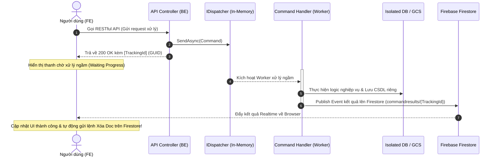
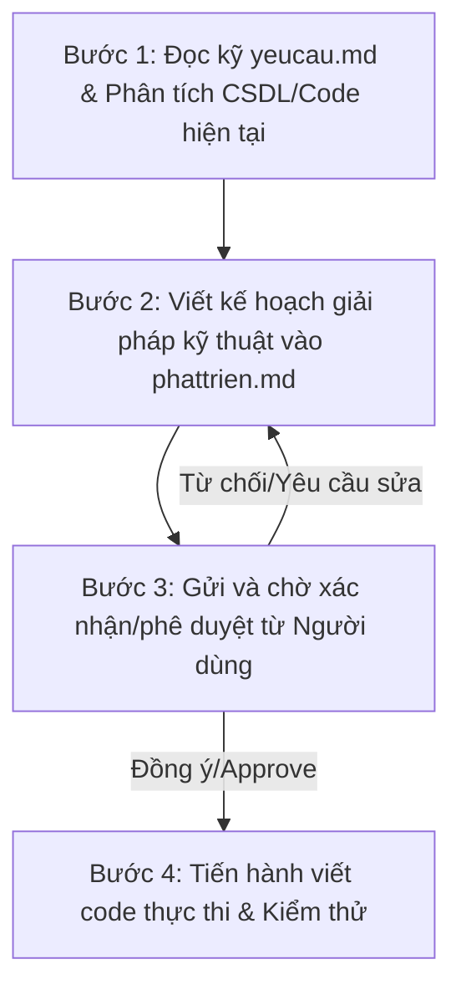

# Kiến Trúc Hệ Thống & Hướng Dẫn Phát Triển Toàn Diện (TreeOfThought Master Guide)

Tài liệu này là **Nguồn Sự Thật Duy Nhất (Single Source of Truth - SSOT)** mô tả chi tiết thiết kế kiến trúc toàn diện và các tiêu chuẩn phát triển phần mềm bắt buộc cho cả lập trình viên con người và các tác nhân trí tuệ nhân tạo (A.I Agents sử dụng skill `tot-dev`) khi tiến hành bảo trì, nâng cấp hoặc phát triển các nghiệp vụ mới trong toàn bộ solution **TreeOfThought**.

---

## 🗺️ 1. Tổng Quan Kiến Trúc Nền Tảng (System Overview)

Hệ thống **TreeOfThought** được thiết kế theo mô hình kiến trúc **Modular Monolith** (Đơn khối dạng Module hóa) kết hợp với các nguyên lý của **Clean Architecture** ở phía Backend và cấu trúc **Workspace Libraries** đa thư viện ở phía Frontend. 

Mô hình này mang lại sự cân bằng hoàn hảo giữa tính đơn giản trong vận hành (deploy một khối duy nhất) và khả năng mở rộng, độc lập nghiệp vụ của kiến trúc Microservices (các module nghiệp vụ cô lập hoàn toàn).

```mermaid
graph TD
    %% Frontend Structure
    subgraph Frontend_Workspace [Frontend Angular Web & Clients]
        AppShell[App Shell Main Application]
        CoreLib[(@tot/core) Core Library]
        SharedUI[(@tot/shared) Shared UI Components]
        BizOidcFE[(business-oidc FE)]
        BizFilesFE[(business-files FE)]
        BizDashboardFE[(business-dashboard FE)]
    end

    %% Backend Structure
    subgraph Backend_Monolith [Backend Modular Monolith .NET 8]
        WebApi[Core.Web.Api App Shell]
        CoreInfra[Core Infrastructure Libraries]
        BizOidcBE[(Core.Infra.Oidc BE)]
        BizFilesBE[(Core.Infra.FilesFolders BE)]
        BizFaceBE[(nhan-dien-khuon-mat BE)]
    end

    %% Storage & Infrastructure
    subgraph Infra_Layer [Hạ Tầng Dịch Vụ]
        Postgres[(PostgreSQL CSDL)]
        Redis[(Redis Cache & Session)]
        Firestore[(Firebase Firestore Realtime)]
        GCS[(Google Cloud Storage GCS)]
    end

    %% FE Dependencies
    AppShell --> CoreLib
    AppShell --> SharedUI
    AppShell -. Lazy Load .-> BizOidcFE
    AppShell -. Lazy Load .-> BizFilesFE
    AppShell -. Lazy Load .-> BizDashboardFE
    
    BizOidcFE --> CoreLib
    BizFilesFE --> CoreLib
    BizDashboardFE --> CoreLib
    BizOidcFE --> SharedUI
    BizFilesFE --> SharedUI
    BizDashboardFE --> SharedUI

    %% FE to BE communication
    AppShell -->|RESTful APIs & OIDC SSO| WebApi

    %% BE Dependencies
    WebApi --> CoreInfra
    WebApi --> BizOidcBE
    WebApi --> BizFilesBE
    WebApi --> BizFaceBE
    
    BizOidcBE --> CoreInfra
    BizFilesBE --> CoreInfra
    BizFaceBE --> CoreInfra

    %% Database & Infra mappings
    BizOidcBE -->|Isolation Connection| Postgres
    BizFilesBE -->|Isolation Connection| GCS
    BizFaceBE -->|Isolation Connection| Postgres
    CoreInfra -->|PubSub, Queue, Session| Redis
    CoreInfra -->|Realtime Notify| Firestore
```

---

## 🖥️ 2. Thiết Kế Kiến Trúc Backend (.NET 8.0)

Phần Backend hoạt động trong thư mục `TreeOfThought/backend`, sử dụng nền tảng **.NET Core 8.0**.

### 2.1. Các Thư Viện Hạ Tầng Cốt Lõi (Core Infra Base)
Hạ tầng dùng chung được phân tách thành các thư viện nền tảng độc lập, cung cấp trừu tượng hóa cho toàn bộ ứng dụng:
*   **`Core.Infra.Base`**: Chứa toàn bộ các Interface (`ICacheService`, `IQueueService`, `IEventBus`, `IEventHandler`, `IDispatcher`), Model, DTO và hằng số dùng chung toàn solution.
*   **`Core.Infra.Redis`**: Xử lý cache, pub/sub và hệ thống hàng đợi tin cậy (Reliable Queue) qua Redis (`LPUSH`/`RPOP`) đảm bảo không thất thoát dữ liệu.
*   **`Core.Infra.Session`**: Quản lý session người dùng trên Redis theo cơ chế **Hybrid Session** (kết hợp JWT mỏng và session Redis dày để tối ưu băng thông).
*   **`Core.Infra.Data`**: Lớp trừu tượng kết nối cơ sở dữ liệu (`BaseDbContext`) hỗ trợ PostgreSQL, MSSQL, MySQL và MongoDB.
*   **`Core.Infra.Firebase`**: Cung cấp FCM để đẩy thông báo di động, Firestore để đồng bộ hóa giao diện thời gian thực, và Google Cloud Storage (GCS) để lưu trữ tệp tin.
*   **`Core.Infra.Auth`**: Xử lý sinh và kiểm tra mã Token JWT, phân quyền Hybrid, và kiểm soát truy cập tài nguyên chi tiết (ACL Bitmask) qua custom attribute `[AppAuthorize]`.
*   **`Core.Infra.Cqrs`**: Cung cấp hạ tầng Command/Handler và Event/PubSub in-memory, tích hợp tự động quét đăng ký Handler và xuất bản thông báo trạng thái xử lý lên Firestore.

### 2.2. Quy Chuẩn Cô Lập Nghiệp Vụ Nghiêm Ngặt (Strict Isolation)
Để đảm bảo Modular Monolith không biến thành "Big Ball of Mud" (Đống bùn lầy công nghệ):
1.  **Dự án độc lập**: Mỗi nghiệp vụ bắt buộc phải là một project riêng biệt trong `TreeOfThought/backend/`.
2.  **Tuyệt đối không gọi chéo**: Nghiêm cấm việc Add Reference hoặc gọi trực tiếp code từ module nghiệp vụ này sang module nghiệp vụ khác.
3.  **Giao tiếp lỏng (Loose Coupling)**: Mọi trao đổi thông tin hoặc kích hoạt hành động liên nghiệp vụ bắt buộc phải đi qua **Command/Event** hoặc **Redis Pub/Sub**.
4.  **Truy vấn dữ liệu Read-Only**: Nếu cần truy vấn dữ liệu từ bảng của module khác, cho phép tạo một `DbContext` phụ ngay tại module hiện tại nhưng **chỉ được phép cấu hình ở chế độ Read-only** (không được thay đổi dữ liệu).
5.  **Cấu hình Database & Connection String**: Mỗi nghiệp vụ sở hữu cơ sở dữ liệu riêng. Connection string phải cấu hình cô lập trong `appsettings.json` với key là tên nghiệp vụ:
    ```json
    "{TenNghiepVu}:Postgresql" hoặc "{TenNghiepVu}:Redis"
    ```

### 2.3. Quy Trình CQRS & Phản Hồi Thời Gian Thực (Realtime UI Feedback)
Đối với các tác vụ ghi dữ liệu hoặc xử lý dài hơi (như AI, xử lý ảnh khuôn mặt, tải tệp tin GCS), Backend áp dụng luồng xử lý bất đồng bộ kết hợp thông báo Firestore:



> [!IMPORTANT]
> **HẰNG SỐ TIỀN TỐ FIRESTORE NOTIFY PATH**
> 
> Toàn bộ đường dẫn notify realtime trên Firestore bắt buộc phải sử dụng chung một tiền tố hằng số duy nhất được định nghĩa tập trung ở cả Backend và Frontend để tránh lãng phí tài nguyên và chi phí đám mây:
> *   **Backend (C#)**: `FirestoreConstants.NotificationPathPrefix = "commandresults"` (tại `Core.Infra.Base`)
> *   **Frontend (TS)**: `FIRESTORE_NOTIFY_PATH_PREFIX = 'commandresults'` (tại `@tot/core`)
> 
> Đường dẫn hoàn chỉnh: `commandresults/{trackingId}`.

### 2.4. Quy Chuẩn Phân Trang Bắt Buộc (Server-Side Paging)
Mọi API trả về danh sách dữ liệu bắt buộc phải thực hiện phân trang từ phía máy chủ để bảo vệ hiệu năng mạng và bộ nhớ:
*   **Tham số đầu vào (Request)**: Bắt buộc hỗ trợ `pageIndex` (1-based, mặc định là 1) và `pageSize` (mặc định là 10).
*   **Cấu trúc trả về (Response)**: Bắt buộc trả về một JSON Object chứa:
    ```json
    {
      "items": [ ... ],
      "total": 123
    }
    ```
    *Trong đó `total` là tổng số bản ghi thực tế trong CSDL thỏa mãn điều kiện lọc, không bị giới hạn bởi Skip/Take.*

### 2.5. Bảo Mật và Phân Quyền Hybrid [AppAuthorize] & ACL
Hệ thống sử dụng cơ chế bảo mật tinh vi thông qua thuộc tính tùy biến `[AppAuthorize]`:
1.  **Claim-based**: Kiểm tra quyền tĩnh. Khi khai báo `[AppAuthorize("test.read")]`, hệ thống tự động thêm tiền tố `"be."` thành `"be.test.read"` để so khớp với quyền của user.
2.  **Hybrid Mode**: Để tránh token JWT quá nặng, các vai trò chính (Roles) được lưu trong JWT, còn danh sách quyền chi tiết (Claims/Permissions) được lưu trên **Redis Session**.
3.  **Realtime Sync**: Khi Admin thay đổi vai trò/quyền của User trên giao diện, hệ thống tự động trigger `SyncUserClaimsToRedisAsync` và `SyncUserAclToRedisAsync` để cập nhật lập tức lên Redis Session mà không yêu cầu người dùng đăng nhập lại.
4.  **ACL Bitmask (Fine-grained Access Control)**: Hỗ trợ phân quyền động tới từng bản ghi tài nguyên cụ thể thông qua mặt nạ bitmask:
    *   `1` (nhị phân `0001`) = **Read** (Đọc)
    *   `2` (nhị phân `0010`) = **Write** (Ghi)
    *   `4` (nhị phân `0100`) = **Delete** (Xóa)
    *   `8` (nhị phân `1000`) = **Share** (Chia sẻ)
    *   *Ví dụ: Trích xuất `ResourceId` tự động theo thứ tự ưu tiên: Header `x-resource-id` -> Route Parameter `{id}` -> Query string `?id=...`.*

### 2.6. Quản Lý Cấu Hình Firebase Tập Trung
Không được phép hardcode các cài đặt như `AppName` hoặc `StorageBucket` trong code. Toàn bộ cấu hình Firebase được nạp tập trung qua Options Pattern ở App Shell và map vào `FirebaseService` để sử dụng các hàm overload cực kỳ tinh gọn:
```json
"Firebase": {
  "AppName": "Default",
  "StorageBucket": "dunp-test-gcs",
  "ProjectId": "realtimedbtest-d8c6b"
}
```

---

## 🎨 3. Thiết Kế Kiến Trúc Frontend (Angular 17+)

Phần Frontend hoạt động trong thư mục `TreeOfThought/frontend/web`, xây dựng trên nền tảng **Angular Workspace (v17+)**, **TypeScript**, **Ant Design (NG-ZORRO)** và **Transloco**.

### 3.1. Phân Chia Workspace Libraries
Frontend được chia thành cấu trúc các thư viện và ứng dụng chính nhằm đảm bảo tính tái sử dụng và cô lập tuyệt đối:
*   **`@tot/core` (Thư viện logic)**: Chứa toàn bộ nền tảng hệ thống dùng chung: Auth, Interceptors, Guards, Hằng số quyền, `HttpClientService`, `MessageBusService`, `ComponentRegistryService`, `FirebaseService`.
*   **`@tot/shared` (Thư viện UI dùng chung)**: Cung cấp các UI component chất lượng cao, tiền tố bắt buộc bắt đầu bằng **`tot-`** (như `tot-button`, `tot-table`, `tot-autocomplete`, `tot-input`, `tot-editor`).
*   **`projects/tot/{ten-nghiep-vu}` (Các thư viện nghiệp vụ độc lập)**: Các module chức năng viết thường, phân tách bằng dấu gạch ngang (Kebab-case), ví dụ: `business-dashboard`, `business-files`, `nhan-dien-khuon-mat`.

> [!CAUTION]
> **CẤM IMPORT TRỰC TIẾP GIỮA CÁC MODULE NGHIỆP VỤ**
> 
> Tuyệt đối không được import trực tiếp component, service hay model giữa các module nghiệp vụ con với nhau để tránh phụ thuộc chéo vòng tròn. Mọi giao tiếp và trao đổi phải thực hiện qua `MessageBusService` hoặc `ComponentRegistryService`.

### 3.2. Trao Đổi Giữa Các Module Độc Lập
1.  **Component Registry (Gọi UI chéo)**:
    Khi module này cần hiển thị giao diện của module khác, nó sẽ lấy component thông qua `ComponentRegistryService` bằng các khóa đăng ký tập trung đóng băng (`REGISTRY_KEYS` trong Core):
    ```typescript
    // Đăng ký tại Module cung cấp UI
    this.registry.register(REGISTRY_KEYS.FILES_FOLDERS, FileSelectModalComponent);
    
    // Sử dụng tại Module tiêu thụ UI bằng ViewContainerRef động
    const componentType = this.registry.get(REGISTRY_KEYS.FILES_FOLDERS);
    if (componentType) {
      this.host.createComponent(componentType);
    }
    ```
2.  **Message Bus / Event Bus (Gửi nhận dữ liệu)**:
    Sử dụng RxJS để mô phỏng hoàn hảo cơ chế CQRS từ Backend:
    *   **Command (Hàng đợi - Queue)**: Đảm bảo cơ chế FIFO. Tại một thời điểm, trên một `queueName` chỉ có duy nhất một tác vụ chạy ngầm được thực thi lần lượt.
    *   **Event (Phát sóng - Pub/Sub)**: Phát quảng bá sự kiện tới toàn bộ các subscriber cùng lắng nghe trên một `topicName`.

### 3.3. Đặc Tả Thiết Kế UI Components Tiêu Chuẩn `@tot/shared`

#### A. Tot Button (`tot-button`)
*   Tự động hiển thị spinner loading khi click thực hiện các tác vụ bất đồng bộ.
*   Tự động vô hiệu hóa (disabled) nút bấm để ngăn người dùng nhấp đúp (double-click).
*   Tự động unsubscribe và tắt loading khi stream hoàn thành hoặc phát sinh lỗi (`finalize`).

#### B. Tot Autocomplete (`tot-autocomplete`)
*   Hỗ trợ chế độ chọn đơn (`default`) và chọn nhiều (`multiple`).
*   Tích hợp Infinite Scroll: Cuộn xuống cuối tự động kích hoạt nạp trang tiếp theo. Page size mặc định là **10**.
*   Caching & Hydration: Nạp trước dữ liệu trong `sessionStorage` để hiển thị tức thì. Khi tìm kiếm từ khóa hoặc phân trang mới, merge thêm các item chưa có vào cache để tiết kiệm số lần gọi API lên server.

#### C. Tot Table (`tot-table`)
Thành phần bảng hiển thị dữ liệu bắt buộc tuân thủ 5 nguyên tắc thiết kế premium:
1.  **Phân trang phía Server**: Luôn hiển thị thanh phân trang (`nzHideOnSinglePage: false`). Cho phép chọn page size 5, 10, 20, 25, 50, 100, 200. Mặc định là **10**. Mọi thao tác đổi trang phải gửi request API lên BE.
2.  **Cố định Cột Hành động**: Cột Hành động (Sửa, Xóa...) **bắt buộc** cố định ở phía bên phải (`right: true`), độ rộng cố định khoảng **`150px`**.
3.  **Layout Nút Xếp Dọc**: Nếu cột hành động chứa nhiều nút chức năng, **bắt buộc phải xếp dọc** (mỗi nút một dòng, sử dụng CSS `flex-direction: column; gap: 4px;`) để tránh vỡ bố cục hiển thị. Tất cả nút hành động phải dùng `tot-button`.
4.  **Hiển thị Text Trọn vẹn (Cấm Ellipsis)**: Các ô (cells) dữ liệu trong bảng phải luôn hiển thị đầy đủ text, không được cắt ngắn. Tự động xuống hàng bằng cấu hình CSS bắt buộc:
    ```css
    ::ng-deep .ant-table-cell {
      white-space: normal !important;
      word-break: break-word !important;
    }
    ```
5.  **Màu sắc Đồng nhất**: Header bảng màu `#fafafa`. Các ô dữ liệu màu `#ffffff` (kể cả cột fixed-right) để tạo tính tương phản cao và thẩm mỹ cao cấp.

#### D. Tot Input (`tot-input`)
*   Hỗ trợ 3 chế độ: `text` (văn bản thường), `password` (mật khẩu) và `textarea` (hộp thoại nhập liệu nhiều dòng).
*   **Trường Mật khẩu**: Bắt buộc hiển thị icon con mắt ở phía bên phải. Click vào icon con mắt sẽ đảo ngược trạng thái ẩn/hiện văn bản nhập liệu và thay đổi icon tương ứng.

### 3.4. Hệ Thống Đa Ngôn Ngữ Transloco & Docker Mount
Hệ thống sử dụng **Transloco** để dịch thuật đa ngôn ngữ. 
Toàn bộ các file ngôn ngữ định dạng JSON được quản lý tập trung tại thư mục `src/assets/lang/` (ví dụ: `vi.json`, `en.json`).
*   **Quy chuẩn Vận hành**: Thư mục ngôn ngữ này được cấu hình để có thể **mount volume** trực tiếp từ máy chủ host vào Container Docker chứa ứng dụng (Nginx):
    ```bash
    -v /opt/app/lang:/usr/share/nginx/html/assets/lang
    ```
    Điều này cho phép bộ phận vận hành hoặc biên dịch viên chỉnh sửa nội dung đa ngôn ngữ trực tiếp tại runtime mà không cần phải thực hiện biên dịch (build) và deploy lại ứng dụng Frontend Angular.

---

## 📱 4. Tích Hợp Các Ứng Dụng Khách (Clients Integration)

### 4.1. Mobile Client (Flutter - `mobi/my_pc_assistant`)
*   **Cơ chế**: Sử dụng plugin `flutter_appauth` với luồng **Authorization Code Flow + PKCE** bảo mật cao.
*   **Các Endpoints kết nối**:
    *   Authorization: `$_baseUrl/api/auth/authorize`
    *   Token: `$_baseUrl/api/auth/token`
    *   Logout: `$_baseUrl/api/auth/logout`
    *   UserInfo: `$_baseUrl/api/auth/me`
*   **Quy trình quản lý FCM Token**:
    *   Khi ứng dụng mở lên (Startup), tự động lấy `fcm token device id`.
    *   Đăng nhập thành công (qua SSO hoặc qua API Form login `auth/login`), ứng dụng bắt buộc phải gửi FCM Token và `DeviceId` kèm `AppType` (`mobi android`/`mobi ios`) lên Backend để đăng ký lưu trữ vào database.
    *   **Điều khiển Routing qua Noti**: Khi nhận được thông báo FCM, nếu payload nội dung (body) chứa từ khóa `"files-folders"`, ứng dụng tự động chuyển hướng màn hình đưa người dùng vào trực tiếp thư viện Files Folders.
    *   **Background & Foreground**: Nhận thông báo hoạt động cả khi ứng dụng đang tắt (Background) và đang bật (Foreground).

### 4.2. Web Client ReactJS (`webreactjstestoidc`)
*   Sử dụng thư viện `react-oidc-context` (oidc-client-ts).
*   Cấu hình `oidcConfig` chuẩn chỉ định `authority`, `client_id`, `redirect_uri` (`/callback`), `post_logout_redirect_uri` và `response_type: "code"`.
*   Tích hợp component `ProtectedRoute` sử dụng Hook `useAuth()` để theo dõi trạng thái, bảo vệ các router nhạy cảm và điều hướng đăng nhập.

### 4.3. Web Client MVC C# (`webmvctestoidc`)
*   Sử dụng OpenID Connect middleware tiêu chuẩn của Microsoft.
*   Đăng ký dịch vụ gọn gàng qua `builder.Services.AddAppOidcClient(builder.Configuration)` kết hợp cấu hình phân đoạn `OidcClient` trong `appsettings.json`.
*   **Localhost JWKS Pre-load**: Tự động tải trước các khóa JWKS khi chạy localhost phát triển nhằm bỏ qua các lỗi bắt tay SSL/TLS không hợp lệ của máy cá nhân.

### 4.4. Web API Client / Test Suite (Pure SPA wwwroot - `webapitestoidc`)
*   Vanilla JS và HTML/CSS thuần: Giao tiếp RESTful và kiểm thử cơ chế bảo mật.
*   Thực hiện POST tới SSO Backend `/api/auth/login` để lấy JWT token và lưu vào `localStorage.setItem('test_jwt_token', token)`.
*   Khi gọi API Restful qua API Server, đính kèm tiêu đề `Authorization: Bearer <token>`.
*   Để kiểm tra phân quyền ACL động, đính kèm thêm tiêu đề tùy chỉnh `x-resource-id` và `x-resource-type`.
*   Khi đăng xuất: Xóa token trong LocalStorage và chuyển hướng trình duyệt tới endpoint đăng xuất của SSO Server:
    ```javascript
    window.location.href = `http://localhost:5000/api/auth/logout?post_logout_redirect_uri=${encodeURIComponent(window.location.origin)}`;
    ```

---

## 🤖 5. Quy Tắc Tích Hợp AI IDE & Quy Trình Phát Triển (`tot-dev` Skill)

Mọi tác nhân trí tuệ nhân tạo (A.I IDE như Cursor, Windsurf, Cline) hoạt động trong dự án này **bắt buộc** phải tuân thủ nghiêm ngặt các quy trình và triết lý thiết kế dưới đây:

### 5.1. Triết Lý Thiết Kế KISS (Keep It Simple, Stupid)
*   **Ưu tiên đơn giản**: Luôn lựa chọn giải pháp thiết kế tối giản, dễ hiểu, dễ bảo trì nhất để giải quyết vấn đề.
*   **Không tạo Tech Debt**: Tránh viết code quá phức tạp, tránh lạm dụng các thư viện bên ngoài không cần thiết, và tránh tạo ra các cấu trúc dư thừa. Nếu có thể làm đơn giản, bắt buộc phải làm đơn giản.
*   **Không dùng Placeholder**: Cấm sử dụng các khối code/HTML rỗng hoặc ghi chú "sẽ viết tiếp ở đây". Mọi chức năng demo phải sử dụng dữ liệu giả lập (mock data) thực tế hoặc hình ảnh sắc nét từ AI.

### 5.2. Quy Tắc Tạo Thư Mục Cho Nghiệp Vụ Mới
Khi có yêu cầu xây dựng một nghiệp vụ mới (ví dụ: "Quản lý lương nhân viên"), AI bắt buộc phải áp dụng quy tắc đặt tên folder nhất quán:
1.  **Tên tiếng Việt không dấu, phân tách bằng dấu gạch ngang (Kebab-case)**: `"quan-ly-luong-nhan-vien"`.
2.  **Hồ sơ tài liệu (Docs)**: Tạo thư mục `TreeOfThought/docs/quan-ly-luong-nhan-vien/` chứa file `yeucau.md` và `phattrien.md`.
3.  **Backend (BE)**: Tạo project con trong thư mục `TreeOfThought/backend/quan-ly-luong-nhan-vien/` (hoặc cấu hình controller tương ứng theo sơ đồ nghiệp vụ chỉ định).
4.  **Frontend (FE)**: Tạo thư viện Angular trong thư mục `TreeOfThought/frontend/web/projects/tot/quan-ly-luong-nhan-vien/`.

> [!WARNING]
> **BẢO VỆ THƯ MỤC CỐT LÕI (CORE PROTECTION)**
> 
> Tuyệt đối không được phép thực hiện các thao tác xóa hoặc tự động ghi đè lên các thư mục core của dự án trong quá trình tạo nghiệp vụ mới:
> *   **Core Backend**: `Core.Infra.Auth`, `Core.Infra.Base`, `Core.Infra.Cqrs`, `Core.Infra.Data`, `Core.Infra.Firebase`, `Core.Infra.Redis`, `Core.Infra.Session`, `Core.Web.Api`.
> *   **Core Frontend**: `projects/tot/core`, `projects/tot/shared`, `src/app/modules/auth`.

### 5.3. Quy Trình Phát Triển 4 Bước Chuẩn Mực (Workflow)
Mọi nhiệm vụ phát triển tính năng mới hoặc sửa lỗi bắt buộc phải đi qua tuần tự 4 bước sau, không được nhảy cóc:



1.  **Bước 1: Phân Tích & Nghiên Cứu**:
    *   Đọc kỹ file `yeucau.md` của nghiệp vụ đó để hiểu rõ yêu cầu và ý đồ của người dùng. Nếu chưa có file `yeucau.md`, yêu cầu người dùng đưa srs/mong muốn của họ vào file này trước.
    *   Khảo sát mã nguồn hiện tại trong repository để hiểu rõ base infra và tránh viết lại các chức năng đã có.
2.  **Bước 2: Thiết Kế Giải Pháp (phattrien.md)**:
    *   Viết toàn bộ thiết kế kiến trúc, cấu trúc CSDL dự kiến, sơ đồ luồng dữ liệu, APIs, các thay đổi chi tiết và kế hoạch kiểm thử vào file `phattrien.md` của nghiệp vụ đó.
    *   Nội dung thiết kế phải đảm bảo tính nhất quán cao, không được mỗi lúc làm một kiểu và phải tuân thủ tuyệt đối quy chuẩn coding base.
3.  **Bước 3: Lấy Phê Duyệt Của Người Dùng**:
    *   Thông báo cho người dùng xem trước và đánh giá file `phattrien.md`.
    *   **DỪNG LẠI** và chờ đợi sự xác nhận đồng ý triển khai rõ ràng từ người dùng. Tuyệt đối không được tự ý viết code thực thi trước khi có phê duyệt.
4.  **Bước 4: Triển Khai Thực Thi & Xác Thực**:
    *   Sau khi nhận được lệnh "tiến hành" của người dùng, bắt đầu viết code thực thi chuẩn chỉnh theo đúng giải pháp đã cam kết tại `phattrien.md`.
    *   Khởi chạy môi trường phát triển (`run-dev.sh`), kiểm tra log console, sửa lỗi nếu có, và viết tài liệu hướng dẫn/walkthrough ngắn gọn sau khi hoàn thành.
