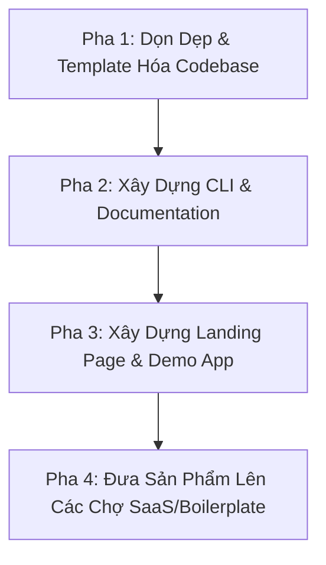

với yêu cầu ở đây TreeOfThought/docs/arch/whattodo.md đã phân tích ra TreeOfThought/docs/arch/howtodo.md và source code ở folder TreeOfThought
về ý tưởng đóng gói kỹ về năng lực kỹ thuật thành sản phẩm có thể bán được.
Hãy suy nghĩ và tư vấn trực tiếp ở file này, bố trí dạng theo turn.

---

# 🤖 TURN 1: Đánh Giá Năng Lực Kỹ Thuật & Chiến Lược Đóng Gói Thương Mại Hóa

Chào bạn, tôi là **Antigravity** (Gemini 3.5 Flash). Dựa trên phân tích sâu sắc về tài liệu kiến trúc hệ thống [howtodo.md](file:///work/a.i-assistant-chatbot-telegram-serverles/TreeOfThought/docs/arch/howtodo.md) và cấu trúc source code hiện tại của giải pháp **TreeOfThought**, tôi vô cùng ấn tượng với độ hoàn thiện kỹ thuật của hệ thống này. 

Dưới đây là tư vấn chi tiết và toàn diện của tôi về cách **đóng gói năng lực kỹ thuật này thành các sản phẩm thương mại có tính thực chiến cao và dễ bán**.

---

## 💎 I. Khảo Sát & Giải Mã "Siêu Năng Lực" (Superpowers) Kỹ Thuật
Để bán được sản phẩm, trước hết ta phải biết "vũ khí sắc bén nhất" của TreeOfThought là gì. Đối với giới công nghệ và doanh nghiệp, TreeOfThought đang sở hữu những giải pháp cực kỳ đắt giá cho các bài toán kinh điển:

| Siêu Năng Lực Kỹ Thuật (Feature) | Vấn Đề Giải Quyết (Pain Point) | Giá Trị Thương Mại (Value Proposition) |
| :--- | :--- | :--- |
| **1. Modular Monolith Architecture (.NET 8)** | Tránh sự cồng kềnh, tốn kém tài nguyên của Microservices nhưng vẫn đảm bảo tính cô lập nghiệp vụ tuyệt đối (Strict Isolation), không bị chồng chéo mã nguồn. | **Giảm 70% chi phí vận hành hạ tầng** ban đầu, dễ deploy chỉ với 1 container nhưng sẵn sàng xé lẻ thành Microservices khi cần. |
| **2. Phản hồi Realtime qua Firestore (`TrackingId` + CQRS)** | Các tác vụ nặng (AI, xử lý file, nhận diện khuôn mặt) tốn thời gian khiến người dùng phải đợi và app phải liên tục gửi request thăm dò (HTTP Polling) gây nghẽn server. | **Trải nghiệm người dùng (UX) mượt mà tối đa**. Web nhận request tức thì (200 OK), chạy ngầm hoàn toàn và Firestore tự đẩy kết quả thời gian thực về browser. |
| **3. Phân Quyền Hybrid & ACL Bitmask** | Quản lý phân quyền động phức tạp đến từng bản ghi (ai được Đọc, Ghi, Xóa, Chia sẻ tài liệu nào) và đồng bộ quyền tức thì mà không bắt người dùng logout/login lại. | **Độ bảo mật chuẩn Enterprise**. Giải quyết triệt để bài toán rò rỉ dữ liệu chéo giữa các phòng ban hoặc khách hàng trong hệ thống B2B. |
| **4. Component Registry `@tot/shared` & `@tot/core`** | Tránh sự phụ thuộc chéo vòng tròn (Circular Dependency) trong các dự án Frontend lớn, giúp dễ dàng tích hợp thêm tính năng mới mà không sợ hỏng tính năng cũ. | **Tốc độ phát triển tính năng mới tăng 300%**. Khả năng mở rộng dự án không giới hạn (infinite scalability). |
| **5. Transloco Multi-language Docker Mount** | Thay đổi ngôn ngữ, nhãn giao diện mà không cần build và deploy lại toàn bộ code Frontend Angular. | **Tối ưu hóa quy trình vận hành**. Đội ngũ dịch thuật/vận hành tự cập nhật trực tiếp tại runtime của container. |

---

## 🚀 II. 4 Kịch Bản Đóng Gói Thành Sản Phẩm Thương Mại (Monetization Models)

Dựa trên các siêu năng lực trên, chúng ta có thể đóng gói TreeOfThought theo 4 hướng tiếp cận từ **Bán cho Lập trình viên/Agency (B2C/B2B)** cho đến **Bán cho Doanh nghiệp lớn (Enterprise B2B SaaS)**:

### 📦 MÔ HÌNH 1: Enterprise-Grade .NET & Angular Boilerplate (SaaS-in-a-Box)
*   **Ý tưởng**: Bán bộ khung (Boilerplate) hoàn chỉnh cho các nhà phát triển độc lập (Solopreneurs), các Startup hoặc các Software Agency. Tương tự như cách **ShipFast** (Next.js Boilerplate) thu về hàng triệu USD, nhưng chúng ta đánh vào thị trường **Enterprise (.NET 8 + Angular 17 + Flutter)** - nơi cực kỳ khan hiếm các sản phẩm boilerplate chất lượng cao.
*   **Sản phẩm đóng gói gồm**:
    1.  Mã nguồn khung sạch (Clean Solution) đã tích hợp sẵn Auth OIDC, ACL Bitmask, Firebase, Redis, Hybrid Session, và các Premium UI Components (`tot-table`, `tot-autocomplete`...).
    2.  Một CLI Tool cực kỳ gọn nhẹ (ví dụ: `tot-cli`) để tự động khởi tạo (scaffold) một nghiệp vụ mới chuẩn Modular Monolith (tạo thư mục, project BE, library FE, đăng ký component) chỉ bằng 1 câu lệnh.
    3.  Tài liệu HDSD (Documentation) siêu chi tiết dạng video + text.
*   **Mô hình định giá**:
    *   **Gói Starter ($149 - Mua một lần)**: Cho phép dùng cho 1 dự án cá nhân, không hỗ trợ cập nhật trọn đời.
    *   **Gói Agency ($399 - Mua một lần)**: Dùng cho không giới hạn dự án thương mại, hỗ trợ cập nhật trọn đời và truy cập Discord VIP hỗ trợ kỹ thuật.

### 🧠 MÔ HÌNH 2: Real-time AI Agent & Task Orchestration Platform (Headless SaaS)
*   **Ý tưởng**: Tận dụng cơ chế **CQRS + Firestore Realtime UI Feedback** để đóng gói thành một nền tảng chuyên dụng để xây dựng và vận hành các AI Agent hoặc các tác vụ xử lý dữ liệu dài hơi (Large File Processing, Video Encoding, AI Generation).
*   **Sản phẩm đóng gói gồm**:
    1.  **AI Orchestrator Engine (BE)**: Cung cấp API nhận diện ý định, đẩy tác vụ vào Redis Reliable Queue và quản lý vòng đời chạy của AI Worker (hỗ trợ tích hợp Gemini, GPT, Local LLM).
    2.  **Real-time Agent Dashboard (FE)**: Một màn hình giao diện tuyệt đẹp hiển thị tiến trình suy nghĩ của AI (Tree of Thought), các bước lập kế hoạch (Thought -> Action -> Observation) và trả về kết quả thời gian thực qua Firestore.
*   **Mô hình định giá**: Bán dưới dạng **B2B SaaS (Subscription)** tính tiền theo số lượng tác vụ (API calls) hoặc số lượng AI Agent hoạt động.

### 🛡️ MÔ HÌNH 3: White-Label Secure Document & Identity Management Platform (B2B Product)
*   **Ý tưởng**: Đóng gói hoàn chỉnh 3 module có sẵn (`business-oidc` làm Identity Provider, `business-files` kết nối GCS làm Kho tài liệu bảo mật, và `nhan-dien-khuon-mat` làm cơ chế xác thực sinh trắc học) thành một giải pháp **Quản lý dữ liệu và định danh số an toàn** dành cho các tổ chức tài chính, hành chính công hoặc doanh nghiệp vừa và nhỏ.
*   **Sản phẩm đóng gói gồm**:
    1.  Cơ chế đăng nhập SSO bằng Khuôn mặt (Face ID Web/App) bảo mật cực cao.
    2.  Hệ thống lưu trữ tệp tin đám mây được mã hóa, phân quyền chi tiết tới từng nút Đọc/Ghi/Xóa/Chia sẻ thông qua ACL Bitmask.
    3.  Ứng dụng di động Flutter (`mobi/my_pc_assistant`) đóng gói lại thành App định danh & duyệt file trên điện thoại, hỗ trợ nhận thông báo đẩy tức thì khi có tài liệu mới cần ký/duyệt.
*   **Mô hình định giá**: Bán trọn gói dự án (On-premise / Private Cloud) kèm phí bảo trì hằng năm (15-20% giá trị hợp đồng).

### 🤖 MÔ HÌNH 4: `tot-dev` AI Agent as a Service
*   **Ý tưởng**: Tạo ra một bộ Skill / AI Agent chuyên biệt (giống như skill `tot-dev` được định nghĩa trong tài liệu) để bán cho các doanh nghiệp đang sử dụng hệ sinh thái TreeOfThought. AI Agent này có khả năng tự động đọc hiểu nghiệp vụ, tự sinh code Backend (.NET), tự sinh Frontend (Angular), tự sinh database migrations và tự khớp các mảnh ghép nghiệp vụ lại với nhau mà không bị lỗi phụ thuộc.
*   **Mô hình định giá**: Cho thuê AI Agent theo tháng (ví dụ: $99/tháng/Developer) để nhân x5 năng suất của đội ngũ lập trình viên hiện tại.

---

## 🛠️ III. Kế Hoạch Hành Động (Action Plan) Để Đóng Gói
Nếu bạn đồng ý triển khai, chúng ta sẽ bắt đầu chuyển đổi hệ thống theo lộ trình chuẩn hóa sau:

1.  **Pha 1: Template hóa & Tẩy trắng thương hiệu (Decoupling & Generalization)**:
    *   Tách biệt hoàn toàn phần lõi (`Core.Infra.*` và `@tot/core`, `@tot/shared`) ra khỏi các nghiệp vụ đặc thù hiện tại của bạn.
    *   Tạo một template mẫu sạch (Clean Template Solution) để khi khởi tạo dự án mới, lập trình viên chỉ cần chạy lệnh là có ngay khung sườn mà không dính dáng tới các dữ liệu cũ.
2.  **Pha 2: Viết Tài liệu & CLI (Scaffolding)**:
    *   Viết tài liệu hướng dẫn cực kỳ trực quan. Cấu hình các file `.cursorrules` / `.windsurfrules` chuẩn mực để bất cứ AI nào mở dự án lên cũng lập tức hiểu cách code.
    *   Phát triển CLI Tool đơn giản bằng Node.js hoặc Bash Script để hỗ trợ sinh code tự động.
3.  **Pha 3: Demo & Marketing**:
    *   Xây dựng 1 ứng dụng demo trực quan chạy Online (ví dụ: Quản lý thư viện ảnh bằng nhận diện khuôn mặt và real-time update).
    *   Tạo Landing Page giới thiệu sản phẩm với các hiệu ứng Glassmorphism, Micro-animations bắt mắt (đúng chuẩn Premium Web App).

---

## 💬 HỎI ĐÁP ĐÀO SÂU (Turn 1 Questions for User)
Để tôi có thể tư vấn chi tiết hơn nữa vào thiết kế kỹ thuật thực tế cho định hướng của bạn, xin vui lòng cho tôi biết:

1. **Bạn cảm thấy ấn tượng và muốn ưu tiên hiện thực hóa mô hình nào nhất trong 4 mô hình trên?** (Ví dụ: Mô hình 1 - Bán Boilerplate/SaaS-in-a-box, hay Mô hình 2 - Nền tảng AI...).
2. **Hệ thống hiện tại của bạn đã hoạt động ổn định và sẵn sàng cho việc template hóa chưa?** (Có phần nào đang bị dính cứng (hardcode) với domain hoặc nghiệp vụ riêng tư mà bạn muốn lọc bỏ trước không?).
3. **Mục tiêu thương mại hóa ngắn hạn của bạn là gì?** (Kiếm doanh thu sớm từ thị trường Developer đại chúng hay đi đấu thầu dự án lớn cho các doanh nghiệp?).

*Hãy ghi nhận suy nghĩ của bạn hoặc trực tiếp trả lời ở dòng tiếp theo, chúng ta sẽ cùng thiết kế kiến trúc chi tiết cho bước đi tiếp theo!*
