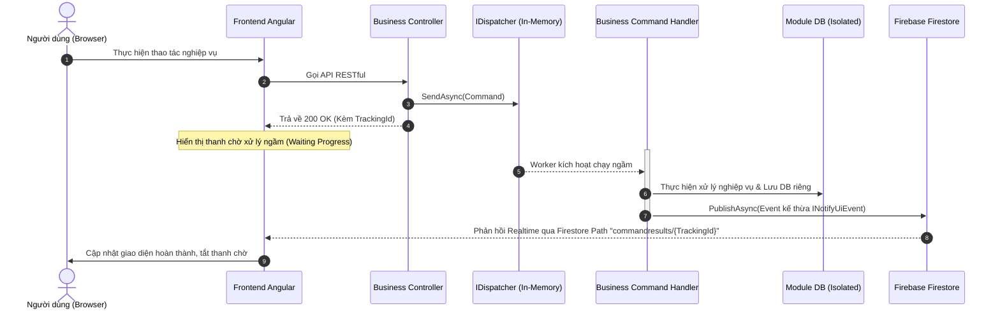
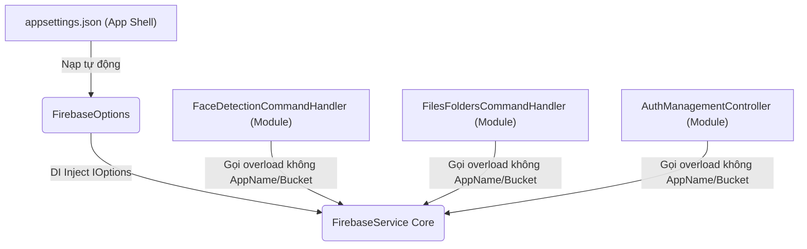
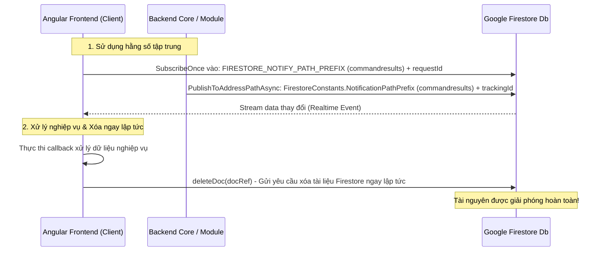

# Tiêu chuẩn Phát triển và Thiết kế Kiến trúc Backend (TreeOfThought)

Tài liệu này định nghĩa thiết kế kiến trúc tổng quan và các tiêu chuẩn phát triển bắt buộc cho toàn bộ dự án Backend trong thư mục `TreeOfThought/backend`, được đúc kết từ yêu cầu nền tảng tại [whattodo.md](TreeOfThought/docs/backend/whattodo.md) và các quy chuẩn nghiêm ngặt của skill `tot-dev`.

---

## 1. Tổng quan Kiến trúc Nền tảng (General Base Infra)

Backend được thiết kế theo mô hình **Modular Monolith** kết hợp với **Clean Architecture** và **CQRS**. Hệ thống cung cấp một hạ tầng cơ sở vững chắc (Base Infrastructure) để mọi module nghiệp vụ khi tích hợp vào đều có thể kế thừa và hoạt động nhất quán về: **Database, Cache, Session, CQRS, Firebase và Security/Auth**.

### Các thư viện hạ tầng cốt lõi (Core Infra Base):
*   **Core.Infra.Base**: Định nghĩa toàn bộ Contracts dùng chung (Interface như `ICacheService`, `IQueueService`, `IEventBus`, `IEventHandler`, `INotifyUiEvent`, `IDispatcher`), các hằng số và các model dùng chung cho toàn bộ giải pháp.
*   **Core.Infra.Redis**: Quản lý Cache, Pub/Sub và Hàng đợi tin cậy (Reliable Queue thông qua `LPUSH` / `RPOP` nhằm đảm bảo không thất thoát thông tin khi worker gặp sự cố).
*   **Core.Infra.Session**: Quản lý session người dùng tập trung trên Redis dưới mô hình **Hybrid Session** (kết hợp thông tin mỏng trong JWT và thông tin chi tiết trên Redis để tối ưu hóa băng thông mạng).
*   **Core.Infra.Data**: Quản lý kết nối đa cơ sở dữ liệu (PostgreSQL, MSSQL, MySQL, MongoDB) thông qua lớp trừu tượng `BaseDbContext`.
*   **Core.Infra.Firebase**: Đóng gói các dịch vụ của Google Firebase (FCM để thông báo đẩy, Firestore để gửi phản hồi realtime lên UI, Google Cloud Storage để lưu trữ file tài liệu/hình ảnh).
*   **Core.Infra.Auth**: Xử lý JWT, ACL chi tiết và Authorization thông minh. Annotation `[AppAuthorize]` hỗ trợ kiểm tra quyền ở cả mức tĩnh (Claims) và mức động (Claims + Redis Session + ACL Bitmask theo từng Resource ID cụ thể).
*   **Core.Infra.Cqrs**: Cung cấp hạ tầng xử lý Command/Handler và Event/PubSub bất đồng bộ, đi kèm cơ chế tự động đăng ký handler (`CqrsAutoRegistrationService`) và tự động gửi thông báo trạng thái xử lý lên Firestore (`UiNotificationEventHandler`).

---

## 2. Tiêu chuẩn Phát triển Nghiệp vụ chung (Business Module Standards)

Tất cả các module nghiệp vụ khi phát triển mới hoặc bổ sung tính năng **bắt buộc phải tuân thủ tuyệt đối** các tiêu chuẩn kiến trúc dưới đây nhằm tránh tạo ra nợ kỹ thuật (tech debt) và đảm bảo tính bền vững của giải pháp:

### 2.1. Tính Cô lập Tuyệt đối (Strict Isolation & Encapsulation)
*   **Dự án độc lập**: Mỗi nghiệp vụ phải là một project riêng biệt trong thư mục `TreeOfThought/backend/`.
*   **Không gọi chéo**: Tuyệt đối không được Add Reference hoặc gọi trực tiếp code từ module nghiệp vụ khác.
*   **Giao tiếp lỏng (Loose Coupling)**: Mọi trao đổi dữ liệu hoặc kích hoạt xử lý giữa các nghiệp vụ bắt buộc phải thực hiện thông qua **Command/Event** của CQRS hoặc Pub/Sub của Redis.
*   **Truy vấn dữ liệu liên nghiệp vụ (Read-Only)**: Nếu bắt buộc phải truy vấn dữ liệu thuộc quản lý của module khác, cho phép tạo một `DbContext` phụ ngay trong module hiện tại nhưng **chỉ được phép cấu hình ở chế độ Read-only** (tuyệt đối không được chứa code làm thay đổi dữ liệu).

### 2.2. Quy tắc Cấu hình DB và Connection String riêng biệt
*   **Tách biệt cơ sở dữ liệu**: Mỗi nghiệp vụ sở hữu một `DbContext` riêng biệt kế thừa từ `BaseDbContext`.
*   **Cấu hình cô lập**: Để đảm bảo việc triển khai (deploy) không lẫn lộn cơ sở dữ liệu giữa các môi trường và giữa các module, connection string của từng nghiệp vụ phải được cấu hình và nạp **duy nhất** từ khóa cấu hình riêng trong `appsettings.json` dạng:
    ```json
    "{TenNghiepVu}:Postgresql" hoặc "{TenNghiepVu}:Redis"
    ```
    *Ví dụ: `NhanDienKhuonMat:Postgresql`. Hệ thống sẽ báo lỗi khởi chạy ngay lập tức nếu thiếu khóa cấu hình riêng này của nghiệp vụ.*

### 2.3. Quy trình Xử lý Bất đồng bộ & Phản hồi Realtime lên UI (CQRS Pattern)
Đối với các tác vụ nghiệp vụ mất nhiều thời gian (như xử lý tệp tin, AI, Telegram Chatbot...), bắt buộc triển khai theo luồng xử lý bất đồng bộ:
1.  **API Restful**: Nhận yêu cầu từ UI, chuyển đổi thành **Command** (ví dụ: `SaveFaceDetectionSessionCommand`), gửi lệnh qua `_dispatcher.SendAsync(command)` và lập tức trả về mã `200 OK` chứa mã theo dõi (`trackingId` / `requestId`) để UI hiển thị trạng thái xử lý (Waiting Progress).
2.  **Background Worker**: Handler tương ứng nhận lệnh chạy ngầm dưới nền, xử lý logic nghiệp vụ và lưu kết quả vào CSDL của module.
3.  **Realtime UI Notification**: Xử lý xong, Handler phát ra một **Event** kế thừa `INotifyUiEvent` (ví dụ: `FaceDetectionSessionSavedEvent`). Hệ thống sẽ tự động đồng bộ hóa thông báo lên Firestore theo đường dẫn:
    ```
    commandresults/{TrackingId}
    ```
4.  **UI Feedback**: Giao diện Frontend lắng nghe (subscribe) Firestore tại đường dẫn trên để nhận kết quả thành công/thất bại và cập nhật UI lập tức, sau đó chủ động xóa document trên Firestore để tránh rác tài nguyên.



### 2.4. Quy chuẩn Phân trang bắt buộc (Standard Server-Side Paging)

> [!IMPORTANT]
> **Cập nhật ngày 2026-05-28 08:48:10**: Paging cho việc lấy danh sách (List/Search) **luôn luôn bắt buộc phải là phân trang ở server (server-side paging)**. Tuyệt đối không được sử dụng cơ chế tải toàn bộ rồi phân trang ở giao diện (client-side paging), nhằm đảm bảo hiệu năng mạng, tối ưu hóa bộ nhớ RAM của thiết bị khách, và sẵn sàng mở rộng khi quy mô dữ liệu tăng lên.

#### 1. Quy chuẩn Tham số Đầu vào (Request parameters)
Mọi API trả về danh sách dạng phân trang bắt buộc phải đặt tên tham số đồng bộ là **`pageIndex`** và **`pageSize`** (cú pháp camelCase ở đầu query string) để tương thích 100% với Frontend `@tot/shared` `tot-table` component:
*   **`pageIndex`**: 1-based index (Trang đầu tiên luôn luôn bắt đầu bằng `1`). Mặc định khi không truyền là `1`.
*   **`pageSize`**: Số lượng bản ghi giới hạn trên một trang. Mặc định khi không truyền là `10`.

> [!CAUTION]
> **SAI LẦM CẤM KỴ**: Tuyệt đối **không** được viết tắt tham số thành `page` hoặc sử dụng chỉ số bắt đầu bằng `0` (0-based) ở mức API, vì điều này sẽ gây sai lệch nghiêm trọng các tham số truyền từ Frontend `tot-table`.

#### 2. Công thức tính toán skip/take trong C# Entity Framework
Luôn luôn thực hiện skip bản ghi theo công thức 1-based chuẩn xác để tránh lệch dữ liệu:
```csharp
var items = await query
    .Skip((pageIndex - 1) * pageSize)
    .Take(pageSize)
    .ToListAsync();
```

#### 3. Quy chuẩn Cấu trúc Dữ liệu Trả về (Response Payload)
Tất cả các API phân trang bắt buộc phải trả về một đối tượng JSON chuẩn chứa đúng 2 khóa sau:
*   **`items`**: Mảng chứa danh sách các bản ghi của trang hiện tại.
*   **`total`**: Tổng số lượng bản ghi thực tế trong CSDL thỏa mãn điều kiện lọc (không bị giới hạn bởi `Skip` / `Take`).

```json
{
  "items": [
    { "id": "guid-1", "name": "Bản ghi 1" },
    { "id": "guid-2", "name": "Bản ghi 2" }
  ],
  "total": 17
}
```

> [!WARNING]
> **SAI LẦM PHỔ BIẾN**: Tuyệt đối **không** được trả về mảng dữ liệu bọc trong khóa `data` hay viết hoa thành `Items`/`Total` ở JSON trả về (phải luôn giữ chữ thường `items`/`total` thông qua cấu hình CamelCase Serializer mặc định của ASP.NET Core) để Frontend `tot-table` có thể tự động bóc tách dữ liệu nhất quán.

#### 4. Phối hợp Realtime với Frontend (Tránh lỗi Reset trang ngầm)
*   **Tránh dùng queryParamsChange**: Backend và Frontend thống nhất không sử dụng cơ chế lắng nghe `queryParamsChange` để tải lại trang, nhằm ngăn chặn việc Ng-Zorro Antd tự động phát sự kiện reset về trang 1 khi `items` hoặc `total` thay đổi.
*   **Bộ lắng nghe chuẩn**: Frontend luôn đăng ký trực tiếp bộ lắng nghe sự kiện `(pageIndexChange)` và `(pageSizeChange)` để gán giá trị và gọi API một cách tường minh.

#### 5. BÀI HỌC KINH NGHIỆM VÀ SỰ THỐNG NHẤT FE - BE
Để không lặp lại bất kỳ sai lầm nào gây mất phân trang hoặc tải sai trang, cả lập trình viên Backend và Frontend phải nghiêm ngặt tuân thủ bản đối chiếu sau:

| Vấn đề / Sai lầm đã xảy ra | Hậu quả thực tế | Cách thiết kế & Xử lý đúng chuẩn |
| :--- | :--- | :--- |
| **Sử dụng sự kiện `queryParamsChange`** | Thiết lập lại `pageIndex = 1` ngầm tạo vòng lặp vô hạn hoặc reset khi chuyển trang. | **CẤM DÙNG** `queryParamsChange`. Thay thế bằng sự kiện độc lập `(pageIndexChange)` và `(pageSizeChange)`. |
| **Angular Ivy Two-Way Binding Quirk** | Ivy triệt tiêu gán tự động khi dùng `[(pageIndex)]="pageIndex"` chung với `(pageIndexChange)`. | Dùng liên kết 1-way: `[pageIndex]="pageIndex"` và gán tường minh `(pageIndexChange)="pageIndex = $event; loadData()"`. |
| **Sai lệch cấu trúc JSON Payload** | FE không bóc tách được dữ liệu, bảng trống rỗng hoặc thanh phân trang bị ẩn. | BE trả về đúng khóa chữ thường `items` và `total` (serializer camelCase). FE chỉ đọc đúng cấu trúc này. |
| **Trượt tên tham số Query String** | Tham số chuyển trang bị bỏ qua, BE trả về trang mặc định liên tục. | Bắt buộc đặt tên tham số API query string là `pageIndex` và `pageSize` (camelCase). |
| **Lệch công thức EF Skip/Take** | Lặp bản ghi hoặc hiển thị thiếu bản ghi giữa các trang. | Sử dụng công thức 1-based: `.Skip((pageIndex - 1) * pageSize).Take(pageSize)`. |

### 2.5. Quy tắc Đóng gói Khởi tạo Cơ sở Dữ liệu & Đăng ký Dịch vụ (Database Initialization & Extension Encapsulation)

> [!IMPORTANT]
> **Cập nhật ngày 2026-05-27 11:40:40**: Để duy trì tính độc lập (Decoupling) và nhất quán cấu trúc mã nguồn theo folder nghiệp vụ, việc khởi tạo cơ sở dữ liệu (tạo bảng, sinh dữ liệu mẫu/seed data) hoặc đăng ký dịch vụ (Dependency Injection) của từng nghiệp vụ **bắt buộc phải được đóng gói vào các Extension Methods** của dự án nghiệp vụ đó. App Shell (`Program.cs`) tuyệt đối không được tự ý thực hiện khởi tạo hoặc cấu hình thủ công.

#### 1. Tiêu chuẩn Đặt tên và Định nghĩa Extension Methods
Mỗi dự án nghiệp vụ (hoặc hạ tầng cốt lõi) cần định nghĩa các phương thức mở rộng theo 2 giai đoạn startup:

*   **Giai đoạn Build Container (Đăng ký dịch vụ)**:
    *   Sử dụng extension method trên `IServiceCollection` nằm trong namespace của nghiệp vụ.
    *   Tiền tố đặt tên: `Add...`
    *   *Ví dụ: `public static IServiceCollection AddNhanDienKhuonMat(this IServiceCollection services, IConfiguration config)`*
*   **Giai đoạn Pipeline Startup (Khởi tạo và Sử dụng dịch vụ)**:
    *   Sử dụng extension method trên `IApplicationBuilder` nằm trong namespace của nghiệp vụ.
    *   Tiền tố đặt tên: `Use...` và kiểu trả về là `async Task`.
    *   *Ví dụ: `public static async Task UseNhanDienKhuonMat(this IApplicationBuilder app)`*

#### 2. Quy chuẩn An toàn khi Khởi tạo Cơ sở dữ liệu ngầm
Bên trong phương thức `Use{NghiepVu}`, bắt buộc phải tuân thủ các quy tắc thiết kế an toàn:
1.  **Quản lý Scope**: Tạo một `IServiceScope` thông qua `app.ApplicationServices.CreateScope()` để đảm bảo lấy ra đúng các dịch vụ Scoped (như `DbContext`) và tự động giải phóng tài nguyên sau khi quá trình khởi tạo kết thúc.
2.  **Khởi tạo Bất đồng bộ**: Thực hiện tạo bảng hoặc seed dữ liệu một cách bất đồng bộ bằng cách gọi `await dbContext.EnsureTablesCreatedAsync()`.
3.  **Xử lý Ngoại lệ (Safety Try-Catch)**: Bọc toàn bộ logic khởi tạo trong khối `try-catch`. Nếu xảy ra lỗi khởi tạo DB (ví dụ CSDL chưa sẵn sàng hoặc sai kết nối), ghi nhận log cụ thể qua `Console.WriteLine` hoặc `ILogger` với prefix `[STARTUP ERROR]` và **không** ném ngoại lệ làm sập ứng dụng chính ngay lập tức, giúp ứng dụng App Shell có khả năng phục hồi hoặc ghi nhận lỗi startup rõ ràng.

*Ví dụ minh họa cấu trúc phương thức khởi tạo chuẩn:*
```csharp
public static async Task UseNhanDienKhuonMat(this IApplicationBuilder app)
{
    using (var scope = app.ApplicationServices.CreateScope())
    {
        var services = scope.ServiceProvider;
        try
        {
            var faceDb = services.GetRequiredService<NhanDienKhuonMatDbContext>();
            await faceDb.EnsureTablesCreatedAsync();
        }
        catch (Exception ex)
        {
            Console.WriteLine($"[STARTUP ERROR] NhanDienKhuonMatDbContext table creation failed: {ex.Message}");
        }
    }
}
```

#### 3. Cách tích hợp sạch vào App Shell (`Program.cs`)
Nhờ có các extension method được chuẩn hóa, file `Program.cs` của App Shell sẽ cực kỳ gọn gàng và không bị phình to (bloated). Chỉ cần thực hiện gọi tuần tự:
```csharp
// --- 8. Initialize Infrastructure ---
await app.UseAppOidc(config, new[] { Assembly.GetExecutingAssembly() });
await app.UseFilesFolders();
await app.UseNhanDienKhuonMat();
await app.UseCqrs();
```

---

## 3. Ví dụ Minh họa về Triển khai Nghiệp vụ đúng chuẩn

Hệ thống hiện tại có các module nghiệp vụ mẫu minh họa xuất sắc cho việc áp dụng các tiêu chuẩn trên:

### 3.1. Ví dụ 1: Module FilesFolders (`Core.Infra.FilesFolders`)
*   **Cơ sở dữ liệu**: Có `FilesFoldersDbContext` riêng biệt, kết nối qua `FilesFoldersConnection`.
*   **Xử lý bất đồng bộ**: Xử lý upload và tổ chức file qua hệ thống Command/Handler của CQRS.
*   **Phân trang**: API `GetFolderContentAsync` nạp dữ liệu phân trang và trả về định dạng `{ items, total }` chuẩn xác.

### 3.2. Ví dụ 2: Module Nhận Diện Khuôn Mặt (`nhan-dien-khuon-mat`)
*   **Cấu trúc**: Thư mục đặt tên kebab-case chuẩn `nhan-dien-khuon-mat`.
*   **Cấu hình độc lập**: Tự định nghĩa `NhanDienKhuonMatDbContext` và chỉ nạp kết nối Postgres qua khóa chuyên biệt `NhanDienKhuonMat:Postgresql` trong `appsettings.json` để tránh lẫn lộn khi deploy.
*   **Luồng xử lý**: API `api/face-detection/save` tiếp nhận luồng tải lên multipart form, đẩy command ngầm qua dispatcher, tải dữ liệu lên Firebase Cloud Storage, lưu DB và phản hồi realtime về UI thông qua Firestore path `commandresults/{TrackingId}` khi xử lý thành công.

---

## 4. Gap Analysis & Định hướng Hoàn thiện Hạ tầng

Dựa trên việc kiểm tra chéo toàn bộ code trong `TreeOfThought/backend`, chúng tôi đề xuất các định hướng tối ưu hóa cơ sở hạ tầng chung:

- [ ] **Chính sách Firestore TTL (Time To Live)**: Đề xuất cấu hình quy tắc dọn dẹp tự động (TTL) cho collection `notify` trên Firebase Firestore để tự động xóa các document cũ phòng trường hợp Client bị ngắt kết nối đột ngột và không kịp gửi yêu cầu xóa tài liệu.
- [ ] **Đồng bộ hóa Session khi thay đổi quyền**: Cần hoàn thiện API trong `AuthManagementController` để tự động trigger phương thức `SyncUserClaimsToRedisAsync` và `SyncUserAclToRedisAsync` ngay khi Admin cập nhật quyền của User, giúp phân quyền Hybrid Auth có tác dụng ngay lập tức mà không cần người dùng đăng nhập lại.
- [x] **Di chuyển toàn bộ cài đặt Firebase vào appsettings**: Hợp nhất và di chuyển toàn bộ cấu hình Firebase (AppName, StorageBucket...) đang bị hardcode trong các handler về tập trung quản lý tại `appsettings.json` của App Shell để dễ dàng thay đổi theo môi trường triển khai. *(Xem thiết kế chi tiết tại Mục 5)*
- [x] **Định nghĩa hằng số tập trung cho Firestore Notify Path**: Định nghĩa duy nhất hằng số (const) `commandresults` ở cả Backend và Frontend để đảm bảo tất cả các nghiệp vụ sử dụng chung một cấu trúc đường dẫn đồng bộ và không tạo bừa bãi. Đồng thời xác thực việc UI tự động dọn dẹp (deleteDoc) tài liệu Firestore ngay sau khi nhận kết quả để tránh lãng phí tài nguyên và chi phí. *(Xem thiết kế chi tiết tại Mục 6)*

---

## 5. Giải pháp thiết kế di chuyển cấu hình Firebase tập trung vào appsettings.json

Để giải quyết triệt để vấn đề các cài đặt Firebase như `AppName` (chuỗi `"Default"`) và `StorageBucket` (chuỗi `"dunp-test-gcs"`) đang bị hardcode rải rác trong các Command Handlers và Controllers, chúng tôi đề xuất **Giải pháp bổ sung các phương thức Overload trong `FirebaseService` (Phương án A)**.

### 5.1. Sơ đồ Nguyên lý Kiến trúc
Thay vì buộc tất cả các module nghiệp vụ (như `nhan-dien-khuon-mat`, `Core.Infra.FilesFolders`, `Core.Infra.Oidc`) phải tự nạp cấu hình `IOptions<FirebaseOptions>` để lấy các giá trị mặc định của môi trường rồi truyền thủ công vào từng phương thức, chúng tôi sẽ mở rộng `FirebaseService` trong `Core.Infra.Firebase` để nó tự động sử dụng cấu hình mặc định được nạp từ `appsettings.json` nếu người gọi không chỉ định.



### 5.2. Các thay đổi chi tiết dự kiến

#### 1. Nâng cấp `FirebaseService` (trong [FirebaseService.cs](file:///work/a.i-assistant-chatbot-telegram-serverles/TreeOfThought/backend/Core.Infra.Firebase/Services/FirebaseService.cs))
Bổ sung các phương thức overloaded tự động nạp `AppName` và `StorageBucket` từ `_options.Value`:

```csharp
// Overloads cho FCM & Token
public async Task<string> CreateCustomTokenAsync(string uid, IDictionary<string, object>? claims = null)
    => await CreateCustomTokenAsync(_options.Value.AppName, uid, claims);

public async Task<FirebaseToken> VerifyIdTokenAsync(string idToken)
    => await VerifyIdTokenAsync(_options.Value.AppName, idToken);

public async Task SendNotificationAsync(string token, string title, string body)
    => await SendNotificationAsync(_options.Value.AppName, token, title, body);

// Overloads cho Firestore
public FirestoreDb GetFirestore() 
    => GetFirestore(_options.Value.AppName);

public async Task PublishToAddressPathAsync(string path, object data)
    => await PublishToAddressPathAsync(_options.Value.AppName, path, data);

public async Task DeleteAddressPathAsync(string path)
    => await DeleteAddressPathAsync(_options.Value.AppName, path);

// Overloads cho Storage
public async Task<string> UploadFileAsync(string objectName, Stream content, string contentType, bool isPublic = false)
    => await UploadFileAsync(_options.Value.AppName, _options.Value.StorageBucket, objectName, content, contentType, isPublic);

public async Task UpdateObjectAclAsync(string objectName, bool isPublic)
    => await UpdateObjectAclAsync(_options.Value.AppName, _options.Value.StorageBucket, objectName, isPublic);

public string GetSignedUrl(string objectName, TimeSpan duration)
    => GetSignedUrl(_options.Value.AppName, _options.Value.StorageBucket, objectName, duration);

public string GetPublicUrl(string objectName)
    => GetPublicUrl(_options.Value.StorageBucket, objectName);

public async Task<byte[]> ReadFileAsync(string objectName)
    => await ReadFileAsync(_options.Value.AppName, _options.Value.StorageBucket, objectName);

public async Task DeleteFileAsync(string objectName)
    => await DeleteFileAsync(_options.Value.AppName, _options.Value.StorageBucket, objectName);

public async Task<List<string>> ListFilesAsync(string prefix)
    => await ListFilesAsync(_options.Value.AppName, _options.Value.StorageBucket, prefix);
```

#### 2. Dọn dẹp các Handler & Controller (Caller)
Sau khi triển khai các overload trên, code ở các module nghiệp vụ sẽ cực kỳ tinh gọn và độc lập:

*   **Tại [FaceDetectionCommandHandler](file:///work/a.i-assistant-chatbot-telegram-serverles/TreeOfThought/backend/nhan-dien-khuon-mat/Handlers/FaceDetectionCommandHandler.cs)**:
    *   *Trước đây*: Phải inject `IOptions<FirebaseOptions>` và gọi:
        ```csharp
        originalUrl = await _firebaseService.UploadFileAsync(_firebaseOptions.AppName, _firebaseOptions.BucketName, originalPath, ...);
        ```
    *   *Sau refactor*: **Không cần inject `IOptions<FirebaseOptions>`**, chỉ cần gọi trực tiếp:
        ```csharp
        originalUrl = await _firebaseService.UploadFileAsync(originalPath, originalStream, command.OriginalContentType, false);
        ```

*   **Tại [FilesFoldersCommandHandler](file:///work/a.i-assistant-chatbot-telegram-serverles/TreeOfThought/backend/Core.Infra.FilesFolders/Handlers/FilesFoldersCommandHandler.cs)**:
    *   *Trước đây*: Phải inject `IOptions<FirebaseOptions>` và truyền cả AppName lẫn BucketName.
    *   *Sau refactor*: **Không cần inject `IOptions<FirebaseOptions>`**, gọi đơn giản:
        ```csharp
        var url = await _firebaseService.UploadFileAsync(objectName, stream, command.ContentType, false);
        ```

*   **Tại [UiNotificationEventHandler](file:///work/a.i-assistant-chatbot-telegram-serverles/TreeOfThought/backend/Core.Infra.Cqrs/Handlers/UiNotificationEventHandler.cs)**:
    *   *Trước đây*: Hardcode `"Default"` khi đẩy notify realtime:
        ```csharp
        await _firebaseService.PublishToAddressPathAsync("Default", @event.NotifyPath, @event);
        ```
    *   *Sau refactor*: Gọi trực tiếp không cần AppName:
        ```csharp
        await _firebaseService.PublishToAddressPathAsync(@event.NotifyPath, @event);
        ```

*   **Tại [AuthManagementController](file:///work/a.i-assistant-chatbot-telegram-serverles/TreeOfThought/backend/Core.Infra.Oidc/Controllers/AuthManagementController.cs)**:
    *   *Trước đây*: Inject `IConfiguration` để đọc `Firebase:StorageBucket` thủ công và hardcode `"Default"`:
        ```csharp
        var bucketName = _config["Firebase:StorageBucket"] ?? "dunp-test-gcs";
        var publicUrl = await _firebaseService.UploadFileAsync("Default", bucketName, fileName, stream, file.ContentType);
        ```
    *   *Sau refactor*: **Không cần dùng `IConfiguration` hay hardcode**, gọi cực kỳ đơn giản:
        ```csharp
        var publicUrl = await _firebaseService.UploadFileAsync(fileName, stream, file.ContentType);
        ```

*   **Tại các Controller Test ([FirebaseTestController](file:///work/a.i-assistant-chatbot-telegram-serverles/TreeOfThought/backend/Core.Web.Api/Controllers/FirebaseTestController.cs), [TestController](file:///work/a.i-assistant-chatbot-telegram-serverles/TreeOfThought/backend/Core.Web.Api/Controllers/TestController.cs), [SampleHandlers](file:///work/a.i-assistant-chatbot-telegram-serverles/TreeOfThought/backend/Core.Web.Api/Handlers/SampleHandlers.cs))**:
    *   Các chuỗi hardcode `"Default"` và các dòng đọc config thủ công sẽ được lược bỏ hoàn toàn và chuyển sang dùng hàm overload của `FirebaseService`.

## 6. Giải pháp thiết kế Hằng số tập trung cho Firestore Notify Path và Cơ chế dọn dẹp phía UI

Theo bản cập nhật ngày **2026-05-17 12:36:36**, để tối ưu chi phí và tài nguyên Firestore (tránh các thao tác ghi/đọc dư thừa gây lãng phí tiền bạc), chúng tôi đề xuất giải pháp chuẩn hóa đường dẫn thông báo qua hằng số tập trung và kiểm tra tính hợp lệ của cơ chế dọn dẹp phía Client (UI).

### 6.1. Sơ đồ đồng bộ hóa Hằng số & Luồng dọn dẹp dữ liệu
Thiết kế này đảm bảo cả Backend và Frontend đều chia sẻ một cấu trúc đường dẫn duy nhất mà không tự ý định nghĩa các chuỗi hardcode phân mảnh:



### 6.2. Các thay đổi chi tiết dự kiến

#### 1. Xây dựng hằng số tại Backend (project [Core.Infra.Base](file:///work/a.i-assistant-chatbot-telegram-serverles/TreeOfThought/backend/Core.Infra.Base)):
Tạo mới file [FirestoreConstants.cs](file:///work/a.i-assistant-chatbot-telegram-serverles/TreeOfThought/backend/Core.Infra.Base/Constants/FirestoreConstants.cs):
```csharp
namespace Core.Infra.Base.Constants;

public static class FirestoreConstants
{
    /// <summary>
    /// Đường dẫn tiền tố hằng số duy nhất cho việc notify UI trong toàn bộ solution.
    /// Tránh việc tạo bừa bãi các collection/path khác nhau gây lãng phí tài nguyên.
    /// </summary>
    public const string NotificationPathPrefix = "commandresults";

    public static string GetNotificationPath(string trackingId) => $"{NotificationPathPrefix}/{trackingId}";
    public static string GetNotificationPath(Guid trackingId) => $"{NotificationPathPrefix}/{trackingId}";
}
```

#### 2. Cập nhật các Class Event & Controller tại Backend:
- Tại [FilesFoldersEvent](file:///work/a.i-assistant-chatbot-telegram-serverles/TreeOfThought/backend/Core.Infra.FilesFolders/Models/Events.cs) và [NhanDienKhuonMatEvent](file:///work/a.i-assistant-chatbot-telegram-serverles/TreeOfThought/backend/nhan-dien-khuon-mat/Models/Events.cs):
  ```csharp
  // Thay thế đường dẫn hardcode cũ
  public string NotifyPath => FirestoreConstants.GetNotificationPath(TrackingId);
  ```
- Tại các controller test như [TestController](file:///work/a.i-assistant-chatbot-telegram-serverles/TreeOfThought/backend/Core.Web.Api/Controllers/TestController.cs) hay handler như [SampleHandlers](file:///work/a.i-assistant-chatbot-telegram-serverles/TreeOfThought/backend/Core.Web.Api/Handlers/SampleHandlers.cs):
  ```csharp
  await _firebase.PublishToAddressPathAsync(FirestoreConstants.GetNotificationPath(trackingId), data);
  ```

#### 3. Chuẩn hóa hằng số và Kiểm tra Luồng dọn dẹp tại Frontend (Angular):
- Khảo sát thực tế trong [firebase.service.ts](file:///work/a.i-assistant-chatbot-telegram-serverles/TreeOfThought/frontend/web/projects/tot/core/src/lib/firebase/firebase.service.ts) cho thấy hàm `subscribeOnce` **đã** được viết rất chuẩn mực và có cơ chế tự động dọn dẹp tài liệu Firestore ngay sau khi nhận phản hồi:
  ```typescript
  // firebase.service.ts (Line 123-147)
  subscribeOnce(requestId: string, callback: (data: any) => void) {
    const docRef = doc(this.db, 'commandresults', requestId); // Sẽ refactor thành hằng số FIRESTORE_NOTIFY_PATH_PREFIX
    const unsubscribe = onSnapshot(docRef, async (snapshot) => {
      if (snapshot.exists()) {
        try {
          const data = snapshot.data();
          callback(data);
          unsubscribe(); // Ngừng lắng nghe ngay lập tức
        } catch (error) {
          console.error(error);
        } finally {
          try {
            await deleteDoc(docRef); // XÓA DOCUMENT TRÊN FIRESTORE NGAY LẬP TỨC!
          } catch (e) {
            console.error('Failed to delete Firestore document after receipt', e);
          }
        }
      }
    });
    return unsubscribe;
  }
  ```
- Dự kiến thay thế:
  ```typescript
  export const FIRESTORE_NOTIFY_PATH_PREFIX = 'commandresults';
  // ...
  const docRef = doc(this.db, FIRESTORE_NOTIFY_PATH_PREFIX, requestId);
  ```

Giải pháp trên đảm bảo tuân thủ nghiêm ngặt nguyên tắc KISS, đồng bộ hóa tuyệt đối cấu trúc Firestore ở cả Frontend/Backend và ngăn chặn triệt để lãng phí tài nguyên của Google Cloud Firestore.

---

## 7. Quy chuẩn Đăng ký và Cấu hình Authorization (Cập nhật 2026-05-18 12:46:36)

Để sử dụng annotation bảo mật `[AppAuthorize]` (thuộc project `Core.Infra.Auth`) trong các project nghiệp vụ Backend (như `nhan-dien-khuon-mat`, `Core.Infra.FilesFolders`, `Core.Infra.Oidc`), các API và Ứng dụng khách bắt buộc phải thực hiện đăng ký dịch vụ thông qua `AuthServiceExtensions.cs` tại `Program.cs` và cấu hình chính xác tệp tin `appsettings.json` tùy theo loại ứng dụng:

### 7.1. Đối với API Restful tiêu thụ Token (Resource Server)
Các API nghiệp vụ hoạt động như một Resource Server tiêu thụ JWT token được cấp phát từ SSO Server (`Core.Web.Api`), kết hợp kiểm tra phân quyền Hybrid (JWT + Redis Session).

#### 1. Cấu hình `appsettings.json` bắt buộc:
*   **Session**: Cấu hình kết nối Redis để lưu trữ và tải claims/ACL bổ sung từ Session (hỗ trợ chế độ Hybrid khi lượng claims quá lớn vượt quá kích thước JWT tối ưu).
*   **Auth**: Cấu hình `IsOidc` thành `false` để hoạt động dưới dạng Resource Server, đồng thời trỏ `Authority` về SSO Server.
```json
{
  "Session": {
    "Redis": "localhost:6379,defaultDatabase=0,password=Test123456,abortConnect=false"
  },
  "Auth": {
    "Jwt": {
      "IsOidc": false, // Project API này chỉ là Resource Server tiêu thụ Token
      "Authority": "http://localhost:5000" // Trỏ tới địa chỉ của SSO Server (Core.Web.Api)
    }
  }
}
```

#### 2. Đăng ký trong `Program.cs`:
Kích hoạt phân quyền và xác thực dạng JWT Bearer thông qua extension `AddAppAuthorization`:
```csharp
using Core.Infra.Auth.Extensions;
using Core.Infra.Auth.Models;

var builder = WebApplication.CreateBuilder(args);

// Đăng ký dịch vụ Authorization với chế độ JWT Bearer
builder.Services.AddAppAuthorization(builder.Configuration, AppAuthMode.JwtBearer);

var app = builder.Build();

app.UseAuthentication();
app.UseAuthorization();
```

---

### 7.2. Đối với MVC Web App (Client ứng dụng dùng Cookie & OpenID Connect)
Khi xây dựng một ứng dụng khách MVC Web (ví dụ: `webmvctestoidc`) giao tiếp với SSO Server, ứng dụng cần cấu hình cơ chế Cookie Authentication để duy trì trạng thái đăng nhập trên trình duyệt và tích hợp OpenID Connect để thực hiện luồng SSO đăng nhập.

#### 1. Cấu hình `appsettings.json` cho OIDC:
```json
{
  "Oidc": {
    "Authority": "http://localhost:5000",
    "ClientId": "WebMvcTestOidc",
    "ClientSecret": "WebMvcTestOidcSecret"
  }
}
```

#### 2. Đăng ký và Cấu hình chi tiết trong `Program.cs`:
*   Sử dụng `AppAuthMode.None` khi gọi `AddAppAuthorization()` để bỏ qua việc tự động đăng ký xác thực của Core base và để ứng dụng MVC Web tự định nghĩa cấu hình Cookies & OpenID Connect tùy biến.
*   Bỏ qua kiểm tra `Nonce` (`RequireNonce = false`) nếu OIDC Server tùy biến chưa hỗ trợ hoàn toàn.
*   Sử dụng bộ xác thực tiêu chuẩn `TokenValidationParameters` kết nối endpoint JWKS của SSO Backend.

```csharp
using Core.Infra.Auth.Extensions;
using Core.Infra.Auth.Models;
using Microsoft.AspNetCore.Authentication.Cookies;
using Microsoft.AspNetCore.Authentication.OpenIdConnect;
using Microsoft.IdentityModel.Tokens;

var builder = WebApplication.CreateBuilder(args);
var oidcConfig = builder.Configuration.GetSection("Oidc");

// 1. Đăng ký phần Authorization Core (sử dụng AppAuthMode.None để tự cấu hình Authentication)
builder.Services.AddAppAuthorization(builder.Configuration, AppAuthMode.None);

// 2. Cấu hình Authentication kết hợp Cookies và OpenID Connect (SSO)
builder.Services.AddAuthentication(options =>
{
    options.DefaultScheme = CookieAuthenticationDefaults.AuthenticationScheme;
    options.DefaultChallengeScheme = OpenIdConnectDefaults.AuthenticationScheme;
})
.AddCookie(CookieAuthenticationDefaults.AuthenticationScheme, options =>
{
    options.Cookie.Name = "WebMvcTestOidc_Auth";
    options.Cookie.SameSite = SameSiteMode.Lax;
    options.LoginPath = "/Home/Login";
})
.AddOpenIdConnect(OpenIdConnectDefaults.AuthenticationScheme, options =>
{
    options.Authority = oidcConfig["Authority"];
    options.ClientId = oidcConfig["ClientId"];
    options.ClientSecret = oidcConfig["ClientSecret"];
    options.ResponseType = "code";
    
    options.SaveTokens = true;
    options.RequireHttpsMetadata = false; 

    // Bypass Nonce do Custom OIDC Server chưa hỗ trợ
    options.ProtocolValidator.RequireNonce = false;

    // Cấu hình xác thực Token tiêu chuẩn qua JWKS endpoint của Backend
    options.TokenValidationParameters = new TokenValidationParameters
    {
        NameClaimType = "preferred_username",
        RoleClaimType = "role",
        ValidateIssuer = true,
        ValidIssuer = oidcConfig["Authority"],
        ValidateAudience = true,
        ValidAudience = oidcConfig["ClientId"],
        ValidateLifetime = true,
        ValidateIssuerSigningKey = true,
        ClockSkew = TimeSpan.FromMinutes(5)
    };
});

var app = builder.Build();

app.UseStaticFiles();
app.UseRouting();

app.UseAuthentication();
app.UseAuthorization();

app.MapControllerRoute(
    name: "default",
    pattern: "{controller=Home}/{action=Index}/{id?}");
```

Sự nhất quán trong cách đăng ký này đảm bảo tất cả các ứng dụng trong giải pháp đều sử dụng chung một cơ chế đánh giá quyền lực của `[AppAuthorize]`, đồng thời duy trì khả năng co giãn và chịu tải mượt mà của hệ thống SSO.

---
**Ghi chú**: Hạ tầng Core Base và tiêu chuẩn thiết kế Modular Monolith hiện tại của solution cực kỳ vững chắc và mạch lạc. Việc tuân thủ nghiêm ngặt các quy tắc trên sẽ giúp giải pháp luôn sạch sẽ, dễ dàng tích hợp thêm các dịch vụ mới mà không sợ phát sinh lỗi dây chuyền.

---

## 8. Hướng dẫn Phát triển & Tích hợp OIDC SSO dành cho skill `tot-dev`

Để duy trì tính nhất quán bảo mật cho toàn bộ hệ thống TreeOfThought, khi phát triển bất kỳ tính năng Backend mới hoặc xây dựng Client mới (Web/Mobile), nhà phát triển **bắt buộc** phải tuân thủ hướng dẫn chi tiết dưới đây:

### 8.1. Hướng dẫn Sử dụng Chi tiết `[AppAuthorize]` tại Backend (Cơ sở từ `webapitestoidc`)

Project `Core.Infra.Auth` cung cấp annotation `[AppAuthorize]`. Dưới đây là 8 kịch bản áp dụng thực tế được chuẩn hóa từ `TestAuthController.cs`:

#### 1. Endpoint Công cộng (Public Endpoint)
Không sử dụng bất kỳ attribute bảo mật nào.
```csharp
[HttpGet("public")]
public IActionResult GetPublic() => Ok("Không cần token");
```

#### 2. Yêu cầu Xác thực Tiêu chuẩn (Standard Secure)
Chỉ yêu cầu người dùng gửi Token JWT hợp lệ.
```csharp
[HttpGet("secure")]
[AppAuthorize]
public IActionResult GetSecure() => Ok("Đã xác thực thành công");
```

#### 3. Yêu cầu Vai trò Ưu tiên (Prioritized Role Check)
Chỉ định rõ vai trò được truy cập. Hệ thống sẽ kiểm tra nhanh và cho phép bypass nếu thỏa mãn.
```csharp
[HttpGet("admin-role")]
[AppAuthorize(Roles = "Admin")]
public IActionResult GetAdminRole() => Ok("Yêu cầu vai trò Admin");
```

#### 4. Quyền hạn Quản trị (Admin Claim Bypass)
Bypass kiểm tra quyền phức tạp khi user có claim quản trị tối cao (`be.admin`).
```csharp
[HttpGet("admin-claim")]
[AppAuthorize("admin")] // Attribute tự động chuyển thành "be.admin"
public IActionResult GetAdminClaim() => Ok("Quyền admin tối cao");
```

#### 5. Quyền hạn Cụ thể (Custom Claim Requirement)
Khai báo claim cụ thể cần có để thực hiện action.
```csharp
[HttpGet("custom-claim")]
[AppAuthorize("test.read")] // Tự động thêm tiền tố "be." thành "be.test.read"
public IActionResult GetCustomClaim() => Ok("Có quyền đọc test");
```

#### 6. Kiểm tra ACL Động - Quyền Đọc (Dynamic ACL Read)
Yêu cầu quyền Đọc (`ResourceActions.Read` có bitmask là `1`) trên tài nguyên cụ thể.
```csharp
[HttpGet("acl-read/{id?}")]
[AppAuthorize(ResourceType = "Document", Action = ResourceActions.Read)]
public IActionResult GetAclRead(string? id) => Ok("Đọc tài nguyên thành công");
```
> [!NOTE]
> Hệ thống sẽ trích xuất `ResourceId` theo thứ tự ưu tiên: Header `x-resource-id` -> Route `{id}` -> Query string `?id=...`, sau đó truy vấn Redis Session cache để lấy ACL bitmask kiểm tra.

#### 7. Kiểm tra ACL Động - Quyền Ghi (Dynamic ACL Write)
Yêu cầu quyền Ghi (`ResourceActions.Write` có bitmask là `2`).
```csharp
[HttpGet("acl-write/{id?}")]
[AppAuthorize(ResourceType = "Document", Action = ResourceActions.Write)]
public IActionResult GetAclWrite(string? id) => Ok("Ghi tài nguyên thành công");
```

#### 8. Xem thông tin User (User Info Diagnostic)
Nhận diện claims và định dạng xác thực để debug.
```csharp
[HttpGet("user-info")]
[AppAuthorize]
public IActionResult GetUserInfo() => Ok(User.Claims.Select(c => new { c.Type, c.Value }));
```

---

### 8.2. Tiêu chuẩn cấu hình và tích hợp SSO OIDC phía Client

Mỗi nền tảng Frontend/Client trong giải pháp TreeOfThought bắt buộc phải tuân theo cách cấu hình chuẩn tương ứng dưới đây:

#### A. Mobile Client (Flutter - `mobi/my_pc_assistant`)
*   **Thư viện sử dụng**: `flutter_appauth`
*   **Cơ chế**: Authorization Code Flow + PKCE bảo mật cao cho Mobile.
*   **Quy chuẩn thực thi**:
    1.  Kích hoạt SSO qua `signInWithSso` bằng cách gọi `_appAuth.authorizeAndExchangeCode()` với cấu hình endpoint:
        - `authorizationEndpoint`: `$_baseUrl/api/auth/authorize`
        - `tokenEndpoint`: `$_baseUrl/api/auth/token`
        - `endSessionEndpoint`: `$_baseUrl/api/auth/logout`
        - `clientId`: `"my_pc_assistant"`
        - `redirectUrl`: `"my-pc-assistant://callback"`
    2.  Sau khi lấy được `accessToken`, bắt buộc gọi GET `$_baseUrl/api/auth/me` để lấy thông tin chi tiết người dùng (`preferred_username`, `email`, `name`).
    3.  Đăng xuất qua `signOut()` sử dụng `endSession()` truyền kèm `idTokenHint` để kết thúc session trên cả app và SSO Server.

#### B. Web Client SPA (ReactJS - `webreactjstestoidc`)
*   **Thư viện sử dụng**: `react-oidc-context` (dựa trên `oidc-client-ts`).
*   **Quy chuẩn thực thi**:
    1.  Cấu hình `oidcConfig` chuẩn:
        ```typescript
        export const oidcConfig = {
          authority: "http://localhost:5000",
          client_id: "react_spa",
          redirect_uri: window.location.origin + "/callback",
          post_logout_redirect_uri: window.location.origin + "/",
          response_type: "code",
          scope: "openid profile email"
        };
        ```
    2.  Bao bọc ứng dụng bằng `<AuthProvider {...oidcConfig}>`.
    3.  Tạo Component `ProtectedRoute` dùng hook `useAuth()` bảo vệ các router nhạy cảm, hiển thị cảnh báo chưa đăng nhập và điều hướng người dùng về trang chủ để kích hoạt đăng nhập nếu chưa xác thực.
    4.  Tạo route `/callback` chuyên biệt để xử lý trao đổi Authorization Code nhận được từ OIDC Server và chuyển hướng người dùng mượt mà về trang cá nhân.

#### C. Web Client Server-Side (ASP.NET MVC - `webmvctestoidc`)
*   **Thư viện sử dụng**: ASP.NET Core OpenID Connect Middleware.
*   **Quy chuẩn thực thi**:
    1.  Tách cấu hình xác thực core bằng cách gọi `builder.Services.AddAppAuthorization(builder.Configuration, AppAuthMode.None)` để tránh chồng chéo.
    2.  Gọi extension `builder.Services.AddAppOidcClient(builder.Configuration)` để tự động cấu hình Cookies và OIDC Client.
    3.  Khai báo chính xác trong `appsettings.json` phân đoạn `OidcClient`:
        ```json
        "OidcClient": {
          "Authority": "http://localhost:5000",
          "ClientId": "WebMvcTestOidc",
          "ClientSecret": "WebMvcTestOidcSecret",
          "CookieName": "WebMvcTestOidc_Auth",
          "LoginPath": "/Home/Login",
          "RequireNonce": false
        }
        ```
    4.  Nhận diện môi trường Localhost để tự động tải trước các khóa JWKS nhằm tránh lỗi handshake SSL HTTP ở máy phát triển.

#### D. Web API Client / Test Suite (Pure SPA - `webapitestoidc` wwwroot)
*   **Thư viện sử dụng**: HTML5, Vanilla JavaScript & Standard CSS.
*   **Quy chuẩn thực thi**:
    1.  **Đăng nhập và Lấy Token**: Gửi yêu cầu xác thực POST tới SSO Server `http://localhost:5000/api/auth/login` với body:
        ```json
        { "username": "admin", "password": "admin123" }
        ```
        Nhận về JWT Token dưới định dạng JSON `{ token: "..." }`.
    2.  **Lưu trữ Token cục bộ**: Lưu trữ Token trong `localStorage` để duy trì trạng thái đăng nhập:
        ```javascript
        localStorage.setItem('test_jwt_token', jwtToken);
        ```
    3.  **Thực hiện API Requests**: Khi gửi yêu cầu HTTP GET/POST tới API Server (`http://localhost:5006`), đính kèm tiêu đề Authorization:
        ```javascript
        const headers = {
          'Authorization': `Bearer ${jwtToken}`
        };
        ```
    4.  **Truyền tham số kiểm tra ACL**: Đính kèm các tiêu đề tùy chọn để phục vụ việc kiểm tra ACL động:
        - Tiêu đề `x-resource-id`: Chứa ID của tài nguyên (ví dụ: `doc_999`).
        - Tiêu đề `x-resource-type`: Chứa loại tài nguyên (ví dụ: `Document`).
    5.  **Dọn dẹp Session Đăng xuất**: Để xóa session cookie phía SSO Server, dọn dẹp localStorage và điều hướng trình duyệt tới URL đăng xuất:
        ```javascript
        localStorage.removeItem('test_jwt_token');
        window.location.href = `http://localhost:5000/api/auth/logout?post_logout_redirect_uri=${encodeURIComponent(postLogoutUri)}`;
        ```


