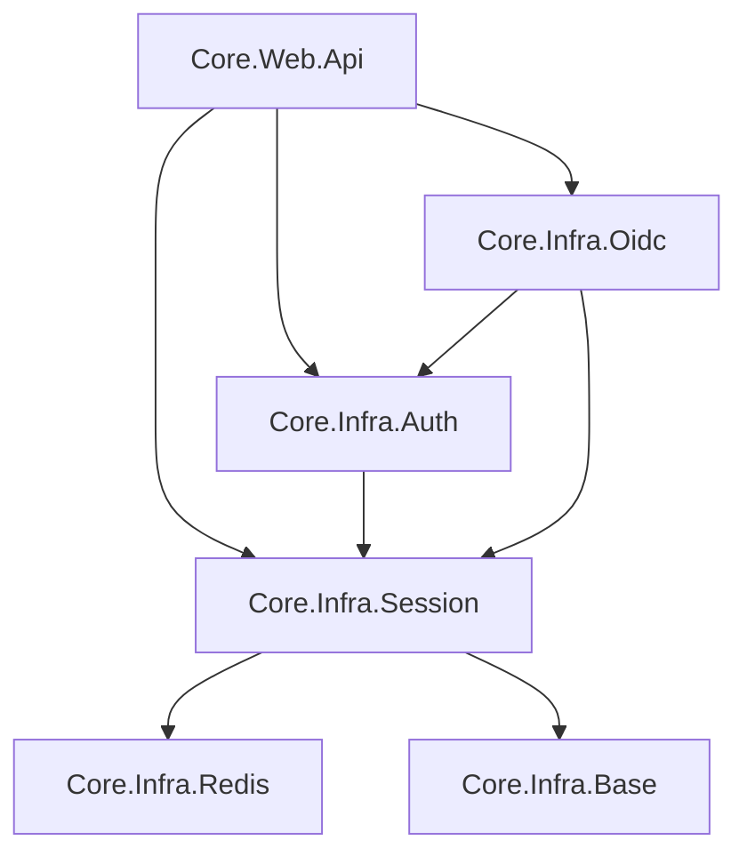

# Kế hoạch phát triển và tái cấu trúc hệ thống Authentication/Session (Cập nhật)

Tài liệu này phác thảo các bước cần thiết để tái cấu trúc hệ thống Auth theo yêu cầu tại `TreeOfThought/docs/backend/yeucau.md`.

## 1. Mục tiêu
- **Tính nhất quán**: Đảm bảo tất cả các project nghiệp vụ (FilesFolders, Oidc, ...) sử dụng chung một cơ chế `AppAuthorizeAttribute` từ `Core.Infra.Auth`.
- **Tập trung hóa Session/JWT**: Chuyển việc quản lý session (Redis) và sinh JWT về `Core.Infra.Session`.
- **Tính module hóa**: Chia tách rõ ràng giữa Identity Provider (Oidc), Policy Enforcement (Auth Infrastructure), và State/Token Management (Session).
- **Hỗ trợ Hybrid Session**: Tự động chuyển đổi giữa JWT-only và JWT+Redis Session khi số lượng claims lớn.

## 2. Cấu trúc Project đề xuất

### Core.Infra.Session (NEW)
Project này là trung tâm quản lý trạng thái và cấp phát token.
- **Interfaces**:
    - `IUserSessionService`: Quản lý claims, roles, ACL trong Redis.
    - `IJwtService`: Sinh và parse JWT token.
- **Implementations**:
    - `RedisSessionService`: Triển khai lưu trữ session.
    - `JwtService`: Triển khai sinh JWT (sử dụng RSA từ config).
- **Models**:
    - `UserSession`: Chứa thông tin user, roles, permissions, ACL.
    - `AuthCodeData`: Dữ liệu cho OIDC authorization code flow.
- **Extensions**: `AddAppSession(config)` để đăng ký các dịch vụ.

### Core.Infra.Auth (Refactored)
Project này đóng vai trò là **Resource Server Infrastructure** (Policy Enforcement Point).
- **Attributes**: `AppAuthorizeAttribute`.
- **Handlers**: `AppAuthorizationHandler`, `AppAuthorizationPolicyProvider`.
- **Trách nhiệm**:
    - Đọc JWT từ request.
    - Nếu JWT không chứa đủ granular claims (Hybrid mode), sẽ gọi `IUserSessionService` để lấy thêm từ Redis.
    - Kiểm tra Role/Permission/Policy/ACL.
- **Phụ thuộc**: Phụ thuộc vào `Core.Infra.Session`.
- **Extensions**: `AddAppAuthorization()` để đăng ký handler và policy provider.

### Core.Infra.Oidc (Refactored)
Project này đóng vai trò là **Identity Provider** (Business Logic).
- **Services**: `AuthService` (Quản lý User, Role, Claim trong DB).
- **Trách nhiệm**:
    - Xác thực user (Login/SSO).
    - Sau khi xác thực thành công, gọi `IUserSessionService` để "bơm" (sync) dữ liệu lên Redis.
    - Gọi `IJwtService` để tạo token trả về cho client.
- **Phụ thuộc**: Phụ thuộc vào `Core.Infra.Session` và `Core.Infra.Auth`.
- **Extensions**: `AddAppOidc()` để đăng ký repositories và business services.

## 3. Lộ trình thực hiện chi tiết

### Bước 1: Khởi tạo Core.Infra.Session
1. Tạo project `Core.Infra.Session` (classlib).
2. Thêm vào solution `Core.Infra.sln`.
3. Di chuyển `AuthRedisService.cs` từ `Core.Infra.Auth` sang đây và refactor thành `RedisSessionService`.
4. Tạo `IJwtService` và `JwtService`, di chuyển logic sinh JWT từ `Core.Infra.Oidc/Services/AuthService.cs` sang.
5. Thêm `AddAppSession` extension method.

### Bước 2: Tái cấu trúc Core.Infra.Auth
1. Xóa `AuthRedisService.cs` (đã chuyển sang Session).
2. Cập nhật `AppAuthorizationHandler` để inject `IUserSessionService`.
3. Refactor logic trong `AppAuthorizationHandler` để sử dụng `IUserSessionService.GetUserClaimsAsync(userId)` khi cần.
4. Thêm `AddAppAuthorization` extension method.

### Bước 3: Tái cấu trúc Core.Infra.Oidc
1. Cập nhật `AuthService.cs`:
    - Inject `IUserSessionService` và `IJwtService`.
    - Phương thức `GenerateJwtToken` giờ sẽ chỉ chuẩn bị dữ liệu và gọi `IJwtService.GenerateTokenAsync`.
    - Phương thức `SyncUserClaimsToRedisAsync` và `SyncUserAclToRedisAsync` sẽ gọi qua `IUserSessionService`.
2. Dọn dẹp `AuthServiceExtensions.cs`.

### Bước 4: Cấu hình Program.cs
Tất cả các project API/Worker chỉ cần gọi:
```csharp
builder.Services.AddAppSession(config);
builder.Services.AddAppAuthorization();
builder.Services.AddAppOidc(config);
```

## 4. Sơ đồ phụ thuộc (Dependency Map)


## 5. Các điểm kỹ thuật quan trọng
- **JWT Key**: Logic đọc RSA Private Key từ PEM sẽ nằm tập trung ở `JwtService`.
- **Session Expiry**: Mặc định là 24h, cấu hình được qua `IConfiguration`.
- **Hybrid Logic**: Nếu `claims.Count > 30`, `JwtService` sẽ chỉ đưa Roles vào token, `IUserSessionService` sẽ lưu toàn bộ claims vào Redis. Handler ở `Core.Infra.Auth` sẽ tự biết lấy từ đâu dựa trên việc có granular claims trong token hay không.
 điểm cần lưu ý
- **Dependency**: `Core.Infra.Auth` và `Core.Infra.Oidc` đều sẽ phụ thuộc vào `Core.Infra.Session`.
- **Hybrid Strategy**: Cần thống nhất logic: nếu số lượng claims > X, sẽ chỉ lưu Roles vào JWT, còn lại lưu vào Redis. Logic này nên nằm ở `Core.Infra.Auth` để Handler biết chỗ mà tìm.
- **Migration**: Cần cẩn thận khi chuyển namespace để không làm hỏng các tham chiếu hiện có trong `Core.Web.Api` và các project khác.
