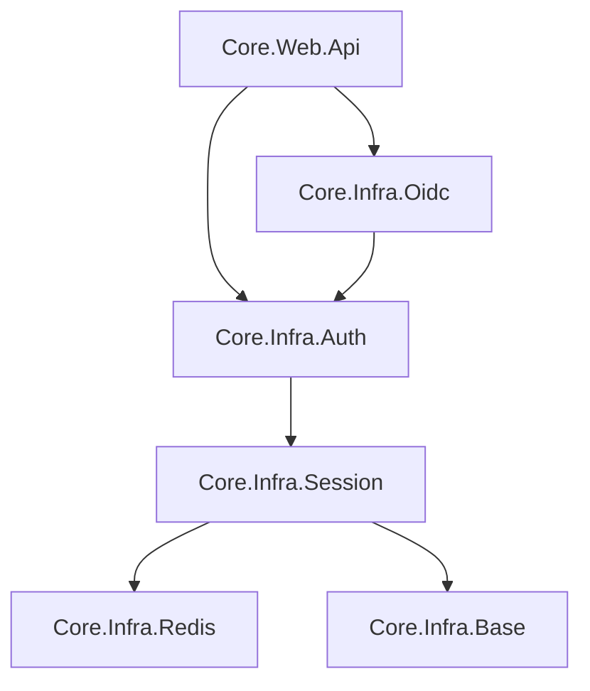

# Kế hoạch phát triển và tái cấu trúc hệ thống Authentication/Session (Cập nhật - 2026-05-15)

Tài liệu này phác thảo các bước cần thiết để tái cấu trúc hệ thống Auth theo yêu cầu mới nhất tại `TreeOfThought/docs/backend/yeucau.md`.

## 1. Mục tiêu
- **Tính nhất quán**: Đảm bảo tất cả các project nghiệp vụ (FilesFolders, Oidc, ...) sử dụng chung một cơ chế `AppAuthorizeAttribute` từ `Core.Infra.Auth`.
- **Tách bạch trách nhiệm**: 
    - `Core.Infra.Session`: Chuyên biệt về lưu trữ trạng thái người dùng trên Redis.
    - `Core.Infra.Auth`: Chuyên biệt về Authorization (Attribute, Handler) và Quản lý Token (JWT).
    - `Core.Infra.Oidc`: Chuyên biệt về Nghiệp vụ nhận diện (Identity Provider), Login, SSO.
- **Tính module hóa**: Mỗi project có Extension riêng để đăng ký vào `Program.cs`. `Core.Infra.Auth` tự động bao gồm `Core.Infra.Session`.
- **Hỗ trợ Hybrid Session**: Cơ chế tự động kiểm tra Redis nếu JWT chỉ chứa thông tin tối giản (do giới hạn kích thước token).

## 2. Cấu trúc Project chi tiết

### Core.Infra.Session
Project này là tầng dữ liệu thấp nhất cho session.
- **Trách nhiệm**:
    - Lưu trữ/Truy xuất Roles, Claims, Permissions, ACL của người dùng từ Redis.
    - Định nghĩa các hằng số (Constants) dùng chung cho toàn hệ thống.
- **Thành phần chính**:
    - `IUserSessionService` / `RedisSessionService`: Quản lý session data.
    - `AuthConstants`: Các hằng số về Claim Type, Policy Prefix.
    - `AuthCodeData`: Model cho OIDC code flow.
- **Extensions**: `AddAppSession()` đăng ký Redis và Session Service.

### Core.Infra.Auth
Project này đóng vai trò là **Resource Server Infrastructure** và **Token Provider**.
- **Trách nhiệm**:
    - Kiểm tra quyền truy cập qua `AppAuthorizeAttribute`.
    - **Sinh và Parse JWT Token** (Chuyển từ Session sang đây để nhất quán với logic check token).
    - Thực thi logic Hybrid: Nếu token thiếu claims, tự động gọi `IUserSessionService` để lấy từ Redis.
- **Thành phần chính**:
    - `AppAuthorizeAttribute`.
    - `AppAuthorizationHandler`, `AppAuthorizationPolicyProvider`.
    - `IJwtService` / `JwtService`: Sinh JWT (RSA).
- **Phụ thuộc**: Phụ thuộc vào `Core.Infra.Session`.
- **Extensions**: `AddAppAuthorization()` đăng ký Handlers, Policy Provider và `JwtService`. Extension này sẽ gọi luôn `AddAppSession()`.

### Core.Infra.Oidc
Project này là tầng **Business Logic** cho Identity.
- **Trách nhiệm**:
    - Quản lý User, Role, Claim Mapping.
    - Thực hiện Login, SSO flow.
    - Đồng bộ hóa dữ liệu người dùng lên Redis (`IUserSessionService`) khi login thành công.
    - Gọi `IJwtService` từ `Core.Infra.Auth` để tạo token trả về.
- **Thành phần chính**:
    - `AuthService`: Logic nghiệp vụ login/sso.
    - `AuthController`: Endpoint cho authentication.
- **Phụ thuộc**: Phụ thuộc vào `Core.Infra.Auth` (để dùng JWT service) và `Core.Infra.Session`.
- **Extensions**: `AddAppOidc()`.

## 3. Lộ trình thực hiện

### Bước 1: Điều chỉnh Core.Infra.Session
- Di chuyển `IJwtService` và `JwtService` ra khỏi project này (chuẩn bị chuyển sang Auth).
- Giữ lại `RedisSessionService` và các models/constants cần thiết.
- Đảm bảo `AddAppSession` hoạt động độc lập.

### Bước 2: Nâng cấp Core.Infra.Auth
- Tiếp nhận `IJwtService` và `JwtService` từ Session.
- Cập nhật `AppAuthorizationHandler`:
    - Inject `IUserSessionService`.
    - Triển khai logic: Nếu `Claims` trong JWT không có các permission cần thiết, thử truy vấn `IUserSessionService` để kiểm tra trong Redis.
- Cập nhật `AddAppAuthorization` để đăng ký thêm `IJwtService` và gọi `AddAppSession`.

### Bước 3: Cập nhật Core.Infra.Oidc
- Thay đổi tham chiếu: Thay vì dùng `IJwtService` từ Session, giờ dùng từ Auth.
- Refactor `AuthService`:
    - Khi login thành công: 
        1. Gọi `IUserSessionService.SaveSessionAsync` (Lưu full claims/roles vào Redis).
        2. Gọi `IJwtService.GenerateTokenAsync` (Tạo JWT, có thể tối giản claims nếu quá nhiều).
- Loại bỏ các logic login/token rải rác ở Controller, đưa tập trung vào `AuthService`.

### Bước 4: Cấu hình thống nhất tại Program.cs
Sử dụng các extension phương thức mới:
```csharp
// Đăng ký Auth (đã bao gồm Session)
builder.Services.AddAppAuthorization(builder.Configuration);

// Đăng ký Oidc (Nghiệp vụ Identity)
builder.Services.AddAppOidc(builder.Configuration);

// Các project nghiệp vụ khác chỉ cần dùng AddAppAuthorization để có AppAuthorizeAttribute
builder.Services.AddAppFilesFolders(builder.Configuration);
```

## 4. Sơ đồ phụ thuộc (Dependency Map)


## 5. Các lưu ý kỹ thuật
- **Hybrid JWT/Session**: JWT nên ưu tiên chứa Roles. Các permissions chi tiết (claims) có thể lưu ở Redis để giảm kích thước JWT, tránh lỗi Header Too Large.
- **Extension Methods**: Cần kiểm tra kỹ để tránh đăng ký trùng lặp (Idempotent registration).
- **Namespace**: Chuyển `JwtService` sang namespace `Core.Infra.Auth.Services`.
