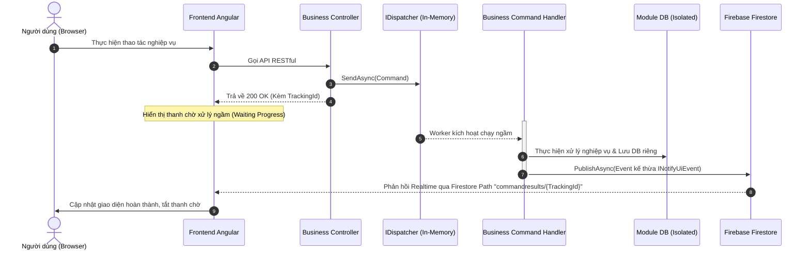
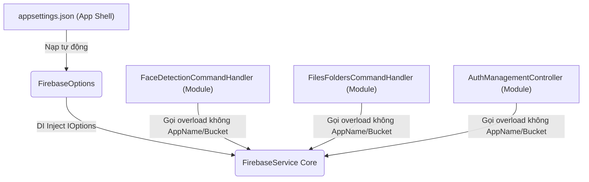
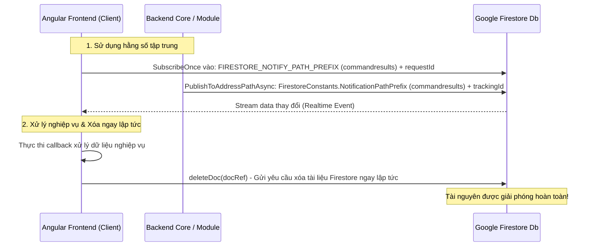

# Tiêu chuẩn Phát triển và Thiết kế Kiến trúc Backend (TreeOfThought)

Tài liệu này định nghĩa thiết kế kiến trúc tổng quan và các tiêu chuẩn phát triển bắt buộc cho toàn bộ dự án Backend trong thư mục `TreeOfThought/backend`, được đúc kết từ yêu cầu nền tảng tại [yeucau.md](TreeOfThought/docs/backend/yeucau.md) và các quy chuẩn nghiêm ngặt của skill `tot-dev`.

---

## 1. Tổng quan Kiến trúc Nền tảng (General Base Infra)

Backend được thiết kế theo mô hình **Modular Monolith** kết hợp với **Clean Architecture** và **CQRS**. Hệ thống cung cấp một hạ tầng cơ sở vững chắc (Base Infrastructure) để mọi module nghiệp vụ khi tích hợp vào đều có thể kế thừa và hoạt động nhất quán về: **Database, Cache, Session, CQRS, Firebase và Security/Auth**.

### Các thư viện hạ tầng cốt lõi (Core Infra Base):
*   **Core.Infra.Base**: Định nghĩa toàn bộ Contracts dùng chung (Interface như `ICacheService`, `IQueueService`, `IEventBus`, `IEventHandler`, `INotifyUiEvent`, `IDispatcher`), các hằng số và các model dùng chung cho toàn bộ giải pháp.
*   **Core.Infra.Redis**: Quản lý Cache, Pub/Sub và Hàng đợi tin cậy (Reliable Queue thông qua `LPUSH` / `RPOP` nhằm đảm bảo không thất thoát thông tin khi worker gặp sự cố).
*   **Core.Infra.Session**: Quản lý session người dùng tập trung trên Redis dưới mô hình **Hybrid Session** (kết hợp thông tin mỏng trong JWT và thông tin chi tiết trên Redis để tối ưu hóa băng thông mạng).
*   **Core.Infra.Data**: Quản lý kết nối đa cơ sở dữ liệu (PostgreSQL, MSSQL, MySQL, MongoDB) thông qua lớp trừu tượng `BaseDbContext`.
*   **Core.Infra.Firebase**: Đóng gói các dịch vụ của Google Firebase (FCM để thông báo đẩy, Firestore để gửi phản hồi realtime lên UI, Google Cloud Storage để lưu trữ file tài liệu/hình ảnh).
*   **Core.Infra.Auth**: Xử lý JWT, ACL chi tiết và Authorization thông minh. Annotation `[AppAuthorize]` hỗ trợ kiểm tra quyền ở cả mức tĩnh (Claims) và mức động (Claims + Redis Session + ACL Bitmask theo từng Resource ID cụ thể).
*   **Core.Infra.Cqrs**: Cung cấp hạ tầng xử lý Command/Handler và Event/PubSub bất đồng bộ, đi kèm cơ chế tự động đăng ký handler (`CqrsAutoRegistrationService`) và tự động gửi thông báo trạng thái xử lý lên Firestore (`UiNotificationEventHandler`).

---

## 2. Tiêu chuẩn Phát triển Nghiệp vụ chung (Business Module Standards)

Tất cả các module nghiệp vụ khi phát triển mới hoặc bổ sung tính năng **bắt buộc phải tuân thủ tuyệt đối** các tiêu chuẩn kiến trúc dưới đây nhằm tránh tạo ra nợ kỹ thuật (tech debt) và đảm bảo tính bền vững của giải pháp:

### 2.1. Tính Cô lập Tuyệt đối (Strict Isolation & Encapsulation)
*   **Dự án độc lập**: Mỗi nghiệp vụ phải là một project riêng biệt trong thư mục `TreeOfThought/backend/`.
*   **Không gọi chéo**: Tuyệt đối không được Add Reference hoặc gọi trực tiếp code từ module nghiệp vụ khác.
*   **Giao tiếp lỏng (Loose Coupling)**: Mọi trao đổi dữ liệu hoặc kích hoạt xử lý giữa các nghiệp vụ bắt buộc phải thực hiện thông qua **Command/Event** của CQRS hoặc Pub/Sub của Redis.
*   **Truy vấn dữ liệu liên nghiệp vụ (Read-Only)**: Nếu bắt buộc phải truy vấn dữ liệu thuộc quản lý của module khác, cho phép tạo một `DbContext` phụ ngay trong module hiện tại nhưng **chỉ được phép cấu hình ở chế độ Read-only** (tuyệt đối không được chứa code làm thay đổi dữ liệu).

### 2.2. Quy tắc Cấu hình DB và Connection String riêng biệt
*   **Tách biệt cơ sở dữ liệu**: Mỗi nghiệp vụ sở hữu một `DbContext` riêng biệt kế thừa từ `BaseDbContext`.
*   **Cấu hình cô lập**: Để đảm bảo việc triển khai (deploy) không lẫn lộn cơ sở dữ liệu giữa các môi trường và giữa các module, connection string của từng nghiệp vụ phải được cấu hình và nạp **duy nhất** từ khóa cấu hình riêng trong `appsettings.json` dạng:
    ```json
    "{TenNghiepVu}:Postgresql" hoặc "{TenNghiepVu}:Redis"
    ```
    *Ví dụ: `NhanDienKhuonMat:Postgresql`. Hệ thống sẽ báo lỗi khởi chạy ngay lập tức nếu thiếu khóa cấu hình riêng này của nghiệp vụ.*

### 2.3. Quy trình Xử lý Bất đồng bộ & Phản hồi Realtime lên UI (CQRS Pattern)
Đối với các tác vụ nghiệp vụ mất nhiều thời gian (như xử lý tệp tin, AI, Telegram Chatbot...), bắt buộc triển khai theo luồng xử lý bất đồng bộ:
1.  **API Restful**: Nhận yêu cầu từ UI, chuyển đổi thành **Command** (ví dụ: `SaveFaceDetectionSessionCommand`), gửi lệnh qua `_dispatcher.SendAsync(command)` và lập tức trả về mã `200 OK` chứa mã theo dõi (`trackingId` / `requestId`) để UI hiển thị trạng thái xử lý (Waiting Progress).
2.  **Background Worker**: Handler tương ứng nhận lệnh chạy ngầm dưới nền, xử lý logic nghiệp vụ và lưu kết quả vào CSDL của module.
3.  **Realtime UI Notification**: Xử lý xong, Handler phát ra một **Event** kế thừa `INotifyUiEvent` (ví dụ: `FaceDetectionSessionSavedEvent`). Hệ thống sẽ tự động đồng bộ hóa thông báo lên Firestore theo đường dẫn:
    ```
    commandresults/{TrackingId}
    ```
4.  **UI Feedback**: Giao diện Frontend lắng nghe (subscribe) Firestore tại đường dẫn trên để nhận kết quả thành công/thất bại và cập nhật UI lập tức, sau đó chủ động xóa document trên Firestore để tránh rác tài nguyên.



### 2.4. Quy chuẩn Phân trang bắt buộc (Standard Server-Side Paging)

> [!IMPORTANT]
> **Cập nhật ngày 2026-05-17 12:46:36**: Paging cho việc lấy danh sách (List/Search) **luôn luôn bắt buộc phải là phân trang ở server (server-side paging)**. Tuyệt đối không được sử dụng cơ chế tải toàn bộ rồi phân trang ở giao diện (client-side paging), nhằm đảm bảo hiệu năng mạng, tối ưu hóa bộ nhớ RAM của thiết bị khách, và sẵn sàng mở rộng khi quy mô dữ liệu tăng lên.

*   **Yêu cầu**: Mọi API trả về danh sách (List/Search) bắt buộc phải hỗ trợ phân trang server-side.
*   **Tham số đầu vào (Request)**: Bắt buộc hỗ trợ `pageIndex` (1-based, mặc định là 1) và `pageSize` (mặc định là 10).
*   **Cấu trúc dữ liệu trả về (Response)**: Bắt buộc trả về một Object chứa định dạng JSON chuẩn:
    ```json
    {
      "items": [ ... ],
      "total": 123
    }
    ```
    *Lưu ý: `total` phải là tổng số bản ghi thực tế trong cơ sở dữ liệu thỏa mãn điều kiện lọc (filter), không bị giới hạn bởi mệnh đề phân trang (Skip/Take) của truy vấn.*

---

## 3. Ví dụ Minh họa về Triển khai Nghiệp vụ đúng chuẩn

Hệ thống hiện tại có các module nghiệp vụ mẫu minh họa xuất sắc cho việc áp dụng các tiêu chuẩn trên:

### 3.1. Ví dụ 1: Module FilesFolders (`Core.Infra.FilesFolders`)
*   **Cơ sở dữ liệu**: Có `FilesFoldersDbContext` riêng biệt, kết nối qua `FilesFoldersConnection`.
*   **Xử lý bất đồng bộ**: Xử lý upload và tổ chức file qua hệ thống Command/Handler của CQRS.
*   **Phân trang**: API `GetFolderContentAsync` nạp dữ liệu phân trang và trả về định dạng `{ items, total }` chuẩn xác.

### 3.2. Ví dụ 2: Module Nhận Diện Khuôn Mặt (`nhan-dien-khuon-mat`)
*   **Cấu trúc**: Thư mục đặt tên kebab-case chuẩn `nhan-dien-khuon-mat`.
*   **Cấu hình độc lập**: Tự định nghĩa `NhanDienKhuonMatDbContext` và chỉ nạp kết nối Postgres qua khóa chuyên biệt `NhanDienKhuonMat:Postgresql` trong `appsettings.json` để tránh lẫn lộn khi deploy.
*   **Luồng xử lý**: API `api/face-detection/save` tiếp nhận luồng tải lên multipart form, đẩy command ngầm qua dispatcher, tải dữ liệu lên Firebase Cloud Storage, lưu DB và phản hồi realtime về UI thông qua Firestore path `commandresults/{TrackingId}` khi xử lý thành công.

---

## 4. Gap Analysis & Định hướng Hoàn thiện Hạ tầng

Dựa trên việc kiểm tra chéo toàn bộ code trong `TreeOfThought/backend`, chúng tôi đề xuất các định hướng tối ưu hóa cơ sở hạ tầng chung:

- [ ] **Chính sách Firestore TTL (Time To Live)**: Đề xuất cấu hình quy tắc dọn dẹp tự động (TTL) cho collection `notify` trên Firebase Firestore để tự động xóa các document cũ phòng trường hợp Client bị ngắt kết nối đột ngột và không kịp gửi yêu cầu xóa tài liệu.
- [ ] **Đồng bộ hóa Session khi thay đổi quyền**: Cần hoàn thiện API trong `AuthManagementController` để tự động trigger phương thức `SyncUserClaimsToRedisAsync` và `SyncUserAclToRedisAsync` ngay khi Admin cập nhật quyền của User, giúp phân quyền Hybrid Auth có tác dụng ngay lập tức mà không cần người dùng đăng nhập lại.
- [x] **Di chuyển toàn bộ cài đặt Firebase vào appsettings**: Hợp nhất và di chuyển toàn bộ cấu hình Firebase (AppName, StorageBucket...) đang bị hardcode trong các handler về tập trung quản lý tại `appsettings.json` của App Shell để dễ dàng thay đổi theo môi trường triển khai. *(Xem thiết kế chi tiết tại Mục 5)*
- [x] **Định nghĩa hằng số tập trung cho Firestore Notify Path**: Định nghĩa duy nhất hằng số (const) `commandresults` ở cả Backend và Frontend để đảm bảo tất cả các nghiệp vụ sử dụng chung một cấu trúc đường dẫn đồng bộ và không tạo bừa bãi. Đồng thời xác thực việc UI tự động dọn dẹp (deleteDoc) tài liệu Firestore ngay sau khi nhận kết quả để tránh lãng phí tài nguyên và chi phí. *(Xem thiết kế chi tiết tại Mục 6)*

---

## 5. Giải pháp thiết kế di chuyển cấu hình Firebase tập trung vào appsettings.json

Để giải quyết triệt để vấn đề các cài đặt Firebase như `AppName` (chuỗi `"Default"`) và `StorageBucket` (chuỗi `"dunp-test-gcs"`) đang bị hardcode rải rác trong các Command Handlers và Controllers, chúng tôi đề xuất **Giải pháp bổ sung các phương thức Overload trong `FirebaseService` (Phương án A)**.

### 5.1. Sơ đồ Nguyên lý Kiến trúc
Thay vì buộc tất cả các module nghiệp vụ (như `nhan-dien-khuon-mat`, `Core.Infra.FilesFolders`, `Core.Infra.Oidc`) phải tự nạp cấu hình `IOptions<FirebaseOptions>` để lấy các giá trị mặc định của môi trường rồi truyền thủ công vào từng phương thức, chúng tôi sẽ mở rộng `FirebaseService` trong `Core.Infra.Firebase` để nó tự động sử dụng cấu hình mặc định được nạp từ `appsettings.json` nếu người gọi không chỉ định.



### 5.2. Các thay đổi chi tiết dự kiến

#### 1. Nâng cấp `FirebaseService` (trong [FirebaseService.cs](file:///work/a.i-assistant-chatbot-telegram-serverles/TreeOfThought/backend/Core.Infra.Firebase/Services/FirebaseService.cs))
Bổ sung các phương thức overloaded tự động nạp `AppName` và `StorageBucket` từ `_options.Value`:

```csharp
// Overloads cho FCM & Token
public async Task<string> CreateCustomTokenAsync(string uid, IDictionary<string, object>? claims = null)
    => await CreateCustomTokenAsync(_options.Value.AppName, uid, claims);

public async Task<FirebaseToken> VerifyIdTokenAsync(string idToken)
    => await VerifyIdTokenAsync(_options.Value.AppName, idToken);

public async Task SendNotificationAsync(string token, string title, string body)
    => await SendNotificationAsync(_options.Value.AppName, token, title, body);

// Overloads cho Firestore
public FirestoreDb GetFirestore() 
    => GetFirestore(_options.Value.AppName);

public async Task PublishToAddressPathAsync(string path, object data)
    => await PublishToAddressPathAsync(_options.Value.AppName, path, data);

public async Task DeleteAddressPathAsync(string path)
    => await DeleteAddressPathAsync(_options.Value.AppName, path);

// Overloads cho Storage
public async Task<string> UploadFileAsync(string objectName, Stream content, string contentType, bool isPublic = false)
    => await UploadFileAsync(_options.Value.AppName, _options.Value.StorageBucket, objectName, content, contentType, isPublic);

public async Task UpdateObjectAclAsync(string objectName, bool isPublic)
    => await UpdateObjectAclAsync(_options.Value.AppName, _options.Value.StorageBucket, objectName, isPublic);

public string GetSignedUrl(string objectName, TimeSpan duration)
    => GetSignedUrl(_options.Value.AppName, _options.Value.StorageBucket, objectName, duration);

public string GetPublicUrl(string objectName)
    => GetPublicUrl(_options.Value.StorageBucket, objectName);

public async Task<byte[]> ReadFileAsync(string objectName)
    => await ReadFileAsync(_options.Value.AppName, _options.Value.StorageBucket, objectName);

public async Task DeleteFileAsync(string objectName)
    => await DeleteFileAsync(_options.Value.AppName, _options.Value.StorageBucket, objectName);

public async Task<List<string>> ListFilesAsync(string prefix)
    => await ListFilesAsync(_options.Value.AppName, _options.Value.StorageBucket, prefix);
```

#### 2. Dọn dẹp các Handler & Controller (Caller)
Sau khi triển khai các overload trên, code ở các module nghiệp vụ sẽ cực kỳ tinh gọn và độc lập:

*   **Tại [FaceDetectionCommandHandler](file:///work/a.i-assistant-chatbot-telegram-serverles/TreeOfThought/backend/nhan-dien-khuon-mat/Handlers/FaceDetectionCommandHandler.cs)**:
    *   *Trước đây*: Phải inject `IOptions<FirebaseOptions>` và gọi:
        ```csharp
        originalUrl = await _firebaseService.UploadFileAsync(_firebaseOptions.AppName, _firebaseOptions.BucketName, originalPath, ...);
        ```
    *   *Sau refactor*: **Không cần inject `IOptions<FirebaseOptions>`**, chỉ cần gọi trực tiếp:
        ```csharp
        originalUrl = await _firebaseService.UploadFileAsync(originalPath, originalStream, command.OriginalContentType, false);
        ```

*   **Tại [FilesFoldersCommandHandler](file:///work/a.i-assistant-chatbot-telegram-serverles/TreeOfThought/backend/Core.Infra.FilesFolders/Handlers/FilesFoldersCommandHandler.cs)**:
    *   *Trước đây*: Phải inject `IOptions<FirebaseOptions>` và truyền cả AppName lẫn BucketName.
    *   *Sau refactor*: **Không cần inject `IOptions<FirebaseOptions>`**, gọi đơn giản:
        ```csharp
        var url = await _firebaseService.UploadFileAsync(objectName, stream, command.ContentType, false);
        ```

*   **Tại [UiNotificationEventHandler](file:///work/a.i-assistant-chatbot-telegram-serverles/TreeOfThought/backend/Core.Infra.Cqrs/Handlers/UiNotificationEventHandler.cs)**:
    *   *Trước đây*: Hardcode `"Default"` khi đẩy notify realtime:
        ```csharp
        await _firebaseService.PublishToAddressPathAsync("Default", @event.NotifyPath, @event);
        ```
    *   *Sau refactor*: Gọi trực tiếp không cần AppName:
        ```csharp
        await _firebaseService.PublishToAddressPathAsync(@event.NotifyPath, @event);
        ```

*   **Tại [AuthManagementController](file:///work/a.i-assistant-chatbot-telegram-serverles/TreeOfThought/backend/Core.Infra.Oidc/Controllers/AuthManagementController.cs)**:
    *   *Trước đây*: Inject `IConfiguration` để đọc `Firebase:StorageBucket` thủ công và hardcode `"Default"`:
        ```csharp
        var bucketName = _config["Firebase:StorageBucket"] ?? "dunp-test-gcs";
        var publicUrl = await _firebaseService.UploadFileAsync("Default", bucketName, fileName, stream, file.ContentType);
        ```
    *   *Sau refactor*: **Không cần dùng `IConfiguration` hay hardcode**, gọi cực kỳ đơn giản:
        ```csharp
        var publicUrl = await _firebaseService.UploadFileAsync(fileName, stream, file.ContentType);
        ```

*   **Tại các Controller Test ([FirebaseTestController](file:///work/a.i-assistant-chatbot-telegram-serverles/TreeOfThought/backend/Core.Web.Api/Controllers/FirebaseTestController.cs), [TestController](file:///work/a.i-assistant-chatbot-telegram-serverles/TreeOfThought/backend/Core.Web.Api/Controllers/TestController.cs), [SampleHandlers](file:///work/a.i-assistant-chatbot-telegram-serverles/TreeOfThought/backend/Core.Web.Api/Handlers/SampleHandlers.cs))**:
    *   Các chuỗi hardcode `"Default"` và các dòng đọc config thủ công sẽ được lược bỏ hoàn toàn và chuyển sang dùng hàm overload của `FirebaseService`.

## 6. Giải pháp thiết kế Hằng số tập trung cho Firestore Notify Path và Cơ chế dọn dẹp phía UI

Theo bản cập nhật ngày **2026-05-17 12:36:36**, để tối ưu chi phí và tài nguyên Firestore (tránh các thao tác ghi/đọc dư thừa gây lãng phí tiền bạc), chúng tôi đề xuất giải pháp chuẩn hóa đường dẫn thông báo qua hằng số tập trung và kiểm tra tính hợp lệ của cơ chế dọn dẹp phía Client (UI).

### 6.1. Sơ đồ đồng bộ hóa Hằng số & Luồng dọn dẹp dữ liệu
Thiết kế này đảm bảo cả Backend và Frontend đều chia sẻ một cấu trúc đường dẫn duy nhất mà không tự ý định nghĩa các chuỗi hardcode phân mảnh:



### 6.2. Các thay đổi chi tiết dự kiến

#### 1. Xây dựng hằng số tại Backend (project [Core.Infra.Base](file:///work/a.i-assistant-chatbot-telegram-serverles/TreeOfThought/backend/Core.Infra.Base)):
Tạo mới file [FirestoreConstants.cs](file:///work/a.i-assistant-chatbot-telegram-serverles/TreeOfThought/backend/Core.Infra.Base/Constants/FirestoreConstants.cs):
```csharp
namespace Core.Infra.Base.Constants;

public static class FirestoreConstants
{
    /// <summary>
    /// Đường dẫn tiền tố hằng số duy nhất cho việc notify UI trong toàn bộ solution.
    /// Tránh việc tạo bừa bãi các collection/path khác nhau gây lãng phí tài nguyên.
    /// </summary>
    public const string NotificationPathPrefix = "commandresults";

    public static string GetNotificationPath(string trackingId) => $"{NotificationPathPrefix}/{trackingId}";
    public static string GetNotificationPath(Guid trackingId) => $"{NotificationPathPrefix}/{trackingId}";
}
```

#### 2. Cập nhật các Class Event & Controller tại Backend:
- Tại [FilesFoldersEvent](file:///work/a.i-assistant-chatbot-telegram-serverles/TreeOfThought/backend/Core.Infra.FilesFolders/Models/Events.cs) và [NhanDienKhuonMatEvent](file:///work/a.i-assistant-chatbot-telegram-serverles/TreeOfThought/backend/nhan-dien-khuon-mat/Models/Events.cs):
  ```csharp
  // Thay thế đường dẫn hardcode cũ
  public string NotifyPath => FirestoreConstants.GetNotificationPath(TrackingId);
  ```
- Tại các controller test như [TestController](file:///work/a.i-assistant-chatbot-telegram-serverles/TreeOfThought/backend/Core.Web.Api/Controllers/TestController.cs) hay handler như [SampleHandlers](file:///work/a.i-assistant-chatbot-telegram-serverles/TreeOfThought/backend/Core.Web.Api/Handlers/SampleHandlers.cs):
  ```csharp
  await _firebase.PublishToAddressPathAsync(FirestoreConstants.GetNotificationPath(trackingId), data);
  ```

#### 3. Chuẩn hóa hằng số và Kiểm tra Luồng dọn dẹp tại Frontend (Angular):
- Khảo sát thực tế trong [firebase.service.ts](file:///work/a.i-assistant-chatbot-telegram-serverles/TreeOfThought/frontend/web/projects/tot/core/src/lib/firebase/firebase.service.ts) cho thấy hàm `subscribeOnce` **đã** được viết rất chuẩn mực và có cơ chế tự động dọn dẹp tài liệu Firestore ngay sau khi nhận phản hồi:
  ```typescript
  // firebase.service.ts (Line 123-147)
  subscribeOnce(requestId: string, callback: (data: any) => void) {
    const docRef = doc(this.db, 'commandresults', requestId); // Sẽ refactor thành hằng số FIRESTORE_NOTIFY_PATH_PREFIX
    const unsubscribe = onSnapshot(docRef, async (snapshot) => {
      if (snapshot.exists()) {
        try {
          const data = snapshot.data();
          callback(data);
          unsubscribe(); // Ngừng lắng nghe ngay lập tức
        } catch (error) {
          console.error(error);
        } finally {
          try {
            await deleteDoc(docRef); // XÓA DOCUMENT TRÊN FIRESTORE NGAY LẬP TỨC!
          } catch (e) {
            console.error('Failed to delete Firestore document after receipt', e);
          }
        }
      }
    });
    return unsubscribe;
  }
  ```
- Dự kiến thay thế:
  ```typescript
  export const FIRESTORE_NOTIFY_PATH_PREFIX = 'commandresults';
  // ...
  const docRef = doc(this.db, FIRESTORE_NOTIFY_PATH_PREFIX, requestId);
  ```

Giải pháp trên đảm bảo tuân thủ nghiêm ngặt nguyên tắc KISS, đồng bộ hóa tuyệt đối cấu trúc Firestore ở cả Frontend/Backend và ngăn chặn triệt để lãng phí tài nguyên của Google Cloud Firestore.

---
**Ghi chú**: Hạ tầng Core Base và tiêu chuẩn thiết kế Modular Monolith hiện tại của solution cực kỳ vững chắc và mạch lạc. Việc tuân thủ nghiêm ngặt các quy tắc trên sẽ giúp giải pháp luôn sạch sẽ, dễ dàng tích hợp thêm các dịch vụ mới mà không sợ phát sinh lỗi dây chuyền.


