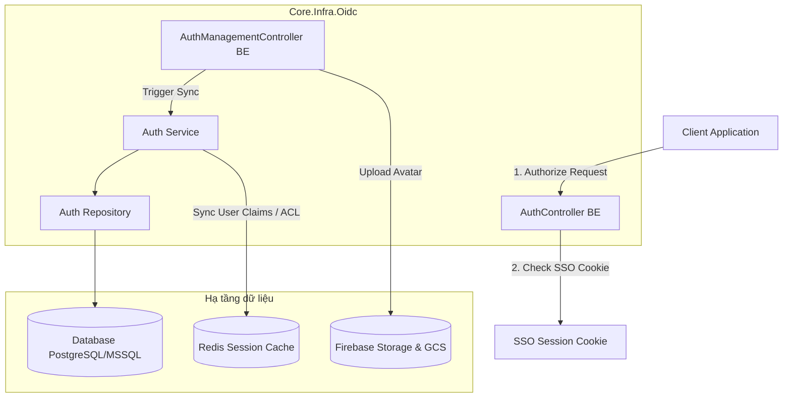

# Phân tích Thiết kế & Kế hoạch Phát triển - Module OIDC

Tài liệu này tổng hợp toàn bộ giải pháp kỹ thuật, cấu trúc mã nguồn, thiết kế luồng dữ liệu, phân tích khoảng cách kỹ thuật (Gap Analysis), kế hoạch triển khai và quy tắc bảo trì của module **OIDC (Identity & Decentralized Authorization Management)** dựa trên các yêu cầu nghiệp vụ tại [whattodo.md](file:///work/a.i-assistant-chatbot-telegram-serverles/TreeOfThought/docs/business-oidc/whattodo.md) và hiện trạng mã nguồn thực tế.

---

## 1. Tổng quan Kiến trúc Kỹ thuật

Hệ thống OIDC được thiết kế theo mô hình **Modular Monolith** kết hợp các chuẩn bảo mật **OIDC/OAuth2** và cơ chế **Hybrid Authorization** để tối ưu hóa hiệu năng, bảo mật và khả năng đồng bộ thời gian thực.

### Các thành phần Công nghệ áp dụng:
- **Backend:** .NET 8.0, ASP.NET Core Web API, Identity base, cookie-based SSO session, RSA signing keys.
- **Frontend:** Angular 17+, Standalone Components, Ng-Zorro-Antd UI, Transloco i18n, `@tot/shared` UI library (gồm `tot-table`, `tot-button`, `tot-autocomplete`).
- **Caching & Session State:** Redis (Hybrid Mode: basic roles trong JWT, detail permissions lưu ở Redis Session để tránh phình to kích thước JWT Token).
- **Storage:** Google Cloud Storage (Firebase Storage Bucket) dùng cho upload tệp ảnh đại diện của người dùng.

---

## 2. Giải pháp Thiết kế chi tiết & Luồng dữ liệu

### A. Cơ chế Xác thực tập trung SSO & OIDC Core
- **SSO Cookie Session:** Người dùng đăng nhập thành công tại `/api/auth/login` sẽ được thiết lập cookie bảo mật `SsoSessionScheme` với thời hạn 7 ngày. Cookie này hoạt động như một phiên đăng nhập tập trung (Single Sign-On).
- **Authorization Code Flow:**
  1. Khi client gọi `/api/auth/authorize`, hệ thống kiểm tra Cookie SSO.
  2. Nếu hợp lệ: BE tự sinh mã `code` tạm thời thông qua `GenerateAuthorizationCodeAsync`, lưu trữ trạng thái ủy quyền và chuyển hướng (redirect) về client kèm `code` và `state`.
  3. Nếu không hợp lệ: Chuyển hướng người dùng về giao diện Đăng nhập của SPA kèm theo `returnUrl` (chứa URL gốc của authorize request).
- **Token Exchange:** Giao diện client gửi `code` tới `/api/auth/token`. BE kiểm tra mã code, trao đổi mã lấy JWT token được ký bằng giải thuật RS256 (khóa private cấu hình trên server, public key cung cấp qua `/api/auth/jwks`).

### B. Cơ chế Phân quyền Hybrid Authorization & ACL
- **Hybrid Claim Processing:**
  - Token JWT chỉ chứa các thông tin cơ bản: User ID, Username, Display Name và các vai trò chính (Roles).
  - Khi ứng dụng gọi API `/api/auth/me` hoặc khi thực thi `AppAuthorizeAttribute` kiểm tra quyền: Hệ thống sẽ tự động đọc danh sách Claims chi tiết trong JWT. Nếu không có (Stateless), hệ thống sẽ tự động đọc từ **Redis Session** (Stateful) để so khớp.
- **Access Control List (ACL) Bitmask:**
  - ACL cho phép phân quyền trên từng bản ghi tài nguyên cụ thể thông qua `resourceType` (ví dụ: `document`) và `resourceId` (ví dụ: `file_abc_123` hoặc `*` cho tất cả).
  - Mức độ truy cập được biểu diễn qua mặt nạ quyền (Bitmask):
    - `1` (nhị phân `0001`) = **Read** (Đọc)
    - `2` (nhị phân `0010`) = **Write** (Ghi)
    - `4` (nhị phân `0100`) = **Delete** (Xóa)
    - `8` (nhị phân `1000`) = **Share** (Chia sẻ)
  - Ví dụ: Người dùng có mask là `7` (`1 + 2 + 4`) sẽ có toàn quyền Đọc, Ghi và Xóa trên tài nguyên đó.
- **Realtime Session Synchronization:**
  - Để đảm bảo quyền hạn mới cập nhật có hiệu lực ngay lập tức, `AuthManagementController` tích hợp các trigger đồng bộ:
    - Khi thay đổi vai trò hoặc quyền trực tiếp: Gọi `_authService.SyncUserClaimsToRedisAsync(userId)`.
    - Khi cấu hình thêm mới ACL: Gọi `_authService.SyncUserAclToRedisAsync(userId)`.
    - Thao tác này ghi đè trực tiếp trạng thái session của người dùng trên Redis, có hiệu lực ngay trong request tiếp theo mà không cần relogin.

---

## 3. Cấu trúc và Thiết kế các Component Frontend (FE)

Thư viện [business-oidc](file:///work/a.i-assistant-chatbot-telegram-serverles/TreeOfThought/frontend/web/projects/tot/business-oidc) được cấu trúc thành các Standalone Components gọn gàng, chia tách nghiệp vụ rõ ràng:

### A. Quản lý Người dùng (`user-list`)
- **Tích hợp bảng Premium (`tot-table`):** Sử dụng directive `totCell` để render custom template cho từng cột:
  - Cột `avatar`: Hiển thị avatar tròn, khi hover hiển thị mask icon camera, click kích hoạt `onFileSelected` của input file ẩn để tải ảnh lên tức thì thông qua API `uploadAvatar`.
  - Cột `roles` & `claims`: Hiển thị danh sách tag màu. Tích hợp cờ `closeable` cho phép xóa nhanh bằng cách nhấn nút close tag (kèm Modal xác nhận). Nút dashed plus mở Modal nhanh để thêm vai trò/quyền.
- **Bộ lọc tìm kiếm toàn diện:** Grid layout 4 cột, tích hợp range date-picker, autocompletes đa chọn, và bộ chọn nhà cung cấp SSO.

### B. Quản lý Vai trò (`role-list`)
- Quản lý danh sách vai trò dạng bảng. Cho phép gán nhanh quyền cho vai trò bằng ModalAutocomplete và hiển thị trực quan dưới dạng tag màu.
- Tự động khóa các tính năng chỉnh sửa/xóa đối với vai trò hệ thống `Admin` nhằm tránh lỗi sập quyền.

### C. Quản lý ACL (`acl-list`)
- **UX Lọc Tài nguyên:** Yêu cầu người dùng nhập loại tài nguyên và ID trước khi tìm kiếm để tối ưu hóa hiệu năng hiển thị danh sách ACL.
- **Bộ máy tính toán Bitmask:** Khi tạo mới một ACL entry, giao diện cung cấp Checkbox group gồm 4 mức độ: Read (1), Write (2), Delete (4), Share (8). Giao diện tự động tính tổng mask và gửi về BE.

### D. Đồng bộ quyền (`claim-sync`) & Thông tin cá nhân (`authorize-info`)
- **Claim Sync:** Hiển thị thông số `version` (`CLAIMS_VERSION`) và danh sách quyền định nghĩa cứng trong FE hệ thống (`ALL_CLAIMS`). Nhấn "Đồng bộ" gửi mảng claims lên `/api/Auth/claims/sync` để nạp vào DB BE.
- **Authorize Info:** Chia làm 2 tabs: "Quyền của tôi" (thông tin vai trò, claims và status admin của user hiện tại đọc từ `localStorage`) và "Cấu hình ứng dụng" (danh sách toàn bộ các quyền định nghĩa ở phía client).

---

## 4. Đánh giá Hiện trạng & Phân tích Gác (Gap Analysis)

Dựa trên việc đối chiếu giữa mã nguồn thực tế và chuẩn kiến trúc dự án (nêu tại [backend/whattodo.md](file:///work/a.i-assistant-chatbot-telegram-serverles/TreeOfThought/docs/backend/whattodo.md)), chúng tôi phát hiện một số điểm khoảng cách kỹ thuật (Gaps) cần cải thiện sau:

### 4.1. Phân trang phía Server (Server-side Pagination) trên FE:
- **Hiện trạng:** Cả 4 bảng quản trị (`user-list`, `role-list`, `acl-list`, `claim-sync`) ở Frontend đang sử dụng `[frontPagination]="true"`. Nghĩa là dữ liệu được tải toàn bộ về client và phân trang tại client.
- **Vấn đề:** Trái với quy chuẩn phân trang của hệ thống (bắt buộc phân trang Server-side sử dụng `pageIndex`, `pageSize` trong request và trả về cấu trúc `{ items, total }`). Khi lượng users, roles, claims lớn sẽ gây chậm và tốn tài nguyên.

### 4.2. Đồng bộ Redis khi Cập nhật / Xóa Người dùng:
- **Hiện trạng:** API `UpdateUser` và `DeleteUser` trong `AuthManagementController` chỉ thao tác với DB qua `_authRepo` mà **chưa** xóa hoặc đồng bộ lại session cache của user đó trên Redis.
- **Vấn đề:** Nếu người dùng bị xóa hoặc bị khóa, họ vẫn có thể sử dụng Session Token cũ truy cập hệ thống cho đến khi Redis session hết hạn.

### 4.3. Đồng bộ Redis khi thay đổi Claims của một Vai trò (Role):
- **Hiện trạng:** Khi Admin cập nhật hoặc xóa quyền khỏi một vai trò (`AssignClaimToRole`, `RemoveClaimFromRole`), hệ thống chỉ cập nhật bảng trung gian trong DB mà chưa quét và đồng bộ lại Claims cho toàn bộ người dùng đang sở hữu vai trò đó trên Redis.
- **Vấn đề:** Người dùng đang online sẽ không nhận được quyền mới hoặc vẫn giữ quyền cũ cho tới khi họ relogin hoặc session hết hạn.

### 4.4. Đồng bộ Redis khi Xóa ACL:
- **Hiện trạng:** Trong API `RemoveAcl` (`[HttpDelete("acl/{id}")]`), hệ thống chỉ thực hiện xóa trong cơ sở dữ liệu mà chưa đồng bộ lại thông tin ACL của user lên Redis vì API chỉ nhận vào ID của bản ghi ACL (không có sẵn User ID để sync).

---

## 5. Kế hoạch Hoàn thiện & Triển khai (Tasks)

Để hoàn thiện module OIDC đạt chuẩn kiến trúc cao cấp của dự án, kế hoạch triển khai bao gồm các tác vụ sau:

### Phase 1: Các tính năng đã hoàn thiện (Core Functionality)
- [x] Đăng ký, đăng nhập SSO và OIDC Core (Discovery, JWKS, Authorization Code, Token Exchange).
- [x] Phân quyền Hybrid (Token JWT + Redis Session) và ACL Bitmask.
- [x] Nạp và quét claims tự động từ code BE lên DB (`ClaimScannerService`).
- [x] Giao diện CRUD Users, Roles, Claims và gán nhanh trực quan ở FE.
- [x] Giao diện Đổi mật khẩu, xem thông tin phân quyền cá nhân ở FE.
- [x] Đồng bộ Redis Session tức thì khi Admin gán/xóa trực tiếp vai trò hoặc quyền của user.

### Phase 2: Khắc phục Gaps & Tối ưu hóa (Pending Refactor)
- [/] **Tác vụ 1: Chuyển đổi sang Server-side Pagination:**
  - Cập nhật FE gọi các API `/users`, `/roles`, `/claims` truyền kèm `pageIndex` và `pageSize` (Đã hoàn thành).
  - Triển khai phân trang Server-side cho bảng quản lý ACL (`acl-list.component.ts`) ở cả Backend & Frontend (Đang đề xuất).
- [ ] **Tác vụ 2: Đồng bộ Redis khi Xóa/Chỉnh sửa User:**
  - Thêm logic xóa Redis session cache của User tương ứng trong API `DeleteUser` và `UpdateUser`.
- [ ] **Tác vụ 3: Tối ưu hóa sync Redis khi sửa quyền của Role:**
  - Viết background service hoặc handler trong `AuthManagementController` để khi một vai trò thay đổi quyền, tự động quét danh sách người dùng thuộc vai trò đó và cập nhật lại Redis Session của họ.
- [ ] **Tác vụ 4: Đồng bộ Redis khi Xóa ACL:**
  - Cập nhật API `RemoveAcl`: Lấy thông tin ACL entry từ DB trước khi xóa để xác định `UserId`, tiến hành xóa bản ghi DB và gọi `SyncUserAclToRedisAsync` cho user đó.
- [/] **Tác vụ 5: Sửa lỗi Tải lên Ảnh Đại diện (Avatar Upload Bug):**
  - **Backend:** Cập nhật `UploadAvatar` trong `AuthManagementController.cs` để truyền `isPublic: true` vào `UploadFileAsync` (Đã hoàn thành).
  - **Frontend:** Cập nhật `UserListComponent` trong `user-list.component.ts` để reassign reference của `users` array và inject `ChangeDetectorRef` để gọi `cdr.detectChanges()`, đảm bảo kích hoạt bộ máy Change Detection của Angular ngay lập tức khi tải lên thành công (Đang đề xuất).

---

## 6. Quy tắc Phát triển & Bảo trì cho tương lai (Guidelines)

Khi thực hiện nâng cấp hoặc bổ sung tính năng cho module OIDC, bắt buộc tuân thủ các quy tắc sau:

1. **Tuyệt đối không vi phạm nguyên tắc cô lập (Isolation):**
   - Không add reference chéo từ project OIDC sang các project nghiệp vụ khác như `FilesFolders`.
   - Nếu có nhu cầu trao đổi dữ liệu (ví dụ: lấy thông tin file khi gán ACL), phải thực hiện qua API Restful hoặc Event/Command PubSub.
2. **Đồng bộ hóa Session ngay lập tức:**
   - Bất kỳ API thay đổi trạng thái phân quyền nào của người dùng trong `AuthManagementController` đều phải gọi hàm trigger đồng bộ Redis tương ứng (`SyncUserClaimsToRedisAsync` hoặc `SyncUserAclToRedisAsync`).
3. **Quy chuẩn UI/UX:**
   - Các component UI mới phải bắt đầu bằng tiền tố `@tot/` hoặc sử dụng các component chia sẻ trong `@tot/shared`.
   - Toàn bộ text hiển thị trên UI bắt buộc phải bọc qua pipe `transloco` để đảm bảo hỗ trợ đa ngôn ngữ đồng nhất.
   - Giữ nguyên cơ chế bảo vệ đối với vai trò `Admin` và quyền `admin` trên toàn bộ giao diện và API.

---

## 7. Câu hỏi làm rõ & Xác nhận từ người dùng

Để tiến hành hoàn thiện Phase 2 tối ưu hóa hệ thống, xin vui lòng cho biết ý kiến của bạn về các điểm sau:
  1. **Phân trang Server-side:** Bạn có muốn chúng tôi tiến hành refactor toàn bộ 4 bảng quản trị ở FE (`user-list`, `role-list`, `acl-list`, `claim-sync`) sang chế độ Server-side Paging ngay trong turn này không?
  2. **Đồng bộ hàng loạt khi sửa Role:** Khi cập nhật quyền của một Vai trò (Role), việc quét tất cả users sở hữu vai trò đó để cập nhật Redis có thể gây tốn tài nguyên nếu số lượng users quá lớn. Bạn có đồng ý triển khai giải pháp này dưới dạng một Background Task/Queue tin cậy hay chỉ cần chạy đồng bộ in-memory cho các dự án quy mô vừa và nhỏ?

---

## 8. Cập nhật 2026-05-21 08:20:20: Giải pháp FCM Notification lên App Mobile

### A. Thiết kế Database riêng cho Notify
Chúng ta tạo ra một DB Context riêng biệt mang tên `NotifyDbContext` để quản lý việc lưu trữ thiết bị và mã đăng ký FCM của người dùng.
- **Thực thể `UserFcmToken`:**
  - `Id` (Guid, Primary Key)
  - `UserId` (Guid, Foreign Key)
  - `FcmToken` (string, Required)
  - `DeviceId` (string, Nullable/Empty)
  - `AppType` (string, Nullable/Empty) - Chỉ ra FCM token đến từ ứng dụng nào (ví dụ: `admin`, `mobi android`, `reactjsatest`...).
  - Các trường tracking standard (`CreatedAt`, `UpdatedAt`, `CreatedBy`, `UpdatedBy`).
- **Cơ chế Duy nhất (Unique constraint):** Thiết lập index phức hợp `(UserId, DeviceId)` làm khóa duy nhất để tự động cập nhật token mới khi đăng nhập trên cùng một thiết bị, và index trên cột `FcmToken` để truy vấn nhanh.
- **Hạ tầng:** Context này sử dụng chung cấu hình kết nối PostgreSql từ phân vùng OIDC, tự động kích hoạt tạo bảng khi ứng dụng khởi chạy (`EnsureTablesCreatedAsync`).

### B. Tích hợp Đăng nhập và lưu FCM Token
- **LoginRequest DTO:** Bổ sung thêm ba trường `FcmToken`, `DeviceId` và `AppType` (đều cho phép null hoặc empty).
- **AuthController:** Khi người dùng thực hiện xác thực đăng nhập thành công:
  - Kiểm tra xem request có truyền kèm `FcmToken` hay không.
  - Nếu có, gọi qua `INotifyRepository` thực hiện lưu trữ hoặc cập nhật FCM token kèm DeviceId và AppType cho `UserId` đó.
  - Tự động dọn dẹp các bản ghi trùng lặp của FCM Token hoặc DeviceId thuộc về tài khoản khác để tránh gửi nhầm thông báo.

### C. Quản lý Giao diện & Điều khiển gửi thông báo
- **API Backend (`AuthManagementController`):**
  - `GET /api/AuthManagement/users/{userId}/fcm-tokens`: Trả về danh sách FCM Token kèm Device ID và AppType của một người dùng.
  - `POST /api/AuthManagement/users/send-notification`: Nhận DTO gồm `{ fcmToken, title, body }`, gọi trực tiếp qua `FirebaseService.SendNotificationAsync` để đẩy thông báo lên thiết bị qua hạ tầng Google FCM.
- **Menu & Giao diện quản trị (`notify` Component):**
  - Giao diện dạng trang quản trị nằm dưới menu "Quản trị hệ thống" -> "Gửi thông báo".
  - Hiển thị danh sách người dùng với phân trang Server-side đầy đủ (`tot-table`), hỗ trợ thanh tìm kiếm tức thời theo Username hoặc Email.
  - Mỗi dòng có nút "Gửi thông báo" kích hoạt mở Modal:
    - Modal tự động fetch danh sách thiết bị/token FCM của user đó qua API.
    - Cho phép Admin chọn 1 trong các thiết bị đã liên kết qua bộ chọn (`nz-select`), hiển thị dạng: `Thiết bị: {DeviceId} ({AppType})`.
    - Form nhập Tiêu đề, Nội dung thông điệp chi tiết.
    - Nhấn nút Gửi sẽ gọi API đẩy thông điệp tức thời lên thiết bị di động của họ.

### D. Cập nhật 2026-05-21 15:20:20: Tối ưu hóa FCM Token Lifecycle (Caching & Reuse)
Để tối ưu hóa hiệu năng, giảm thiểu số lượng cuộc gọi API lấy Token không cần thiết từ Firebase, và nâng cao trải nghiệm người dùng (mượt mà, không giật lag khi mở modal gửi thông báo), vòng đời và cơ chế tái sử dụng của FCM Token được thiết lập như sau:
1. **Lấy Token Toàn cục Tự động (Auto-Fetch on App Init):**
   - Khi tải trang (Application bootstrap), `FirebaseService` trong `@tot/core` sẽ tự động thực hiện cuộc gọi không đồng bộ lấy `fcm token device id` thông qua phương thức `getFCMToken()`.
   - Để không chặn hoặc làm chậm quá trình tải giao diện chính, tiến trình này được bọc trong một khối `setTimeout` an toàn (1000ms).
2. **Cơ chế Cache và Tái Sử Dụng (Caching & Memory Persistence):**
   - Sau khi lấy token thành công từ Firebase, token sẽ được lưu giữ trực tiếp vào biến bộ nhớ `currentFcmToken` của `FirebaseService`.
   - **Tối ưu hóa Vòng Đời:** Trừ khi người dùng đăng xuất (Logout) hoặc token bị thu hồi, hệ thống **không** thực hiện yêu cầu lấy mới token từ Firebase ở bất kỳ thời điểm nào sau đó. Mọi yêu cầu lấy token đều truy cập trực tiếp và tức thời vào giá trị đã cache thông qua getter đồng bộ `getCurrentFCMToken()`.
3. **Đăng ký FCM Token Tự động và Toàn cục (Auto-Registration Flow):**
   - Khi người dùng đăng nhập thành công (bằng Form đăng nhập Username/Password thông thường hoặc qua SSO/Mạng xã hội), hoặc khi tải trang và phát hiện một phiên làm việc (Session) OIDC hợp lệ đã có sẵn, `AuthService` sẽ tự động lấy token từ cache và thực hiện đăng ký lên Backend qua endpoint `POST /api/auth/register-fcm`.
   - Việc này đảm bảo thông tin token thiết bị của trình duyệt luôn được cập nhật chính xác và sẵn sàng ở Backend OIDC mà không yêu cầu người dùng phải thực hiện bất kỳ thao tác thủ công nào.
4. **Trải nghiệm Gửi thông báo Thực tế trong `NotifyComponent`:**
   - Khi Admin mở Modal gửi thông báo cho một người dùng bất kỳ:
     - Component sẽ lấy token của trình duyệt hiện tại thông qua `FirebaseService.getCurrentFCMToken()` (đã được cache toàn cục khi tải trang).
     - Token này sẽ được gắn thẻ đặc biệt `(Thiết bị hiện tại)` và hiển thị ngay trên danh sách lựa chọn thiết bị nhận của Modal.
     - Nếu token thiết bị hiện tại chưa được đăng ký trong DB của user nhận tin, hệ thống tự động chèn thêm một tùy chọn giả định `Thiết bị hiện tại (Chưa lưu)` lên đầu danh sách. Điều này cho phép gửi thông báo thử nghiệm trực tiếp đến chính trình duyệt đang thao tác một cách tức thì và vô cùng thuận lợi.
