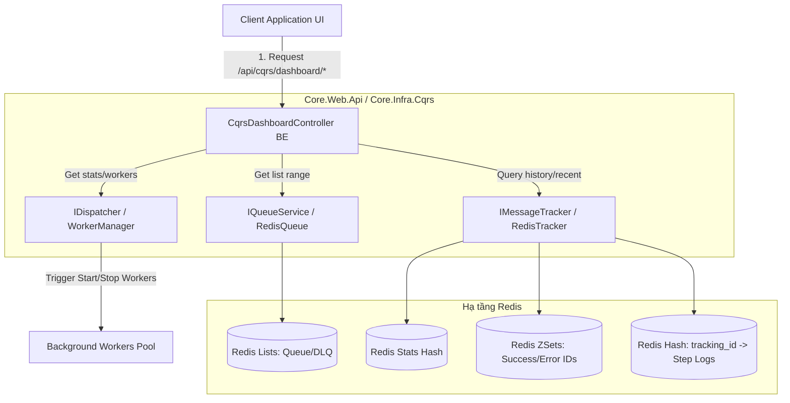

# Phân tích Thiết kế & Kế hoạch Phát triển - Module CQRS Dashboard

Tài liệu này tổng hợp giải pháp kỹ thuật, sơ đồ kiến trúc luồng dữ liệu, phân tích các khoảng cách kỹ thuật (Gap Analysis), và các nguyên tắc định hướng phát triển dài hạn cho phân hệ **CQRS Dashboard (Hệ thống Giám sát & Quản trị CQRS)** dựa trên tài liệu yêu cầu nghiệp vụ tại [yeucau.md](file:///work/a.i-assistant-chatbot-telegram-serverles/TreeOfThought/docs/cqrs-dashboard/yeucau.md) và hiện trạng mã nguồn thực tế.

---

## 1. Tổng quan Kiến trúc Kỹ thuật

CQRS Dashboard được tích hợp trực tiếp vào hạ tầng phân phối tin nhắn trung tâm sử dụng **Redis** làm cơ sở dữ liệu in-memory tốc độ cao cho hàng đợi (Lists), theo dõi trạng thái tin nhắn (Hashes và Sorted Sets), và quản lý log truy vết (Tracking history).

### Các thành phần Công nghệ áp dụng:
- **Backend:** .NET 8.0, ASP.NET Core Web API, `IDispatcher` quản lý vòng đời worker, `IQueueService` giao tiếp Redis List, `IMessageTracker` theo dõi vòng đời message.
- **Frontend:** Angular Standalone Components, Ng-Zorro-Antd, Transloco i18n, `@tot/shared` UI Library (gồm `tot-table` và `tot-button`).
- **Data & Message Tracking Storage:** Redis phục vụ lưu trữ message queue, active processing queue, Dead-Letter Queue (DLQ), sorted sets chứa danh sách trackingId thành công/lỗi, và hashes chứa lịch sử truy vết từng bước.

---

## 2. Giải pháp Thiết kế chi tiết & Luồng dữ liệu

### A. Cơ chế thu thập Metrics & Giám sát Hàng đợi (Queues & Topics)
- **Stats Aggregation:** `CqrsDashboardController.GetQueues` tự động quét tất cả các hàng đợi và topic đã đăng ký trong `IDispatcher`.
  - Đối với từng Queue: Gọi `GetQueueLengthAsync(queueName)` để lấy lượng pending, và `GetQueueLengthAsync(queueName:processing)` để lấy lượng active tin nhắn. Đồng thời, lấy số lượng `processed` (thành công) và `error` (lỗi) từ cache thống kê của `MessageTracker`.
  - Đối với Topic: Lấy danh sách subscribers của topic. Với mỗi subscriber, tính tổng lượng tin nhắn trong queue con (`sub_queue:topic:sub`) và queue xử lý con (`sub_proc:topic:sub`).

### B. Cơ chế Theo dõi Truy vết (Message Tracking History)
- **Tracking Flow:** Khi một tin nhắn được gửi, hệ thống tự sinh mã `trackingId` (GUID) và nạp bước "Dispatcher" vào Redis Hash `tracking:{trackingId}` qua `IMessageTracker`.
- **Step Logging:** Mỗi bước xử lý tiếp theo của Worker (Nhận tin nhắn, Gọi Handler, Hoàn thành, Gặp lỗi) được ghi lại dưới dạng một đối tượng log chứa Timestamp, Step, Status, Details, MessageContent và WorkerName.
- **History Indexing:** Khi tin nhắn kết thúc thành công hoặc thất bại, `trackingId` được lưu vào Sorted Set tương ứng (`tracking:success:{queue}` hoặc `tracking:error:{queue}`) để phục vụ truy vấn danh sách lịch sử tin nhắn gần đây qua API `/api/cqrs/dashboard/tracking/recent`.

### C. Cơ chế Xử lý Lỗi & Gửi lại (Dead-Letter Queue & Retry)
- **DLQ Retrieval:** Khi tin nhắn gặp lỗi vượt quá số lần retry cho phép, worker di chuyển tin nhắn sang hàng đợi lỗi `queueName:dead`. Dashboard hiển thị các tin nhắn này qua API `/api/cqrs/dashboard/messages/{queueName}:dead` sử dụng phân trang phía server.
- **Message Retry:** 
  - Khi gọi `Retry`, API sẽ gửi yêu cầu tới `IDispatcher.RetryCommandAsync(queueName, messageJson)`.
  - Phương thức này sẽ xóa tin nhắn khỏi DLQ, sửa lại thông số kỹ thuật (ví dụ: đặt lại số lần retry) và đẩy ngược lại hàng đợi gốc để xử lý.
- **Resend via Tracking:**
  - Nếu tin nhắn đã bị xóa khỏi hàng đợi nhưng vẫn còn log tracking, API `ResendTracking` sẽ lấy nội dung tin nhắn gốc (`MessageContent`) từ bước đầu tiên trong log tracking và đẩy lại vào `IQueueService` (đối với Command) hoặc `IEventBus` (đối với Event).

---

## 3. Cấu trúc và Thiết kế các Component Frontend (FE)

Thư viện [business-dashboard](file:///work/a.i-assistant-chatbot-telegram-serverles/TreeOfThought/frontend/web/projects/tot/business-dashboard) được phân bổ thành cấu trúc Standalone Components rõ ràng, tích hợp đa ngôn ngữ qua pipe và directive transloco:

- **`dashboard` Component:**
  - Layout chính chia làm các cards tổng hợp dữ liệu thống kê bên trên và hệ thống tabs bên dưới.
  - Tích hợp Dropdown cho phép thay đổi Refresh Interval linh hoạt qua hàm `onRefreshIntervalChange` sử dụng RxJS `interval` và `takeUntil` để tránh rò rỉ bộ nhớ (memory leak).
  - Tích hợp Modal gửi Command & Event mẫu với bộ soạn thảo JSON đơn giản.
- **`message-list` Component:**
  - Được tái sử dụng dưới dạng Modal hiển thị danh sách tin nhắn cho một hàng đợi cụ thể.
  - Sử dụng `nz-table` / `tot-table` hỗ trợ phân trang Server-side để hiển thị hàng nghìn bản ghi tin nhắn mà không làm treo UI.
  - Tích hợp `expandTemplate` hiển thị trực quan cấu trúc JSON và stack trace lỗi chi tiết.
- **`tracing` Component:**
  - Được mở dưới dạng trang độc lập hoặc modal từ mã `trackingId`.
  - Sử dụng các step của `NzSteps` kết hợp `NzTimeline` giúp lập trình viên nhanh chóng debug chính xác tin nhắn đang bị lỗi hoặc bị nghẽn ở thành phần nào (Publisher, Dispatcher, Handler, Worker).
- **`topic-detail` Component:**
  - Hộp thoại modal hiển thị danh sách các subscribers đang lắng nghe một topic, đo lường tốc độ xử lý tin nhắn của từng sub.

---

## 4. Đánh giá Hiện trạng & Phân tích Gác (Gap Analysis)

Qua đối chiếu giữa mã nguồn thực tế và các quy chuẩn kiến trúc hiện tại của dự án, chúng tôi ghi nhận một số khoảng cách kỹ thuật (Gaps) cần lưu ý cải tiến trong tương lai:

### 4.1. Cách thức định nghĩa Template cho các cột của `tot-table`:
- **Hiện trạng:** Trong [MessageListComponent](file:///work/a.i-assistant-chatbot-telegram-serverles/TreeOfThought/frontend/web/projects/tot/business-dashboard/src/lib/message-list/message-list.component.ts), việc định nghĩa các template hiển thị của cột (`timeTpl`, `contentTpl`, `statusTpl`, `actionsTpl`) đang được thực hiện thông qua việc gán trực tiếp thuộc tính `template` trong file TS (`{ title: 'Thời gian', template: this.timeTpl }`) kết hợp `@ViewChild` để lấy template từ HTML.
- **Khoảng cách:** Quy chuẩn mới của hệ thống (áp dụng tại [UserListComponent](file:///work/a.i-assistant-chatbot-telegram-serverles/TreeOfThought/frontend/web/projects/tot/business-oidc/src/lib/user-list/user-list.component.ts)) là khai báo hoàn toàn động trong HTML sử dụng directive `totCell` (ví dụ: `<ng-template totCell="time" let-data>`) dựa trên `key` cột. Cách làm hiện tại của `business-dashboard` làm tăng sự phụ thuộc chặt chẽ giữa code TS và HTML.

### 4.2. Việc quản lý và dọn dẹp (Cleanup) dữ liệu Log Tracking trên Redis:
- **Hiện trạng:** `IMessageTracker` lưu trữ toàn bộ các bước log xử lý tin nhắn (`tracking:{trackingId}`) và lưu index thành công/lỗi trong Sorted Sets.
- **Khoảng cách:** Hiện tại hệ thống chưa có cơ chế cấu hình TTL (Time-To-Live) tự động dọn dẹp cho các key log tracking này trên Redis. Theo thời gian, lượng log tích tụ khổng lồ sẽ gây phình to dung lượng bộ nhớ Redis (Redis Out Of Memory). Cần bổ sung cơ chế tự động hết hạn (Expire) sau 3 đến 7 ngày.

---

## 5. Kế hoạch Hoàn thiện & Triển khai (Tasks)

Kế hoạch hoàn thiện và tối ưu hóa hệ thống CQRS Dashboard được chia làm hai giai đoạn:

### Phase 1: Các tính năng đã hoàn thiện (Core Functionality)
- [x] Backend Controller đầy đủ APIs quản trị stats, queues, last-activity, retry, DLQ, tracking và worker control.
- [x] Tích hợp phân trang Server-side cho API tin nhắn hàng đợi và nhật ký tracking.
- [x] Thư viện Angular `business-dashboard` với đầy đủ các component hiển thị UI chuyên nghiệp, responsive.
- [x] Tích hợp thành công component dùng chung đạt chuẩn của dự án (`tot-table`, `tot-button`).
- [x] Tích hợp đa ngôn ngữ Transloco và hệ thống tự động làm mới dữ liệu định kỳ trên dashboard.

### Phase 2: Cải tiến & Tối ưu hóa (Pending Refactor)
- [ ] **Tác vụ 1: Chuẩn hóa việc sử dụng `TotCellDirective`:**
  - Refactor bảng tin nhắn trong `MessageListComponent` loại bỏ `@ViewChild` và `template` trong định nghĩa cột TS.
  - Chuyển sang sử dụng directive `<ng-template totCell="key" let-data>` hoàn toàn trong file HTML tương tự module OIDC.
- [ ] **Tác vụ 2: Bổ sung TTL tự động dọn dẹp Redis Log:**
  - Cập nhật backend `RedisTracker` tự động thiết lập thời gian hết hạn (ví dụ: `TimeSpan.FromDays(7)`) khi ghi nhận các key `tracking:{trackingId}` để bảo vệ dung lượng tài nguyên Redis.
- [ ] **Tác vụ 3: Tối ưu hóa UI/UX Tracing:**
  - Bổ sung nút Copy nhanh nội dung log lỗi chi tiết trực tiếp trên giao diện timeline của `TracingComponent`.

---

## 6. Quy tắc Phát triển & Bảo trì cho tương lai (Guidelines)

Khi phát triển thêm tính năng hoặc nâng cấp hệ thống CQRS Dashboard, bắt buộc tuân thủ nghiêm ngặt các quy tắc sau:

1. **Tuyệt đối không can thiệp trực tiếp làm thay đổi logic nghiệp vụ:**
   - Phân hệ Dashboard chỉ mang tính chất giám sát và hỗ trợ điều phối lỗi (DLQ).
   - Ngoại trừ các thao tác retry hoặc resend tin nhắn lỗi, tuyệt đối không được tự ý chỉnh sửa nội dung hoặc thay đổi thứ tự hàng đợi tin nhắn của các nghiệp vụ khác.
2. **Tuân thủ Cơ chế Phân quyền chặt chẽ:**
   - Toàn bộ API trong `CqrsDashboardController.cs` bắt buộc phải được bảo vệ bởi thuộc tính `[AppAuthorize("be.infra.dashboard")]`.
   - Bất kỳ API mới nào được thêm vào đều phải xác thực quyền quản trị viên hệ thống để tránh rò rỉ dữ liệu tin nhắn nhạy cảm.
3. **Sử dụng component dùng chung `@tot/shared`:**
   - Các bảng hiển thị dữ liệu mới bắt buộc sử dụng `tot-table` và các nút bấm sử dụng `tot-button`.
   - Giản lược tối đa việc viết code CSS tùy biến, tận dụng hệ thống style tokens và base components có sẵn để đảm bảo giao diện đồng bộ, premium.

---

## 7. Câu hỏi làm rõ & Xác nhận từ người dùng

Để tiến hành cải tiến phân hệ theo kế hoạch Phase 2, xin vui lòng cho biết ý kiến của bạn về các điểm sau:
1. **Chuẩn hóa `totCell` directive:** Bạn có đồng ý tiến hành refactor bảng hiển thị tin nhắn lỗi trong `MessageListComponent` sang cơ chế directive `totCell` ngay trong turn này để đồng bộ 100% với chuẩn viết code của dự án không?
2. **Cơ chế TTL dọn dẹp Redis:** Bạn muốn cấu hình thời gian hết hạn (TTL) tự động cho log tracking trên Redis mặc định là bao nhiêu ngày (đề xuất là 7 ngày)?
