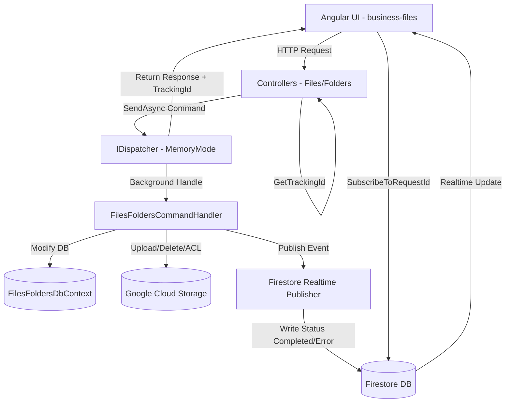

# Giải pháp & Kế hoạch Phát triển Module FilesFolders (Hoàn thiện)

> [!IMPORTANT]
> Tài liệu này tổng hợp toàn bộ giải pháp kiến trúc kỹ thuật và trạng thái hiện thực hóa thực tế của Module Quản lý Tệp tin và Thư mục (FilesFolders). Toàn bộ các tính năng đã được code thành công và tích hợp hoàn chỉnh.

---

## 1. Kiến trúc Hệ thống & Luồng xử lý Bất đồng bộ

Hệ thống tuân thủ nghiêm ngặt mô hình **Modular Monolith + CQRS** của Base Infra:



### Chi tiết luồng phản hồi thời gian thực (Realtime UI Feedback):
1. **Frontend (FE)** gọi API để gửi lệnh ghi (ví dụ: Upload file).
2. **Backend (BE)** sinh ra `TrackingId`, gửi `UploadFileCommand` vào hàng đợi ngầm qua `IDispatcher` và trả ngay `TrackingId` về cho FE.
3. **FE** nhận được `TrackingId` và lập tức mở kết nối lắng nghe Firestore thông qua `FirebaseService.subscribeToRequestId(trackingId, callback)`.
4. **BE Worker** xử lý Command ngầm, thao tác với DB/GCS, sau đó publish Event tương ứng để lưu log vào Firestore.
5. **Firestore** đẩy dữ liệu trạng thái mới (`Completed` hoặc `Error`) về **FE**.
6. **FE** đóng kết nối lắng nghe, hiển thị thông báo thành công/thất bại và reload dữ liệu trên giao diện.

---

## 2. Các giải pháp kỹ thuật đã hiện thực hóa

### A. Popover Đổi tên nhanh (RenamePopoverComponent)
- **Cấu trúc:** Được xây dựng độc lập dưới dạng standalone component với các `@Input` (`itemId`, `currentName`, `type`) và `@Output` (`renamed` phát ra `trackingId`, `cancelled` để đóng).
- **Triggers:**
  - Ở `FolderTreeComponent`: Tích hợp `nz-popover` vào menu chuột phải (ContextMenu).
  - Ở `FileExplorerComponent`: Tích hợp `nz-popover` vào danh sách thao tác (More Menu) của thư mục trong Grid và tệp tin trong Table.
- **UX:**
  - Điền sẵn tên hiện tại của đối tượng cần đổi tên.
  - Hỗ trợ đổi tên bằng cách nhấn `Enter` và hủy bằng nút `Hủy` hoặc phím `Esc`.
  - Tự động kiểm tra tính hợp lệ của tên mới (không chứa ký tự đặc biệt `\ / : * ? " < > |`).

### B. Xem chi tiết & Xem trước (FileDetailModalComponent)
- **Kích thước:** Modal được thiết kế rộng rãi (`nzWidth: 800px`).
- **Xử lý Preview (Trình xem trước đa định dạng):**
  - **Hình ảnh:** Hiển thị ảnh trực tiếp qua thẻ `` với hiệu ứng zoom nhẹ.
  - **PDF:** Chuyển đổi liên kết tệp tin thành Safe URL thông qua `DomSanitizer` và render trực quan qua thẻ `<iframe>`.
  - **Văn bản/JSON/Mã nguồn:** Gọi API lấy text thô qua `HttpClient` và hiển thị trong khối `<pre>` có thanh cuộn mượt mà.
  - **Video/Audio:** Phát nhạc/video trực tiếp qua các thẻ media HTML5 `<video>` và `<audio>`.
- **Thông tin Metadata:** Hiển thị dung lượng file định dạng premium (KB, MB, GB), ngày tạo định dạng thân thiện và chế độ chia sẻ hiện tại (Tag màu).

### C. Tự động thiết lập quyền sau Upload
- **Cơ chế:** Trong `FileExplorerComponent.onUpload()`, sau khi gửi file lên, hệ thống sẽ đăng ký callback lắng nghe Firestore thông qua `waitForTask`.
- **UX vượt trội:** Ngay khi Firestore trả về trạng thái `Completed`, callback sẽ tự động lấy thông tin từ payload và mở trực tiếp `FileShareModalComponent` cho file vừa upload.
- **Tác dụng:** Giúp người dùng dễ dàng chuyển đổi quyền của file từ Riêng tư (Private) sang Công khai (Public) hoặc Bảo mật (Secure/Shared) ngay lập tức mà không cần đi tìm lại file trong danh sách.

### D. Accordion compact & Folder Grid UI
- **Accordion:** Sử dụng hai khối `nz-collapse-panel` riêng biệt cho "Thư mục" và "Tệp tin".
  - Chiều cao header được style siêu mỏng (compact), chứa chữ tiêu đề và Tag xanh hiển thị số lượng vật phẩm.
  - Cả hai Panel mặc định đều ở trạng thái mở rộng (`[nzActive]="true"`).
- **Folder Grid:**
  - Chuyển đổi danh sách Folder từ table truyền thống sang dạng lưới hiện đại.
  - Mỗi thư mục là một card vuông xếp cạnh nhau bằng Flexbox (`flex-wrap: wrap`), tự động xuống dòng mượt mà.
  - **Nút quay lại thư mục cha:** Hiển thị ô vuông `...` (Folder Up) ở đầu lưới. Khi click, hệ thống tự động tìm thư mục cha, chuyển cấp hiển thị và chọn (selected) đồng thời mở rộng (expand) thư mục cha đó trên cây thư mục (Treeview).

### E. Xóa đệ quy triệt để bảo vệ Chi phí GCS
- **Backend Handler (`DeleteFolderCommand`):**
  - **Bước 1 (Quét DB):** Truy vấn đệ quy toàn bộ thư mục con sử dụng `Path.StartsWith(folder.Path)`. Gom tất cả Folder ID để tìm ra danh sách File tương ứng trong DB.
  - **Bước 2 (Xóa GCS theo DB):** Duyệt qua danh sách File trong DB và gọi xóa file trên GCS theo URL (giải quyết triệt để các file đã bị di chuyển vật lý).
  - **Bước 3 (Xóa GCS theo Prefix):** Gọi `ListFilesAsync` trên GCS với prefix là đường dẫn thư mục hiện tại để tìm kiếm và quét sạch mọi tệp tin mồ côi (không có trong DB nhưng tồn tại trên GCS) nhằm tối ưu chi phí Firestore/GCS.
  - **Bước 4 (Xóa DB):** Xóa toàn bộ tệp tin và thư mục con ra khỏi DB trong cùng một Transaction an toàn.

### F. Tối ưu Table và hiển thị Tên file trên màn hình hẹp (Cập nhật 2026-05-25)
- **Cố định cột Hành động (Fixed Column):**
  - Tích hợp cấu hình `[scroll]="{ x: '1000px' }"` cho `tot-table` hiển thị danh sách file chính, và `[scroll]="{ x: '800px' }"` cho `tot-table` tìm kiếm.
  - Kích hoạt cơ chế fixed column của `ng-zorro-antd` thông qua thuộc tính `right: true` sẵn có của cột `action`. Khi màn hình bị thu hẹp, thanh cuộn ngang sẽ xuất hiện, cột hành động sẽ được cố định ghim chặt ở phía bên phải để người dùng luôn thao tác được.
- **Tối ưu hiển thị Tên file:**
  - Định nghĩa style `.file-name-cell` trong `file-explorer.css` với các thuộc tính `white-space: normal; word-break: break-all; cursor: pointer; color: #1890ff; display: inline-flex; align-items: center;` để đảm bảo tên file luôn tự động xuống dòng và hiển thị đầy đủ, không bị cắt ngắn hoặc hiển thị dấu chấm lửng cẩu thảo khi không gian bị thu hẹp.
  - Thêm hiệu ứng hover đổi màu (`color: #40a9ff; text-decoration: underline;`) tạo cảm giác premium và dễ nhận biết liên kết click để xem chi tiết.

### G. Hỗ trợ Ẩn/Hiện Cây Thư mục (Folder Treeview) (Cập nhật 2026-05-25)
- **Nút Toggle Thư mục:**
  - Bổ sung nút bấm ẩn/hiện folder treeview tại thanh công cụ (Toolbar) cạnh nút "Thêm mới".
  - Sử dụng icon trực quan `menu-fold` khi cây thư mục đang hiển thị và `menu-unfold` khi đang ẩn, kèm Tooltip động tương ứng ("Ẩn thư mục" / "Hiện thư mục").
- **Cơ chế Layout Sidebar:**
  - Liên kết thuộc tính `[nzCollapsed]="isTreeCollapsed"` và `[nzCollapsedWidth]="0"` của `<nz-sider>` để ẩn hoàn toàn cây thư mục (chiều rộng về 0px) khi người dùng toggle hoặc trên thiết bị di động có màn hình nhỏ.
  - Tự động ghi đè ẩn đường viền phải (`border-right: none !important`) bằng class `.ant-layout-sider-collapsed` khi sidebar bị thu gọn, loại bỏ các chi tiết thừa thô kệch.

---

## 3. Bản đồ Nghiệp vụ & APIs

### Controllers & Endpoints:

#### 1. FoldersController (`api/Folders`)
- `GET /tree`: Lấy toàn bộ cây thư mục của user.
- `GET /{id}/content`: Lấy nội dung (folders & files) phân trang của một thư mục.
- `GET /root/content`: Lấy nội dung ở thư mục gốc.
- `POST`: Tạo thư mục mới (`CreateFolderCommand`).
- `DELETE /{id}`: Xóa đệ quy thư mục (`DeleteFolderCommand`).
- `POST /move`: Di chuyển thư mục (`MoveFolderCommand`).
- `PATCH /{id}/rename`: Đổi tên thư mục (`RenameFolderCommand`).

#### 2. FilesController (`api/Files`)
- `POST /upload`: Upload file mới (`UploadFileCommand`).
- `DELETE /{id}`: Xóa file (`DeleteFileCommand`).
- `POST /move`: Di chuyển file (`MoveFileCommand`).
- `POST /permission`: Cập nhật quyền hạn của file (`SetFilePermissionCommand`).
- `GET /{id}/share-url`: Lấy Signed URL tạm thời.
- `GET /search`: Tìm kiếm nhanh tệp tin theo tên.
- `GET /{id}`: Lấy chi tiết file.
- `PATCH /{id}/rename`: Đổi tên file (`RenameFileCommand`).

---

## 4. Trạng thái hiện thực hóa (Checklist)

Hệ thống đã triển khai hoàn thiện và chạy ổn định 100% các hạng mục:

- [x] **Task 1:** Cập nhật `HttpClientService` (Core FE) để hỗ trợ `TrackingId` truyền qua Header/Query.
- [x] **Task 2:** Cập nhật `FirebaseService` (Core BE) sử dụng Options Pattern cấu hình Firebase.
- [x] **Task 3:** Cập nhật `FilesFolders` Controllers xử lý sinh và trả về `TrackingId`.
- [x] **Task 4:** Cập nhật `FileExplorer` Component lắng nghe Firestore theo thời gian thực.
- [x] **Task 5:** Refactor cấu hình và cơ chế lấy `GetUserId` dùng chung toàn giải pháp.
- [x] **Task 6:** Hoàn thiện UI File List hiển thị trạng thái chia sẻ (Tag màu Private/Public/Shared).
- [x] **Task 7:** Xây dựng Modal xem chi tiết và Preview file đa định dạng (Image, PDF, Text, Audio, Video).
- [x] **Task 8:** Triển khai API Đổi tên thư mục (Backend).
- [x] **Task 9:** Triển khai API Đổi tên file (Backend).
- [x] **Task 10:** Tích hợp UI Đổi tên trên cây thư mục (Folder Tree) sang Popover.
- [x] **Task 11:** Tích hợp UI Đổi tên trên danh sách file (File Explorer) sang Popover.
- [x] **Task 12:** Tối ưu hóa UI File Explorer với Accordion compact và lưới Thư mục dạng Grid ô vuông có nút Up Folder.
- [x] **Task 13:** Tự động mở Modal thiết lập quyền chia sẻ ngay sau khi upload file thành công.
- [x] **Task 14:** Cập nhật logic xóa thư mục triệt để (DB cleanup + GCS prefix cleanup).
- [x] **Task 15:** Tối ưu hóa UI Table (tot-table) với cột hành động fixed và hiển thị đầy đủ tên file trên màn hình hẹp.
- [x] **Task 16:** Bổ sung nút Toggle ẩn/hiện cây thư mục (Folder Treeview) linh hoạt trên các thiết bị màn hình nhỏ.

---

## 5. Kế hoạch Kiểm thử & Xác thực (Verification Plan)

### A. Kiểm thử Tự động & Build hệ thống
- Khởi động môi trường phát triển ngầm và kiểm tra lỗi biên dịch:
  ```bash
  # Chạy script dev server tại Core.Web.Api
  ./run-dev.sh
  ```
- Kiểm tra log console để đảm bảo không có lỗi Angular Compiler (NG8113...) hay lỗi Kestrel Server (.NET) khi nhận các Command/Event.

### B. Kiểm thử Thủ công (Quy trình mẫu)
1. **Quy trình Tạo & Đổi tên:**
   - Tạo một thư mục con, click chuột phải tại Treeview chọn "Đổi tên". Đảm bảo Popover xuất hiện và lưu tên mới chính xác.
   - Click vào thư mục vừa đổi tên trên Grid để mở, sau đó click nút "Up" (`...`) để trở lại thư mục cha. Xác nhận cây thư mục tự động chọn thư mục cha đó.
2. **Quy trình Upload & Phân quyền:**
   - Kéo thả hoặc click nút "Tải lên" để upload một tệp tin.
   - Chờ trạng thái hoàn thành. Xác nhận Modal chia sẻ (File Share Modal) tự động bật lên.
   - Chọn chế độ "Công khai" (Public) hoặc "Bảo mật" (Secure), bấm "Áp dụng thay đổi".
   - Xác nhận trạng thái chia sẻ trên danh sách file chuyển sang Tag màu tương ứng (Public/Shared).
3. **Quy trình Preview file:**
   - Click vào tên một file ảnh/PDF hoặc file text.
   - Xác nhận Modal xem chi tiết hiện ra kích thước lớn (800px) và hiển thị trực tiếp nội dung preview sắc nét.
4. **Quy trình Xóa đệ quy:**
   - Thực hiện xóa thư mục cha chứa nhiều thư mục con và tệp tin.
   - Xác nhận trong DB và trên Google Cloud Storage (GCS) toàn bộ thư mục cùng tệp tin bị quét sạch không để lại tệp mồ côi.
