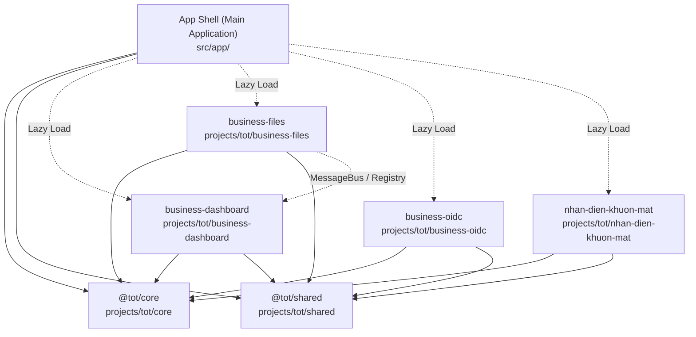
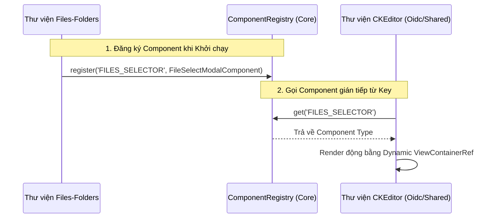

# Định hướng & Kiến trúc Phát triển Frontend (TreeOfThought)

Tài liệu này trình bày giải pháp kỹ thuật chi tiết cho việc xây dựng Frontend Angular theo mô hình modularized (Workspace Libraries), đảm bảo tính độc lập tuyệt đối giữa các nghiệp vụ (Business Modules) nhưng vẫn tuân thủ chặt chẽ các quy chuẩn chung của hệ thống về HTTP Client, Auth, Interceptor, Event Bus và UI UX.

---

## 🗺️ 1. Cấu trúc Workspace & Mô hình Module hóa

Hệ thống Frontend được đặt tại thư mục **`TreeOfThought/frontend/web`**, phát triển trên nền tảng **Angular Workspace (v17+)** kết hợp với **TypeScript**, **Ant Design (NG-ZORRO)** và **Transloco (Đa ngôn ngữ)**.



### 📂 Phân bổ các Thư viện chính:

1. **`@tot/core` (Thư viện cốt lõi)**:
   - **Nhiệm vụ**: Đóng gói toàn bộ nền tảng hệ thống dùng chung.
   - **Thành phần**: `HttpClientService`, `AuthService`, `Interceptors`, `Guards`, `Claims Constants`, `MessageBusService`, `ComponentRegistryService`, `FirebaseService`, `Transloco Providers`.
   - **Quy tắc**: Tuyệt đối không chứa bất kỳ giao diện người dùng (UI) nào. Chỉ chứa logic, service, hằng số và interface.

2. **`@tot/shared` (Thư viện UI dùng chung)**:
   - **Nhiệm vụ**: Cung cấp bộ UI component thống nhất và tái sử dụng cao.
   - **Thành phần**: Các component có tiền tố `tot-` như `tot-button`, `tot-table`, `tot-autocomplete`, `tot-editor`...
   - **Quy tắc**: Chỉ phụ thuộc vào `@tot/core` và các thư viện bên thứ ba (NG-ZORRO, v.v.). Tuyệt đối không import bất kỳ business module nào.

3. **`projects/tot/{ten-nghiep-vu}` (Các thư viện Nghiệp vụ độc lập)**:
   - **Tên thư mục**: Viết thường, phân tách bằng dấu gạch ngang (kebab-case), ví dụ: `business-dashboard`, `business-files`, `nhan-dien-khuon-mat`. Không nhất thiết phải có prefix `business-`, đặt tên sát với nghiệp vụ thực tế.
   - **Quy tắc cô lập**:
     - **CẤM IMPORT TRỰC TIẾP** mã nguồn, component, service hay hằng số giữa các thư viện nghiệp vụ với nhau (ví dụ: `business-dashboard` không được import trực tiếp từ `business-files`).
     - Việc trao đổi dữ liệu hoặc gọi UI chéo bắt buộc phải thông qua **Message Bus (Event Bus)** và **Component Registry**.

---

## 🛠️ 2. Quy chuẩn Kỹ thuật & Tích hợp Hệ thống

### 2.1. Đăng ký Định tuyến (Routing) và Lazy Loading
Để đảm bảo hiệu năng tối ưu, tất cả các module nghiệp vụ đều phải được tải chậm (Lazy Loading) bởi App Shell chính.

*   **Tại Thư viện Nghiệp vụ (ví dụ: `business-files`)**:
    Định nghĩa file routes và export ra ngoài thông qua `public-api.ts`:
    ```typescript
    // projects/tot/business-files/src/lib/business-files.routes.ts
    import { Routes } from '@angular/router';
    import { FilesDashboardComponent } from './components/files-dashboard/files-dashboard.component';

    export const BUSINESS_FILES_ROUTES: Routes = [
      { path: '', component: FilesDashboardComponent }
    ];
    ```

*   **Tại App Shell (`src/app/app.routes.ts`)**:
    Đăng ký lazy loading bằng cú pháp `loadChildren` hoặc `loadComponent`:
    ```typescript
    import { Routes } from '@angular/router';
    import { ClaimGuard } from '@tot/core';

    export const routes: Routes = [
      {
        path: 'files',
        loadChildren: () => import('@tot/business-files').then(m => m.BUSINESS_FILES_ROUTES),
        canActivate: [ClaimGuard],
        data: { claims: ['Files.View'] }
      }
    ];
    ```

### 2.2. Nhất quán Luật HTTP Client, Auth và Interceptor
> [!NOTE]
> Tất cả các thư viện nghiệp vụ khi chạy đều tuân thủ 100% các bộ luật Interceptor và Auth chung của hệ thống.

*   **Lý do**: Trong Angular, HTTP Interceptors được đăng ký ở tầng Root Application (`app.config.ts`). Do đó, bất kể request HTTP được gửi từ App Shell hay từ bất kỳ Business Module lazy-loaded nào, chúng đều tự động đi qua các Interceptors đã đăng ký:
    1.  `AuthInterceptor`: Tự động gắn token `Bearer` từ `AuthService`.
    2.  `ErrorInterceptor`: Tự động bắt lỗi HTTP (401, 403, 500...) và hiển thị thông báo qua `AppNotificationService`.
*   **Thực thi**: Các nghiệp vụ sử dụng `HttpClient` tiêu chuẩn của Angular hoặc gọi qua `HttpClientService` của `@tot/core` để tận dụng các API bọc sẵn.

### 2.3. Cơ chế Truyền dữ liệu & State Management
Để tối ưu hóa luồng dữ liệu và giữ cấu trúc đơn giản (KISS), việc truyền dữ liệu được phân cấp như sau:
1.  **Quan hệ Cha - Con (Trong cùng 1 component cha)**: Sử dụng thuộc tính `@Input()` và `@Output()` chuẩn Angular.
2.  **Giữa các view/page trong cùng một Module Nghiệp vụ**: Sử dụng dịch vụ lưu trữ trạng thái có phạm vi (Scoped State Service) được cung cấp trong module đó (sử dụng `BehaviorSubject` của RxJS) hoặc truyền qua `ActivatedRoute` (Query/Route Params).
3.  **Giữa các Module Nghiệp vụ hoàn toàn độc lập**: Sử dụng `MessageBusService` để gửi message hoặc lắng nghe sự kiện mà không làm tăng độ phụ thuộc chéo.

---

## ⚡ 3. Hệ thống CQRS Message Bus & Tự động Theo dõi Yêu cầu (Request Tracking)

Để mô phỏng hoàn hảo cơ chế CQRS từ Backend (`Core.Infra.Cqrs`), Frontend triển khai hệ thống Event Bus chung kết hợp với cơ chế **Tự động theo dõi Yêu cầu realtime (Automated Request Tracking)** tại `HttpClientService`.

```mermaid
sequenceDiagram
    participant FE as Component Nghiệp vụ (FE)
    participant HC as HttpClientService (Core)
    participant BE as REST API Backend
    participant FS as Cloud Firestore
    
    FE->>HC: post() / put() / patch() / delete()
    HC->>HC: Tạo trackingId (FE) hoặc lấy từ (BE)
    HC->>BE: Gửi HTTP Request (X-Tracking-Id header)
    BE-->>HC: HTTP Response (200 OK / 202 Accepted)
    
    Note over HC, FS: Tự động lắng nghe Firestore dưới nền
    HC->>FS: FirebaseService.subscribeToRequestId(trackingId)
    HC-->>FE: Trả về HTTP Result (chứa trackingId)
    
    Note over FE, HC: Đăng ký nhận kết quả cực kỳ đơn giản qua Callback
    FE->>HC: http.registerCallback(trackingId, callback)
    
    Note over BE, FS: BE hoàn thành tác vụ bất đồng bộ
    BE->>FS: Ghi kết quả tại commandresults/{trackingId}
    
    FS-->>HC: Firestore trigger snapshot update
    HC->>FE: Kích hoạt callback(data) truyền về Component
    FE->>FE: Xử lý giao diện (Toast, Refresh...)
    
    Note over FS, HC: Dọn dẹp tự động & Giải phóng bộ nhớ
    HC->>FS: Xóa document khỏi Firestore (deleteDoc)
    HC->>HC: Xóa callback khỏi trackingCallbacks Map
```



### 3.1. Phân biệt Command (Queue) và Event (Pub/Sub) tại Message Bus

*   **Command (Xử lý hàng đợi - Queue)**:
    - **Cơ chế**: FIFO (First-In, First-Out).
    - **Nguyên tắc**: Ở mỗi `queueName`, tại một thời điểm **chỉ có duy nhất một xử lý** được hoạt động tuần tự. Các yêu cầu tiếp theo sẽ xếp hàng đợi.
    - **API trên Core**:
      ```typescript
      execute<T extends IBaseCommand>(queueName: string, command: T): Promise<void>
      ```
    - **Ứng dụng**: Cho các tác vụ ghi dữ liệu, chỉnh sửa hệ thống, upload nhiều tài liệu tuần tự.

*   **Event (Phát sóng - Pub/Sub)**:
    - **Cơ chế**: Phát quảng bá (Broadcasting).
    - **Nguyên tắc**: Một Topic có thể được đăng ký lắng nghe bởi vô số Subscriber. Khi Event phát đi, tất cả Subscriber sẽ nhận đồng thời.
    - **API trên Core**:
      ```typescript
      publish<T extends IBaseEvent>(topicName: string, event: T): void;
      on<T extends IBaseEvent>(topicName: string): Observable<T>;
      ```
    - **Ứng dụng**: Gửi thông điệp toàn cục (ví dụ: `FILE_UPLOADED`, `THEME_CHANGED`, `USER_LOGGED_OUT`).

### 3.2. Tích hợp Tự động lắng nghe & Đăng ký Callback (Centralized Realtime Feedback)
> [!IMPORTANT]
> **QUY TẮC CƠ CHẾ THEO DÕI REALTIME (AUTOMATED HTTP TASK TRACKING)**
> 
> Để giảm bớt gánh nặng code lặp và đảm bảo tính đồng bộ, `HttpClientService` ở base đã được tích hợp sẵn cơ chế tự động theo dõi tác vụ realtime thông qua việc nhận callback trực tiếp.
> 
> 1. **Tự động lắng nghe dưới nền (Auto-Subscribe)**: Mỗi khi có yêu cầu làm thay đổi dữ liệu (POST, PUT, PATCH, DELETE), `HttpClientService` tự động bắt lấy hoặc tạo `trackingId` (gửi qua `X-Tracking-Id` header). Nếu Backend trả về một `trackingId` khác trong response body, hệ thống tự động đồng bộ hóa và chuyển hướng lắng nghe sang `trackingId` mới của Backend.
> 2. **Tích hợp Callback Trực tiếp (Direct Callback Argument)**: Các hàm `post`, `put`, `patch`, `delete` hỗ trợ nhận callback trực tiếp làm tham số. Điều này giúp loại bỏ hoàn toàn các bước đăng ký thủ công ở bên ngoài, loại bỏ rủi ro rò rỉ bộ nhớ hoặc quên đăng ký.
> 3. **Cơ chế chống Race Condition (Double Map Protection)**: Nếu kết quả Firestore gửi về *trước* khi component kịp đăng ký callback (ví dụ do mạng cực nhanh), dữ liệu sẽ được lưu tạm trong bản đồ `receivedData` và tự động giải phóng sau 30 giây. Khi callback hoặc `registerCallback` được kích hoạt, hệ thống sẽ trả về dữ liệu lưu tạm này ngay lập tức.
> 4. **Tự động dọn dẹp (Self-Cleaning)**: Khi callback được kích hoạt, nó tự động dọn dẹp để giải phóng bộ nhớ. Hệ thống tự động dọn dẹp Firestore listener sau 5 phút nếu Backend không trả về kết quả.
> 5. **Cơ chế dự phòng registerCallback**: Vẫn duy trì phương thức `registerCallback(trackingId, callback)` để giải quyết các kịch bản bất đồng bộ đặc thù (ví dụ: Component nhận `trackingId` phản hồi từ sự kiện đóng của một Modal).
> 
> *   **Cách sử dụng Tích hợp Callback trực tiếp (Khuyên dùng)**:
>     Người lập trình chỉ cần truyền callback vào tham số thứ 3 của hàm `post`, `put`, `patch` (hoặc tham số thứ 2 của hàm `delete`) hoặc thông qua Service trung gian:
>     ```typescript
>     // Tại Service trung gian (Wrapper mỏng)
>     createFolder(name: string, parentId: string | null, callback?: (data: any) => void) {
>       return this.http.post('/api/folders', { name, parentId }, callback);
>     }
>     
>     // Tại Component nghiệp vụ:
>     await this.filesFoldersService.createFolder(name, parentId, (data: any) => {
>       if (data.status === 'Completed') {
>         this.message.success(data.message || 'Thư mục đã được tạo');
>         this.loadContent();
>       } else if (data.status === 'Error') {
>         this.message.error(data.message || 'Lỗi khi tạo thư mục');
>       }
>     });
>     ```
> 
> *   **Cách sử dụng registerCallback dự phòng (Cho kịch bản Modal/Popover bất đồng bộ)**:
>     ```typescript
>     const modal = this.modal.create({
>       nzTitle: 'Di chuyển thư mục',
>       nzContent: MoveModalComponent,
>       nzFooter: null
>     });
> 
>     modal.afterClose.subscribe((result: any) => {
>       if (result && result.trackingId) {
>         // Đăng ký callback thủ công bằng trackingId nhận về sau khi đóng modal
>         this.http.registerCallback(result.trackingId, (data) => {
>           if (data.status === 'Completed') {
>             this.message.success('Đã di chuyển thành công');
>             this.loadContent();
>           }
>         });
>       }
>     });
>     ```

### 3.3. Tích hợp FCM Token Toàn cục và Background Service Worker

Để tối ưu hóa việc quản lý và đẩy thông báo (FCM Push Notifications), hệ thống triển khai cơ chế thu thập, lưu trữ và đăng ký token toàn cục:

*   **Tự động lấy và cache FCM Token**:
    - Ngay khi ứng dụng khởi chạy (`FirebaseService` constructor), hệ thống sử dụng một `setTimeout` an toàn để kích hoạt phương thức `getFCMToken()`.
    - Token lấy được sẽ lưu trữ trực tiếp vào biến bộ nhớ `currentFcmToken` của `FirebaseService`, cho phép các thành phần khác truy cập đồng bộ lập tức qua phương thức `getCurrentFCMToken()` không gây trễ giao diện.

*   **Tự động đăng ký FCM Token lên Backend**:
    - Để đảm bảo Backend luôn có thông tin thiết bị và token mới nhất phục vụ gửi noti, `AuthService` chịu trách nhiệm tự động gửi token lên API `/api/auth/register-fcm` ngay khi người dùng có phiên làm việc hợp lệ.
    - Luồng tự động đăng ký diễn ra tại:
      1.  **Khi tải trang (Startup)**: Nếu người dùng đã đăng nhập (có JWT token), hệ thống tự động đẩy token lên Backend sau khi nạp cấu hình claims (`syncClaims`).
      2.  **Khi đăng nhập thành công**: Cả luồng đăng nhập Username/Password thông thường và Social SSO đều kích hoạt đăng ký FCM Token lập tức sau khi lưu session cookie.

*   **Nhận thông báo trong nền (Background Messaging)**:
    - Sử dụng Service Worker `/admin/firebase-messaging-sw.js` (phạm vi scope `/admin/`) hoạt động độc lập dưới nền trình duyệt để lắng nghe sự kiện `onBackgroundMessage`.
    - Khi có thông báo mới, Service Worker tự động gọi `self.registration.showNotification(...)` hiển thị trực tiếp lên hệ điều hành ngay cả khi người dùng không mở tab trình duyệt.

*   **Hiển thị thông báo khi ứng dụng đang mở (Foreground Template)**:
    - App Shell (`app.ts`) đăng ký một listener sự kiện foreground `onMessageReceived` toàn cục.
    - Khi nhận được payload, hệ thống sử dụng `templateService.getTemplate('html')` (khai báo dạng template động chứa `[innerHTML]` tại `app.html`) kết hợp với `AppNotificationService` để hiển thị thông báo toast góc trên bên phải màn hình một cách đồng nhất, thẩm mỹ cao.

---

## 🧩 4. Giải pháp Gọi Component chéo (Component Registry)

Khi các nghiệp vụ độc lập cần hiển thị UI của nhau (ví dụ: Editor trong `business-oidc` cần nhúng nút "Chọn tài liệu" từ thư viện `business-files`), chúng ta sử dụng **`ComponentRegistryService`** làm đại lý trung gian.



### 4.1. Khai báo các Key Đăng ký tập trung
Tất cả các định danh dùng để gọi component động được quy hoạch tại `@tot/core` dưới dạng hằng số đóng băng:
```typescript
// projects/tot/core/src/lib/constants/registry.constants.ts
export const REGISTRY_KEYS = {
  FILES_FOLDERS: 'FILES_FOLDERS',
  FACE_RECOGNITION: 'FACE_RECOGNITION',
} as const;
```

### 4.2. Thực thi Đăng ký và Sử dụng

*   **Tại Thư viện nghiệp vụ cung cấp UI (`business-files`)**:
    ```typescript
    import { ComponentRegistryService, REGISTRY_KEYS } from '@tot/core';
    import { FileSelectModalComponent } from './components/file-select-modal.component';

    export class BusinessFilesModule {
      constructor(private registry: ComponentRegistryService) {
        // Đăng ký component vào Registry hệ thống
        this.registry.register(REGISTRY_KEYS.FILES_FOLDERS, FileSelectModalComponent);
      }
    }
    ```

*   **Tại Thư viện nghiệp vụ tiêu thụ UI (ví dụ: Editor hoặc Dashboard)**:
    Sử dụng directive hoặc nạp thủ công qua `ViewContainerRef`:
    ```typescript
    import { Component, ViewChild, ViewContainerRef } from '@angular/core';
    import { ComponentRegistryService, REGISTRY_KEYS } from '@tot/core';

    @Component({
      selector: 'tot-editor-wrapper',
      template: `<div #dynamicHost></div>`
    })
    export class EditorWrapperComponent {
      @ViewChild('dynamicHost', { read: ViewContainerRef, static: true }) host!: ViewContainerRef;

      constructor(private registry: ComponentRegistryService) {}

      openFileSelector() {
        const componentType = this.registry.get(REGISTRY_KEYS.FILES_FOLDERS);
        if (componentType) {
          this.host.clear();
          const componentRef = this.host.createComponent(componentType);
          // Truy cập instance và truyền tham số nếu cần
          // componentRef.instance.someInput = ...
        }
      }
    }
    ```

---

## 🎨 5. Quy chuẩn Thiết kế UI Components (`@tot/shared`)

Tất cả các thành phần UI thuộc thư viện dùng chung bắt buộc phải tuân theo tiền tố **`tot-`** và áp dụng thiết kế giao diện cao cấp, chuyên nghiệp.

### 5.1. Tot Button (`tot-button`)
*   **Hành vi**: Tự động hiển thị spinner loading khi đang xử lý các tác vụ bất đồng bộ, vô hiệu hóa nút bấm để tránh double-click.
*   **Đặc tả API**:
    - Hỗ trợ truyền vào thuộc tính `[loading]` một giá trị `boolean`, một `Observable<any>`, hoặc một `Promise<any>`.
    - Tự động ngắt kết nối (unsubscribe) và dừng loading khi stream hoàn thành hoặc phát sinh lỗi (`finalize`).

### 5.2. Tot Autocomplete (`tot-autocomplete`)
Component thay thế cho các hộp chọn Dropdown/Select truyền thống, mang lại trải nghiệm mượt mà.
*   **Chế độ**: Hỗ trợ Chọn đơn (`default`) và Chọn nhiều (`multiple`).
*   **Tải dữ liệu phân trang (Infinite Scroll)**:
    - Bắt buộc tích hợp cuộn vô hạn (`nzScrollToBottom`). Khi cuộn xuống cuối danh sách, component tự động nạp thêm trang dữ liệu tiếp theo. Page size mặc định luôn là **10**.
*   **Caching & Hydration (Tối ưu hóa API)**:
    - Khi khởi tạo, component kiểm tra và lấy dữ liệu trong `sessionStorage` để render ngay lập tức (instant rendering).
    - Khi thực hiện phân trang tiếp theo hoặc tìm kiếm từ khóa, các mục dữ liệu mới được merge vào cache hiện có, đảm bảo không trùng lặp và tiết kiệm số lần gọi API lên server.

### 5.3. Tot Table (`tot-table`)
Thành phần trung tâm để quản lý hiển thị danh sách dữ liệu, được bọc trong các chuẩn giao diện cực kỳ cao cấp.

| Thuộc tính (Input) | Kiểu dữ liệu | Giá trị mặc định / Mô tả |
| :--- | :--- | :--- |
| `[data]` | `any[]` | Danh sách bản ghi hiển thị trên bảng. |
| `[columns]` | `TotTableColumn[]` | Cấu hình cột (Title, Key, Width, Alignment, Fixed...). |
| `[loading]` | `boolean` | Trạng thái hiển thị spinner đang tải dữ liệu. |
| `[total]` | `number` | **Bắt buộc**: Tổng số lượng bản ghi thực tế từ server phục vụ server-side paging. |
| `[pageIndex]` | `number` | `1` (Trang hiện tại). |
| `[pageSize]` | `number` | `10` (Kích thước trang mặc định). |
| `[title]` | `string \| TemplateRef` | Tiêu đề hiển thị ở góc trái của NZ-Card wrapper. |
| `[extra]` | `TemplateRef \| string` | Template chứa nút hành động (Add, Refresh...) ở góc phải NZ-Card. |

> [!IMPORTANT]
> **CÁC NGUYÊN TẮC THIẾT KẾ BẮT BUỘC CỦA TOT-TABLE**
> 
> 1.  **Phân trang phía Server (Server-side Paging)**: Tất cả bảng danh sách **phải phân trang từ phía máy chủ** sử dụng `[frontPagination]="false"`.
>     *   **Nguyên tắc hiển thị thanh phân trang**: Khi sử dụng `[frontPagination]="false"`, bạn **BẮT BUỘC** phải bind giá trị cho `[total]`. Nếu thiếu `[total]` (hoặc `total = 0`), thanh phân trang của `nz-table` sẽ bị ẩn hoàn toàn do hiểu nhầm rằng không có bản ghi nào tồn tại.
> 
>     *   **TỔNG HỢP CÁC SAI LẦM NGHIÊM TRỌNG ĐÃ XẢY RA VÀ BÀI HỌC KINH NGHIỆM**:
>         *   **Sai lầm 1 (Ng-Zorro `nzQueryParamsChange` Pitfall)**: Lắng nghe sự kiện `(queryParamsChange)` hoặc `(nzQueryParamsChange)` để kích hoạt tải dữ liệu từ API. 
>             *   *Hậu quả*: Khi gán giá trị mới cho dữ liệu bảng (`nzData`) hoặc tổng số bản ghi (`nzTotal`), Ng-Zorro tự động thực hiện tính toán và phát ngược lại sự kiện reset về trang 1. Điều này tạo ra **vòng lặp vô hạn** hoặc tự động reset trang 2, 3 về trang 1 ngay sau khi load xong.
>             *   *Khắc phục*: Tuyệt đối **CẤM** sử dụng `(queryParamsChange)` / `(nzQueryParamsChange)`. Chỉ dùng `(pageIndexChange)` và `(pageSizeChange)` độc lập.
>         *   **Sai lầm 2 (Angular Ivy Two-Way Binding Quirk)**: Sử dụng cú pháp liên kết hai chiều `[(pageIndex)]="pageIndex"` đồng thời khai báo handler tường minh `(pageIndexChange)="loadData()"`.
>             *   *Hậu quả*: Trình biên dịch Angular Ivy sẽ triệt tiêu hành động gán tự động `pageIndex = $event`. Khi người dùng click chuyển sang trang 2, giá trị biến `pageIndex` tại component cha vẫn giữ nguyên là `1`, khiến API liên tục gọi trang 1 và giao diện không thể chuyển trang.
>             *   *Khắc phục*: Sử dụng liên kết một chiều `[pageIndex]="pageIndex"` và thực hiện gán thủ công tường minh trong template: `(pageIndexChange)="pageIndex = $event; loadData()"`.
>         *   **Sai lầm 3 (Chênh lệch cấu trúc JSON Payload)**: Backend trả về JSON có dạng `{ data: [...] }` hoặc `{ Items: [...], Total: ... }` (chữ hoa), trong khi Component `@tot/shared` `tot-table` mong đợi cấu trúc `{ items: [...], total: ... }` (chữ thường).
>             *   *Hậu quả*: Bảng hiển thị trống trơn hoặc thanh phân trang biến mất (mặc định hiểu `total = 0`).
>             *   *Khắc phục*: Cấu hình Serializer mặc định ở Backend trả về camelCase và Component bóc tách đúng thuộc tính `items` và `total` (viết thường).
>         *   **Sai lầm 4 (Mất đồng bộ tên tham số Query String)**: Frontend gửi `pageIndex` & `pageSize`, Backend lại khai báo hứng `page` hoặc `size` dẫn tới trượt tham số và backend trả về trang 1 mặc định.
>             *   *Khắc phục*: Thống nhất tuyệt đối tên tham số trên cả hai đầu là `pageIndex` và `pageSize` (camelCase).
> 
>     *   **Cú pháp CHUẨN XÁC bắt buộc phải dùng cho HTML Template**:
>         ```html
>         <tot-table 
>           [data]="data" 
>           [total]="total" 
>           [pageIndex]="pageIndex" 
>           [pageSize]="pageSize" 
>           [frontPagination]="false"
>           (pageIndexChange)="pageIndex = $event; loadData()"
>           (pageSizeChange)="pageSize = $event; pageIndex = 1; loadData()"
>         ></tot-table>
>         ```
> 
>     *   **Quy trình 3 bước triển khai cho mọi nghiệp vụ khác (Standard for all Business Modules)**:
>         Để đảm bảo tính nhất quán trên toàn bộ các nghiệp vụ khác (như `business-oidc`, `business-files`, `nhan-dien-khuon-mat`,...), khi viết bất kỳ màn hình danh sách nào cần phân trang, bắt buộc thực hiện đủ 3 bước sau:
>         
>         **Bước A: Định nghĩa Service nhận tham số phân trang**:
>         ```typescript
>         // business-service.ts
>         getItems(pageIndex: number, pageSize: number): Observable<{ items: any[], total: number }> {
>           return this.http.get(`/api/business/items?pageIndex=${pageIndex}&pageSize=${pageSize}`);
>         }
>         ```
>         
>         **Bước B: Khai báo State và Callback trong Component TS**:
>         ```typescript
>         // business.component.ts
>         pageIndex = 1;
>         pageSize = 10;
>         total = 0;
>         dataList: any[] = [];
>         loading = false;
> 
>         ngOnInit() {
>           this.loadData();
>         }
> 
>         loadData() {
>           this.loading = true;
>           this.businessService.getItems(this.pageIndex, this.pageSize).subscribe({
>             next: (res) => {
>               this.dataList = res.items;
>               this.total = res.total;
>               this.loading = false;
>             },
>             error: () => this.loading = false
>           });
>         }
>         ```
>         
>         **Bước C: Sử dụng cấu hình chuẩn trong HTML Template**:
>         ```html
>         <!-- business.component.html -->
>         <tot-table
>           [data]="dataList"
>           [columns]="columns"
>           [loading]="loading"
>           [total]="total"
>           [pageIndex]="pageIndex"
>           [pageSize]="pageSize"
>           [frontPagination]="false"
>           (pageIndexChange)="pageIndex = $event; loadData()"
>           (pageSizeChange)="pageSize = $event; pageIndex = 1; loadData()"
>         ></tot-table>
>         ```
> 
>     *   **Xử lý Danh sách tĩnh/In-memory Arrays**: Đối với các danh sách được tải toàn bộ về client một lần (như in-memory queues/topics từ Redis hoặc danh sách files tìm kiếm tĩnh), bạn **vẫn phải tuân thủ** `[frontPagination]="false"`. Hãy giải quyết bằng cách tự cắt nhỏ mảng (slicing) tại tầng Component:
>         *   Khai báo `pageIndex = 1;` và `pageSize = 10;` tại Component.
>         *   Tạo computed getter (ví dụ: `get pagedItems() { return this.allItems.slice((this.pageIndex - 1) * this.pageSize, this.pageIndex * this.pageSize); }`).
>         *   Trong template, bind:
>             ```html
>             <tot-table 
>               [data]="pagedItems" 
>               [total]="allItems.length" 
>               [pageIndex]="pageIndex" 
>               [pageSize]="pageSize" 
>               [frontPagination]="false"
>               (pageIndexChange)="pageIndex = $event"
>               (pageSizeChange)="pageSize = $event; pageIndex = 1"
>             ></tot-table>
>             ```
> 2.  **Cố định Cột Hành động (Fixed Action Column)**: Cột Hành động (chứa các nút Sửa, Xóa...) **BẮT BUỘC** cố định ở phía bên phải (`right: true`). Độ rộng cố định khoảng **`150px`** để đảm bảo trải nghiệm cuộn mượt mà.
> 3.  **Layout Nút Xếp Dọc (Vertical Action Stack)**: Nếu cột hành động chứa nhiều nút bấm, tất cả các nút **BẮT BUỘC phải xếp dọc** (mỗi nút chiếm một dòng riêng biệt, sử dụng CSS `flex-direction: column; gap: 4px;`), tuyệt đối không được co cụm hay thu nhỏ nút theo chiều ngang gây vỡ bố cục. Tất cả các nút hành động phải dùng `tot-button`.
> 4.  **Hiển thị Text Trọn vẹn (No Text Overflow)**: Các ô (cells) dữ liệu trong bảng phải luôn hiển thị đầy đủ text, **CẤM** sử dụng các thuộc tính cắt ngắn text như ellipsis ẩn đi dữ liệu của người dùng trừ khi có chỉ định đặc biệt. Thiết lập CSS bắt buộc tự động xuống hàng:
>     ```css
>     ::ng-deep .ant-table-cell {
>       white-space: normal !important;
>       word-break: break-word !important;
>     }
>     ```
> 5.  **Màu sắc Đồng nhất**: Header bảng có mã màu nền `#fafafa`. Các dòng dữ liệu (bao gồm cả dòng có cột cố định fixed-right) có màu nền là `#ffffff` để tạo cảm giác sang trọng, tương phản cao.

### 5.4. Tot Input (`tot-input`)
Thành phần input dùng chung hỗ trợ 3 dạng: văn bản thông thường, mật khẩu (có nút ẩn/hiện), và textarea. Bắt buộc tích hợp `ControlValueAccessor` của Angular Forms để sử dụng đồng nhất.

*   **Đặc tả API**:
    - `[type]`: `'text' | 'password' | 'textarea'` (Mặc định: `'text'`).
    - `[placeholder]`: `string` (Mặc định: `''`).
    - `[prefixIcon]`: `string | null` (Mặc định: `null`, ví dụ: `'user'`, `'lock'`).
    - `[rows]`: `number` (Mặc định: `4`, dùng cho dạng `'textarea'`).
    - `[disabled]`: `boolean` (Mặc định: `false`).
*   **Trường Mật khẩu (Password)**:
    - Hiển thị nút biểu tượng con mắt (`eye` hoặc `eye-invisible`) ở phía bên phải.
    - Click vào nút mắt sẽ chuyển đổi trạng thái hiển thị của mật khẩu (ẩn/hiện) và cập nhật biểu tượng mắt phù hợp.

---

## 🌐 6. Hệ thống Đa ngôn ngữ (Internationalization - I18n)

Hệ thống sử dụng **Transloco** (`@jsverse/transloco`) làm thư viện dịch đa ngôn ngữ cốt lõi thay thế hoàn toàn cho `ngx-translate`.

### 6.1. Đóng gói tại Core
Toàn bộ logic nạp file ngôn ngữ, cấu hình runtime và phát hiện ngôn ngữ mặc định được đóng gói gọn gàng trong `@tot/core`.
Ứng dụng chính chỉ cần gọi hàm khởi tạo tại `app.config.ts`:
```typescript
provideTotI18n({
  prodMode: environment.production,
  availableLangs: ['en', 'vi'],
  defaultLang: 'vi'
})
```

### 6.2. Cấu trúc File JSON & Docker Mountable Volume
*   **Vị trí**: Toàn bộ file JSON đa ngôn ngữ được tập trung tại `src/assets/lang/` (ví dụ: `vi.json`, `en.json`).
*   **Quy chuẩn Vận hành**: Thư mục ngôn ngữ này được cấu hình để có thể **mount volume** từ máy chủ host vào Container Docker chứa ứng dụng (Nginx):
    ```bash
    -v /opt/app/lang:/usr/share/nginx/html/assets/lang
    ```
    Điều này cho phép bộ phận vận hành hoặc biên dịch viên chỉnh sửa nội dung đa ngôn ngữ trực tiếp tại runtime mà không cần phải build và deploy lại ứng dụng Frontend.

---

## 💻 7. Quy trình Phát triển & DX (Developer Experience)

### 7.1. Chế độ Watch Thời gian thực (Real-time HMR)
Khi các lập trình viên thay đổi mã nguồn trong bất kỳ thư viện con nào (`projects/tot/core`, `@tot/shared`, hay `@tot/business-files`), hệ thống sẽ lập tức nhận biết và biên dịch lại (Hot Module Replacement) lên App Shell chính.
*   **Cấu hình**: Bản đồ đường dẫn (Path mapping) trong `tsconfig.json` trỏ trực tiếp đến file định nghĩa public API của thư viện:
    ```json
    "paths": {
      "@tot/core": ["projects/tot/core/src/public-api.ts"],
      "@tot/shared": ["projects/tot/shared/src/public-api.ts"],
      "@tot/business-files": ["projects/tot/business-files/src/public-api.ts"]
    }
    ```

### 7.2. Lệnh Khởi chạy Dự án
Tại thư mục gốc Frontend (`TreeOfThought/frontend/web`), lập trình viên chạy lệnh sau để khởi động môi trường phát triển:
```bash
npm run dev
# Hoặc chạy file shell script hỗ trợ:
./run-dev.sh
```

---

## 💡 8. Triết lý KISS & Decoupling (Tách biệt Nghiệp vụ)

Để dự án phát triển lâu dài không bị rơi vào bẫy "Technical Debt", mỗi lập trình viên phải ghi nhớ:
1.  **Keep It Simple, Stupid (KISS)**: Tránh viết code quá phức tạp. Chia nhỏ các component lớn thành các component con có mục tiêu rõ ràng.
2.  **Decoupling**: Các module nghiệp vụ tuyệt đối không liên kết trực tiếp với nhau. Nếu module A cần tính năng của module B:
    - *Gọi UI*: Sử dụng `ComponentRegistry`.
    - *Gửi tín hiệu / Data*: Sử dụng `MessageBus` Event.
3.  **Không Placeholder**: Mọi giao diện khi phát triển phải sử dụng dữ liệu mô phỏng (mock data) thực tế hoặc hình ảnh chất lượng cao sinh bởi AI, tránh các khối xám rác gây mất thẩm mỹ cho bản demo.

---
> [!IMPORTANT]
> *Tài liệu này là quy chuẩn kiến trúc bắt buộc. Mọi thay đổi mã nguồn hoặc bổ sung thư viện nghiệp vụ mới phải được đối chiếu và cập nhật vào tài liệu này trước khi tiến hành viết code.*
