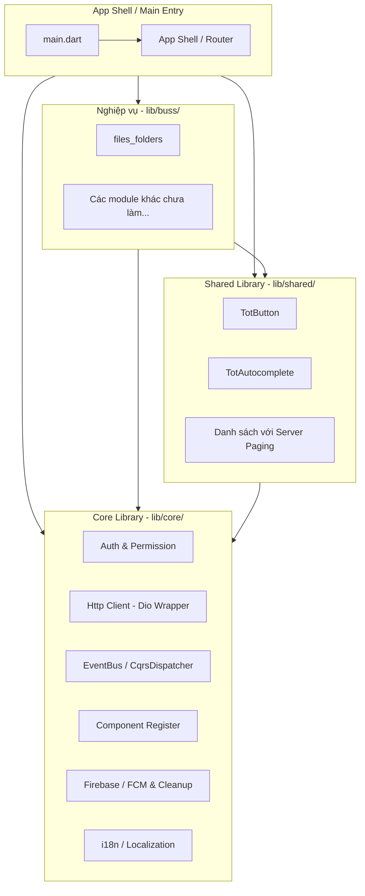
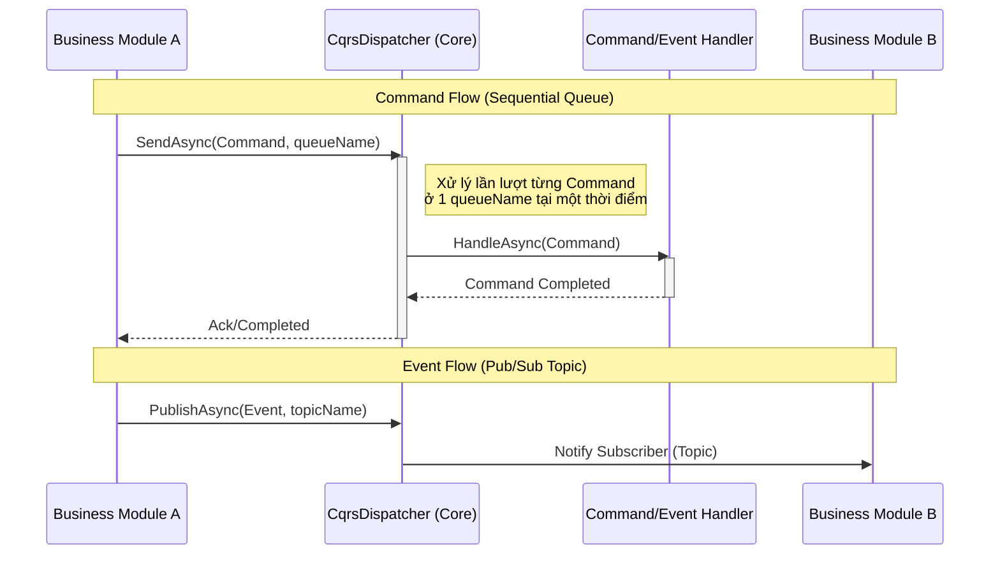
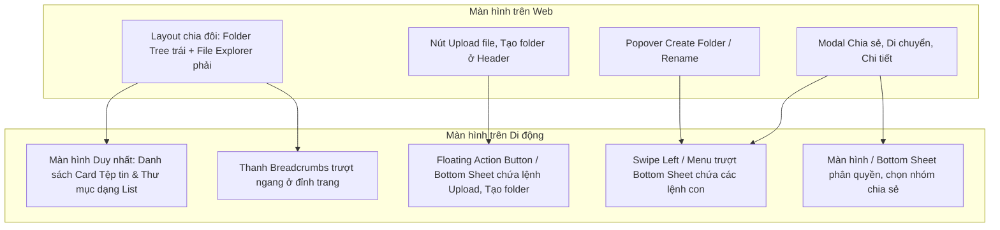
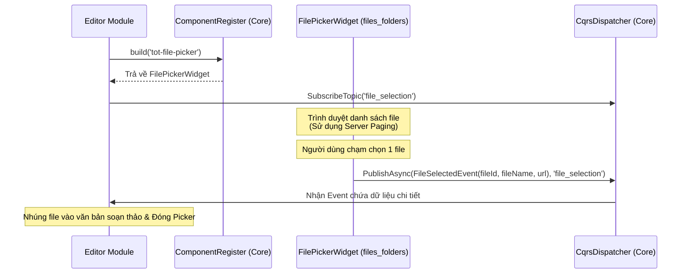
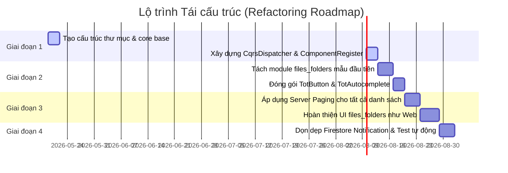

# Kế hoạch phát triển ứng dụng My PC Assistant (Cập nhật Kiến trúc Clean Mobile)

Tài liệu này trình bày chi tiết về thiết kế kiến trúc và kế hoạch phát triển ứng dụng di động **My PC Assistant** (Flutter/Dart). Giai đoạn này tập trung 100% vào việc xây dựng module **Quản lý Tệp tin & Thư mục (`files_folders`) làm sản phẩm mẫu (Sample) đầu tiên**. Toàn bộ tính năng và giao diện người dùng (UI) được chuyển đổi nguyên vẹn từ bản Angular Web (`TreeOfThought/frontend/web/projects/tot/business-files`) sang trải nghiệm di động (Mobile UX) cao cấp nhất, kết hợp các hạ tầng Core Clean.

> [!NOTE]
> Các nghiệp vụ khác như `dashboard` hay `chat_assistant` sẽ **chưa thực hiện ở giai đoạn này** để đảm bảo tập trung hoàn thiện và kiểm thử mẫu module `files_folders` trước.

---

## 1. Kiến trúc Tổng quan (Architectural Blueprint)

Để đáp ứng đầy đủ các yêu cầu về phân tách module và đồng nhất hóa cấu trúc trao đổi dữ liệu, ứng dụng di động Flutter sẽ được cấu trúc thành 3 lớp chính (không cần lazy loading để giữ hệ thống tinh gọn):



### Quy tắc Phân rã & Độc lập Nghiệp vụ:
1. **Tên thư mục nghiệp vụ tự do**: Thư mục nghiệp vụ đặt theo tên nghiệp vụ thực tế mong muốn (ví dụ: `files_folders`) phù hợp với yêu cầu thực thi khi gọi `tot-dev`.
2. **Không Tham chiếu Trực tiếp**: Một module nghiệp vụ **tuyệt đối không được import** bất kỳ file nào từ module nghiệp vụ khác. Việc import chỉ được phép thực hiện từ `lib/core/` và `lib/shared/`.
3. **Giao tiếp Giải mã (Decoupled State Sharing via CQRS)**:
   - Các nghiệp vụ nhúng hoặc gọi UI của nhau thông qua **`ComponentRegister`** (đăng ký động bằng String key).
   - Truyền dữ liệu trạng thái (State) hoặc kích hoạt hành động chéo qua **`CqrsDispatcher`** (Event Bus). Các component nhúng động hoàn toàn có thể tự phát các Command/Event để cập nhật trạng thái cha mà không bị ràng buộc phụ thuộc.

---

## 2. Chi tiết Lớp Core (lib/core/)

Lớp core cung cấp hạ tầng kỹ thuật dùng chung cho toàn bộ dự án.

### 2.1. Authentication, Guard & Permission (Auth & Guard)
- **SSO Login & Logout**: Tích hợp OIDC Provider thông qua thư viện `flutter_appauth`. Sau khi login thành công, Token sẽ được lưu trữ an toàn trong `flutter_secure_storage`.
- **Interceptors**: Tự động chèn token Bearer vào header của tất cả các API request qua Dio.
- **Route Guarding**: Định nghĩa `RouteGuard` trong router của Flutter. Trước khi chuyển màn hình (route), hệ thống sẽ check session.
- **Permission Checking (Claims)**: Tuân thủ logic kiểm tra quyền của Backend (BE Auth Attribute). Tạo một `TotPermission` widget trong Flutter để ẩn/hiển thị UI dựa trên claims của người dùng.

### 2.2. HTTP Client (Dio Wrapper)
- **Interceptors**: Tự động xử lý Refresh Token khi gặp lỗi `401 Unauthorized`.
- **Global Error Handling**: Khi API trả về mã lỗi (`4xx`, `5xx`), tự động đẩy thông báo qua Toast/Dialog tùy chỉnh mà không cần try-catch cục bộ ở mọi API call.
- **Global Loading Overlay**: Tích hợp thanh loading/busy overlay trên màn hình chính khi có API đang xử lý chạy ngầm, giúp trải nghiệm đồng nhất.

### 2.3. Event Bus & CQRS (CqrsDispatcher)
Hệ thống tin nhắn bất đồng bộ thiết kế dạng **CQRS (Command & Event)** tương tự backend C# để đồng bộ hóa giao tiếp:



- **Command (Sequential Queue)**: Đăng ký và xử lý tuần tự (FIFO). Đảm bảo ở mỗi `queueName` chỉ có tối đa **1 process** đang thực hiện nghiệp vụ xử lý lần lượt. Sử dụng Dart `Stream` và hàng đợi `Queue<T>` chạy ngầm.
- **Event (Pub/Sub)**: Đăng ký và lắng nghe dữ liệu theo Topic (topicName). Khi publish một Event, tất cả các module đã đăng ký topic đó đều nhận được dữ liệu song song.

### 2.4. Component Register (Đăng ký thành phần động)
- Sử dụng String key để đăng ký và lấy Widget builder động, triệt tiêu dependency trực tiếp giữa các module nghiệp vụ:
  ```dart
  class ComponentRegister {
    static final Map<String, WidgetBuilder> _registry = {};

    static void register(String key, WidgetBuilder builder) {
      _registry[key] = builder;
    }

    static Widget build(String key, BuildContext context, {Object? arguments}) {
      final builder = _registry[key];
      if (builder == null) return Container(child: Text('Component $key not registered'));
      return builder(context);
    }
  }
  ```

### 2.5. Firebase FCM & Tối ưu hóa Dọn dẹp Notification
- **Thông báo đẩy (FCM)**: Lắng nghe notification ở cả 3 trạng thái: Foreground, Background và Terminated.
- **Tối ưu hóa Chi phí & Dữ liệu Firestore**:
  > [!IMPORTANT]
  > Sau khi Mobile App nhận được thông báo dữ liệu từ Firestore (như kết quả xử lý upload, rename, xóa, v.v.), xử lý logic hoàn tất thì **phải gọi ngay lập tức API xóa dữ liệu thông báo đó trên Firestore**. Tránh tích tụ rác dữ liệu, bảo mật thông tin và tối ưu hóa chi phí Firestore (read/write quota).

### 2.6. Internationalization (i18n / Localization)
- Giao diện di động hoàn toàn hỗ trợ i18n cực kỳ mạnh mẽ:
  - Tải động các tệp JSON ngôn ngữ (`vi.json`, `en.json`) từ tài nguyên (`assets/i18n/`) hoặc local storage.
  - Sử dụng một `I18nService` trong Core để nạp và quản lý bản dịch theo cặp Key-Value.
  - Cung cấp tiện ích `.tr()` (ví dụ: `'common.save'.tr()`) để dịch nhanh giao diện mà không làm suy giảm hiệu năng render.

---

## 3. Chi tiết Lớp Shared Components (lib/shared/)

Các component dùng chung trong lớp này phải bắt đầu bằng tiền tố **`tot-`** (trong code Dart sẽ được chuẩn hóa thành CamelCase với prefix **`Tot`**).

### 3.1. TotButton (Nút thao tác tiêu chuẩn)
- **Hành vi bắt buộc**: Khi click vào nút thực hiện tác vụ bất đồng bộ, nút phải **tự động chuyển sang trạng thái Loading (hiển thị spinner tròn)** và **vô hiệu hóa tạm thời tương tác click (disabled)**. Khi tác vụ kết thúc (Future completed hoặc State thay đổi), ẩn loading và kích hoạt lại nút.
- Điều này ngăn chặn việc người dùng click nhiều lần (double-click/spam request) gây lỗi nghiệp vụ.

### 3.2. TotAutocomplete (Thanh tìm kiếm chọn lọc nâng cao)
- **Tính năng cốt lõi**:
  - Hỗ trợ cả 2 chế độ: **Chọn một (Single)** hoặc **Chọn nhiều (Multi-select)**.
  - **Paging load on scroll**: Khi người dùng cuộn tới cuối danh sách tìm kiếm, tự động kích hoạt lấy thêm dữ liệu (paging size mặc định là 10).
  - **Local Session Cache**: Lưu kết quả tìm kiếm vào bộ nhớ đệm (Session Storage giả lập trên Flutter). Lần đầu mở lên sẽ ưu tiên hiển thị ngay dữ liệu cũ, các lần paging hoặc search tiếp theo sẽ cập nhật thêm các giá trị mới chưa có trong cache vào danh sách.
  - Hiển thị spinner loading nhỏ khi đang kéo dữ liệu từ server.

### 3.3. Yêu cầu Bắt buộc về Server Paging (Phân trang Máy chủ)
- **Không cần xây dựng TotTable**: Hệ thống di động chưa yêu cầu xây dựng widget `tot-table` động phức tạp.
- **Yêu cầu Server Paging bắt buộc**: Tất cả các API gọi lên server lấy danh sách dữ liệu **luôn luôn phải hỗ trợ phân trang (paging)**.
  - Dữ liệu request gửi đi phải có: `pageIndex` và `pageSize` (mặc định là 10).
  - Dữ liệu response trả về bắt buộc tuân thủ định dạng cấu trúc:
    ```json
    {
      "items": [...],
      "totalCount": 142,
      "pageIndex": 1,
      "pageSize": 10
    }
    ```
  - Phía UI hiển thị sử dụng `ListView.builder` kết hợp với bộ điều khiển cuộn (`ScrollController`) để tự động kích hoạt tải trang tiếp theo khi cuộn xuống gần cuối danh sách (Infinite Scroll).

---

## 4. Module Nghiệp vụ Mẫu đầu tiên: Quản lý Tệp tin (`files_folders`)

Module này được thiết kế dựa trên các tính năng của Angular `business-files` trên Web để chuyển sang bản di động:



### 4.1. Cấu trúc thư mục của Module `files_folders` trên Mobile:
```text
lib/buss/files_folders/
├── pages/
│   ├── folder_content_page.dart    # Giao diện danh sách thư mục & tệp tin (sử dụng Server Paging)
│   ├── file_share_page.dart        # Giao diện cấu hình chia sẻ file (Công khai / Riêng tư)
│   └── file_detail_page.dart       # Màn hình xem thông tin chi tiết và lịch sử tệp tin
├── widgets/
│   ├── file_picker_widget.dart     # Component chọn tệp tin động để nhúng vào module khác
│   ├── folder_tree_selector.dart   # Popup chọn thư mục đích phục vụ tính năng "Di chuyển" (Move)
│   └── file_list_item.dart         # Card hiển thị tệp tin/thư mục hỗ trợ vuốt chạm (Swipe actions)
├── services/
│   └── files_folders_api.dart      # Gọi API của module (Dio Client, luôn truyền pageIndex, pageSize)
├── models/
│   └── file_folder_models.dart     # Các đối tượng FolderContent, FileItem, FolderItem, Breadcrumb
└── files_folders_module.dart       # File đăng ký router, components và các Event/Command handlers
```

### 4.2. Danh sách API gọi lên máy chủ (C# Web API Endpoints):
Dịch vụ `FilesFoldersApi` sẽ thực thi các API khớp hoàn toàn với Backend:
- `GET /api/folders/tree`: Lấy danh sách cây thư mục (dùng cho tính năng Di chuyển).
- `GET /api/folders/{folderId}/content` hoặc `/api/folders/root/content?pageIndex=X&pageSize=Y`: Lấy nội dung thư mục hiện tại (hỗ trợ phân trang máy chủ).
- `POST /api/folders`: Tạo thư mục mới `{ name, parentId }`.
- `DELETE /api/folders/{folderId}`: Xóa thư mục.
- `POST /api/folders/move`: Di chuyển thư mục `{ folderId, newParentId }`.
- `PATCH /api/folders/{folderId}/rename`: Đổi tên thư mục `{ newName }`.
- `POST /api/files/upload`: Tải file lên (sử dụng `MultipartFile` qua Dio).
- `DELETE /api/files/{fileId}`: Xóa file.
- `POST /api/files/move`: Di chuyển file `{ fileId, newFolderId }`.
- `PATCH /api/files/{fileId}/rename`: Đổi tên file `{ newName }`.
- `POST /api/files/permission`: Phân quyền file `{ fileId, permission, shareCode, expiredAt }`.
- `GET /api/files/{fileId}/share-url?durationHours=H`: Lấy URL chia sẻ file.
- `GET /api/files/{fileId}`: Lấy chi tiết file.
- `GET /api/files/search?query=Q`: Tìm kiếm file.

---

## 5. Trải nghiệm người dùng Mobile (Mobile UI/UX Flows)

Giao diện sẽ được thiết kế hiện đại theo phong cách Ant Design Mobile với các hiệu ứng chuyển động mượt mà:

### 5.1. Màn hình Danh sách Tệp tin (`folder_content_page.dart`):
- **Header & Breadcrumbs**:
  - Breadcrumbs hiển thị đường dẫn thư mục hiện tại dưới dạng danh sách trượt ngang (Horizontal Scroll View).
  - Cho phép người dùng chạm vào một thư mục cha trong danh sách breadcrumbs để quay lại thư mục đó ngay lập tức.
  - Có nút "Quay lại thư mục cha" (Up Arrow) ở góc trái.
- **Search Bar**:
  - Thanh tìm kiếm được đặt ngay dưới Header. Khi nhập từ khóa, hệ thống kích hoạt tìm kiếm và hiển thị kết quả lọc ngay tức thì.
- **Danh sách Card (ListView.builder)**:
  - Hiển thị danh sách các thư mục trước, sau đó đến các tệp tin.
  - Mỗi item hiển thị icon đại diện (Folder, PDF, Word, Image, v.v.), tên, kích thước, và ngày cập nhật.
  - Bắt buộc tích hợp **Infinite Scroll (Server Paging)**: Khi cuộn gần tới cuối danh sách, một vòng tròn loading nhỏ hiển thị ở đáy và tự động nạp trang tiếp theo từ server (mặc định size 10).
- **Vuốt chạm & Hành động nhanh (Swipe Actions)**:
  - Vuốt một Card sang trái để hiển thị các nút tác vụ nhanh: **Đổi tên**, **Di chuyển**, **Xóa**.
  - Nếu chạm vào icon `...` bên phải Card, ứng dụng sẽ trượt lên một **Bottom Action Sheet** chứa tất cả các lệnh: *Xem chi tiết, Đổi tên, Di chuyển, Chia sẻ/Phân quyền, Xóa*.
- **Floating Action Button (FAB)**:
  - Một nút tròn lớn màu tím chủ đạo nằm ở góc dưới cùng bên phải.
  - Khi chạm vào, trượt lên danh sách lệnh nhanh: **Tải file lên** (mở trình duyệt file trên điện thoại để upload), **Tạo thư mục mới** (mở popup nhập tên thư mục).

### 5.2. Luồng Xử lý Upload & Phân quyền (Upload & Share Flow):
1. Người dùng bấm **Upload File**, chọn một ảnh hoặc tài liệu bất kỳ.
2. Ứng dụng hiển thị một **Progress Bottom Sheet** chạy ngầm để hiển thị tiến độ upload thực tế qua API `POST /api/files/upload`.
3. Nhận được phản hồi chứa `trackingId`, ứng dụng gọi dịch vụ real-time Firestore để theo dõi quá trình xử lý của Server.
4. Khi Firebase thông báo trạng thái `Completed`, ứng dụng **tự động xóa bản ghi notification Firestore** để dọn dẹp bộ nhớ và tiết kiệm chi phí Firestore.
5. Sau đó, ứng dụng hiển thị thông báo thành công và **tự động mở màn hình Phân quyền (`file_share_page.dart`)** để người dùng thiết lập truy cập (Riêng tư / Công khai / Được chia sẻ) tương tự tính năng trên Web.

### 5.3. Tính năng Chọn Tệp tin Động & Chia sẻ Trạng thái qua CQRS Event Bus:
Khi một module khác (ví dụ: Soạn thảo văn bản) cần chức năng chọn file, họ sẽ gọi xây dựng component picker. Sự tương tác dữ liệu và state hoàn toàn decoupled nhờ `CqrsDispatcher`:



- **Mã nguồn đăng ký Widget Picker (`files_folders_module.dart`)**:
  ```dart
  void initFilesFoldersModule() {
    ComponentRegister.register('tot-file-picker', (context) => const FilePickerWidget());
  }
  ```
- **Mã nguồn sử dụng tại Module Soạn thảo**:
  ```dart
  // 1. Nhúng Widget động vào giao diện
  Widget filePickerWidget = ComponentRegister.build('tot-file-picker', context);

  // 2. Lắng nghe Event chọn file từ Event Bus để cập nhật trạng thái Editor
  CqrsDispatcher.instance.subscribeToTopic('file_selection', (event) {
    if (event is FileSelectedEvent) {
      // Cập nhật State trong Editor
      setState(() {
        selectedFileName = event.fileName;
        selectedFileUrl = event.fileUrl;
      });
      // Đóng popup picker
      Navigator.pop(context);
    }
  });
  ```

---

## 6. Lộ trình Triển khai (Refactoring Roadmap)

Quá trình chuyển đổi từ source code có sẵn sang kiến trúc mới sẽ chia làm 4 giai đoạn, đảm bảo không làm gián đoạn các tính năng native đã hoàn thành:



### Chi tiết các bước:
1. **Giai đoạn 1 (Core Foundations)**:
   - Tạo các thư mục mới: `lib/core/`, `lib/shared/`, `lib/buss/`.
   - Thiết lập `CqrsDispatcher`, `ComponentRegister` và `DioWrapper`.
   - Di chuyển và wrap `AuthService` hiện có sang thư mục `lib/core/auth`.
   - Cài đặt `I18nService` nạp JSON tĩnh phục vụ dịch đa ngôn ngữ.
2. **Giai đoạn 2 (Shared & First Module)**:
   - Xây dựng module nghiệp vụ `files_folders` làm mẫu đầu tiên với đầy đủ `ComponentRegister` và truyền state qua `CqrsDispatcher`.
   - Đóng gói các widget dùng chung: `TotButton` hỗ trợ trạng thái loading tự động và `TotAutocomplete`.
3. **Giai đoạn 3 (Server Paging & UI Completeness)**:
   - Cập nhật toàn bộ các API gọi dữ liệu danh sách trong app hỗ trợ truyền tham số `pageIndex`, `pageSize` bắt buộc.
   - Thiết kế giao diện `folder_content_page.dart` hỗ trợ Swipe Actions, Breadcrumbs, FAB và Bottom Action Sheet.
   - Hoàn thiện luồng Upload File và mở màn hình cấu hình chia sẻ file.
4. **Giai đoạn 4 (Optimizations & Cleanups)**:
   - Tích hợp logic xóa tài liệu thông báo trên Firestore ngay sau khi app nhận và xử lý thành công.
   - Thực thi bộ test tự động (`integration_test`) trên hệ thống mới.
