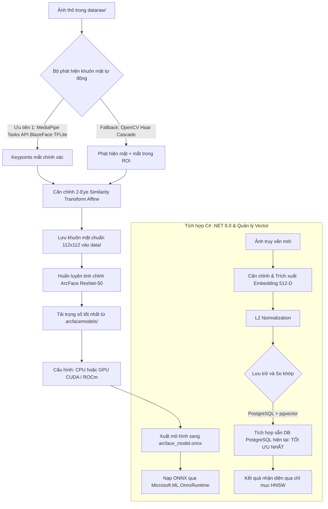
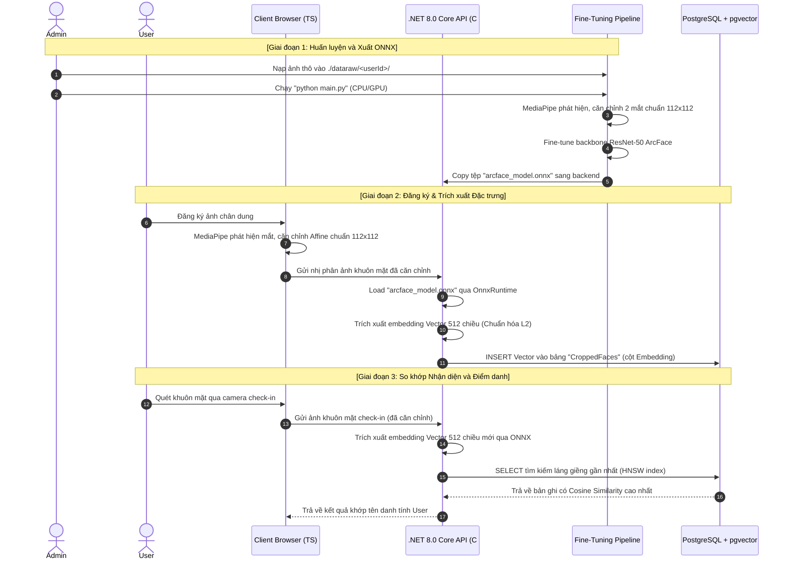

# Hướng dẫn và Giải pháp Tinh chỉnh (Fine-tune) ArcFace, Quản lý Vector & Xuất ONNX cho .NET 8.0

Tài liệu này cung cấp toàn bộ thiết kế hệ thống, hướng dẫn tổ chức dữ liệu, tiêu chuẩn tiền xử lý hình ảnh, kỹ thuật cắt (crop) & căn chỉnh (alignment) khuôn mặt, cách quản lý vector embedding bằng FAISS/Qdrant/PostgreSQL (pgvector) và hướng dẫn tích hợp mô hình ONNX trong **C# .NET 8.0**.

---

## 0. Hướng dẫn Khởi tạo Môi trường (Bước đầu tiên bắt buộc)

### Yêu cầu hệ thống

| Thành phần | Phiên bản tối thiểu | Ghi chú |
|---|---|---|
| Python | 3.10+ | Khuyên dùng 3.11 hoặc 3.12 |
| pip | 23+ | Nâng cấp ngay sau khi tạo venv |
| RAM | 8 GB | 4 GB có thể dùng được với CPU |
| Dung lượng đĩa | ~5 GB | Cho model + thư viện PyTorch |
| GPU (tùy chọn) | NVIDIA CUDA hoặc AMD ROCm | CPU cũng chạy được, chậm hơn |

### Cài đặt từng bước

```bash
# ─── Bước 1: Đi vào thư mục làm việc ───────────────────────────────────────
cd TreeOfThought/docs/nhan-dien-khuon-mat/ArcFaceFinetune

# ─── Bước 2: Tạo môi trường ảo Python (chỉ làm 1 lần) ──────────────────────
python3 -m venv venv

# ─── Bước 3: Kích hoạt môi trường ảo ───────────────────────────────────────
source venv/bin/activate          # Linux / macOS
# venv\Scripts\activate           # Windows

# ─── Bước 4: Nâng cấp pip ──────────────────────────────────────────────────
pip install --upgrade pip

# ─── Bước 5: Cài đặt toàn bộ thư viện cần thiết ────────────────────────────
# Dùng cho máy có GPU NVIDIA (CUDA):
pip install torch torchvision --index-url https://download.pytorch.org/whl/cu121

# Dùng cho máy có GPU AMD (ROCm - Linux):
pip install torch torchvision --index-url https://download.pytorch.org/whl/rocm6.0

# Dùng cho máy chỉ có CPU (hoặc test trước):
pip install torch torchvision

# ─── Bước 6: Cài đặt các thư viện xử lý ảnh và ML khác ────────────────────
pip install onnx onnxruntime numpy pillow opencv-python mediapipe
```

### Chạy pipeline fine-tune

```bash
# Kích hoạt venv (nếu chưa)
source venv/bin/activate

# Đặt ảnh thô vào dataraw/<userId>/ (tùy chọn - nếu không có sẽ dùng mock data)
mkdir -p dataraw/ten_user
# cp /path/to/photos/*.jpg dataraw/ten_user/

# Chạy pipeline (tự động tải model, xử lý ảnh, fine-tune, xuất ONNX)
python main.py
```

### Cấu hình thiết bị (trong `main.py` dòng 18)

```python
DEVICE_CONFIG = "cpu"    # ← Mặc định: CPU (test ổn định trước)
# DEVICE_CONFIG = "cuda" # ← GPU NVIDIA CUDA
# DEVICE_CONFIG = "auto" # ← Tự động chọn GPU nếu có
```

> **Lưu ý AMD GPU (RDNA3 - gfx1103)**: Code đã tích hợp sẵn `HSA_OVERRIDE_GFX_VERSION=11.0.0`
> để fix lỗi rocBLAS với chip AMD Radeon RX 7600/7700 (gfx1103). Không cần set thủ công.

### Thư mục model được tải tự động

Khi chạy `python main.py`, các model sau sẽ được **tự động tải về** `./arcfacemodels/`:

| File | Kích thước | Nguồn | Mục đích |
|---|---|---|---|
| `blaze_face_short_range.tflite` | ~1 MB | Google MediaPipe | Phát hiện khuôn mặt |
| `face_landmarker.task` | ~3 MB | Google MediaPipe | Landmark 468 điểm (tùy chọn) |
| `resnet50_arcface.pth` | ~100 MB | HuggingFace | Backbone ArcFace pretrained |

> Nếu `resnet50_arcface.pth` không tải được tự động (lỗi 401), pipeline sẽ **tự động dùng ImageNet pretrained** làm fallback. Kết quả vẫn hoạt động tốt cho fine-tune nhỏ.

### Kết quả đầu ra

Sau khi chạy thành công, terminal sẽ in ra đường dẫn tuyệt đối:

```
✅ File ONNX đường dẫn đầy đủ:
   /work/.../ArcFaceFinetune/arcface_model.onnx

 Trong C# .NET 8.0, nạp bằng:
   var session = new InferenceSession(@"/work/.../arcface_model.onnx");
```

---


## 1. Tổng quan Kiến trúc Pipeline Hệ thống

Hệ thống nhận diện khuôn mặt hoạt động theo chu kỳ khép kín từ khâu tiền xử lý hình ảnh, trích xuất đặc trưng qua mạng thần kinh nhân tạo đến khâu truy vấn siêu nhanh bằng cơ sở dữ liệu vector.



---

## 2. Giải đáp Câu hỏi Nghiệp vụ và Tổ chức Dữ liệu

### Câu hỏi 1: Tôi cần tổ chức folder data, ảnh để finetune như thế nào?

Bạn có thể cung cấp dữ liệu theo hai hình thức (Ảnh thô chưa cắt hoặc Ảnh đã cắt sẵn):

> **[Cập nhật kỹ thuật]**: `main.py` tự động phát hiện khuôn mặt theo thứ tự ưu tiên:
> 1. **MediaPipe Tasks API** (`FaceDetector` + `BlazeFace TFLite`) — mediapipe ≥ 0.10, độ chính xác cao nhất, trả về keypoints mắt trực tiếp. Model `blaze_face_short_range.tflite` (~1MB) được tự động tải về `./arcfacemodels/`.
> 2. **OpenCV Haar Cascade** — fallback khi model BlazeFace không tải được, phát hiện mặt + mắt trong ROI.

#### A. Hình thức 1: Cung cấp ảnh thô ban đầu (Khuyên dùng)
Bạn tạo thư mục `dataraw/` chứa các thư mục con theo ID của User, bên trong là các tệp ảnh chụp thực tế chưa qua xử lý (pipeline sẽ tự động quét, cắt và căn chỉnh):

```text
TreeOfThought/docs/nhan-dien-khuon-mat/ArcFaceFinetune/
├── dataraw/
│   ├── user_id_1/
│   │   ├── captured_image_1.jpg
│   │   ├── webcam_photo.png
│   │   └── ...
│   ├── user_id_2/
│   │   ├── checkin.jpg
│   │   └── ...
│   └── user_id_N/
│       └── face.jpg
```

Khi bạn chạy `python main.py`, script sẽ tự động:
1. Phát hiện thư mục `dataraw/`.
2. Sử dụng thư viện **MediaPipe Face Detection** chạy cục bộ để tìm tọa độ mắt trái và mắt phải của từng khuôn mặt.
3. Thực thi thuật toán **Căn chỉnh Affine** đồng nhất.
4. Cắt và lưu kết quả ảnh khuôn mặt đạt chuẩn `112x112` vào thư mục `data/` để tiến hành huấn luyện.

#### B. Hình thức 2: Dữ liệu ảnh khuôn mặt đã được cắt sẵn từ UI
Nếu bạn đã có sẵn ảnh khuôn mặt được cắt vuông từ trình duyệt (ví dụ qua MediaPipe của Web App), bạn có thể nạp trực tiếp vào thư mục `data/`:

```text
TreeOfThought/docs/nhan-dien-khuon-mat/ArcFaceFinetune/
├── data/
│   ├── user_id_1/
│   │   ├── face_aligned_1.png
│   │   └── ...
│   └── user_id_N/
│       └── face_aligned.png
```

> [!TIP]
> **Tự động sinh dữ liệu ảo (Mock Dataset):**
> Nếu cả `dataraw/` và `data/` đều trống hoặc chưa được tạo, `main.py` sẽ tự động sinh dữ liệu giả lập (3 user ảo với 5 ảnh/user dạng vector hình học) để đảm bảo pipeline luôn chạy thành công ngay lập tức để bạn trải nghiệm.

---

### Câu hỏi 2: Mỗi ảnh để đưa vào tổ chức folder có cần tiêu chuẩn gì không? Từ ảnh gốc cần crop theo tiêu chuẩn nào không?

Để ArcFace đạt độ chính xác tối đa, ảnh khuôn mặt đưa vào huấn luyện hoặc nhận diện cần phải được **Cắt (Crop)** và **Căn chỉnh (Align)** chuẩn hóa:

#### A. Tiêu chuẩn Kỹ thuật của Ảnh Đầu Vào
- **Kích thước đầu vào:** **Exactly 112x112 pixels** (hoặc 224x224 nếu dùng kiến trúc lớn hơn).
- **Hệ màu:** **RGB** (3 kênh màu). Nếu sử dụng thư viện Python OpenCV (đọc mặc định là BGR), bạn bắt buộc phải chuyển sang RGB.
- **Công thức chuẩn hóa (Normalization):** Đưa giá trị pixel từ `[0, 255]` về khoảng `[-1.0, 1.0]`:
  $$x_{norm} = \frac{x - 127.5}{127.5}$$

#### B. Tiêu chuẩn Cắt (Crop) và Căn chỉnh (Alignment) từ ảnh gốc

> [!NOTE]
> Việc chỉ cắt theo hộp bao (bounding box) đơn thuần và resize sẽ khiến mắt, mũi, miệng bị lệch vị trí, làm giảm độ chính xác của mô hình đi **10-15%**. Phương pháp chuẩn công nghiệp là sử dụng **Affine Transformation (Biến đổi tương đồng)** dựa trên 5 điểm mốc (landmarks).

##### Phương pháp 1: Căn chỉnh 5 điểm mốc Landmark (Khuyến nghị cho độ chính xác cao)
Sử dụng các mô hình phát hiện điểm mốc (như MediaPipe, RetinaFace hoặc MTCNN) để lấy tọa độ của 5 điểm mốc trên mặt: 
1. Mắt trái ($left\_eye$)
2. Mắt phải ($right\_eye$)
3. Đỉnh mũi ($nose$)
4. Khóe miệng trái ($left\_mouth$)
5. Khóe miệng phải ($right\_mouth$)

Sau đó, thực hiện phép biến đổi Affine để ánh xạ 5 điểm này vào tọa độ chuẩn trên khung ảnh `112x112`:
- **Target Left Eye:** `(38.2946, 51.6963)`
- **Target Right Eye:** `(73.5318, 51.5014)`
- **Target Nose:** `(56.0252, 71.7366)`
- **Target Left Mouth:** `(41.5493, 92.3655)`
- **Target Right Mouth:** `(70.7299, 92.2041)`

*Đoạn mã ví dụ bằng Python (Dùng OpenCV để Align):*
```python
import cv2
import numpy as np

def align_face(image_rgb, landmarks_5point):
    """
    landmarks_5point: Array dạng [[x, y], [x, y], ...] chứa 5 điểm mốc
    """
    # Bộ điểm mốc chuẩn của ArcFace
    reference_landmarks = np.array([
        [38.2946, 51.6963],
        [73.5318, 51.5014],
        [56.0252, 71.7366],
        [41.5493, 92.3655],
        [70.7299, 92.2041]
    ], dtype=np.float32)
    
    src_points = np.array(landmarks_5point, dtype=np.float32)
    
    # Tính toán ma trận biến đổi affine
    tform = cv2.estimateAffinePartial2D(src_points, reference_landmarks)[0]
    
    # Warp hình ảnh về kích thước 112x112
    aligned_face = cv2.warpAffine(image_rgb, tform, (112, 112), borderValue=0)
    return aligned_face
```

##### Phương pháp 2: Cắt hình vuông mở rộng (Giải pháp đơn giản nếu không có Landmark)
Nếu không có hệ thống phát hiện 5 điểm mốc trên Client hoặc Backend C#, ta có thể crop từ bounding box khuôn mặt:
1. Xây dựng hộp vuông dựa trên cạnh lớn nhất: $size = \max(width, height)$.
2. Mở rộng hộp vuông ra khoảng **15% - 20%** để tránh mất cấu trúc trán và tai.
3. Cắt và resize về `112x112`.

---

## 3. Tiêu chuẩn Căn chỉnh Đồng nhất Đa nền tảng (Python, TypeScript, C#)

> [!IMPORTANT]
> **TÍNH ĐỒNG NHẤT CỰC KỲ QUAN TRỌNG:**
> Để mô hình ArcFace nhận diện chính xác nhất, khuôn mặt được trích xuất ở 3 giai đoạn: **(1) Cắt ảnh thô để huấn luyện (Python)**, **(2) Đăng ký ảnh mới (TypeScript trên Browser)**, và **(3) Nhận diện điểm danh (C# trên Backend)** bắt buộc phải được căn chỉnh hình học giống hệt nhau.

Để đạt được sự đồng nhất 100% mà không phụ thuộc vào các thư viện ma trận cồng kềnh trên Browser (JS/TS) hay Backend (.NET), chúng ta áp dụng **Thuật toán Căn chỉnh 2 Điểm Mắt (2-Eye Similarity Transform)**. Thuật toán này xoay ảnh để hai mắt nằm ngang, tỷ lệ khoảng cách giữa hai mắt chuẩn hóa về $35.24$ pixel, và đưa trung điểm hai mắt về tọa độ chuẩn `(55.91, 51.60)` trên canvas $112 \times 112$.

Dưới đây là mã nguồn đồng nhất bằng 3 ngôn ngữ:

### 3.1. Mã nguồn Python (Dùng khi chuẩn bị dữ liệu & Huấn luyện)
```python
import cv2
import numpy as np

def align_face_python(image_bgr, eye_left, eye_right):
    """
    eye_left: (x, y) của mắt xuất hiện ở phía bên trái bức ảnh
    eye_right: (x, y) của mắt xuất hiện ở phía bên phải bức ảnh
    """
    # Tính toán trung điểm hiện tại, khoảng cách và góc nghiêng của mắt
    cx = (eye_left[0] + eye_right[0]) / 2.0
    cy = (eye_left[1] + eye_right[1]) / 2.0
    dx = eye_right[0] - eye_left[0]
    dy = eye_right[1] - eye_left[1]
    
    current_dist = np.sqrt(dx**2 + dy**2)
    angle_deg = np.degrees(np.arctan2(dy, dx))
    
    # Kích thước đích của ArcFace
    target_dist = 35.2372
    tx = 55.9132
    ty = 51.59885
    
    scale = target_dist / current_dist
    
    # Tính ma trận quay và tỷ lệ
    M = cv2.getRotationMatrix2D((cx, cy), angle_deg, scale)
    
    # Dịch chuyển trung điểm mắt về tọa độ đích
    M[0, 2] += (tx - cx)
    M[1, 2] += (ty - cy)
    
    # Áp dụng biến đổi Affine
    aligned_face = cv2.warpAffine(image_bgr, M, (112, 112), flags=cv2.INTER_CUBIC, borderValue=0)
    return aligned_face
```

### 3.2. Mã nguồn TypeScript / JavaScript (Dùng trên Trình duyệt khi User đăng ký ảnh)
Sử dụng trực tiếp HTML5 `<canvas>` 2D context để thực thi Affine Transform gốc mà không cần bất kỳ thư viện ngoài nào:
```typescript
interface Point {
  x: number;
  y: number;
}

function alignFaceBrowser(
  imageEl: HTMLImageElement | HTMLVideoElement | HTMLCanvasElement,
  eyeLeft: Point,
  eyeRight: Point
): HTMLCanvasElement {
  const canvas = document.createElement("canvas");
  canvas.width = 112;
  canvas.height = 112;
  const ctx = canvas.getContext("2d");
  if (!ctx) throw new Error("Không thể khởi tạo Canvas 2D Context");

  const cx = (eyeLeft.x + eyeRight.x) / 2;
  const cy = (eyeLeft.y + eyeRight.y) / 2;
  const dx = eyeRight.x - eyeLeft.x;
  const dy = eyeRight.y - eyeLeft.y;

  const currentDist = Math.sqrt(dx * dx + dy * dy);
  const angleRad = Math.atan2(dy, dx);

  const targetDist = 35.2372;
  const tx = 55.9132;
  const ty = 51.59885;
  const scale = targetDist / currentDist;

  ctx.save();
  // Thực hiện các phép biến đổi hình học
  ctx.translate(tx, ty);             // 4. Dịch chuyển về trung điểm mắt đích
  ctx.scale(scale, scale);           // 3. Thay đổi tỷ lệ
  ctx.rotate(-angleRad);             // 2. Xoay ngược góc nghiêng để mắt nằm ngang
  ctx.translate(-cx, -cy);           // 1. Đưa trung điểm mắt hiện tại về gốc tọa độ

  // Vẽ hình ảnh gốc lên canvas đã được biến đổi
  ctx.drawImage(imageEl, 0, 0);
  ctx.restore();

  return canvas;
}
```

### 3.3. Mã nguồn C# .NET 8.0 (Dùng ở Backend khi trích xuất vector điểm danh)
Sử dụng thuật toán ánh xạ pixel trực tiếp (Inverse Affine Mapping), hoàn toàn độc lập với các thư viện xử lý ma trận và chạy cực nhanh trên mọi hệ điều hành:
```csharp
using SixLabors.ImageSharp;
using SixLabors.ImageSharp.PixelFormats;
using System;

public static class FaceAligner
{
    public static Image<Rgb24> AlignFace(Image<Rgb24> sourceImage, PointF eyeLeft, PointF eyeRight)
    {
        float cx = (eyeLeft.X + eyeRight.X) / 2f;
        float cy = (eyeLeft.Y + eyeRight.Y) / 2f;
        float dx = eyeRight.X - eyeLeft.X;
        float dy = eyeRight.Y - eyeLeft.Y;

        float currentDist = (float)Math.Sqrt(dx * dx + dy * dy);
        float angleRad = (float)Math.Atan2(dy, dx);

        float targetDist = 35.2372f;
        float tx = 55.9132f;
        float ty = 51.59885f;
        float scale = targetDist / currentDist;

        float cos = (float)Math.Cos(angleRad);
        float sin = (float)Math.Sin(angleRad);

        var aligned = new Image<Rgb24>(112, 112);

        // Duyệt qua từng pixel của ảnh đích 112x112 và tính ngược tọa độ trên ảnh nguồn
        for (int y = 0; y < 112; y++)
        {
            for (int x = 0; x < 112; x++)
            {
                // Dịch chuyển gốc tọa độ về tâm mắt đích
                float rx = x - tx;
                float ry = y - ty;

                // Thay đổi tỷ lệ scale
                rx /= scale;
                ry /= scale;

                // Xoay thuận góc angleRad
                float srcX = rx * cos - ry * sin + cx;
                float srcY = rx * sin + ry * cos + cy;

                // Lấy giá trị màu bằng phép láng giềng gần nhất (Nearest Neighbor)
                int ix = (int)Math.Round(srcX);
                int iy = (int)Math.Round(srcY);

                if (ix >= 0 && ix < sourceImage.Width && iy >= 0 && iy < sourceImage.Height)
                {
                    aligned[x, y] = sourceImage[ix, iy];
                }
                else
                {
                    aligned[x, y] = new Rgb24(0, 0, 0); // Màu đen ngoài biên ảnh
                }
            }
        }

        return aligned;
    }
}
```

---

## 4. Chiến lược Huấn luyện liên tục (Continuous Fine-tuning)

Trong các hệ thống nhận diện khuôn mặt thực tế, chúng ta kết hợp **Học không giám sát (Zero-shot Enrollment)** cho các thao tác hàng ngày và **Huấn luyện tinh chỉnh định kỳ (Scheduled Fine-tuning)**.

#### Giải pháp 1: Đăng ký tức thời không cần Train (Zero-shot Enrollment - KHUYÊN DÙNG HẰNG NGÀY)
Mô hình Backbone ArcFace pre-trained đã được huấn luyện trên hàng triệu khuôn mặt khác nhau. Nó sở hữu khả năng tổng quát hóa cực kỳ cao, nghĩa là nó có thể trích xuất đặc trưng của **bất kỳ khuôn mặt người lạ nào** thành vector 512 chiều có ý nghĩa.
* **Quy trình hoạt động:** 
  1. Khi người dùng mới đăng ký, trình duyệt sử dụng MediaPipe phát hiện khuôn mặt và cắt (crop) ảnh mặt gửi lên Server.
  2. Server chạy trực tiếp mô hình ONNX hiện tại để sinh ra vector embedding 512 chiều.
  3. Lưu vector này vào PostgreSQL (`pgvector`).
  4. Người dùng có thể điểm danh hoặc nhận diện được **ngay lập tức** mà không cần chạy bất kỳ quá trình huấn luyện/fine-tune nào!

#### Giải pháp 2: Huấn luyện định kỳ (Scheduled Fine-tuning / Retraining)
Chúng ta chỉ tiến hành huấn luyện tinh chỉnh (Fine-tune) lại mô hình Backbone khi muốn **nâng cao độ chính xác trên nhóm nhân viên nội bộ**, hoặc khi môi trường camera, ánh sáng văn phòng thay đổi nhiều.
* **Tại sao không nên train liên tục sau mỗi lần thêm 1 ảnh?** Vì trong ArcFace, lớp đầu ra của ArcFace Head (ArcMarginProduct) có số lượng lớp (class) bằng số lượng danh tính (User). Mỗi khi thêm User mới, kích thước ma trận này thay đổi, việc cập nhật trọng số đơn lẻ sẽ dẫn đến hiện tượng **Quên thảm họa (Catastrophic Forgetting)** - mô hình chỉ nhớ các ảnh mới nạp và quên dần các ảnh cũ.
* **Quy trình MLOps Huấn luyện Tự động định kỳ:**
  1. Thiết lập một cronjob chạy hàng tuần hoặc khi số lượng User mới tăng thêm một ngưỡng nhất định (ví dụ: +50 người).
  2. Cronjob sẽ tải tất cả các ảnh khuôn mặt đã được duyệt của toàn bộ User trong cơ sở dữ liệu về cấu trúc thư mục `data/`.
  3. Chạy lệnh: `python main.py`.
  4. Script sẽ tự động nạp trọng số mô hình tốt nhất từ thư mục `./arcfacemodels/`, khởi tạo lại đầu phân lớp ArcFace với số lượng User hiện tại, và huấn luyện tinh chỉnh lại trong một vài epoch.
  5. Xuất mô hình ONNX mới đè lên tệp cũ.
  6. Viết script chạy quét lại toàn bộ ảnh khuôn mặt trong Database bằng mô hình ONNX mới để cập nhật lại các Vector Embedding chính xác hơn trong PostgreSQL.

---

## 5. Cài đặt Môi trường & Chạy Pipeline Huấn luyện (`main.py`)

Tệp `main.py` tự động hóa việc chuẩn bị dữ liệu mẫu, tải mô hình ArcFace tiền huấn luyện ResNet-50 từ Hugging Face về `./arcfacemodels/resnet50_arcface.pth`, huấn luyện tinh chỉnh với ArcFace Margin Loss, và xuất/kiểm định định dạng ONNX.

### 5.1 Cấu hình thiết bị phần cứng (CPU / GPU)
Ở đầu file `main.py`, bạn có thể chỉ định phần cứng hoạt động thông qua biến cấu hình:
```python
# Cấu hình phần cứng chạy: 'auto', 'cuda', hoặc 'cpu'
DEVICE_CONFIG = 'auto'
```

### 5.2 Hướng dẫn Khởi tạo Môi trường Chạy (Setup Environment Guide)

Để khởi tạo môi trường Python sạch sẽ, độc lập và cài đặt đầy đủ các thư viện phụ thuộc, hãy thực thi chính xác các bước sau trong Terminal tại thư mục làm việc:

```bash
# Di chuyển vào thư mục làm việc
cd /work/a.i-assistant-chatbot-telegram-serverles/TreeOfThought/docs/nhan-dien-khuon-mat/ArcFaceFinetune

# 1. Khởi tạo môi trường ảo Python (Virtual Environment)
python3 -m venv venv

# 2. Kích hoạt môi trường ảo
source venv/bin/activate
source /work/a.i-assistant-chatbot-telegram-serverles/venv/bin/activate

# 3. Nâng cấp bộ quản lý gói pip lên phiên bản mới nhất
pip install --upgrade pip

# 4. Cài đặt các gói phụ thuộc cơ bản (Numpy, Pillow, ONNX, OpenCV, MediaPipe)
pip install numpy pillow onnx onnxruntime opencv-python mediapipe

# 5. Cài đặt PyTorch & Torchvision (Lựa chọn lệnh phù hợp với phần cứng của bạn):

# --- LỰA CHỌN A: Máy chạy CPU thuần (Không có GPU CUDA hoặc chạy trên Docker Serverless) ---
pip install torch torchvision --index-url https://download.pytorch.org/whl/cpu

# --- LỰA CHỌN B: Máy hỗ trợ GPU NVIDIA CUDA (Tăng tốc huấn luyện nhanh gấp 20-50 lần) ---
# Lệnh dưới đây cài đặt bản Torch tương thích CUDA 11.8 hoặc 12.1 phổ biến
pip install torch torchvision --index-url https://download.pytorch.org/whl/cu121

# 6. Chạy chương trình huấn luyện tinh chỉnh và xuất ONNX
python main.py
```

> [!WARNING]
> **Khắc phục lỗi thiếu thư viện hệ thống trên môi trường Linux (Ubuntu/Debian):**
>
> Nếu bạn chạy chương trình gặp lỗi dạng `ImportError: libGL.so.1: cannot open shared object file` (thường gặp khi chạy docker hoặc server tối giản thiếu GUI), đó là do hệ điều hành thiếu các thư viện liên kết đồ họa của OpenCV. Hãy chạy lệnh sau trên hệ thống để cài đặt bổ sung:
> ```bash
> sudo apt-get update && sudo apt-get install -y libgl1-mesa-glx libglib2.0-0
> ```
> *Hoặc một giải pháp thay thế nhanh gọn không cần quyền sudo là gỡ bản opencv thường và cài bản headless:*
> ```bash
> pip uninstall -y opencv-python
> pip install opencv-python-headless
> ```

---

## 6. Sơ đồ Tích hợp Doanh nghiệp: Python (Train) -> C# (Trích xuất) -> Postgres (So khớp)

Dưới đây là thiết kế chi tiết luồng tích hợp hoàn chỉnh theo nhu cầu nghiệp vụ cốt lõi của dự án:



---

## 7. Chọn Giải Pháp Quản Lý Vector: PostgreSQL với `pgvector` & HNSW

Theo quyết định kỹ thuật của bạn: **Sử dụng PostgreSQL làm cơ sở dữ liệu quản lý Vector và HNSW làm thuật toán tìm kiếm tương đồng**.

### 7.1. Cấu hình Cơ sở dữ liệu PostgreSQL (pgvector)
Truy vấn SQL để kích hoạt extension, tạo cột vector 512 chiều và xây dựng chỉ mục đồ thị HNSW:

```sql
-- 1. Kích hoạt tiện ích mở rộng vector
CREATE EXTENSION IF NOT EXISTS vector;

-- 2. Thêm cột Embedding 512 chiều vào bảng CroppedFaces
ALTER TABLE "CroppedFaces" ADD COLUMN "Embedding" vector(512);

-- 3. Tạo chỉ mục HNSW sử dụng khoảng cách Cosine để tìm kiếm siêu tốc
CREATE INDEX ON "CroppedFaces" USING hnsw ("Embedding" vector_cosine_ops)
WITH (m = 16, ef_construction = 64);
```

### 7.2. Tích hợp Entity Framework Core (EF Core) trong C# .NET 8.0

#### Cài đặt thư viện NuGet:
```xml
<PackageReference Include="Pgvector" Version="0.3.0" />
<PackageReference Include="Pgvector.EntityFrameworkCore" Version="0.2.1" />
```

#### Định nghĩa Entity Model trong C#:
```csharp
using System;
using System.ComponentModel.DataAnnotations.Schema;
using Pgvector;

public class CroppedFace
{
    public Guid Id { get; set; }
    
    public Guid OriginalImageId { get; set; }
    
    public string Url { get; set; }
    
    [Column(TypeName = "vector(512)")]
    public Vector Embedding { get; set; }
    
    public string BoundingBox { get; set; }
    
    public DateTime CreatedAt { get; set; }
}
```

#### Mã nguồn so khớp khuôn mặt siêu tốc bằng LINQ:
```csharp
using System;
using System.Linq;
using System.Threading.Tasks;
using Microsoft.EntityFrameworkCore;
using Pgvector;

public class FaceMatcherService
{
    private readonly AppDbContext _dbContext;

    public FaceMatcherService(AppDbContext dbContext)
    {
        _dbContext = dbContext;
    }

    public async Task<MatchedFaceResult> MatchFaceAsync(float[] queryEmbedding, float similarityThreshold = 0.55f)
    {
        var targetVector = new Vector(queryEmbedding);

        var matched = await _dbContext.CroppedFaces
            .Select(face => new
            {
                Face = face,
                Similarity = 1.0f - face.Embedding.CosineDistance(targetVector)
            })
            .Where(x => x.Similarity >= similarityThreshold)
            .OrderByDescending(x => x.Similarity)
            .Select(x => new MatchedFaceResult
            {
                IsMatched = true,
                FaceId = x.Face.Id,
                ImageUrl = x.Face.Url,
                SimilarityScore = x.Similarity,
                OriginalImageId = x.Face.OriginalImageId
            })
            .FirstOrDefaultAsync();

        return matched ?? new MatchedFaceResult { IsMatched = false };
    }
}

public class MatchedFaceResult
{
    public bool IsMatched { get; set; }
    public Guid FaceId { get; set; }
    public Guid OriginalImageId { get; set; }
    public string ImageUrl { get; set; }
    public float SimilarityScore { get; set; }
}
```
