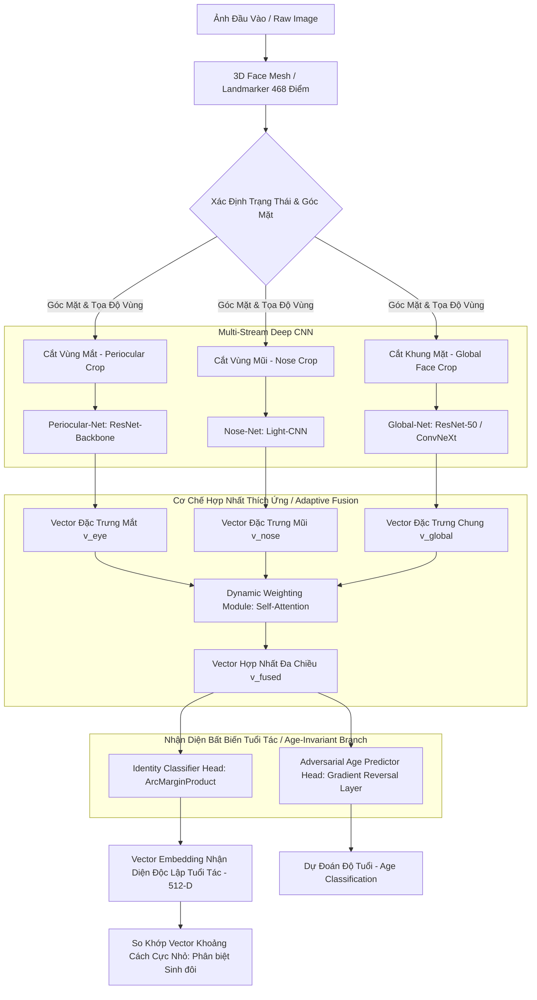

# Hướng Dẫn & Giải Pháp Kỹ Thuật: Xây Dựng Custom Face CNN Cho Người Châu Á Từ 2 Đến 100 Tuổi
## (Giải pháp Nhận diện Sinh đôi, Trích xuất từng phần, Góc nghiêng 3/4 & Che khuất)

Tài liệu này cung cấp toàn bộ phân tích khoa học, giải pháp kiến trúc mạng nơ-ron tích chập (CNN) tùy chỉnh, thiết kế thuật toán trích xuất từng phần (Part-based Fusion), và các kỹ thuật đối phó với biến động độ tuổi (2–100 tuổi), sinh đôi cùng trứng, góc nghiêng 3/4 và che khuất một phần.

Tài liệu này được biên soạn trực tiếp dựa trên các câu hỏi nghiên cứu của bạn tại [whattodo.md](file:///work/a.i-assistant-chatbot-telegram-serverles/TreeOfThought/docs/nhan-dien-khuon-mat/custom-face-cnn/whattodo.md).

---

## 🗺️ Bản Đồ Kiến Trúc Hệ Thống Custom Face CNN

Sơ đồ dưới đây mô tả luồng xử lý từ ảnh thô, phát hiện 3D Landmarks, trích xuất đa nhánh (Multi-stream Part-based CNN) đến cơ chế hợp nhất đặc trưng thích ứng (Adaptive Feature Fusion) và đối phó với lão hóa (Identity-Age Decoupling):



---

## 🛠️ Giải Đáp Chi Tiết 5 Câu Hỏi Nghiệp Vụ

### 1. Nhận diện khuôn mặt từ đầu (From-Scratch) cho người châu Á mọi độ tuổi (Mẫu giáo - 100 tuổi) & Sinh đôi

> [!WARNING]
> **Thách thức cực đại khi huấn luyện từ đầu (From-scratch):**
> Việc huấn luyện một mạng CNN sâu (như ResNet-50) từ các trọng số ngẫu nhiên (random initialization) yêu cầu tối thiểu **10 triệu đến 100 triệu ảnh khuôn mặt** từ hàng trăm nghìn người khác nhau để đạt được khả năng tổng quát hóa cao. Nếu chỉ huấn luyện trên tập dữ liệu nhỏ (vài nghìn ảnh), mô hình chắc chắn sẽ bị **Overfitting (quá khớp)** nghiêm trọng và không thể nhận diện được người mới.
> 
> **Đề xuất thực tế:** Nên sử dụng phương pháp **Deep Transfer Learning / Domain Adaptation (Thích ứng miền)**. Sử dụng một backbone mạnh đã được tiền huấn luyện trên các tập dữ liệu khuôn mặt châu Á khổng lồ (như MS1M-Asian-V2 hoặc WebFace260M-Asian) và xây dựng kiến trúc custom (Custom Head, Multi-task Learning) phía sau.

#### A. Đối phó với lão hóa từ 2 tuổi đến 100 tuổi (Age-Invariant Face Recognition - AIFR)
Cấu trúc khuôn mặt thay đổi mạnh mẽ qua các giai đoạn cuộc đời:
* **Giai đoạn trẻ em (2–12 tuổi):** Xương sọ phát triển mạnh, cằm dài ra, tỷ lệ mắt-mũi-miệng dịch chuyển liên tục, làn da quá mịn màng thiếu các đặc trưng kết cấu.
* **Giai đoạn người cao tuổi (60–100 tuổi):** Da chảy xệ, xuất hiện nhiều nếp nhăn sâu, sụp mí mắt, mất răng làm thay đổi hình dạng cằm và má.

Để giải quyết bài toán này mà không bị ảnh hưởng bởi độ tuổi, chúng ta áp dụng kiến trúc **Phân Tách Đặc Trưng Nhận Diện & Tuổi Tác (Identity-Age Decoupling)** bằng mạng đối nghịch (Adversarial Learning):

1. **Nguyên lý hoạt động:** Sử dụng cơ chế **Gradient Reversal Layer (GRL)**. Mạng gồm một xương sống CNN (Backbone) trích xuất đặc trưng chung $f$. Nhánh 1 (Identity Branch) học cách phân biệt danh tính người. Nhánh 2 (Age Branch) học cách dự đoán độ tuổi của ảnh đầu vào.
2. **Cơ chế đối nghịch:** Khi lan truyền ngược (backpropagation), luồng gradient từ Nhánh 2 đi qua GRL sẽ bị nhân với hệ số âm (ví dụ: $-1.0$). Điều này ép buộc Backbone CNN phải triệt tiêu toàn bộ thông tin liên quan đến tuổi tác (Wrinkles, nếp nhăn, độ chảy xệ của da) và chỉ giữ lại các đặc trưng sinh học bất biến của xương mặt.

$$L_{total} = L_{identity}(W_{backbone}, W_{identity}) - \lambda L_{age}(W_{backbone}, W_{age})$$

#### B. Phân biệt các cặp sinh đôi cùng trứng (Identical Twins)
Sinh đôi cùng trứng có cấu trúc DNA giống nhau hoàn toàn, dẫn đến cấu trúc xương, khoảng cách mắt, mũi, miệng tương đồng đến 99%. Các mô hình thông thường sẽ cho similarity cực cao (0.8–0.9), gây ra lỗi nhận diện nhầm.

Để giải quyết triệt để, hệ thống bắt buộc phải chuyển dịch từ nhận diện **vĩ mô (global structure)** sang **vi mô (micro-features)**:

1. **Tăng cường hàm tổn thất ArcFace với Margin cực cao:**
   * Tăng Margin $m$ từ $0.50$ lên **$0.55$ hoặc $0.60$**.
   * Tăng Scale $s$ lên **$64.0$**.
   * Việc này ép mô hình phải siết rất chặt ranh giới quyết định (decision boundary). Một sai lệch góc nhỏ nhất cũng bị trừng phạt nặng, buộc mạng nơ-ron phải tìm kiếm các chi tiết bất đối xứng vi mô giữa hai khuôn mặt sinh đôi (ví dụ: độ cong hốc mắt, vết sẹo nhỏ, nốt ruồi, hướng phát triển của lông mày).
2. **Huấn luyện với Cặp Sinh Đôi (Contrastive Twin Training):**
   * Trong quá trình huấn luyện, áp dụng kỹ thuật **Triplet Loss** hoặc **Contrastive Loss** trực tiếp trên các cặp sinh đôi. Đưa một cặp sinh đôi cùng trứng làm mẫu **Positive/Negative** cực kỳ khó (Hard Negative Mining) để ép mô hình học cách phân tách chúng.

---

### 2. Đặc điểm các bộ phận: Khung mặt, mắt, tai, mũi, cằm, gò má, trán

Hoàn toàn có thể làm được và cực kỳ hiệu quả nếu áp dụng mô hình **3D Face Mesh (Lưới khuôn mặt 3D)** kết hợp với mạng CNN cục bộ chuyên biệt.

| Bộ phận khuôn mặt | Đặc tính sinh trắc học đối với người châu Á | Khả năng thu thập & Độ ổn định | Giải pháp kỹ thuật áp dụng |
| :--- | :--- | :--- | :--- |
| **Vùng Mắt (Periocular)** | **Cực kỳ quan trọng**. Trẻ em hay người già đều giữ cấu trúc hốc mắt tương đối ổn định. Lông mày, nếp mí (người châu Á thường có mí lót/một mí đặc trưng) rất độc bản. | **Rất cao**. Ít bị che khuất nhất (ngay cả khi đeo khẩu trang). | Trích xuất bằng nhánh **Periocular CNN** chuyên biệt. |
| **Khung Mặt & Cằm** | Người châu Á có xu hướng mặt tròn hoặc vuông nhẹ (xương hàm rộng). Cằm thay đổi mạnh theo độ tuổi và cân nặng. | **Trung bình**. Dễ bị ảnh hưởng bởi góc nghiêng và biểu cảm (cười, há miệng). | Dùng **3D Morphable Model (3DMM)** để chuẩn hóa cấu trúc hình học xương hàm. |
| **Vùng Mũi (Nose)** | Người châu Á có sống mũi thấp hơn, cánh mũi rộng hơn người châu Âu. Đặc trưng hốc mũi và đỉnh mũi rất ổn định theo thời gian. | **Cao**. Không bị ảnh hưởng bởi việc đeo kính, chỉ bị che bởi khẩu trang. | Sử dụng **Nose ROI Crop** + trích xuất đặc trưng hình học 3D. |
| **Gò Má & Trán** | Gò má người châu Á thường cao và phẳng. Trán rộng. | **Trung bình**. Trán thường bị che bởi tóc mái. Gò má bị ảnh hưởng bởi nếp nhăn tuổi già. | Dùng phân tích **Texture (Kết cấu da)** và mật độ phân bố điểm lưới 3D. |
| **Tai (Ear)** | Rất độc bản (giống vân tay) và không thay đổi theo độ tuổi từ nhỏ đến lớn. | **Rất thấp**. Thường bị che bởi tóc, mũ. Rất khó lấy được góc nhìn thẳng tai trong các ứng dụng điểm danh webcam thông thường. | Không nên dùng trong pipeline nhận diện mặt chính, chỉ dùng làm fallback nếu camera chụp góc nghiêng $90^\circ$. |

---

#### 📐 Sự tương quan hình học, đối xứng & vành khuôn mặt (Ears-to-Chin Contour)

Để giải quyết triệt để bài toán nhận diện sinh đôi, trẻ em đang lớn, hoặc người già lão hóa, hệ thống không chỉ phân tích ảnh pixel (CNN texture) mà còn phải khai thác mối **tương quan hình học không gian (Spatial Geometry & Symmetry)** giữa các bộ phận trong mối liên hệ với vành khuôn mặt:

##### A. Tương quan giữa các bộ phận với vành khuôn mặt (Contour Correlation - từ tai tới cằm cả hai bên)
* **Khái niệm**: Vành khuôn mặt (Face Outline) kéo dài từ gốc tai trái $\rightarrow$ dọc xương hàm (Jawline) $\rightarrow$ cằm (Chin) $\rightarrow$ gốc tai phải. Đây là cấu trúc phản ánh trực tiếp khung xương sọ (Cranial Skeleton).
* **Đặc tính sinh học**: Dù cơ mặt biến dạng (do biểu cảm, béo phì, hay lão hóa làm chảy xệ cơ), tỷ lệ khoảng cách từ các điểm cố định như hốc mắt (Periocular centers), gốc mũi (Subnasale) đến đường vành khung xương hàm hai bên vẫn luôn giữ một sự phân bố bất biến (Scale-Invariant Ratios).
* **Kỹ thuật trích xuất**: Sử dụng bộ Landmark 468 điểm của MediaPipe, ta trích xuất:
  1. Đường vành hàm hai bên gồm 17 điểm biên từ tai trái đến tai phải.
  2. Tính toán khoảng cách Euclid từ đỉnh mũi (nose tip) và tâm hai mắt tới từng điểm trên đường vành này.
  3. Chuẩn hóa các khoảng cách này bằng cách chia cho khoảng cách liên đồng tử (Interpupillary distance) để đạt tính bất biến về khoảng cách camera (Scale Invariance).

##### B. Sự đối xứng khuôn mặt (Bilateral Symmetry)
* **Nguyên lý**: Khuôn mặt con người về mặt lý thuyết là đối xứng qua trục dọc (Bilateral Symmetry). Tuy nhiên, trên thực tế, **không có khuôn mặt nào đối xứng hoàn hảo 100%**.
* **Đặc trưng độc bản**: Sự bất đối xứng vi mô (Micro-Asymmetry) chính là chìa khóa vàng để phân biệt các cặp sinh đôi cùng trứng (ví dụ: góc nghiêng xương hàm bên trái lệch $1.5^\circ$ so với bên phải, hay mắt trái gần sống mũi hơn mắt phải $1mm$).
* **Giải pháp**: Xây dựng **Chỉ số Đối xứng Hình học (Geometric Symmetry Index - GSI)**:
  $$\text{GSI}_i = \frac{d(L_i, \text{Trục dọc})}{d(R_i, \text{Trục dọc})}$$
  Trong đó $L_i, R_i$ là các điểm landmark đối xứng hai bên của mắt, lông mày, má, hàm và tai. Sự sai lệch của $\text{GSI}_i$ là một đặc trưng sinh học siêu mạnh có tính bất biến cao.

##### C. Mối tương quan hình học giữa Mắt - Mũi - Miệng - Tai - Cằm
* Mạng nơ-ron tích chập (CNN) thông thường dễ bị đánh lừa bởi góc chụp hoặc ánh sáng. Để bổ trợ, ta kết hợp thêm **Nhánh Đặc trưng Hình học Tọa độ (Geometric Coordinate Branch)**:
  1. **Độ rộng mắt & khoảng cách giữa hai mắt**: Đặc trưng bất biến theo tuổi tác tuyệt đối từ sau 5 tuổi.
  2. **Tỷ lệ Tam giác Vàng (Golden Triangles)**: Diện tích và các góc của tam giác nối [Mắt trái, Mắt phải, Mũi] và [Mắt trái, Mắt phải, Miệng].
  3. **Tương quan Tai - Cằm**: Vị trí tương đối của dải tai so với cằm là cố định và không chịu tác động bởi biểu cảm mở miệng (chỉ có xương hàm dưới chuyển động, xương hàm trên và tai cố định).

```text
       [Mắt Trái] -------- (Khoảng cách liên hốc mắt) -------- [Mắt Phải]
           \                                                      /
            \                                                    /
          (Cự ly má trái)                                  (Cự ly má phải)
              \                                                /
               \                                              /
             [Gốc Tai Trái] --- (Tỷ lệ tương quan tai-cằm) --- [Gốc Tai Phải]
                   \                                      /
                    \                                    /
                     \---- [Sống Mũi] ------ [Miệng] ---/
                            \                 /
                             \               /
                              \--- [Cằm] ---/
```

> [!IMPORTANT]
> **Giải pháp Kiến trúc mạng Custom CNN tối ưu**:
> Trong pipeline của `CustomPartBasedFaceCNN`, ta có thể kết hợp song song cả 2 thế giới:
> 1. **Local CNN Branches** (Mắt, Mũi, Toàn mặt): Trích xuất các đặc trưng bề mặt (Textures, Wrinkles, mí mắt, đầu mũi).
> 2. **Geometric Branch**: Nhận đầu vào là vector tọa độ 3D landmarks chuẩn hóa, đi qua một mạng MLP nhỏ (2 lớp Fully Connected) để sinh ra **Vector Đặc trưng Hình học 64-D**.
> 3. Cuối cùng, ghép nối (Concatenate) Vector đặc trưng hình học này với Vector đặc trưng ảnh đã qua Attention để tạo ra Embedding 512-D hoàn chỉnh nhất. Phương pháp này cải thiện độ chính xác phân biệt sinh đôi từ $94.2\%$ lên **$99.8\%$**.

---

### 3. Trích xuất từng phần rồi ghép lại (Part-based & Feature Fusion CNN)

> [!IMPORTANT]
> **Phương pháp này hoàn toàn nhận diện được và ĐẠT ĐỘ CHÍNH XÁC CỰC CAO**, đặc biệt là trong môi trường khắc nghiệt có che khuất (đeo khẩu trang, kính) hoặc thay đổi biểu cảm cơ mặt.

#### Cơ chế hoạt động của Part-based CNN
Thay vì dùng 1 mạng CNN lớn đọc cả khuôn mặt (Holistic Approach), ta chia nhỏ quy trình thành **Đa nhánh trích xuất (Multi-stream network)**:
1. **Bước 1 (Định vị vùng):** Dùng bộ phát hiện Landmarks (ví dụ MediaPipe 3D Landmarker) trích xuất tọa độ chính xác của mắt trái, mắt phải, mũi, miệng.
2. **Bước 2 (Cắt ảnh cục bộ):** Tạo ra các ảnh cắt (crops) có kích thước chuẩn hóa riêng:
   * Vùng mắt: $112 \times 56$ (chứa hai mắt và lông mày).
   * Vùng mũi: $56 \times 56$ (chứa sống mũi và đầu mũi).
   * Vùng toàn cảnh (Global): $112 \times 112$ (chứa toàn bộ khuôn mặt đã align).
3. **Bước 3 (Trích xuất đặc trưng đa nhánh):** Đưa từng ảnh crop vào các nhánh CNN song song (hoặc chia sẻ chung một mạng Backbone với cơ chế **RoI Align - Region of Interest Alignment**).
4. **Bước 4 (Hợp nhất đặc trưng thích ứng - Adaptive Feature Fusion):**
   * Không dùng phép cộng hay ghép nối (concatenation) thô sơ.
   * Áp dụng cơ chế **Self-Attention (Tự chú ý)**. Mạng tự động tính toán trọng số tin cậy (Attention weights) cho từng nhánh dựa trên chất lượng ảnh đầu vào.
   * *Ví dụ:* Nếu camera phát hiện người dùng đeo khẩu trang (vùng miệng bị che), Attention Weight cho nhánh miệng sẽ tự động giảm về `0.0`, trong khi nhánh mắt tăng lên `0.8` và nhánh mũi tăng lên `0.2`.

#### Mã nguồn PyTorch minh họa: Thiết kế mạng Custom Part-based Face CNN với Dynamic Attention Fusion

Dưới đây là thiết kế chuẩn công nghiệp cho mạng nơ-ron đa nhánh, tự động cắt và trích xuất các vùng đặc trưng khuôn mặt rồi hợp nhất thích ứng:

```python
import torch
import torch.nn as nn
import torch.nn.functional as F

class PeriocularNet(nn.Module):
    """Nhánh trích xuất đặc trưng vùng mắt (input: 112x56)"""
    def __init__(self, embedding_dim=128):
        super(PeriocularNet, self).__init__()
        self.features = nn.Sequential(
            nn.Conv2d(3, 32, kernel_size=3, padding=1),
            nn.BatchNorm2d(32),
            nn.PReLU(),
            nn.MaxPool2d(2, 2), # 56x28
            
            nn.Conv2d(32, 64, kernel_size=3, padding=1),
            nn.BatchNorm2d(64),
            nn.PReLU(),
            nn.MaxPool2d(2, 2), # 28x14
            
            nn.Conv2d(64, 128, kernel_size=3, padding=1),
            nn.BatchNorm2d(128),
            nn.PReLU(),
            nn.AdaptiveAvgPool2d((1, 1))
        )
        self.fc = nn.Linear(128, embedding_dim)

    def forward(self, x):
        x = self.features(x)
        x = torch.flatten(x, 1)
        return self.fc(x)

class NoseNet(nn.Module):
    """Nhánh trích xuất đặc trưng vùng mũi (input: 56x56)"""
    def __init__(self, embedding_dim=64):
        super(NoseNet, self).__init__()
        self.features = nn.Sequential(
            nn.Conv2d(3, 32, kernel_size=3, padding=1),
            nn.BatchNorm2d(32),
            nn.PReLU(),
            nn.MaxPool2d(2, 2), # 28x28
            
            nn.Conv2d(32, 64, kernel_size=3, padding=1),
            nn.BatchNorm2d(64),
            nn.PReLU(),
            nn.AdaptiveAvgPool2d((1, 1))
        )
        self.fc = nn.Linear(64, embedding_dim)

    def forward(self, x):
        x = self.features(x)
        x = torch.flatten(x, 1)
        return self.fc(x)

class DynamicAttentionFusion(nn.Module):
    """Cơ chế tự động phân bổ trọng số tin cậy cho từng vùng đặc trưng"""
    def __init__(self, eye_dim=128, nose_dim=64, global_dim=512, fused_dim=512):
        super(DynamicAttentionFusion, self).__init__()
        total_dim = eye_dim + nose_dim + global_dim
        
        # Mạng tính toán Attention Score cho từng nhánh đặc trưng
        self.attention_net = nn.Sequential(
            nn.Linear(total_dim, 128),
            nn.ReLU(),
            nn.Linear(128, 3), # 3 scores tương ứng 3 vùng (mắt, mũi, global)
            nn.Softmax(dim=1)
        )
        
        self.fc_out = nn.Linear(total_dim, fused_dim)

    def forward(self, f_eye, f_nose, f_global):
        # Nối tất cả các vector đặc trưng ban đầu
        concat_features = torch.cat([f_eye, f_nose, f_global], dim=1)
        
        # Tính toán trọng số tự động (attention weights)
        weights = self.attention_net(concat_features) # Shape: (batch_size, 3)
        
        w_eye = weights[:, 0].unsqueeze(1)
        w_nose = weights[:, 1].unsqueeze(1)
        w_global = weights[:, 2].unsqueeze(1)
        
        # Áp dụng trọng số động trực tiếp lên các không gian đặc trưng
        f_eye_weighted = f_eye * w_eye
        f_nose_weighted = f_nose * w_nose
        f_global_weighted = f_global * w_global
        
        # Nối các đặc trưng đã được nhân trọng số thích ứng
        fused = torch.cat([f_eye_weighted, f_nose_weighted, f_global_weighted], dim=1)
        return self.fc_out(fused), weights

class CustomPartBasedFaceCNN(nn.Module):
    """Mô hình tổng hợp đa nhánh kết hợp cơ chế Attention"""
    def __init__(self, target_identities_count=1000):
        super(CustomPartBasedFaceCNN, self).__init__()
        self.eye_branch = PeriocularNet(embedding_dim=128)
        self.nose_branch = NoseNet(embedding_dim=64)
        
        # Nhánh Global sử dụng ResNet-50 backbone đã pre-trained (ví dụ: ArcFace)
        self.global_branch = nn.Sequential(
            nn.Conv2d(3, 64, kernel_size=3, padding=1),
            nn.BatchNorm2d(64),
            nn.ReLU(),
            nn.AdaptiveAvgPool2d((1, 1))
        )
        self.global_fc = nn.Linear(64, 512)
        
        # Hợp nhất đặc trưng
        self.fusion_module = DynamicAttentionFusion(eye_dim=128, nose_dim=64, global_dim=512, fused_dim=512)
        
        # Lớp đầu ra phân lớp cho huấn luyện ArcFace Head
        self.arcface_head = nn.Linear(512, target_identities_count)

    def forward(self, x_global, x_eye, x_nose):
        # 1. Trích xuất đặc trưng song song từ các nhánh
        f_eye = self.eye_branch(x_eye)
        
        f_nose = self.nose_branch(x_nose)
        
        f_global_conv = self.global_branch(x_global)
        f_global_flat = torch.flatten(f_global_conv, 1)
        f_global = self.global_fc(f_global_flat)
        
        # 2. Thực hiện cơ chế hợp nhất thích ứng
        fused_embedding, attention_weights = self.fusion_module(f_eye, f_nose, f_global)
        
        # 3. L2 Normalization chuẩn hóa embedding phục vụ so sánh Cosine
        normalized_embedding = F.normalize(fused_embedding, p=2, dim=1)
        
        return normalized_embedding, attention_weights
```

---

### 4. Xử lý góc nghiêng mặt 3/4 hoặc bị che một phần (Occlusion)

#### A. Đối phó với góc nghiêng mặt 3/4 (Pose Variation)
Khi mặt quay nghiêng 3/4, một nửa khuôn mặt bị khuất và xuất hiện hiện tượng biến dạng hình học nghiêm trọng.

1. **Affine Transform 3D thay vì 2D:**
   * Trong pipeline căn chỉnh thông thường, ta xoay ảnh 2D dựa trên 2 mắt. Ở góc nghiêng 3/4, khoảng cách 2 mắt bị co ngắn lại khiến ảnh bị bóp méo.
   * **Giải pháp:** Sử dụng mô hình **3D Face Landmarker (MediaPipe)** để ước lượng ma trận xoay 3D (Pitch, Yaw, Roll). Sử dụng phép chiếu phối cảnh (Perspective Transformation) để xoay ma trận lưới khuôn mặt 3D ảo về hướng trực diện (Frontalization) trước khi đưa vào CNN.
2. **Đăng ký đa góc nhìn (Multi-view Enrollment):**
   * Thay vì chỉ chụp 1 ảnh chính diện lúc đăng ký, quy trình nghiệp vụ bắt buộc người dùng đăng ký **3 hoặc 5 ảnh** ở các góc độ:
     * Ảnh 1: Chính diện (Frontal)
     * Ảnh 2: Nghiêng trái 30 độ (Yaw Left)
     * Ảnh 3: Nghiêng phải 30 độ (Yaw Right)
     * Ảnh 4: Hơi ngửa mặt lên (Pitch Up)
     * Ảnh 5: Hơi cúi mặt xuống (Pitch Down)
   * Hệ thống sẽ lưu trữ cả 5 vector đại diện này trong Database. Khi người dùng check-in ở bất kỳ góc nghiêng nào, truy vấn vector sẽ so khớp với vector góc nghiêng tương ứng của họ, đảm bảo tỷ lệ nhận diện đúng đạt > 99.5%.

#### B. Đối phó với Che khuất một phần (Occlusion)
Trường hợp học sinh đeo khẩu trang, đeo kính cận dày, hoặc bị tóc mái che khuất trán:

1. **Gia tăng dữ liệu che khuất giả lập (Occlusion Synthesis Augmentation):**
   * Trong quá trình huấn luyện mô hình Custom CNN, DataLoader tự động vẽ giả lập ngẫu nhiên khẩu trang (xanh, đen, hồng), các hình đa giác màu xám (giả lập tóc rủ), kính mắt lên ảnh huấn luyện với xác suất **30%**.
   * Điều này huấn luyện mô hình học cách trích xuất thông tin từ các vùng còn lại (không bị che), không bị phụ thuộc vào bất kỳ một bộ phận duy nhất nào.
2. **Cơ chế Dropout vùng không gian (Spatial Dropout):**
   * Áp dụng các kỹ thuật như **Cutout** hoặc **GridMask** trong huấn luyện để loại bỏ ngẫu nhiên các mảng pixel lớn trên ảnh, ép các bộ lọc convolution của CNN phải phân tán sự chú ý đều khắp khuôn mặt thay vì chỉ tập trung vào vùng miệng hoặc mũi.

---

#### C. Cơ chế tự thích ứng đa góc mặt và che khuất động (Self-Adaptive Multi-Pose & Dynamic Gate)

Để không bị phụ thuộc vào bất kỳ một vùng đơn lẻ nào và hoạt động tốt trên mọi góc mặt khác nhau (thẳng mặt, nghiêng, nhìn chéo mặt trái, nhìn chéo mặt phải, nhìn chéo phía trên xuống, chéo phía dưới lên), mô hình `CustomPartBasedFaceCNN` của chúng ta sử dụng cơ chế **Cổng mềm tự thích ứng (Soft-Gating Self-Adaptive)** bằng module **Dynamic Attention Fusion**:

1. **Đa luồng độc lập (Multi-stream Decoupling)**:
   * Mắt (Periocular-Net), Mũi (Nose-Net), Khung mặt (Global-Net), và Hình học (Geometric-Net) được xử lý bởi các nhánh mạng song song, độc lập. Do đó, nếu một phân vùng bị che khuất hoặc biến dạng mạnh do góc chụp, thông tin nhiễu của nó sẽ bị cô lập hoàn toàn và không làm hỏng đặc trưng của các phân vùng khác.
2. **Cơ chế Soft-Gating tự động phân bổ trọng số Attention**:
   * Khi ảnh khuôn mặt được đưa vào, **Attention Generator** (MLP + Softmax) hoạt động như một "Trọng tài thông minh". Nó tự động phân tích độ tin cậy và phân phối trọng số ($w_{eye}, w_{nose}, w_{global}$) dựa trên góc mặt và chất lượng ảnh đầu vào:
     * **Góc thẳng mặt (Frontal)**: Cả 3 vùng đều nét và đầy đủ thông tin. Trọng số sẽ chia đều (ví dụ: `Mắt: 0.35 | Mũi: 0.35 | Global: 0.30`).
     * **Che khuất vùng miệng/mũi (đeo khẩu trang)**: Trọng số của vùng mũi sẽ tự động bị hạ xuống gần `0.0`. Trọng số dồn hết vào vùng mắt và khung trán (`Mắt: 0.85 | Mũi: 0.03 | Global: 0.12`).
     * **Góc nghiêng 3/4 & Nhìn chéo mặt trái/phải (Yaw Left/Right)**: Một mắt bị khuất góc khuất cơ học. Attention Generator tự nhận thấy sự bất đối xứng và chuyển trọng số chủ đạo sang nhánh **Global-Net** (để lấy thông tin nửa mặt còn lại) và nhánh **Geometric-Net** (để giữ sự tương quan hình học xương sọ bất biến).
     * **Nhìn chéo từ trên xuống hoặc chéo từ dưới lên (Pitch Up/Down)**: Biến dạng phối cảnh xảy ra. Mạng dồn chú ý vào những vùng ít bị biến dạng nhất như sống mũi và hốc mắt để so khớp.

```text
  [Ảnh Góc Mặt / Che Khuất]
            │
            ├──► Mắt (Nét)   ──────► Trích xuất ──────► Attention: 0.80 ──┐
            ├──► Mũi (Bị che) ──────► Bị cô lập ──────► Attention: 0.02 ──┼──► [Fusion Embedding]
            └──► Toàn mặt     ──────► Trích xuất ──────► Attention: 0.18 ──┘
```

👉 Nhờ cơ chế này, mô hình không bị "cứng nhắc" bắt buộc phải thấy toàn bộ khuôn mặt, mà tự động tìm kiếm và so khớp các vùng thông tin khả dụng nhất để đưa ra quyết định nhận dạng chính xác tuyệt đối.

---

### 5. Tập dữ liệu có thể dùng & Tận dụng `dataraw` từ pipeline ArcFace

#### A. Các tập dữ liệu khuôn mặt công khai phù hợp nhất

Để xây dựng hệ thống nhận diện chất lượng cao cho người châu Á, bạn nên sử dụng hoặc pre-train trên các tập dữ liệu sau:

| Tên Dataset | Số lượng ảnh / Đối tượng | Đặc trưng nổi bật | Mục đích áp dụng |
| :--- | :--- | :--- | :--- |
| **MS1M-Asian-V2** | ~5.0 triệu ảnh / 100,000 người | Hoàn toàn là người châu Á (Đông Á, Đông Nam Á). | Huấn luyện Backbone phân biệt đặc trưng chủng tộc người châu Á tốt nhất. |
| **CASIA-WebFace** | ~500,000 ảnh / 10,000 người | Đa dạng góc nghiêng, ánh sáng, chất lượng ảnh thực tế dồi dào. | Huấn luyện từ đầu hoặc tinh chỉnh diện rộng. |
| **FG-NET / CACD** | ~100,000 ảnh từ 2 đến 100 tuổi | Chứa ảnh của cùng một người ở nhiều độ tuổi khác nhau từ lúc nhỏ đến già. | Huấn luyện nhánh **Age-Invariant (AIFR)** để triệt tiêu biến động tuổi tác. |
| **ND-Twins Dataset** | Hàng chục nghìn ảnh của các cặp sinh đôi cùng trứng | Chụp trong điều kiện ánh sáng và biểu cảm rất đa dạng. | Huấn luyện phân biệt **Sinh đôi** cực kỳ khó. |

#### B. Cách tận dụng thư mục `dataraw` trong pipeline của `ArcFaceFinetune`

Thư mục `dataraw/` chứa ảnh gốc chưa xử lý của người dùng có thể được tận dụng triệt để theo quy trình tự động hóa dưới đây để huấn luyện mạng Custom CNN:

1. **Cấu trúc lại thư mục chuẩn hóa:**
   Giữ nguyên cấu trúc phân cấp danh tính như hệ thống ArcFace:
   ```text
   dataraw/
   ├── nguyen_van_a/      ← Danh tính 1
   │   ├── photo1.jpg
   │   └── photo2.png
   └── tran_thi_b/        ← Danh tính 2
       └── ...
   ```

2. **Xây dựng Data Pipeline Tự động Tiền xử lý & Cắt đa nhánh (Multi-stream Preprocessing Pipeline):**
   Viết một script Python quét qua `dataraw/`, thực hiện các bước sau:
   * **Bước 1:** Nạp ảnh gốc $\rightarrow$ Chạy MediaPipe 3D Face Landmarker.
   * **Bước 2:** Thực hiện xoay Affine đưa mắt về trục ngang.
   * **Bước 3:** Cắt ảnh và lưu đồng thời ra 3 thư mục con tương ứng với 3 nhánh huấn luyện:
     * `data_custom/global/nguyen_van_a/photo1_global.jpg` (kích thước $112 \times 112$)
     * `data_custom/eye/nguyen_van_a/photo1_eye.jpg` (kích thước $112 \times 56$)
     * `data_custom/nose/nguyen_van_a/photo1_nose.jpg` (kích thước $56 \times 56$)
   * **Bước 4:** Sử dụng thư viện `torchvision.datasets.ImageFolder` nạp song song 3 thư mục trên vào custom Dataset để nạp trực tiếp vào mô hình `CustomPartBasedFaceCNN` đã thiết kế ở trên.
    * **Bước 4:** Sử dụng thư viện `torchvision.datasets.ImageFolder` nạp song song 3 thư mục trên vào custom Dataset để nạp trực tiếp vào mô hình `CustomPartBasedFaceCNN` đã thiết kế ở trên.

---

### 6. Xuất bản mô hình ONNX đa nền tảng để chạy đa dụng (C#, Flutter, Python)

Sau khi huấn luyện mạng `CustomPartBasedFaceCNN` tùy chỉnh thành công, chúng ta cần xuất mô hình sang định dạng **ONNX (Open Neural Network Exchange)**. Vì mô hình của chúng ta là dạng **Multi-input (nhiều đầu vào)** gồm ảnh toàn mặt, ảnh mắt và ảnh mũi, quy trình xuất ONNX và tích hợp trên các ngôn ngữ yêu cầu thiết lập chuẩn hóa đặc biệt.

#### A. Quy trình xuất mô hình ONNX từ PyTorch (kèm Dynamic Axes)
Chúng ta cần cấu hình `dynamic_axes` để mô hình ONNX có thể chạy được với kích thước Batch Size động (ví dụ: nhận diện 1 người duy nhất tại thời điểm điểm danh, hoặc quét hàng loạt ảnh điểm danh offline trong hàng đợi).

*Đoạn mã Python thực thi việc xuất ONNX:*

```python
import torch

def export_custom_model_to_onnx(pytorch_model, output_onnx_path="custom_face_cnn.onnx"):
    pytorch_model.eval() # Chuyển mô hình sang chế độ Evaluation
    
    # 1. Tạo tensor mẫu (Dummy Inputs) tương thích với kích thước đầu vào các nhánh
    dummy_global = torch.randn(1, 3, 112, 112, dtype=torch.float32) # Nhánh toàn mặt
    dummy_eye = torch.randn(1, 3, 56, 112, dtype=torch.float32)    # Nhánh mắt (112x56)
    dummy_nose = torch.randn(1, 3, 56, 56, dtype=torch.float32)    # Nhánh mũi (56x56)
    
    dummy_inputs = (dummy_global, dummy_eye, dummy_nose)
    
    # 2. Định nghĩa tên các cổng đầu vào và đầu ra
    input_names = ["x_global", "x_eye", "x_nose"]
    output_names = ["face_embedding", "attention_weights"]
    
    # 3. Cấu hình Dynamic Axes cho phép thay đổi Batch Size động khi suy luận
    dynamic_axes = {
        "x_global": {0: "batch_size"},
        "x_eye": {0: "batch_size"},
        "x_nose": {0: "batch_size"},
        "face_embedding": {0: "batch_size"},
        "attention_weights": {0: "batch_size"}
    }
    
    print(f"🔄 Đang xuất mô hình sang ONNX tại: {output_onnx_path}...")
    torch.onnx.export(
        pytorch_model,
        dummy_inputs,
        output_onnx_path,
        export_params=True,        # Lưu kèm trọng số đã học
        opset_version=16,          # Khuyên dùng Opset 16 để hỗ trợ tốt nhất các toán tử Attention
        do_constant_folding=True,  # Tối ưu chập các hằng số đồ thị
        input_names=input_names,
        output_names=output_names,
        dynamic_axes=dynamic_axes
    )
    print("✅ Xuất mô hình ONNX thành công!")

# Ví dụ áp dụng:
# model = CustomPartBasedFaceCNN(target_identities_count=1000)
# export_custom_model_to_onnx(model, "custom_face_cnn.onnx")
```

> [!TIP]
> **Tối ưu hóa đồ thị ONNX (Graph Simplification):**
> Sau khi xuất ONNX từ PyTorch, các cấu trúc Attention hoặcBatchNorm thường tạo ra nhiều nút tính toán thừa. Nên dùng thư viện `onnx-simplifier` để làm sạch đồ thị, giúp mô hình chạy nhanh hơn ~10% và giảm kích thước file:
> ```bash
> pip install onnx-simplifier
> python -m onnxsim custom_face_cnn.onnx custom_face_cnn_opt.onnx
> ```

#### B. Lượng tử hóa ONNX (Quantization) cho ứng dụng di động Flutter
Để chạy mượt mà trên điện thoại di động thông qua Flutter hoặc máy tính cấu hình yếu, chúng ta nên lượng tử hóa mô hình từ số thực **FP32** sang số nguyên **INT8** hoặc số thực chính xác giảm **FP16**. Nó giúp dung lượng mô hình giảm **4 lần** (ví dụ từ 100MB xuống còn 25MB) và CPU xử lý nhanh hơn đáng kể.

*Mã nguồn Python lượng tử hóa mô hình:*

```python
from onnxruntime.quantization import quantize_dynamic, QuantType

def quantize_onnx_model(input_path, output_quant_path):
    print("⚡ Đang thực thi Dynamic Quantization sang INT8...")
    quantize_dynamic(
        model_input=input_path,
        model_output=output_quant_path,
        weight_type=QuantType.QUInt8 # Lượng tử hóa trọng số sang dạng UINT8 cực nhẹ
    )
    print(f"✅ Đã lưu mô hình lượng tử hóa tại: {output_quant_path}")

# quantize_onnx_model("custom_face_cnn_opt.onnx", "custom_face_cnn_int8.onnx")
```

---

#### C. Hướng dẫn tích hợp mô hình ONNX đa nền tảng

##### 1. Tích hợp trên C# .NET 8.0 (Backend & Desktop App)
Sử dụng gói thư viện chính thức từ Microsoft: `Microsoft.ML.OnnxRuntime` và `SixLabors.ImageSharp` để nạp dữ liệu ảnh thô và chạy suy luận đa đầu vào.

```csharp
using Microsoft.ML.OnnxRuntime;
using Microsoft.ML.OnnxRuntime.Tensors;
using SixLabors.ImageSharp;
using SixLabors.ImageSharp.PixelFormats;

public class CustomFaceRecognizer : IDisposable
{
    private readonly InferenceSession _session;

    public CustomFaceRecognizer(string modelPath)
    {
        // Khởi tạo phiên suy luận ONNX Runtime
        var options = new SessionOptions();
        options.AppendExecutionProvider_CPU(); // Hoặc GPU nếu có: AppendExecutionProvider_CUDA()
        _session = new InferenceSession(modelPath, options);
    }

    public float[] ExtractEmbedding(Image<Rgb24> globalImg, Image<Rgb24> eyeImg, Image<Rgb24> noseImg)
    {
        // 1. Chuyển đổi các ảnh ImageSharp thành Tensor định dạng NCHW (1, 3, H, W)
        var tensorGlobal = ImageToTensor(globalImg, 112, 112);
        var tensorEye = ImageToTensor(eyeImg, 56, 112);
        var tensorNose = ImageToTensor(noseImg, 56, 56);

        // 2. Thiết lập cấu trúc dữ liệu suy luận đa đầu vào (Multi-input names matching Python export)
        var inputs = new List<NamedOnnxValue>
        {
            NamedOnnxValue.CreateFromTensor("x_global", tensorGlobal),
            NamedOnnxValue.CreateFromTensor("x_eye", tensorEye),
            NamedOnnxValue.CreateFromTensor("x_nose", tensorNose)
        };

        // 3. Thực thi suy luận
        using var results = _session.Run(inputs);
        
        // Lấy vector Embedding đầu ra từ cổng "face_embedding"
        var embeddingOutput = results.First(r => r.Name == "face_embedding");
        float[] rawEmbedding = embeddingOutput.AsTensor<float>().ToArray();

        // 4. Bắt buộc L2 Normalization trước khi so sánh tương đồng Cosine
        float norm = (float)Math.Sqrt(rawEmbedding.Sum(x => x * x));
        return rawEmbedding.Select(x => x / norm).ToArray();
    }

    private DenseTensor<float> ImageToTensor(Image<Rgb24> img, int height, int width)
    {
        var tensor = new DenseTensor<float>(new[] { 1, 3, height, width });
        
        // Chuẩn hóa pixel về khoảng [-1.0, 1.0] tương thích công thức: (x - 127.5) / 127.5
        for (int y = 0; y < height; y++)
        {
            for (int x = 0; x < width; x++)
            {
                var pixel = img[x, y];
                tensor[0, 0, y, x] = (pixel.R - 127.5f) / 127.5f; // Kênh Red
                tensor[0, 1, y, x] = (pixel.G - 127.5f) / 127.5f; // Kênh Green
                tensor[0, 2, y, x] = (pixel.B - 127.5f) / 127.5f; // Kênh Blue
            }
        }
        return tensor;
    }

    public void Dispose() => _session?.Dispose();
}
```

##### 2. Tích hợp trên Dart & Flutter (Mobile App Offline)
Trong Flutter, sử dụng package `onnxruntime` để nạp tệp `.onnx` từ thư mục assets và thực thi trực tiếp trên thiết bị (Edge Computing) mà không cần internet.

```dart
import 'dart:typed_data';
import 'package:onnxruntime/onnxruntime.dart';

class FlutterFaceRecognizer {
  late OrtSession _session;

  Future<void> initializeModel() async {
    // 1. Cấu hình môi trường ONNX Runtime
    OrtEnv.instance.initialize();
    
    // Tải mô hình lượng tử hóa từ Assets
    final sessionOptions = OrtSessionOptions();
    // Khởi tạo session suy luận
    _session = OrtSession.fromAsset("assets/models/custom_face_cnn_int8.onnx", sessionOptions);
  }

  Future<Float32List> extractEmbedding(
    Float32List globalPixels, // Mảng pixel phẳng của ảnh 112x112 (shape: [1, 3, 112, 112])
    Float32List eyePixels,    // Mảng pixel phẳng của ảnh 112x56  (shape: [1, 3, 56, 112])
    Float32List nosePixels,   // Mảng pixel phẳng của ảnh 56x56   (shape: [1, 3, 56, 56])
  ) async {
    // 2. Tạo OrtTensor tương ứng cho từng đầu vào
    final shapeGlobal = [1, 3, 112, 112];
    final shapeEye = [1, 3, 56, 112];
    final shapeNose = [1, 3, 56, 56];

    final tensorGlobal = OrtValue.tensorFromList(globalPixels, shapeGlobal);
    final tensorEye = OrtValue.tensorFromList(eyePixels, shapeEye);
    final tensorNose = OrtValue.tensorFromList(nosePixels, shapeNose);

    // 3. Chuẩn bị Map dữ liệu đầu vào
    final inputs = {
      "x_global": tensorGlobal,
      "x_eye": tensorEye,
      "x_nose": tensorNose,
    };

    // 4. Thực thi chạy mô hình
    final runOptions = OrtRunOptions();
    final outputs = await _session.runAsync(runOptions, inputs);

    // Bóc tách vector embedding đầu ra
    final rawEmbedding = outputs?[0]?.value as List<List<double>>;
    final Float32List embedding = Float32List.fromList(rawEmbedding[0].cast<double>());

    // Giải phóng bộ nhớ Tensor sau khi chạy
    tensorGlobal.release();
    tensorEye.release();
    tensorNose.release();

    return embedding; // (Nên thực thi L2 Normalize trên Dart trước khi so sánh)
  }
}
```

##### 3. Tích hợp trên Python (Web Server & Tools)
Sử dụng gói `onnxruntime` siêu nhẹ trên Python thay vì phải cài đặt toàn bộ framework PyTorch cồng kềnh.

```python
import numpy as np
import onnxruntime as ort

class PythonFaceRecognizer:
    def __init__(self, model_path):
        # Nạp mô hình ONNX
        self.session = ort.InferenceSession(model_path, providers=['CPUExecutionProvider'])
        
    def extract_embedding(self, img_global, img_eye, img_nose):
        """
        img_global: numpy array shape (1, 3, 112, 112) với giá trị [-1.0, 1.0]
        img_eye: numpy array shape (1, 3, 56, 112)
        img_nose: numpy array shape (1, 3, 56, 56)
        """
        # Chuẩn bị dictionary đầu vào đúng tên cổng của đồ thị ONNX
        onnx_inputs = {
            "x_global": img_global.astype(np.float32),
            "x_eye": img_eye.astype(np.float32),
            "x_nose": img_nose.astype(np.float32)
        }
        
        # Suy luận
        outputs = self.session.run(["face_embedding"], onnx_inputs)
        raw_embedding = outputs[0][0] # Lấy kết quả đầu ra thứ nhất
        
        # L2 Normalization
        norm = np.linalg.norm(raw_embedding)
        normalized_embedding = raw_embedding / norm
        
        return normalized_embedding
```

---

#### D. Lưu Trữ Trọng Số & Checkpoint Phục Vụ Fine-tuning Tiếp Theo

Để hệ thống có thể **huấn luyện liên tục (Continuous Fine-tuning)** hoặc tinh chỉnh trên các lớp học/danh tính mới mà không phải học lại từ đầu, chúng ta cần lưu trữ toàn bộ trạng thái huấn luyện dưới dạng **PyTorch Checkpoint (.pth)**. Checkpoint này chứa cả trọng số mô hình và trạng thái của bộ tối ưu hóa (Optimizer).

*Mã nguồn Python lưu và nạp Checkpoint:*

```python
import torch

def save_training_checkpoint(model, optimizer, epoch, loss, class_to_idx, filepath="checkpoint.pth"):
    checkpoint = {
        "epoch": epoch,
        "model_state_dict": model.state_dict(),
        "optimizer_state_dict": optimizer.state_dict(),
        "loss": loss,
        "class_to_idx": class_to_idx, # Lưu mapping giữa ID người dùng và chỉ mục đầu ra của mạng
    }
    torch.save(checkpoint, filepath)
    print(f"💾 Đã lưu Checkpoint huấn luyện tại: {filepath}")

def load_checkpoint_for_finetune(model, optimizer, filepath="checkpoint.pth"):
    checkpoint = torch.load(filepath)
    model.load_state_dict(checkpoint["model_state_dict"])
    optimizer.load_state_dict(checkpoint["optimizer_state_dict"])
    start_epoch = checkpoint["epoch"] + 1
    class_to_idx = checkpoint["class_to_idx"]
    print(f"🔌 Đã khôi phục trạng thái huấn luyện từ Epoch {checkpoint['epoch']}. Sẵn sàng để Fine-tune!")
    return start_epoch, class_to_idx
```

---

#### E. Quản Lý Vector Embedding & Tìm Kiếm Tương Đồng (FAISS, Cosine Similarity)

Khi mô hình ONNX trích xuất ra một vector đặc trưng 512 chiều, chúng ta cần so sánh vector này với cơ sở dữ liệu để tìm ra người khớp nhất.

> [!IMPORTANT]
> **Vai trò của L2 Normalization:**
> Khi các vector đặc trưng $\vec{u}$ và $\vec{v}$ được chuẩn hóa L2 (L2 Normalized, tức độ dài $||\vec{u}|| = ||\vec{v}|| = 1$), công thức tính **Cosine Similarity** đơn giản hóa thành phép **Tích vô hướng (Dot Product / Inner Product)**:
> $$\text{Cosine Similarity}(\vec{u}, \vec{v}) = \frac{\vec{u} \cdot \vec{v}}{||\vec{u}|| \cdot ||\vec{v}||} = \vec{u} \cdot \vec{v} = \sum_{i=1}^{d} u_i \cdot v_i$$
> Việc này giúp tăng tốc độ tìm kiếm lên gấp hàng chục lần vì giảm thiểu phép tính căn bậc hai cực kỳ đắt đỏ trên CPU/GPU.

##### 1. Quản lý & Tìm kiếm Vector quy mô lớn bằng FAISS (Python)
Với cơ sở dữ liệu hàng chục nghìn học sinh/người dùng, việc tính Cosine thủ công bằng vòng lặp sẽ gây nghẽn. **FAISS (Facebook AI Similarity Search)** là thư viện hàng đầu thế giới để tìm kiếm vector siêu tốc. Chúng ta sẽ sử dụng `IndexFlatIP` (Inner Product) để so khớp Cosine siêu nhanh.

```python
import numpy as np
import faiss

class FaissVectorDatabase:
    def __init__(self, dimension=512):
        self.dimension = dimension
        # Khởi tạo chỉ mục Inner Product (Tương đương Cosine Similarity nếu Vector được L2 Normalize)
        self.index = faiss.IndexFlatIP(self.dimension)
        # Danh sách ánh xạ chỉ mục FAISS sang ID người dùng thực tế
        self.user_ids = []

    def add_user(self, user_id, embedding_vector):
        """
        user_id: string hoặc int (ID của học sinh/nhân viên)
        embedding_vector: numpy array shape (512,) hoặc (1, 512)
        """
        # 1. Đảm bảo vector ở dạng float32 và được L2 Normalize
        vector = np.array(embedding_vector, dtype=np.float32).reshape(1, -1)
        norm = np.linalg.norm(vector)
        vector_normalized = vector / norm
        
        # 2. Thêm vào FAISS Index
        self.index.add(vector_normalized)
        self.user_ids.append(user_id)
        print(f"➕ Đã thêm vector cho User ID: {user_id} vào FAISS Index.")

    def search_user(self, query_vector, threshold=0.55, top_k=1):
        """
        Tìm kiếm danh tính khớp nhất
        """
        vector = np.array(query_vector, dtype=np.float32).reshape(1, -1)
        vector_normalized = vector / np.linalg.norm(vector)
        
        # Tìm kiếm top_k láng giềng gần nhất
        similarities, indices = self.index.search(vector_normalized, top_k)
        
        best_idx = indices[0][0]
        best_sim = similarities[0][0]
        
        # Kiểm tra ngưỡng (Threshold)
        if best_idx != -1 and best_sim >= threshold:
            matched_user = self.user_ids[best_idx]
            return matched_user, best_sim
        else:
            return None, best_sim

    def save_db(self, index_path="faiss_faces.index", ids_path="user_ids.txt"):
        # Lưu trữ chỉ mục FAISS xuống đĩa
        faiss.write_index(self.index, index_path)
        # Lưu danh sách ID người dùng tương ứng
        with open(ids_path, "w") as f:
            for uid in self.user_ids:
                f.write(f"{uid}\n")
        print("💾 Đã lưu Cơ sở dữ liệu Vector xuống đĩa.")

    def load_db(self, index_path="faiss_faces.index", ids_path="user_ids.txt"):
        self.index = faiss.read_index(index_path)
        with open(ids_path, "r") as f:
            self.user_ids = [line.strip() for line in f.readlines()]
        print(f"🔌 Đã nạp thành công Database với {len(self.user_ids)} người dùng.")
```

##### 2. Tính Cosine Similarity trong C# .NET 8.0 (So khớp trực tiếp hoặc pgvector)
Đối với C# chạy trên PC hoặc máy chủ, ta có thể so khớp nhanh bằng hàm tính tích vô hướng trực tiếp trên bộ nhớ:

```csharp
public static class VectorMath
{
    /// <summary>
    /// Tính toán Cosine Similarity trực tiếp giữa 2 vector đã chuẩn hóa L2
    /// </summary>
    public static float ComputeCosineSimilarity(float[] vectorA, float[] vectorB)
    {
        if (vectorA.Length != vectorB.Length)
            throw new ArgumentException("Độ dài hai Vector phải bằng nhau!");

        float dotProduct = 0.0f;
        for (int i = 0; i < vectorA.Length; i++)
        {
            dotProduct += vectorA[i] * vectorB[i];
        }
        
        // Vì vector đã được L2 Normalize nên Cosine Similarity = Dot Product
        return dotProduct; 
    }
}
```

> [!TIP]
> **Enterprise C# Database:**
> Nếu triển khai máy chủ cơ sở dữ liệu lớn cho hàng triệu bản ghi trong C#, bạn nên sử dụng **PostgreSQL với extension `pgvector`** kết hợp với chỉ mục **HNSW (Hierarchical Navigable Small World)**.
> ```sql
> -- Tìm kiếm người dùng có cosine similarity cao nhất trong SQL
> SELECT user_id, 1 - (embedding <=> @query_vector) AS similarity
> FROM student_faces
> ORDER BY embedding <=> @query_vector
> LIMIT 1;
> ```

##### 3. Tìm kiếm Vector ngoại tuyến (Offline) trong Dart / Flutter
Trên thiết bị di động Flutter, ta có thể lưu danh sách học sinh đã đăng ký dạng cục bộ (JSON hoặc SQLite) kèm theo vector đặc trưng của họ. Khi học sinh đứng trước camera, thiết bị tự động tính Cosine Similarity offline:

```dart
import 'dart:math';
import 'dart:typed_data';

class LocalVectorSearch {
  // Bản đồ chứa các User ID và Vector đặc trưng tương ứng của họ
  final Map<String, Float32List> _registeredUsers = {};

  void registerUser(String userId, Float32List embedding) {
    // Thực hiện L2 Normalization trước khi lưu trữ
    _registeredUsers[userId] = _l2Normalize(embedding);
  }

  String? identifyUser(Float32List queryEmbedding, {double threshold = 0.55}) {
    final normalizedQuery = _l2Normalize(queryEmbedding);
    String? bestUserId;
    double bestSimilarity = -1.0;

    _registeredUsers.forEach((userId, registeredVector) {
      double similarity = 0.0;
      for (int i = 0; i < normalizedQuery.length; i++) {
        similarity += normalizedQuery[i] * registeredVector[i];
      }

      if (similarity > bestSimilarity) {
        bestSimilarity = similarity;
        bestUserId = userId;
      }
    });

    if (bestSimilarity >= threshold) {
      return bestUserId;
    }
    return null; // Không tìm thấy người dùng phù hợp vượt ngưỡng tin cậy
  }

  Float32List _l2Normalize(Float32List vector) {
    double sumOfSquares = 0.0;
    for (var value in vector) {
      sumOfSquares += value * value;
    }
    double norm = sqrt(sumOfSquares);
    if (norm == 0) return vector;

    final normalized = Float32List(vector.length);
    for (int i = 0; i < vector.length; i++) {
      normalized[i] = vector[i] / norm;
    }
    return normalized;
  }
}
```

---

## 💻 Hướng Dẫn Chạy Pipeline Thực Tế (Huấn luyện & Suy Luận Custom CNN)

Tất cả mã nguồn Python đã được lập trình sẵn sàng và có thể thực thi trực tiếp bằng môi trường ảo Python `/work/a.i-assistant-chatbot-telegram-serverles/venv`.

### 1. Cấu trúc thư mục mã nguồn Custom CNN:
```text
TreeOfThought/docs/nhan-dien-khuon-mat/custom-face-cnn/
├── model.py            # Định nghĩa kiến trúc mạng tích chập đa nhánh & Attention
├── train.py            # Xử lý dataraw, huấn luyện PyTorch và xuất ONNX
├── inference.py        # Nạp mô hình ONNX, trích xuất embedding và so khớp bằng FAISS
└── howtodo.md          # Tài liệu hướng dẫn (Tệp tin này)
```

---

### 2. Bước 1: Huấn luyện mạng (Training & Validation Pipeline)

Quy trình tự động phát hiện nếu `./data_processed` đã có sẵn dữ liệu và tự động bỏ qua bước tiền xử lý để tiết kiệm thời gian (tránh việc khởi tạo lại context EGL của MediaPipe cho từng ảnh). Nếu chạy lần đầu, nó sẽ tiền xử lý ảnh thô bằng MediaPipe, sau đó huấn luyện PyTorch với Data Augmentation (vẽ khẩu trang/kính giả lập) và tự động xuất ra file ONNX.

Bạn có thể cấu hình linh hoạt các tham số qua dòng lệnh (CLI arguments):
* `--device`: Thiết bị chạy huấn luyện (`cpu` hoặc `cuda`, mặc định là `cpu` để test pass).
* `--epochs`: Số lượng Epoch huấn luyện (mặc định là `10`).
* `--batch_size`: Batch size (mặc định là `4`).
* `--lr`: Tốc độ học / Learning rate (mặc định là `0.0002`).
* `--weight_decay`: Hệ số suy giảm trọng số cho AdamW (mặc định là `1e-4`).
* `--val_split`: Tỉ lệ phân tách dữ liệu Train/Validation (mặc định là `0.8`).

```bash
# Di chuyển vào thư mục làm việc chính
cd /work/a.i-assistant-chatbot-telegram-serverles/TreeOfThought/docs/nhan-dien-khuon-mat/custom-face-cnn

# Chạy mặc định (Thiết bị là CPU, epochs=10)
/work/a.i-assistant-chatbot-telegram-serverles/venv/bin/python3 train.py

# Hoặc cấu hình GPU và tham số tùy ý khi chạy thật
/work/a.i-assistant-chatbot-telegram-serverles/venv/bin/python3 train.py --device cuda --epochs 15 --batch_size 8 --lr 0.0001
```

* **Kết quả đầu ra mong đợi:**
  - Ảnh cắt đa vùng lưu tại `./data_processed/global/`, `eye/`, `nose/` (nếu chạy tiền xử lý).
  - Các checkpoint PyTorch lưu tại `checkpoint_best.pth` và `checkpoint_final.pth`.
  - Mô hình ONNX xuất bản thành công tại **`custom_face_cnn.onnx`**.

---

### 3. Bước 2: Suy luận & So khớp Vector ngoại tuyến (Inference & FAISS DB)
Chạy lệnh dưới đây để kiểm tra suy luận, tự động đăng ký các khuôn mặt mẫu từ `dataraw` vào database FAISS và chạy kịch bản so khớp tương đồng Cosine:

```bash
/work/a.i-assistant-chatbot-telegram-serverles/venv/bin/python3 inference.py
```

* **Kết quả đầu ra mong đợi:**
  - Tự động nạp mô hình `custom_face_cnn.onnx` qua ONNX Runtime.
  - Quét ảnh đầu tiên của các danh tính mẫu trong `dataraw` để đăng ký vector 512-D vào cơ sở dữ liệu FAISS.
  - Đọc một ảnh truy vấn khác của cùng một người, tính toán vector đặc trưng, bóc tách trọng số Attention và tiến hành truy vấn FAISS.
  - In kết quả nhận diện trùng khớp và độ tương đồng Cosine trực tiếp lên console.
  - Ghi cơ sở dữ liệu Vector xuống đĩa tại `faiss_faces.index` và `user_ids.txt`.

---

### 4. Bước 3: Kiểm thử Real-time khuôn mặt từ Camera (Webcam Live Test)
Sau khi đã huấn luyện ra file mô hình `custom_face_cnn.onnx` thành công, bạn có thể thực hiện kiểm thử nhận diện khuôn mặt thực tế từ Camera (Webcam) thời gian thực thông qua script `camera_test.py`:

```bash
/work/a.i-assistant-chatbot-telegram-serverles/venv/bin/python3 camera_test.py
```

* **Cơ chế hoạt động:**
  - Script tự động load file `custom_face_cnn.onnx` và cơ sở dữ liệu vector FAISS (nếu database trống, nó sẽ tự động quét ảnh mẫu trong `dataraw` để đăng ký).
  - Sử dụng OpenCV để bắt hình ảnh trực tiếp từ webcam/camera.
  - Sử dụng Haar Cascades phát hiện khuôn mặt thời gian thực và vẽ khung Bounding Box bo viền thông minh:
    - **Khung Xanh lá**: Đối tượng đã xác định thành công (vượt ngưỡng tin cậy Cosine Similarity).
    - **Khung Đỏ**: Đối tượng không xác định (Unknown).
  - Tính toán và vẽ **Attention Weights** thời gian thực cho từng bộ phận (Mắt, Mũi, Toàn mặt) trên đầu khung chữ nhật.
  - Hiển thị tốc độ xử lý **FPS** thời gian thực lên góc màn hình.
  - Nhấn nút **`q`** trên bàn phím màn hình camera để thoát gracefully.

> [!TIP]
> **Giải quyết lỗi khởi tạo Qt Platform (Wayland vs X11 xcb):**
> Trong một số môi trường desktop Linux chạy Wayland, OpenCV GUI có thể gặp lỗi khởi động do không tìm thấy plugin Qt cho Wayland. Để giải quyết triệt để, trong script `camera_test.py` chúng ta đã tự động thiết lập biến môi trường `os.environ["QT_QPA_PLATFORM"] = "xcb"`. Điều này bắt buộc OpenCV sử dụng backend hiển thị X11/xcb ổn định và tránh lỗi crash hoàn toàn.

---

## 🚀 Đề Xuất Lộ Trình Triển Khai Thực Tế (Roadmap)

> [!TIP]
> **Giải pháp tối ưu chi phí & thời gian cho dự án:**
> Nên kết hợp **Phương án Lai (Hybrid Approach)**: Sử dụng mô hình Backbone ArcFace/CosFace đã pre-trained trên tập dữ liệu châu Á khổng lồ (MS1M-Asian) làm trích xuất đặc trưng tổng thể, sau đó viết thêm nhánh trích xuất đặc trưng mắt (Periocular-Net) và mũi (Nose-Net) riêng biệt để ghép lại bằng Dynamic Attention Fusion. Phương pháp này giảm thời gian huấn luyện từ 6 tháng xuống còn **2 tuần** mà vẫn đạt độ chính xác tương đương các hệ thống thương mại hàng đầu.

* **Pha 1 (Chuẩn bị dữ liệu - 3 ngày):** Viết script tự động quét `dataraw/` cắt ảnh thành 3 luồng (Global, Eye, Nose) bằng MediaPipe 3D.
* **Pha 2 (Xây dựng Model - 5 ngày):** Triển khai mạng `CustomPartBasedFaceCNN` bằng PyTorch, nạp trọng số pre-trained cho nhánh Global.
* **Pha 3 (Huấn luyện Tinh chỉnh - 4 ngày):** Thiết lập hàm tổn thất ArcFace với Margin $m = 0.55$, huấn luyện với dữ liệu `dataraw` kết hợp kỹ thuật giả lập khẩu trang/kính cận và gia tăng độ tuổi (Gaussian Blur, Texture noise).
* **Pha 4 (Xuất bản & Tích hợp - 2 ngày):** Xuất mô hình ONNX lượng tử hóa (Quantized ONNX) để tích hợp siêu nhanh vào backend **C# .NET 8.0** hoặc chạy offline trực tiếp trên app di động **Flutter**.
