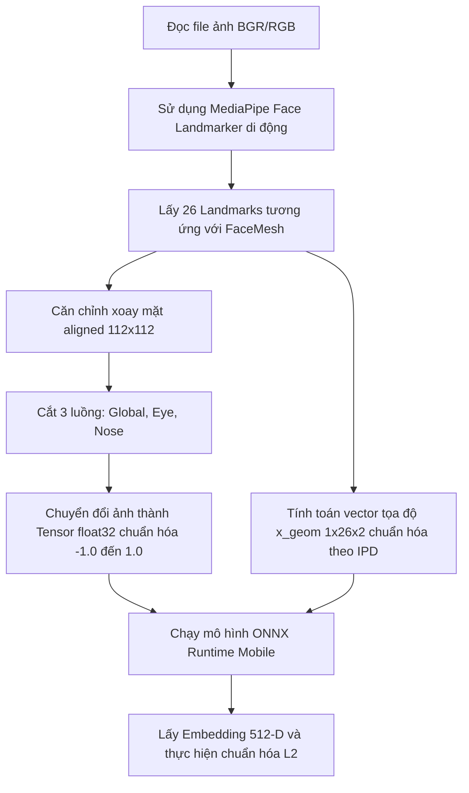

# Mobile Code Samples for Custom Face CNN

Thư mục này chứa mã nguồn mẫu (Code Samples) bằng ngôn ngữ **C# (cho Xamarin/MAUI/Native)** và **Dart (cho Flutter)** để tích hợp mô hình `custom_face_cnn.onnx` nhận diện khuôn mặt trực tiếp trên ứng dụng di động từ một tệp tin ảnh.

---

## Quy Trình Xử Lý Trên Thiết Bị Di Động

Để đạt được độ chính xác đồng bộ 100% với mô hình đã huấn luyện ở Python, ứng dụng di động cần thực hiện tuần tự các bước sau:

### 1. Phát Hiện Khuôn Mặt & Landmarks
* **Bắt buộc**: Trên nền tảng di động, không sử dụng ML Kit thông thường (vì không đủ 468 mốc khuôn mặt và không trùng chỉ mục). Bạn cần sử dụng **MediaPipe Tasks SDK (Face Landmarker)** cho Android/iOS/Flutter.
* MediaPipe Face Landmarker sẽ trả về danh sách 468 điểm tọa độ khuôn mặt (tương tự FaceMesh ở Python). Từ đó trích xuất ra **26 landmarks** theo đúng bảng chỉ mục chỉ định.

### 2. Trích Xuất 26 Landmarks mốc
26 mốc điểm đặc trưng được trích xuất từ 468 mốc của MediaPipe tương ứng với các chỉ mục sau:
`[33, 133, 362, 263, 159, 145, 386, 374, 468, 473, 70, 107, 300, 336, 168, 4, 129, 358, 164, 61, 291, 0, 17, 234, 454, 152]`

---

## Danh Mục Mã Nguồn Mẫu

* [csharp/FaceRecognizer.cs](file:///work/a.i-assistant-chatbot-telegram-serverles/TreeOfThought/docs/nhan-dien-khuon-mat/custom-face-cnn/mobile_samples/csharp/FaceRecognizer.cs): Class viết bằng C# sử dụng gói NuGet `Microsoft.ML.OnnxRuntime` để chạy suy luận mô hình và xử lý ma trận.
* [flutter/face_recognizer.dart](file:///work/a.i-assistant-chatbot-telegram-serverles/TreeOfThought/docs/nhan-dien-khuon-mat/custom-face-cnn/mobile_samples/flutter/face_recognizer.dart): Service viết bằng Dart sử dụng pub package `onnxruntime_flutter` để suy luận đa luồng đầu vào.
