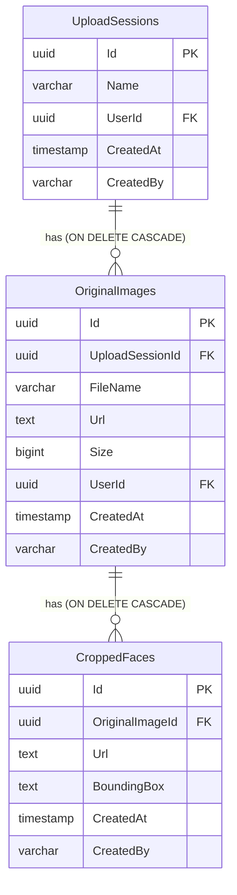
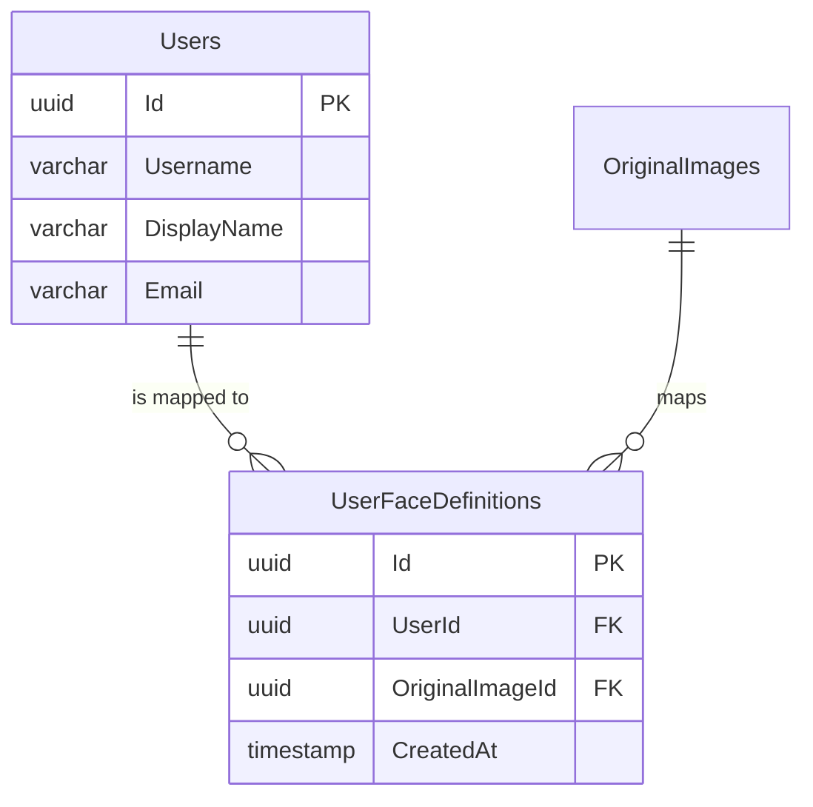
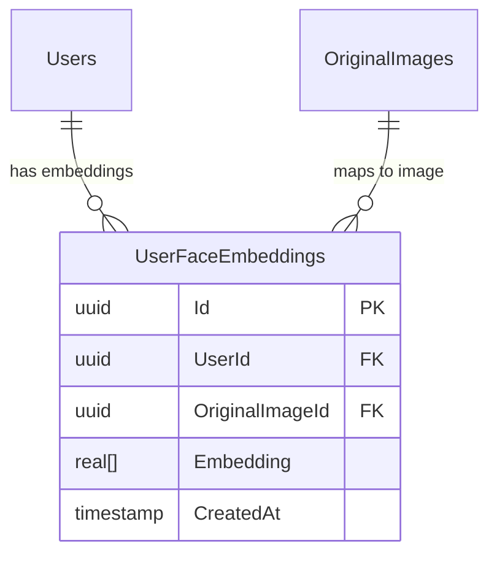

# Giải pháp Phát triển Nghiệp vụ Nhận diện Khuôn mặt (nhan-dien-khuon-mat)

Tài liệu này trình bày giải pháp chi tiết và sơ đồ thiết kế cho module **Nhận diện khuôn mặt** nhằm đáp ứng đầy đủ các yêu cầu nghiệp vụ mới và nâng cao tại [whattodo.md](whattodo.md), tuân thủ nghiêm ngặt quy trình và các nguyên tắc thiết kế hiện có của hệ thống **TreeOfThought**.

---

## 1. Tổng quan Kiến trúc Hệ thống

Giải pháp kết hợp xử lý trí tuệ nhân tạo (AI) hiệu năng cao trực tiếp trên trình duyệt (Client-side Edge AI) để tối ưu trải nghiệm và bảo mật dữ liệu, đồng thời sử dụng hệ thống lưu trữ và quản lý phiên tập trung trên Backend (Server-side, DB PostgreSQL & Google Cloud Storage):

```mermaid
graph TD
    A[Người dùng truy cập Nhận diện khuôn mặt] --> B{Giao diện Workspace Kép}
    
    %% Session làm việc %%
    subgraph Session làm việc (Active Working Session)
        B --> C[Nạp nguồn: Drag & Drop / Folder Picker / File Picker]
        C --> D[Cộng dồn vào hàng đợi Tệp tin nguồn - Cột trái]
        D --> E[Quét MediaPipe Face Detection tuần tự]
        E --> F[Chuyển ảnh có khuôn mặt sang Cột phải]
        F --> G[Xem trước Bounding Box & crop 150x150]
        G --> H[Toggle chọn Lưu/Bỏ ảnh gốc & từng ảnh crop]
        H --> I[Đặt tên Phiên & nhấn Lưu trữ]
        I --> J[Upload nhị phân lên GCS & URL vào DB PostgreSQL]
        J --> K[Realtime Firestore Event: Upload Completed]
        K --> L[Tự động Reset Session làm việc cục bộ]
    end
    
    %% Danh sách quản lý %%
    subgraph Danh sách quản lý (Historical Sessions List)
        B --> M[Bảng lịch sử các phiên upload]
        M --> N[Hành động: Đổi tên inline]
        M --> O[Hành động: Xem chi tiết]
        M --> P[Hành động: Xóa Phiên]
        
        O --> Q[Modal: Bảng chi tiết dòng ảnh gốc & mặt crop]
        Q --> R[Xóa ảnh gốc -> Cascade xóa tệp trên GCS & DB]
        Q --> S[Xóa ảnh crop -> Xóa riêng tệp trên GCS & DB]
        P --> T[Xóa Phiên -> Cascade xóa tất cả tệp liên quan trên GCS & DB]
    end
```

---

## 2. Thiết kế Chi tiết: Session Làm Việc (Active Working Session)

### 2.1. Bố cục và Nạp nguồn đa dạng (Layout & Multi-Source Input)
- **Bố cục (Layout):** Tách biệt các khu vực nạp nguồn và cấu trúc thành 3 cột chính nằm ngang (flexbox/grid) tuân thủ sketch và nâng cao UX:
  - **Khung tiêu đề đầu tiên (3 cột):**
    - *Cột bên trái:* "Nhập tên phiên đang làm việc" hiển thị ô tiêu đề và ô Input nhập tên phiên.
    - *Cột ở giữa:* Khu vực `"Chọn file hoặc kéo thả file"` hỗ trợ Drag & Drop ảnh đơn lẻ và mở file picker.
    - *Cột bên phải:* Khu vực `"Chọn folder hoặc kéo thả folder"` hỗ trợ Drag & Drop thư mục và mở folder picker.
  - **Khung danh sách file:** Bảng dữ liệu của phiên đang làm việc (`Active Session Files Table`) kèm theo phân trang cục bộ (`Paging ...`) ở góc dưới bên phải, và nút "Lưu phiên làm việc" ở góc dưới bên trái.
- **Tính nhất quán với Hệ thống (App Shell Alignment):**
  - **Theme màu sắc:** Tuân thủ 100% theme màu sáng và hệ thống màu của App Shell chung (với nền sáng `#f0f2f5`, sắc xanh chủ đạo `--primary-color: #1890ff`, và các thẻ card mờ kính sáng `rgba(255, 255, 255, 0.7)`).
  - **Nút bấm dùng chung (Shared tot-button):** Tất cả các nút bấm bên trong bảng (`Active Session Table` và `History Table`) bắt buộc phải sử dụng thẻ component dùng chung `<tot-button>` thay thế cho các thẻ HTML thông thường để đồng bộ hóa thiết kế.
- **Hàng đợi cộng dồn (Cumulative loading):**
  - **"Có thể kéo thêm file ảnh hoặc folder vào session đã có để xử lý tiếp"**: Dữ liệu cũ trong bảng làm việc được cộng dồn (append) tiếp và quét song song mà không bị xóa.
- **Cơ chế quét thư mục đệ quy (Recursive Folder Traversal):**
  - Khi người dùng kéo thả thư mục vào khu vực Folder, hệ thống sẽ sử dụng API `webkitGetAsEntry()` đệ quy duyệt qua tất cả các file ảnh nằm sâu bên trong thư mục con để nạp vào hàng đợi.
  - Khi chọn qua Folder Picker, trình duyệt tự động đọc đệ quy và lọc tất cả các tệp hình ảnh để đưa vào xử lý.

### 2.2. Quy trình Quét và Trích xuất (Edge AI pipeline)
1. **Quét MediaPipe:** Sử dụng **MediaPipe Face Detection** chạy cục bộ thông qua WebGL/WebAssembly trên trình duyệt.
2. **Cập nhật Bảng Session:** Bảng danh sách tệp tin hiển thị kết quả phân tích theo cấu trúc 4 cột chuẩn chỉnh:
   - **Tên file:** Tên tệp tin gốc của ảnh.
   - **Khuôn mặt trong ảnh:**
     - Nếu ảnh phát hiện có khuôn mặt: Hiển thị các avatar ảnh khuôn mặt được crop ra (chuẩn 150x150) kèm theo checkbox tích chọn (`[v] ảnh mặt crop được`) trực quan ngay bên trong ô của bảng. Người dùng có thể click chọn hoặc bỏ chọn từng ảnh khuôn mặt crop này.
     - Nếu ảnh không phát hiện khuôn mặt: Hiển thị dòng chữ cảnh báo `"Không có ảnh khuôn mặt"`.
   - **Đường dẫn file:** Hiển thị đường dẫn mô phỏng dạng `/work/[Tên file]` để bảo mật và giữ giao diện nhất quán đúng thiết kế (ví dụ: `/work/dunp.png`).
   - **Hành động:** Nút bấm `"Xóa"` để loại bỏ nhanh tệp tin này ra khỏi hàng đợi phiên làm việc.

### 2.3. Đặt tên, Lưu trữ & Tự động Reset Session
- **Đặt tên phiên:** Tự động tạo tên gợi ý dạng `"Phiên ngày [dd/MM/yyyy HH:mm]"` trong ô Input để người dùng sửa đổi trực tiếp theo ý muốn.
- **Lưu trữ công khai (Public GCS):** Khi bấm nút `"Lưu phiên làm việc"`:
  - Tiến hành tải nhị phân các tệp ảnh gốc được chọn và các ảnh khuôn mặt crop tương ứng lên dịch vụ lưu trữ Google Cloud Storage (GCS) ở chế độ **Public (Mọi người có thể đọc công khai)** bằng cách đặt `isPublic = true` khi gọi `UploadFileAsync` của `FirebaseService`.
  - Cập nhật URL và Metadata vào DB PostgreSQL.
  - Reset hoàn toàn Workspace (về trạng thái trống) và tự động kích hoạt reload danh sách lịch sử bên dưới.

---

## 3. Thiết kế Chi tiết: Danh Sách Quản Lý & Cascade GCS Cleaners

### 3.1. Danh sách Quản lý Phiên (Historical Session List)
- Hiển thị bảng danh sách lịch sử các phiên upload đã lưu của người dùng dưới dạng bảng phân trang từ API PostgreSQL. Bảng gồm 4 cột chính xác theo thiết kế:
  - **Tên phiên:** Hiển thị tên phiên làm việc (cho phép đổi tên inline).
  - **Số lượng ảnh:** Tổng số ảnh gốc trong phiên đó.
  - **Số lượng khuôn mặt:** Tổng số khuôn mặt đã crop của toàn bộ ảnh thuộc phiên đó (được đếm và tối ưu hóa truy vấn thông qua `.SelectMany(i => i.CroppedFaces).Count()`).
  - **Hành động:** Chứa 2 nút bấm `"Xem"` (Xem Chi tiết phiên qua Modal) và `"Xóa"` (Xóa phiên).

### 3.2. Xem Chi tiết & Quản lý dòng (Detailed Session Modal)
- Khi bấm nút **"Xem"**, hiển thị một Modal Chi tiết chứa bảng hiển thị cấu trúc tương tự để xem ảnh gốc và danh sách khuôn mặt crop.
- **Cơ chế xóa đơn lẻ trong modal chi tiết:**
  - *Xóa ảnh gốc:* Xóa file gốc vật lý trên GCS, xóa các file crop vật lý liên kết trên GCS, và cascade xóa dữ liệu trong DB.
  - *Xóa ảnh crop:* Xóa file crop vật lý tương ứng trên GCS và xóa bản ghi đơn lẻ trong DB.

### 3.3. Xóa Phiên & Đồng bộ GCS (Cascade GCS Cleanup Lifecycle)
- **"do dùng google cloud storage lưu file nên khi xóa cần xóa cả trên GCS"**: Khi xóa phiên từ bảng lịch sử hoặc qua API:
  - Hệ thống tự động quét toàn bộ file liên kết, xóa tệp vật lý trên GCS của tất cả ảnh gốc và ảnh crop thuộc phiên đó.
  - Thực thi xóa `UploadSession` trong DB, kích hoạt Cascade Delete xóa sạch toàn bộ OriginalImages và CroppedFaces liên quan.

---

## 4. Thiết kế Thực thể Dữ liệu (Database Schema)

Cơ sở dữ liệu PostgreSQL `tot_db` quản lý 3 bảng thực thể với liên kết chặt chẽ:



---

## 5. Quy hoạch RESTful API Endpoints (FaceDetectionController.cs)

Các API quản lý trực tiếp qua DbContext được thiết kế tối giản, loại bỏ nợ kỹ thuật:

| Phương thức | API Endpoint | Mô tả | Chi tiết dọn dẹp tệp vật lý |
| :--- | :--- | :--- | :--- |
| `POST` | `/api/face-detection/save` | Lưu ảnh gốc & mặt crop theo phiên | Tải tệp tin lên GCS |
| `GET` | `/api/face-detection/sessions` | Lấy danh sách các phiên upload | Không |
| `GET` | `/api/face-detection/sessions/{id}` | Lấy chi tiết ảnh gốc & crop của phiên | Không |
| `PUT` | `/api/face-detection/sessions/{id}/rename` | Đổi tên phiên upload | Không |
| `DELETE` | `/api/face-detection/sessions/{id}` | Xóa toàn bộ phiên upload | **Xóa tất cả** tệp ảnh gốc & crop trên GCS |
| `DELETE` | `/api/face-detection/images/{id}` | Xóa đơn lẻ ảnh gốc | **Xóa tệp ảnh gốc & các mặt crop** trên GCS |
| `DELETE` | `/api/face-detection/faces/{id}` | Xóa đơn lẻ ảnh khuôn mặt crop | **Xóa tệp ảnh crop tương ứng** trên GCS |
| `GET` | `/api/face-detection/users` | Lấy danh sách user OIDC hỗ trợ autocomplete | Không |
| `POST` | `/api/face-detection/definitions` | Định nghĩa khuôn mặt cho user (lưu ánh xạ) | Có kiểm tra trùng và ghi đè |
| `GET` | `/api/face-detection/users/{userId}/definitions` | Xem danh sách các khuôn mặt định nghĩa cho user | Không |
| `DELETE` | `/api/face-detection/definitions/{definitionId}` | Xóa ảnh định nghĩa khỏi user | Không |

---

## 6. Thiết kế Bổ sung: Định nghĩa Khuôn mặt cho Người dùng (Cập nhật 2026-05-28)

Để giải quyết bài toán ánh xạ tệp tin hình ảnh với người dùng hệ thống nhằm phục vụ các tính năng nhận diện tiếp theo, giải pháp kỹ thuật bổ sung được thiết kế như sau:

### 6.1. Cấu trúc DB Context Phân tách (Backend Module isolation)
- **FaceUserDbContext:** Đọc thông tin người dùng OIDC trực tiếp từ bảng `"Users"` có sẵn bằng cách chia sẻ cùng Connection String, tránh việc phụ thuộc chồng chéo giữa các Module Assemblies.
- **FaceDefinitionDbContext:** Quản lý bảng `"UserFaceDefinitions"` lưu trữ ánh xạ ảnh gốc nhận diện với người dùng hệ thống (`UserId` <-> `OriginalImageId`).



### 6.2. Cơ chế Cảnh báo và Ghi đè (Conflict resolution flow)
- Khi gọi `POST /api/face-detection/definitions` với `force = false`, hệ thống tự động kiểm tra xem ảnh gốc đã được định nghĩa cho một người dùng khác hay chưa.
- Nếu ảnh đã được định nghĩa cho người dùng khác, API trả về mã lỗi `409 Conflict` kèm thông báo chi tiết chứa tên người dùng cũ.
- Người dùng xác nhận đồng ý trên giao diện, hệ thống gửi lại request với `force = true` để gỡ bỏ ánh xạ cũ và thiết lập ánh xạ mới.

### 6.3. Thiết kế Trải nghiệm Giao diện (Frontend Face Definition UI Flow)
- **Hành động thêm trên Lịch sử Phiên:** Bổ sung nút bấm `"Chọn định nghĩa khuôn mặt"` cho mỗi phiên upload trong cột hành động.
- **Khu vực Định nghĩa (Workspace Panel):** Khi click nút, hiển thị bảng danh sách các ảnh gốc của phiên đó ngay bên dưới bảng Lịch sử:
  - Cột *Tên ảnh gốc*, *Hình ảnh*.
  - Cột *Hành động*:
    - Hộp chọn Autocomplete chọn người dùng sử dụng `<tot-autocomplete>` kết nối API `/api/face-detection/users`.
    - Nút `"Gán cho user"` (Có logic kiểm tra warning và confirm ghi đè).
    - Nút `"Xem định nghĩa của user"` (Mở Modal chi tiết).
- **Modal Chi tiết Định nghĩa:** Hiển thị thông tin cơ bản của user và danh sách tất cả các ảnh khuôn mặt đã được gán định nghĩa cho user đó. Cho phép xóa ảnh khỏi user qua nút xóa ở cột hành động của modal.

---

## 7. Thiết kế Bổ sung: Đào tạo nhận dạng & Trích xuất Đặc trưng (Cập nhật 2026-05-28 16:59:32)

Giải pháp mở rộng cho phép quản trị viên lựa chọn danh sách người dùng đã định nghĩa khuôn mặt, tải các ảnh gốc tương ứng, chạy huấn luyện tinh chỉnh mô hình ArcFace thông qua tiến trình python, và sử dụng mô hình tốt nhất (`arcface_model_best.onnx`) để trích xuất và lưu trữ vector embedding 512 chiều vào PostgreSQL.

### 7.1. Bổ sung cấu trúc lưu trữ Vector Embedding
Trong DB Context riêng cho nhận diện khuôn mặt (`FaceDefinitionDbContext`), chúng ta thêm thực thể `UserFaceEmbedding` để quản lý các vector trích xuất. Cột `Embedding` được lưu trữ dưới dạng mảng số thực `real[]` của PostgreSQL, được hỗ trợ nguyên bản (native) bởi driver `Npgsql.EntityFrameworkCore.PostgreSQL` mà không cần phụ thuộc gói ngoài:



Mô hình thực thể C# `UserFaceEmbedding.cs`:
```csharp
using System;

namespace Core.Infra.NhanDienKhuonMat.Models;

public class UserFaceEmbedding
{
    public Guid Id { get; set; } = Guid.NewGuid();
    public Guid UserId { get; set; }
    public Guid OriginalImageId { get; set; }
    public float[] Embedding { get; set; } = Array.Empty<float>();
    public DateTime CreatedAt { get; set; } = DateTime.UtcNow;
}
```

Bảng được khởi tạo tự động trong `FaceDefinitionDbContext.EnsureTablesCreatedAsync()`:
```sql
CREATE TABLE IF NOT EXISTS ""UserFaceEmbeddings"" (
    ""Id"" uuid NOT NULL,
    ""UserId"" uuid NOT NULL,
    ""OriginalImageId"" uuid NOT NULL,
    ""Embedding"" real[] NOT NULL,
    ""CreatedAt"" timestamp with time zone NOT NULL,
    CONSTRAINT ""PK_UserFaceEmbeddings"" PRIMARY KEY (""Id"")
);
CREATE INDEX IF NOT EXISTS ""IX_UserFaceEmbeddings_UserId"" ON ""UserFaceEmbeddings"" (""UserId"");
CREATE INDEX IF NOT EXISTS ""IX_UserFaceEmbeddings_OriginalImageId"" ON ""UserFaceEmbeddings"" (""OriginalImageId"");
```

### 7.2. Tích hợp Mô hình ONNX & Trích xuất Đặc trưng (C# Backend)
- **Dependencies mới (.csproj):**
  - Gói `Microsoft.ML.OnnxRuntime` để chạy suy luận mô hình ONNX trong C#.
  - Gói `SixLabors.ImageSharp` để xử lý đọc và chuẩn hóa dữ liệu pixel ảnh trên mọi hệ điều hành.
- **Tiền xử lý ảnh (Preprocessing) chuẩn hóa:**
  Ảnh căn chỉnh được đọc lên bằng SixLabors, chuẩn hóa RGB từng kênh màu về `[-1.0, 1.0]` tương tự `main.py`:
  $$\text{pixel} = \frac{\text{color} - 127.5f}{127.5f}$$
  Sau đó chuyển đổi thành Tensor phẳng dạng `[1, 3, 112, 112]` (NCHW format) và truyền vào `InferenceSession`.
- **L2 Normalization (Chuẩn hóa vector):**
  Vector 512 chiều được chuẩn hóa bằng thuật toán L2 Normalize bắt buộc trước khi lưu vào DB:
  $$\text{norm} = \sqrt{\sum x_i^2}, \quad x_{i, \text{norm}} = \frac{x_i}{\text{norm}}$$

### 7.3. Luồng Nghiệp vụ Huấn luyện Realtime bằng Server-Sent Events (SSE)
- **Tải tệp & Tạo cấu trúc:**
  - Backend tự tạo `facesid/{yyyy-MM-dd}/dataraw/{userid_username}/` dưới thư mục chạy.
  - Tải tất cả ảnh gốc của các user được chọn từ GCS và lưu vào folder tương ứng.
- **Chạy tiến trình Python & Stream Logs:**
  - Khởi chạy python process gọi `main.py` nằm trong folder `TreeOfThought/docs/nhan-dien-khuon-mat/ArcFaceFinetune/`.
  - Stream logs thời gian thực từ `stdout` trực tiếp lên trình duyệt bằng công nghệ **Server-Sent Events (SSE)** (Content-Type: `text/event-stream`). Giúp UI hiển thị log liên tục mượt mà.

### 7.4. Thiết kế các Endpoint API mới (FaceDetectionController.cs)
1. `GET /api/face-detection/users-with-definitions`: Lấy danh sách những user đã định nghĩa khuôn mặt (kèm avatar, thông tin user).
2. `GET /api/face-detection/train/stream`: Endpoint SSE để tải ảnh thô, chạy python finetune và đẩy log `stdout` real-time cho Angular.
3. `GET /api/face-detection/training-folders`: Lấy danh sách các thư mục huấn luyện đã tạo theo ngày (ví dụ `2026-05-28`, `2026-05-29`) bên trong `facesid/`.
4. `POST /api/face-detection/training-folders/{folderName}/extract-embeddings`: 
   - Load mô hình `facesid/{folderName}/arcface_model_best.onnx`.
   - Quét thư mục `facesid/{folderName}/data/`.
   - Trích xuất embedding cho từng ảnh khuôn mặt đã được align trong các subfolder `{userid_username}`.
   - Thực hiện L2 Normalize và lưu trữ vào bảng `UserFaceEmbeddings` (nếu đã tồn tại ảnh đó cho user, thực hiện cập nhật ghi đè).

### 7.5. Giao diện Đào tạo Nhận dạng (Frontend UI Flow)
- **Tích hợp Sidemenu:** Chuyển đổi menu "Nhận diện khuôn mặt" thành một danh mục cha có 2 menu con:
  - `"Phiên upload"` (trỏ vào route `/modules/nhan-dien-khuon-mat/sessions` - chính là UI cũ).
  - `"Đào tạo nhận dạng"` (trỏ vào route `/modules/nhan-dien-khuon-mat/training` - component mới).
- **Component Đào tạo (`DaoTaoNhanDangComponent`):**
  - **Nút "Đào tạo nhận dạng":** Nằm trên cùng của trang. Khi click sẽ:
    - Thu thập danh sách `userId` đang được check.
    - Kết nối `EventSource` (SSE) tới API `/api/face-detection/train/stream?userIds=...`.
    - Lắng nghe sự kiện để cập nhật log box.
  - **Vùng Log (Log Region):** Nằm ngay bên dưới nút Đào tạo. Một text-box/terminal mờ kính tối màu với phông chữ monospace, tự động cuộn xuống cuối (auto-scroll) hiển thị trực quan stdout nhận được từ SSE.
  - **Danh sách User:** Bảng hiển thị danh sách các User hệ thống đã có khuôn mặt định nghĩa (Avatar, DisplayName, Username, Email, Số lượng ảnh định nghĩa).
    - Cột đầu tiên là Checkbox dùng để tích chọn những user sẽ được tham gia đào tạo.
    - Cung cấp một Checkbox ở header để nhanh chóng tích chọn tất cả.
  - **Danh sách Phiên Đào tạo & Nút click lấy Embeddings:**
    - Hiển thị danh sách các folder ngày dạng danh sách nút/thẻ ngay bên dưới Log Region.
    - Click vào một nút ngày sẽ gửi request trích xuất embedding và hiển thị thông báo thành công dạng Toast (`nz-message`).
