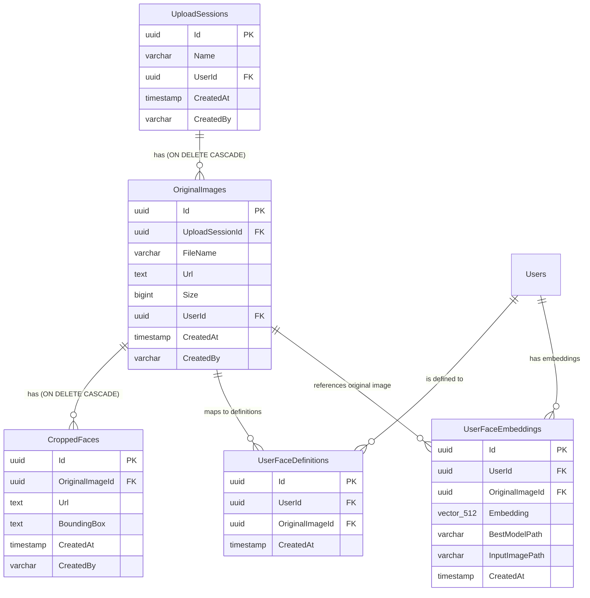
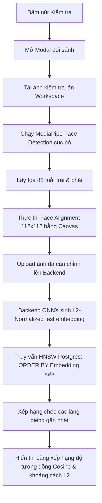

# Giải pháp Phát triển Nghiệp vụ Nhận diện Khuôn mặt (nhan-dien-khuon-mat)

Tài liệu này trình bày giải pháp chi tiết và sơ đồ thiết kế cho module **Nhận diện khuôn mặt** nhằm đáp ứng đầy đủ các yêu cầu nghiệp vụ mới và nâng cao tại [whattodo.md](whattodo.md), tuân thủ nghiêm ngặt quy trình và các nguyên tắc thiết kế hiện có của hệ thống **TreeOfThought**.

---

## 1. Tổng quan Kiến trúc Hệ thống

Giải pháp kết hợp xử lý trí tuệ nhân tạo (AI) hiệu năng cao trực tiếp trên trình duyệt (Client-side Edge AI) để tối ưu trải nghiệm và bảo mật dữ liệu, đồng thời sử dụng hệ thống lưu trữ và quản lý phiên tập trung trên Backend (Server-side, DB PostgreSQL & Google Cloud Storage):

```mermaid
graph TD
    A[Người dùng truy cập Nhận diện khuôn mặt] --> B{Giao diện Workspace Kép}
    
    %% Session làm việc %%
    subgraph Session làm việc (Active Working Session)
        B --> C[Nạp nguồn: Drag & Drop / Folder Picker / File Picker]
        C --> D[Cộng dồn vào hàng đợi Tệp tin nguồn - Cột trái]
        D --> E[Quét MediaPipe Face Detection tuần tự]
        E --> F[Chuyển ảnh có khuôn mặt sang Cột phải]
        F --> G[Xem trước Bounding Box & crop 150x150]
        G --> H[Toggle chọn Lưu/Bỏ ảnh gốc & từng ảnh crop]
        H --> I[Đặt tên Phiên & nhấn Lưu trữ]
        I --> J[Upload nhị phân lên GCS & URL vào DB PostgreSQL]
        J --> K[Realtime Firestore Event: Upload Completed]
        K --> L[Tự động Reset Session làm việc cục bộ]
    end
    
    %% Danh sách quản lý %%
    subgraph Danh sách quản lý (Historical Sessions List)
        B --> M[Bảng lịch sử các phiên upload]
        M --> N[Hành động: Đổi tên inline]
        M --> O[Hành động: Xem chi tiết]
        M --> P[Hành động: Xóa Phiên]
        
        O --> Q[Modal: Bảng chi tiết dòng ảnh gốc & mặt crop]
        Q --> R[Xóa ảnh gốc -> Cascade xóa tệp trên GCS & DB]
        Q --> S[Xóa ảnh crop -> Xóa riêng tệp trên GCS & DB]
        P --> T[Xóa Phiên -> Cascade xóa tất cả tệp liên quan trên GCS & DB]
    end
```

---

## 2. Thiết kế Chi tiết: Session Làm Việc (Active Working Session)

### 2.1. Bố cục và Nạp nguồn đa dạng (Layout & Multi-Source Input)
- **Bố cục (Layout):** Tách biệt các khu vực nạp nguồn và cấu trúc thành 3 cột chính nằm ngang (flexbox/grid) tuân thủ sketch và nâng cao UX:
  - **Khung tiêu đề đầu tiên (3 cột):**
    - *Cột bên trái:* "Nhập tên phiên đang làm việc" hiển thị ô tiêu đề và ô Input nhập tên phiên.
    - *Cột ở giữa:* Khu vực `"Chọn file hoặc kéo thả file"` hỗ trợ Drag & Drop ảnh đơn lẻ và mở file picker.
    - *Cột bên phải:* Khu vực `"Chọn folder hoặc kéo thả folder"` hỗ trợ Drag & Drop thư mục và mở folder picker.
  - **Khung danh sách file:** Bảng dữ liệu của phiên đang làm việc (`Active Session Files Table`) kèm theo phân trang cục bộ (`Paging ...`) ở góc dưới bên phải, và nút "Lưu phiên làm việc" ở góc dưới bên trái.
- **Tính nhất quán với Hệ thống (App Shell Alignment):**
  - **Theme màu sắc:** Tuân thủ 100% theme màu sáng và hệ thống màu của App Shell chung (với nền sáng `#f0f2f5`, sắc xanh chủ đạo `--primary-color: #1890ff`, và các thẻ card mờ kính sáng `rgba(255, 255, 255, 0.7)`).
  - **Nút bấm dùng chung (Shared tot-button):** Tất cả các nút bấm bên trong bảng (`Active Session Table` và `History Table`) bắt buộc phải sử dụng thẻ component dùng chung `<tot-button>` thay thế cho các thẻ HTML thông thường để đồng bộ hóa thiết kế.
- **Hàng đợi cộng dồn (Cumulative loading):**
  - **"Có thể kéo thêm file ảnh hoặc folder vào session đã có để xử lý tiếp"**: Dữ liệu cũ trong bảng làm việc được cộng dồn (append) tiếp và quét song song mà không bị xóa.
- **Cơ chế quét thư mục đệ quy (Recursive Folder Traversal):**
  - Khi người dùng kéo thả thư mục vào khu vực Folder, hệ thống sẽ sử dụng API `webkitGetAsEntry()` đệ quy duyệt qua tất cả các file ảnh nằm sâu bên trong thư mục con để nạp vào hàng đợi.
  - Khi chọn qua Folder Picker, trình duyệt tự động đọc đệ quy và lọc tất cả các tệp hình ảnh để đưa vào xử lý.

### 2.2. Quy trình Quét và Trích xuất (Edge AI pipeline)
1. **Quét MediaPipe:** Sử dụng **MediaPipe Face Detection** chạy cục bộ thông qua WebGL/WebAssembly trên trình duyệt.
2. **Cập nhật Bảng Session:** Bảng danh sách tệp tin hiển thị kết quả phân tích theo cấu trúc 4 cột chuẩn chỉnh:
   - **Tên file:** Tên tệp tin gốc của ảnh.
   - **Khuôn mặt trong ảnh:**
     - Nếu ảnh phát hiện có khuôn mặt: Hiển thị các avatar ảnh khuôn mặt được crop ra (chuẩn 150x150) kèm theo checkbox tích chọn (`[v] ảnh mặt crop được`) trực quan ngay bên trong ô của bảng. Người dùng có thể click chọn hoặc bỏ chọn từng ảnh khuôn mặt crop này.
     - Nếu ảnh không phát hiện khuôn mặt: Hiển thị dòng chữ cảnh báo `"Không có ảnh khuôn mặt"`.
   - **Đường dẫn file:** Hiển thị đường dẫn mô phỏng dạng `/work/[Tên file]` để bảo mật và giữ giao diện nhất quán đúng thiết kế (ví dụ: `/work/dunp.png`).
   - **Hành động:** Nút bấm `"Xóa"` để loại bỏ nhanh tệp tin này ra khỏi hàng đợi phiên làm việc.

### 2.3. Đặt tên, Lưu trữ & Tự động Reset Session
- **Đặt tên phiên:** Tự động tạo tên gợi ý dạng `"Phiên ngày [dd/MM/yyyy HH:mm]"` trong ô Input để người dùng sửa đổi trực tiếp theo ý muốn.
- **Lưu trữ công khai (Public GCS):** Khi bấm nút `"Lưu phiên làm việc"`:
  - Tiến hành tải nhị phân các tệp ảnh gốc được chọn và các ảnh khuôn mặt crop tương ứng lên dịch vụ lưu trữ Google Cloud Storage (GCS) ở chế độ **Public (Mọi người có thể đọc công khai)** bằng cách đặt `isPublic = true` khi gọi `UploadFileAsync` của `FirebaseService`.
  - Cập nhật URL và Metadata vào DB PostgreSQL.
  - Reset hoàn toàn Workspace (về trạng thái trống) và tự động kích hoạt reload danh sách lịch sử bên dưới.

---

## 3. Thiết kế Chi tiết: Danh Sách Quản Lý & Cascade GCS Cleaners

### 3.1. Danh sách Quản lý Phiên (Historical Session List)
- Hiển thị bảng danh sách lịch sử các phiên upload đã lưu của người dùng dưới dạng bảng phân trang từ API PostgreSQL. Bảng gồm 4 cột chính xác theo thiết kế:
  - **Tên phiên:** Hiển thị tên phiên làm việc (cho phép đổi tên inline).
  - **Số lượng ảnh:** Tổng số ảnh gốc trong phiên đó.
  - **Số lượng khuôn mặt:** Tổng số khuôn mặt đã crop của toàn bộ ảnh thuộc phiên đó (được đếm và tối ưu hóa truy vấn thông qua `.SelectMany(i => i.CroppedFaces).Count()`).
  - **Hành động:** Chứa 2 nút bấm `"Xem"` (Xem Chi tiết phiên qua Modal) và `"Xóa"` (Xóa phiên).

### 3.2. Xem Chi tiết & Quản lý dòng (Detailed Session Modal)
- Khi bấm nút **"Xem"**, hiển thị một Modal Chi tiết chứa bảng hiển thị cấu trúc tương tự để xem ảnh gốc và danh sách khuôn mặt crop.
- **Cơ chế xóa đơn lẻ trong modal chi tiết:**
  - *Xóa ảnh gốc:* Xóa file gốc vật lý trên GCS, xóa các file crop vật lý liên kết trên GCS, và cascade xóa dữ liệu trong DB.
  - *Xóa ảnh crop:* Xóa file crop vật lý tương ứng trên GCS và xóa bản ghi đơn lẻ trong DB.

### 3.3. Xóa Phiên & Đồng bộ GCS (Cascade GCS Cleanup Lifecycle)
- **"do dùng google cloud storage lưu file nên khi xóa cần xóa cả trên GCS"**: Khi xóa phiên từ bảng lịch sử hoặc qua API:
  - Hệ thống tự động quét toàn bộ file liên kết, xóa tệp vật lý trên GCS của tất cả ảnh gốc và ảnh crop thuộc phiên đó.
  - Thực thi xóa `UploadSession` trong DB, kích hoạt Cascade Delete xóa sạch toàn bộ OriginalImages và CroppedFaces liên quan.

---

## 4. Thiết kế Thực thể Dữ liệu (Database Schema)

Cơ sở dữ liệu PostgreSQL `tot_db` quản lý 4 bảng thực thể với liên kết chặt chẽ và sử dụng phần mở rộng **pgvector** cho việc lưu trữ đặc trưng khuôn mặt:



---

## 5. Quy hoạch RESTful API Endpoints (FaceDetectionController.cs)

Các API quản lý trực tiếp qua DbContext được thiết kế tối giản, loại bỏ nợ kỹ thuật và tích hợp đầy đủ tính năng so khớp vector:

| Phương thức | API Endpoint | Mô tả | Chi tiết dọn dẹp tệp vật lý |
| :--- | :--- | :--- | :--- |
| `POST` | `/api/face-detection/save` | Lưu ảnh gốc & mặt crop theo phiên | Tải tệp tin lên GCS |
| `GET` | `/api/face-detection/sessions` | Lấy danh sách các phiên upload | Không |
| `GET` | `/api/face-detection/sessions/{id}` | Lấy chi tiết ảnh gốc & crop của phiên | Không |
| `PUT` | `/api/face-detection/sessions/{id}/rename` | Đổi tên phiên upload | Không |
| `DELETE` | `/api/face-detection/sessions/{id}` | Xóa toàn bộ phiên upload | **Xóa tất cả** tệp ảnh gốc & crop trên GCS |
| `DELETE` | `/api/face-detection/images/{id}` | Xóa đơn lẻ ảnh gốc | **Xóa tệp ảnh gốc & các mặt crop** trên GCS |
| `DELETE` | `/api/face-detection/faces/{id}` | Xóa đơn lẻ ảnh khuôn mặt crop | **Xóa tệp ảnh crop tương ứng** trên GCS |
| `GET` | `/api/face-detection/users` | Lấy danh sách user OIDC hỗ trợ autocomplete | Không |
| `POST` | `/api/face-detection/definitions` | Định nghĩa khuôn mặt cho user (lưu ánh xạ) | Có kiểm tra trùng và ghi đè |
| `GET` | `/api/face-detection/users/{userId}/definitions` | Xem danh sách các khuôn mặt định nghĩa cho user | Không |
| `DELETE` | `/api/face-detection/definitions/{definitionId}` | Xóa ảnh định nghĩa khỏi user | Không |
| `GET` | `/api/face-detection/users-with-definitions` | Lấy danh sách user đã định nghĩa khuôn mặt | Không |
| `GET` | `/api/face-detection/train/stream` | SSE stream chạy huấn luyện python | Hỗ trợ stream log real-time |
| `GET` | `/api/face-detection/training-folders` | Danh sách folder huấn luyện theo ngày | Không |
| `POST` | `/api/face-detection/training-folders/{folderName}/extract-embeddings` | Trích xuất vector 512 chiều ONNX | Trích xuất và lưu DB |
| `GET` | `/api/face-detection/embeddings` | Lấy danh sách vector embedding đã trích xuất | Không |
| `DELETE` | `/api/face-detection/embeddings/{id}` | Xóa một vector embedding cụ thể | Không |
| `DELETE` | `/api/face-detection/embeddings/user/{userId}` | Xóa tất cả embedding của user | Không |
| `POST` | `/api/face-detection/embeddings/{id}/compare` | So khớp đối sánh vector HNSW Inner Product | Đối sánh chéo qua chỉ mục HNSW |

---

## 6. Thiết kế Bổ sung: Định nghĩa Khuôn mặt cho Người dùng

Để giải quyết bài toán ánh xạ tệp tin hình ảnh với người dùng hệ thống nhằm phục vụ các tính năng nhận diện tiếp theo, giải pháp kỹ thuật bổ sung được thiết kế như sau:

### 6.1. Cấu trúc DB Context Phân tách (Backend Module isolation)
- **FaceUserDbContext:** Đọc thông tin người dùng OIDC trực tiếp từ bảng `"Users"` có sẵn bằng cách chia sẻ cùng Connection String, tránh việc phụ thuộc chồng chéo giữa các Module Assemblies.
- **FaceDefinitionDbContext:** Quản lý bảng `"UserFaceDefinitions"` lưu trữ ánh xạ ảnh gốc nhận diện với người dùng hệ thống (`UserId` <-> `OriginalImageId`).

### 6.2. Cơ chế Cảnh báo và Ghi đè (Conflict resolution flow)
- Khi gọi `POST /api/face-detection/definitions` với `force = false`, hệ thống tự động kiểm tra xem ảnh gốc đã được định nghĩa cho một người dùng khác hay chưa.
- Nếu ảnh đã được định nghĩa cho người dùng khác, API trả về mã lỗi `409 Conflict` kèm thông báo chi tiết chứa tên người dùng cũ.
- Người dùng xác nhận đồng ý trên giao diện, hệ thống gửi lại request với `force = true` để gỡ bỏ ánh xạ cũ và thiết lập ánh xạ mới.

### 6.3. Thiết kế Trải nghiệm Giao diện (Frontend Face Definition UI Flow)
- **Hành động thêm trên Lịch sử Phiên:** Bổ sung nút bấm `"Chọn định nghĩa khuôn mặt"` cho mỗi phiên upload trong cột hành động.
- **Khu vực Định nghĩa (Workspace Panel):** Khi click nút, hiển thị bảng danh sách các ảnh gốc của phiên đó ngay bên dưới bảng Lịch sử:
  - Cột *Tên ảnh gốc*, *Hình ảnh*.
  - Cột *Hành động*:
    - Hộp chọn Autocomplete chọn người dùng sử dụng `<tot-autocomplete>` kết nối API `/api/face-detection/users`.
    - Nút `"Gán cho user"` (Có logic kiểm tra warning và confirm ghi đè).
    - Nút `"Xem định nghĩa của user"` (Mở Modal chi tiết).
- **Modal Chi tiết Định nghĩa:** Hiển thị thông tin cơ bản của user và danh sách tất cả các ảnh khuôn mặt đã được gán định nghĩa cho user đó. Cho phép xóa ảnh khỏi user qua nút xóa ở cột hành động của modal.

---

## 7. Thiết kế Bổ sung: Đào tạo nhận dạng, pgvector & Đối sánh HNSW (Cập nhật 2026-05-29 08:08:08)

Giải pháp mở rộng hỗ trợ huấn luyện tinh chỉnh mô hình ArcFace, trích xuất vector embedding 512 chiều chất lượng cao và so khớp chéo siêu tốc bằng chỉ mục HNSW Inner Product trong cơ sở dữ liệu PostgreSQL.

### 7.1. Cấu hình Postgres pgvector & EF Core Integration
- **PostgreSQL Container (`docker-compose.yaml`):**
  Di chuyển container từ `postgres:15-alpine` sang image chính thức `ankane/pgvector` để hỗ trợ lưu trữ vector hiệu năng cao:
  ```yaml
  postgres:
    image: ankane/pgvector
    container_name: tot-postgres
    # ...
  ```
- **EF Core Pgvector Provider (`Pgvector.EntityFrameworkCore 0.2.0`):**
  Tích hợp gói EF Core plugin hỗ trợ kiểu dữ liệu `Pgvector.Vector`.
  Override phương thức `OnConfiguring` độc lập bên trong `FaceDefinitionDbContext.cs` để đăng ký vector plugin mà không làm ảnh hưởng đến các phân hệ khác:
  ```csharp
  protected override void OnConfiguring(DbContextOptionsBuilder optionsBuilder)
  {
      if (!optionsBuilder.IsConfigured)
      {
          optionsBuilder.UseNpgsql(_connectionString, o => o.UseVector());
      }
  }
  ```
  Trong phương thức `OnModelCreating`, cấu hình PostgreSQL extension:
  ```csharp
  modelBuilder.HasPostgresExtension("vector");
  ```

### 7.2. Khởi tạo Bảng & Chỉ mục HNSW Inner Product
Trong phương thức khởi chạy `EnsureTablesCreatedAsync()`, hệ thống tự động tải phần mở rộng `vector`, tạo bảng `UserFaceEmbeddings` kiểu `vector(512)` và thiết lập chỉ mục **HNSW sử dụng toán tử Inner Product (`vector_ip_ops`)** để tối ưu hóa tìm kiếm láng giềng gần nhất (Nearest Neighbors):
```sql
CREATE EXTENSION IF NOT EXISTS vector;

CREATE TABLE IF NOT EXISTS "UserFaceEmbeddings" (
    "Id" uuid NOT NULL,
    "UserId" uuid NOT NULL,
    "OriginalImageId" uuid NOT NULL,
    "Embedding" vector(512) NOT NULL,
    "BestModelPath" varchar(512) NULL,
    "InputImagePath" varchar(512) NULL,
    "CreatedAt" timestamp with time zone NOT NULL,
    CONSTRAINT "PK_UserFaceEmbeddings" PRIMARY KEY ("Id")
);

CREATE INDEX IF NOT EXISTS "IX_UserFaceEmbeddings_HNSW_IP" 
ON "UserFaceEmbeddings" 
USING hnsw ("Embedding" vector_ip_ops);
```

### 7.3. Trích xuất đặc trưng với metadata
Khi người dùng bấm **"Trích xuất Embedding"** trên một thư mục ngày đào tạo:
1. Backend khởi tạo mô hình ONNX `arcface_model_best.onnx` của thư mục đó thông qua `Microsoft.ML.OnnxRuntime`.
2. Duyệt qua các ảnh khuôn mặt đã được align trong `data/{userid_username}/`.
3. Trích xuất đặc trưng 512 chiều, thực hiện **L2 Normalization** (bắt buộc trước khi so sánh).
4. Lưu hoặc cập nhật bản ghi vào DB, lưu trữ kèm hai cột metadata quan trọng:
   - `BestModelPath`: Đường dẫn vật lý đến tệp ONNX đã dùng (`arcface_model_best.onnx`).
   - `InputImagePath`: Đường dẫn vật lý đến ảnh đầu vào đã align của user.

### 7.4. Giao diện Chọn User để Đào Tạo & SSE Realtime
- **Nút "Thêm ảnh định nghĩa"**: Thêm cột hành động trong bảng chọn User. Khi click sẽ mở modal tải trực tiếp `NhanDienKhuonMatComponent` giúp gán ảnh định nghĩa mới nhanh chóng.
- **Tự động reload**: Angular lắng nghe SSE stream. Khi nhận được dòng log kết thúc dạng `[DONE]`, Angular sẽ tự động gọi phương thức `loadTrainingFolders()` để cập nhật danh sách folder huấn luyện theo ngày tức thì mà không cần tải lại trang.

### 7.5. Danh sách Vector Embedding & Copy/Xóa
- Card **"Danh sách khuôn mặt đã có Embedding"** hiển thị danh sách người dùng kèm theo các vector embedding của họ:
  - Hiển thị vector rút gọn trực quan (dạng monospaced code block).
  - Nút **Copy**: Copy chuỗi JSON của vector 512 chiều vào clipboard.
  - Nút **Xóa**: Xóa vector embedding đơn lẻ hoặc xóa toàn bộ embedding của user khỏi database.

### 7.6. Quy trình Đối sánh So khớp chéo (MediaPipe + HNSW IP)
Khi người dùng bấm nút **"Kiểm tra"** bên cạnh một embedding:



1. **Client-side Face Alignment (Browser Canvas):**
   Giao diện Modal kiểm tra sử dụng **MediaPipe Face Detection** chạy cục bộ để tìm tọa độ mắt trái $E_L(x_L, y_L)$ và mắt phải $E_R(x_R, y_R)$.
   Thực thi căn chỉnh hình học không gian (Affine Transform) trực tiếp bằng Canvas 2D để chuẩn hóa ảnh về $112 \times 112$ pixel trước khi upload:
   - Tâm xoay giữa 2 mắt: $C(x_c, y_c) = \left(\frac{x_L+x_R}{2}, \frac{y_L+y_R}{2}\right)$
   - Khoảng cách hiện tại giữa 2 mắt: $D_{\text{current}} = \sqrt{(x_R - x_L)^2 + (y_R - y_L)^2}$
   - Góc xoay (Radian): $\theta = \text{atan2}(y_R - y_L, x_R - x_L)$
   - Tham số mục tiêu của mô hình ArcFace: Khoảng cách mắt mục tiêu $D_{\text{target}} = 35.2372$, vị trí mắt mục tiêu $T_x = 55.9132, T_y = 51.59885$.
   - Tỷ lệ tỷ lệ thu phóng: $S = \frac{D_{\text{target}}}{D_{\text{current}}}$
   
   Hệ tọa độ Canvas được biến đổi Affine để vẽ và xuất ảnh đã căn chỉnh:
   ```javascript
   ctx.translate(Tx, Ty);
   ctx.scale(S, S);
   ctx.rotate(-theta);
   ctx.translate(-Cx, -Cy);
   ctx.drawImage(imageEl, 0, 0);
   ```

2. **Server-side HNSW Inner Product Query:**
   Ảnh test đã căn chỉnh được gửi lên API `POST /compare`. Backend sử dụng mô hình ONNX trích xuất vector embedding thử nghiệm đã được L2-Normalize.
   Thực hiện truy vấn láng giềng gần nhất siêu tốc sử dụng toán tử khoảng cách tích vô hướng âm `<#>` trên chỉ mục HNSW trong PostgreSQL:
   ```sql
   SELECT * FROM "UserFaceEmbeddings" 
   ORDER BY "Embedding" <#> {0}::vector 
   LIMIT 20
   ```
   *Lưu ý:* Đối với các vector đã được L2 chuẩn hóa (độ dài = 1), khoảng cách tích vô hướng âm (Negative Inner Product) tỷ lệ nghịch hoàn toàn với độ tương đồng Cosine (Cosine Similarity):
   $$\text{Cosine Similarity} = -\text{Negative Inner Product}$$
   $$\text{L2 Distance} = \sqrt{\max(0, 2 - 2 \times \text{Cosine Similarity})}$$

3. **Giao diện bảng xếp hạng:**
    Modal hiển thị thanh kéo chỉnh ngưỡng so khớp tối thiểu (`threshold` mặc định `0.6`).
    Bảng xếp hạng hiển thị chi tiết hạng, thông tin người dùng, độ tương đồng Cosine, khoảng cách L2, và nhãn trạng thái `"Khớp" / "Không khớp"` giúp việc xác thực cực kỳ trực quan và minh bạch.

### 7.7. Bản Vá Lỗi và Nâng Cấp UX Đối Sánh Khuôn Mặt (Cập nhật 2026-05-29 09:15:00)
Để sửa lỗi người dùng không thể mở hộp thoại chọn tệp tin hoặc chọn lại ảnh trong Modal Kiểm Tra Đối Sánh, các thay đổi kỹ thuật sau đã được áp dụng:
1. **Lazy Loading với `*nzModalContent`**: Di chuyển toàn bộ thẻ `div.compare-modal-content` vào bên trong cấu trúc `<div *nzModalContent>` để đảm bảo vòng đời (lifecycle) của modal tuân thủ đúng chuẩn của thư viện Ng-Zorro, chỉ khởi tạo các phần tử DOM và ViewChild khi modal thực sự được hiển thị.
2. **Cô lập Tệp Tin Input (Bubbling Isolation)**: Di chuyển thẻ `<input type="file" ...>` ra bên ngoài thẻ `.upload-zone` (thành sibling thay vì child). Việc này chặn đứng hoàn toàn hiện tượng lan truyền ngược sự kiện click (Event Bubbling Loop) làm trình duyệt tự động đóng/hủy hộp thoại chọn file.
3. **Làm Mới Giá Trị Input (Input Reset)**: Tự động xóa sạch giá trị của tệp tin đã chọn bằng cách gán `input.value = ''` ngay sau khi tiến trình Face Alignment hoàn tất, cho phép người dùng nhấp chọn hoặc kéo thả lại chính tệp tin đó mà không bị chặn bởi sự kiện thay đổi.
4. **Hỗ Trợ Kéo Thả (Drag & Drop UX)**: Tích hợp thêm các bộ xử lý sự kiện `(dragover)` và `(drop)` trực tiếp lên vùng `.upload-zone` giúp nâng tầm trải nghiệm người dùng tương đồng với khu vực làm việc chính.
5. **Hiển Thị Ảnh Nguồn Của Embedding**:
   - **Backend**: Bổ sung endpoint `[HttpGet("embeddings/{id}/image")]` tại `FaceDetectionController.cs`. Endpoint này đọc đường dẫn ảnh tuyệt đối trong cột `InputImagePath` của bảng `UserFaceEmbeddings` (là ảnh khuôn mặt đã được cropped và aligned trong quá trình chạy finetune) và truyền trực tiếp nhị phân (binary stream) của tệp hình ảnh về phía client.
   - **Frontend**: Nâng cấp giao diện bảng *Danh sách khuôn mặt đã có Embedding*, tái cấu trúc mỗi dòng phần tử `.emb-item` sử dụng layout Flexbox hiện đại để hiển thị ảnh chân dung thu nhỏ (52x52, bo góc 6px, bóng mờ premium) của chính khuôn mặt đã được dùng để trích xuất đặc trưng nằm ở bên trái, bên phải là mã vector và thông tin metadata chi tiết, giúp người dùng đối chiếu cực kỳ trực quan.

