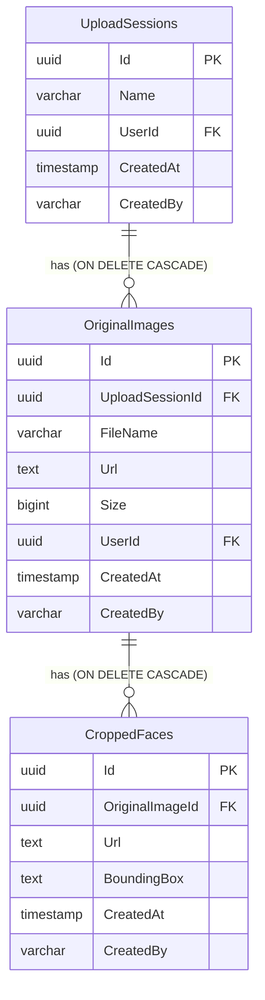

# Giải pháp Phát triển Nghiệp vụ Nhận diện Khuôn mặt (nhan-dien-khuon-mat)

Tài liệu này trình bày giải pháp chi tiết và sơ đồ thiết kế cho module **Nhận diện khuôn mặt** nhằm đáp ứng đầy đủ các yêu cầu nghiệp vụ mới và nâng cao tại [whattodo.md](whattodo.md), tuân thủ nghiêm ngặt quy trình và các nguyên tắc thiết kế hiện có của hệ thống **TreeOfThought**.

---

## 1. Tổng quan Kiến trúc Hệ thống

Giải pháp kết hợp xử lý trí tuệ nhân tạo (AI) hiệu năng cao trực tiếp trên trình duyệt (Client-side Edge AI) để tối ưu trải nghiệm và bảo mật dữ liệu, đồng thời sử dụng hệ thống lưu trữ và quản lý phiên tập trung trên Backend (Server-side, DB PostgreSQL & Google Cloud Storage):

```mermaid
graph TD
    A[Người dùng truy cập Nhận diện khuôn mặt] --> B{Giao diện Workspace Kép}
    
    %% Session làm việc %%
    subgraph Session làm việc (Active Working Session)
        B --> C[Nạp nguồn: Drag & Drop / Folder Picker / File Picker]
        C --> D[Cộng dồn vào hàng đợi Tệp tin nguồn - Cột trái]
        D --> E[Quét MediaPipe Face Detection tuần tự]
        E --> F[Chuyển ảnh có khuôn mặt sang Cột phải]
        F --> G[Xem trước Bounding Box & crop 150x150]
        G --> H[Toggle chọn Lưu/Bỏ ảnh gốc & từng ảnh crop]
        H --> I[Đặt tên Phiên & nhấn Lưu trữ]
        I --> J[Upload nhị phân lên GCS & URL vào DB PostgreSQL]
        J --> K[Realtime Firestore Event: Upload Completed]
        K --> L[Tự động Reset Session làm việc cục bộ]
    end
    
    %% Danh sách quản lý %%
    subgraph Danh sách quản lý (Historical Sessions List)
        B --> M[Bảng lịch sử các phiên upload]
        M --> N[Hành động: Đổi tên inline]
        M --> O[Hành động: Xem chi tiết]
        M --> P[Hành động: Xóa Phiên]
        
        O --> Q[Modal: Bảng chi tiết dòng ảnh gốc & mặt crop]
        Q --> R[Xóa ảnh gốc -> Cascade xóa tệp trên GCS & DB]
        Q --> S[Xóa ảnh crop -> Xóa riêng tệp trên GCS & DB]
        P --> T[Xóa Phiên -> Cascade xóa tất cả tệp liên quan trên GCS & DB]
    end
```

---

## 2. Thiết kế Chi tiết: Session Làm Việc (Active Working Session)

### 2.1. Nạp nguồn đa dạng & Cộng dồn (Multi-Source Input & Cumulative Loading)
- **Cơ chế nạp nguồn:**
  - Hỗ trợ **kéo thả (Drag & Drop)** tệp tin hoặc thư mục ảnh trực tiếp vào Dropzone.
  - Hỗ trợ **hộp thoại chọn (Picker dialog)** qua 2 nút bấm riêng biệt:
    - *Chọn thư mục ảnh:* Đọc đệ quy tất cả các file hình ảnh trong thư mục con (`webkitdirectory`).
    - *Chọn tệp tin ảnh:* Cho phép chọn đồng thời nhiều tệp ảnh đơn lẻ (`multiple`, `accept="image/*"`).
- **Hàng đợi cộng dồn (Cumulative queue):**
  - **"Có thể kéo thêm file ảnh hoặc folder vào session đã có để xử lý tiếp"**: Khi người dùng kéo thả hoặc picker chọn tệp tin/thư mục mới, hệ thống **không xóa** dữ liệu cũ đang hiển thị.
  - Các tệp tin mới sẽ được lọc định dạng ảnh (`image/*`) và tự động thêm tiếp (append) vào cuối mảng hàng đợi `sourceFiles` ở trạng thái `waiting` (Chờ quét).
  - Vòng lặp nhận diện MediaPipe sẽ chỉ chạy quét đối với các tệp tin mới được thêm vào hàng đợi.

### 2.2. Quy trình Quét và Trích xuất (Edge AI pipeline)
1. **Cột trái (Tệp tin nguồn):** Hiển thị danh sách tất cả các file ảnh trong phiên kèm thông số kích thước và trạng thái quét thời gian thực (`Chờ quét`, `Đang quét`, `Hoàn thành`, `Thất bại`).
2. **Quét MediaPipe:** Sử dụng **js MediaPipe Face Detection** chạy cục bộ qua WebGL/WebAssembly. Quét tuần tự từng ảnh bằng canvas offscreen.
3. **Cột phải (Ảnh chứa khuôn mặt):** Chỉ hiển thị các ảnh gốc có phát hiện khuôn mặt. Mỗi hàng hiển thị:
   - Canvas vẽ ảnh gốc cùng các bounding boxes màu xanh neon nổi bật bao quanh khuôn mặt.
   - Checkbox cho phép người dùng chọn xem có lưu tệp ảnh gốc này hay không (`Lưu ảnh gốc này`).
   - Lưới (Grid) các khuôn mặt đã crop (padding 15%, resize 150x150 JPEG). Mỗi mặt crop có switch toggle bật/tắt quyền lưu trữ (`Lưu` / `Bỏ`).

### 2.3. Đặt tên, Lưu trữ & Tự động Reset Session
- **Đặt tên phiên:** Hệ thống tự tạo đề xuất dạng `"Phiên ngày [dd/MM/yyyy HH:mm]"` và cho phép người dùng sửa đổi trực tiếp.
- **Lưu trữ:** Khi nhấn nút "Lưu trữ lên Server":
  - Tải nhị phân các tệp ảnh gốc và các ảnh crop được chọn lên Google Cloud Storage (GCS).
  - Lưu thông tin URL và siêu dữ liệu vào DB PostgreSQL.
  - Gửi sự kiện realtime Firestore về kênh `commandresults/{trackingId}` báo trạng thái `Completed`.
- **Reset session làm việc & Reload Danh sách:**
  - **"Lưu xong sẽ reset session làm việc và reload lại Danh sách quản lý"**: Ngay khi nhận được thông báo lưu trữ thành công, hệ thống sẽ thực thi đồng thời hai hành động:
    1. **Reload Danh sách:** Gọi `loadUploadSessions()` để tải lại toàn bộ danh sách lịch sử phiên ở bảng quản lý phía dưới, cập nhật tức thời phiên vừa được lưu lên giao diện.
    2. **Reset Session:** Thực thi hàm `resetAll()` để dọn sạch hoàn toàn không gian làm việc (giải phóng URL Blob cục bộ `URL.revokeObjectURL`, làm trống các danh sách hàng đợi `sourceFiles`, `processedPhotos`, reset bộ đếm `totalDetectedFacesCount` về 0), giúp màn hình trống sẵn sàng cho phiên tải mới.

---

## 3. Thiết kế Chi tiết: Danh Sách Quản Lý & Cascade GCS Cleaners

### 3.1. Danh sách Quản lý Phiên (Historical Session List)
- Hiển thị bảng danh sách các phiên upload đã lưu trữ của người dùng sắp xếp giảm dần theo thời gian tạo.
- Cột thông tin bao gồm: Tên phiên, Người tải lên, Thời gian tải lên, Số lượng ảnh gốc.
- **Hành động Đổi tên inline:** Cho phép người dùng bấm "Đổi tên" để hiện ô input sửa đổi tên trực tiếp, cập nhật ngay lập tức xuống DB PostgreSQL thông qua REST API tối giản (KISS).

### 3.2. Xem Chi tiết & Quản lý dòng (Detailed Session Modal)
- Khi bấm nút **"Xem"**, một modal premium hiển thị danh sách dạng hàng (Rows). Mỗi hàng gồm:
  - Cột 1: Ảnh gốc hiển thị preview thu nhỏ kèm tên và dung lượng tệp.
  - Cột 2: Lưới các khuôn mặt đã crop được trích xuất và lưu trữ của ảnh gốc đó. Mỗi avatar có nút bấm `x` màu đỏ nổi để thực hiện xóa.
  - Cột 3: Nút hành động **"Xóa ảnh gốc"**.
- **Cơ chế xóa đơn lẻ trong modal chi tiết:**
  - **Xóa ảnh gốc:** Tiến hành xóa tệp ảnh gốc vật lý trên GCS, xóa tất cả các tệp ảnh crop vật lý liên kết trên GCS, sau đó xóa bản ghi ảnh gốc trong DB (kích hoạt cascade delete xóa sạch các bản ghi ảnh crop tương ứng ở mức DB).
  - **Xóa ảnh crop:** Tiến hành xóa tệp ảnh crop vật lý tương ứng trên GCS và xóa bản ghi đơn lẻ trong DB.

### 3.3. Xóa Phiên & Đồng bộ GCS (Cascade GCS Cleanup Lifecycle)
- **"do dùng google cloud storage lưu file nên khi xóa cần xóa cả trên GCS"**: Khi người dùng nhấn nút "Xóa" một Phiên upload trên bảng quản lý:
  - Hệ thống truy vấn toàn bộ các ảnh gốc và ảnh crop thuộc phiên đó từ DB.
  - Gọi bất đồng bộ dịch vụ `FirebaseService.DeleteFileAsync(objectName)` xóa toàn bộ các tệp tin vật lý tương ứng trên Cloud Storage.
  - Tiến hành xóa bản ghi `UploadSession` trong DB (hệ thống PostgreSQL sẽ tự động cascade dọn sạch các dòng bản ghi trong bảng `OriginalImages` và `CroppedFaces`).
- **Xử lý an toàn (Try-Catch):** Mọi thao tác xóa tệp trên GCS được bọc trong khối Try-Catch và ghi log cảnh báo (`LogWarning`) nếu gặp sự cố đám mây, đảm bảo không làm gián đoạn hay kẹt giao dịch xóa cơ sở dữ liệu của người dùng.

---

## 4. Thiết kế Thực thể Dữ liệu (Database Schema)

Cơ sở dữ liệu PostgreSQL `tot_db` quản lý 3 bảng thực thể với liên kết chặt chẽ:



---

## 5. Quy hoạch RESTful API Endpoints (FaceDetectionController.cs)

Các API quản lý trực tiếp qua DbContext được thiết kế tối giản, loại bỏ nợ kỹ thuật:

| Phương thức | API Endpoint | Mô tả | Chi tiết dọn dẹp tệp vật lý |
| :--- | :--- | :--- | :--- |
| `POST` | `/api/face-detection/save` | Lưu ảnh gốc & mặt crop theo phiên | Tải tệp tin lên GCS |
| `GET` | `/api/face-detection/sessions` | Lấy danh sách các phiên upload | Không |
| `GET` | `/api/face-detection/sessions/{id}` | Lấy chi tiết ảnh gốc & crop của phiên | Không |
| `PUT` | `/api/face-detection/sessions/{id}/rename` | Đổi tên phiên upload | Không |
| `DELETE` | `/api/face-detection/sessions/{id}` | Xóa toàn bộ phiên upload | **Xóa tất cả** tệp ảnh gốc & crop trên GCS |
| `DELETE` | `/api/face-detection/images/{id}` | Xóa đơn lẻ ảnh gốc | **Xóa tệp ảnh gốc & các mặt crop** trên GCS |
| `DELETE` | `/api/face-detection/faces/{id}` | Xóa đơn lẻ ảnh khuôn mặt crop | **Xóa tệp ảnh crop tương ứng** trên GCS |
