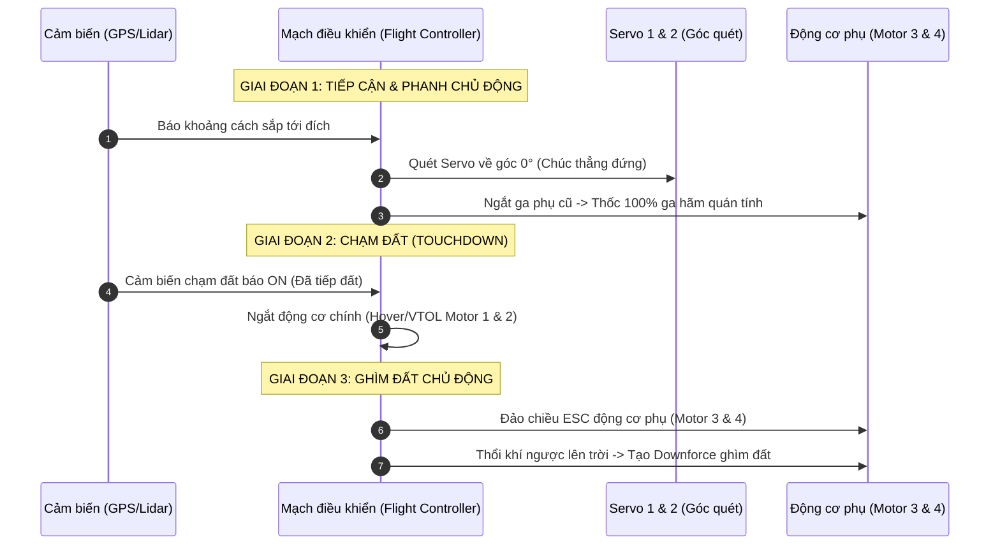

# Sơ đồ cấu tạo và điều khiển UAV

## 1. Sơ đồ thiết kế vật lý UAV

### Góc nhìn từ trên xuống (Top View)

```text
                                    MŨI UAV (HƯỚNG TIẾN)
                                            ▲
                                            │
                    [Cánh tay đòn Trái]     │     [Cánh tay đòn Phải]
                        ┌──────────────────────┼──────────────────────┐
                        │                      │                      │
                ┌────┴────┐           ┌───────────┐           ┌────┴────┐
                │ SERVO 1 │           │  CỤM GIỮA │           │ SERVO 2 │ <── Xoay góc 0 - 180°
                └────┬────┘           │ (Đồng trục│           └────┬────┘
                        │                │ Đồng tốc) │                │
                ┌────┴────┐           └─────┬─────┘           ┌────┴────┐
                │ MOTOR 3 │ <─Quạt phụ      │                 │ MOTOR 4 │ <─Quạt phụ
                └─────────┘   (Trái)        │                 └─────────┘   (Phải)
                                            │
                                            │
                                        ĐUÔI UAV (HƯỚNG LÙI)
```

---

### Góc nhìn chính diện phía trước (Front View) - Trạng thái VTOL (Cất cánh / Giữ độ cao)

```text
                                    [Trục trung tâm cố định]
                                            │
                                    ┌───────┴───────┐
                                ▲     │ ┌───────────┐ │     ▲
                    Gió thổi   │ │    │ │  MOTOR 1  │ │    │ │   Gió thổi
                    xuống đất  │ │    │ │ (Quay CW) │ │    │ │   xuống đất
                                ▼      │ └─────┬─────┘ │      ▼
                    ┌──────────────┐   │   ┌───┴───┐   │   ┌──────────────┐
                    │ CÁNH PHỤ TRÁI│   │   │ CÁNH  │   │   │ CÁNH PHỤ PHẢI│ (Servo 1 & 2 xoay
                    └──────────────┘   │   │ TRÊN  │   │   └──────────────┘  trục chúc thẳng
                    ┌──────────────┐   │   └───────┘   │   ┌──────────────┐  xuống 90 độ)
                    │   MOTOR 3    │   │               │   │   MOTOR 4    │
                    └──────┬───────┘   │   ┌───────┐   │   └──────┬───────┘
                        │           │   │ CÁNH  │   │          │
                    ┌─────┴─────┐     │   │ DƯỚI  │   │    ┌─────┴─────┐
                    │  SERVO 1  │     │   └───┬───┘   │    │  SERVO 2  │
                    └─────┬─────┘     │ ┌─────┴─────┐ │    └─────┬─────┘
                        │           │ │  MOTOR 2  │ │          │
                        │           │ │ (Quay CCW)│ │          │
                        │           │ └───────────┘ │          │
                    ───────┴───────────┴───────┬───────┴──────────┴─────── [Cánh tay đòn carbon]
                                            │
                                        ┌─────┴─────┐
                                        │   KHUNG   │ ───> Nơi đặt Arduino Nano, Pin LiPo,
                                        │   TRUNG   │      Mạch nRF24L01 nhận tín hiệu từ
                                        │   TÂM     │      Bàn đạp chân ga & Tay Joystick
                                        └───────────┘
```

---

### Bàn điều khiển chính (Manual Control - Đặt trên bàn, dùng 2 tay 2 chân)

```text
                    [JOYSTICK TRÁI]                                    [JOYSTICK PHẢI]
                    (Tay trái lo Hướng)                            (Tay phải lo Di chuyển)
                    
                            ▲ Xoay Trái                                    ▲ Lao Tiến
                            │                                              │
                    ◄───────┼───────►                              ◄───────┼───────►
                    Nghiêng  │  Nghiêng                             Bay      │  Bay
                    Trái     ▼  Phải                                Trái     ▼  Lùi
                        Xoay Phải                                       Bay Phải
                        
                (Dùng để điều chỉnh                              (Dùng để di chuyển không gian
                    hướng mũi UAV Đông-Tây)                          hoặc thực hiện cú Lật bụng)

                [CHÂN TRÁI - PHANH]                     [CHÂN PHẢI - GA NÂNG HẠ]
                    ┌───────────────────────┐                ┌───────────────────────┐
                    │    BÀN ĐẠP PHANH CHÂN │                │    BÀN ĐẠP CHÂN GA    │
                    │     (AIR BRAKE PEDAL) │                │    (THROTTLE PEDAL)   │
                    │                       │                │                       │
                    │          ▲            │                │          ▲            │
                    │         ╱ ╲           │                │         ╱ ╲           │
                    │        ╱   ╲          │                │        ╱   ╲          │
                    │       ╱  ▲  ╲         │                │       ╱  ▲  ╲         │
                    │      ╱   │   ╲        │                │      ╱   │   ╲        │
                    │     ╱    │    ╲       │                │     ╱    │    ╲       │
                    └────┴─────┴─────┴──────┘                └────┴─────┴─────┴──────┘
                    Đạp xuống: Kích hoạt PHANH               Đạp xuống: TĂNG ĐỘ CAO
                    Nhả chân:  Bay bình thường               Nhả chân:  GIẢM ĐỘ CAO / HẠ CÁNH
```

---

## 2. Hệ thống điều khiển tự động (Auto Control)

### Bảng chuyển đổi từ cơ cấu thủ công sang hệ thống tự động trên UAV

| Cơ cấu tay / chân thủ công (GCS) | Cảm biến thay thế trên UAV | Thuật toán Auto xử lý (Mô phỏng hành vi) |
| :--- | :--- | :--- |
| **Chân phải:** Bàn đạp chân ga nâng hạ | Cảm biến áp suất (Barometer) + Lidar quét đất | **PID Độ cao (Altitude PID):** Tự động giữ cụm đồng trục giữa ở mức ga treo (Hover), tăng ga cất cánh hoặc giảm dần ga để đáp. |
| **Joystick phải (Dọc):** Tiến / Lùi | Module GPS + IMU (Đo vận tốc thực) | **PID Vị trí (Position PID):** Tính khoảng cách tới đích. Khoảng cách càng xa, tự động quét 2 Servo sườn ra sau càng sâu để tăng tốc. |
| **Joystick phải (Ngang):** Nghiêng sườn / Lật bụng | Cảm biến góc nghiêng (Gyro/Accel 6 trục) | **PID Thăng bằng (Attitude PID):** Liên tục kiểm tra góc Roll. Tự động bù vi sai ga cho Motor 3 & 4 để ghìm UAV chống gió tạt sườn. |
| **Joystick trái (Dọc):** Xoay hướng mũi tàu (Yaw) | Cảm biến La bàn số (Magnetometer) | **PID Hướng mũi (Heading PID):** Tính góc lệch giữa mũi tàu và Đích, tự động bẻ Servo 1 & 2 nghiêng ngược chiều nhau để xoay hướng. |
| **Chân trái:** Bàn đạp Phanh khẩn cấp & Ghìm đất | GPS (Vận tốc) + Lidar (Khoảng cách) + Cảm biến chạm đất (Landing Gear Switch) | **Thuật toán Phanh & Ghìm nền chủ động:** <br>1. *Khi sắp tới đích:* Ngắt ga phụ → quét servo về 0° → thốc 100% ga quạt phụ hãm quán tính.<br>2. *Khi cảm biến báo đã chạm đất:* Đảo chiều ESC động cơ phụ, **thổi ngược lên trời** tạo lực ép (Downforce) khóa chặt thân xe/máy bay xuống mặt đất. |

---

### Phân tích logic xử lý của "Thuật toán Ghìm đất"

Để thực hiện ý tưởng đảo chiều động cơ phụ tạo lực ép xuống mặt đất, cấu hình phần cứng và phần mềm ở hàng cuối cùng sẽ hoạt động theo kịch bản 3 giai đoạn nghiêm ngặt:

#### Sơ đồ tuần tự điều khiển (Sequence Workflow)



**Mô tả chi tiết 3 giai đoạn:**
* **Giai đoạn 1 (Tiếp cận & Phanh chủ động):** Khi UAV sắp đến vị trí đích (dựa trên GPS và Lidar quét khoảng cách), hệ thống ngắt chế độ bay tiến của động cơ phụ, điều khiển Servo 1 & 2 quét góc về 0° (chúc thẳng đứng) và tăng tối đa 100% ga quạt phụ hướng ngược chiều chuyển động để tạo lực cản (phanh) nhằm giảm nhanh quán tính.
* **Giai đoạn 2 (Chạm đất - Touchdown):** Cảm biến chạm đất (Landing Gear Switch) ghi nhận tín hiệu tiếp đất hoàn toàn. Hệ thống lập tức tắt động cơ chính (Motor 1 & 2 của cụm đồng trục đồng tốc) để triệt tiêu toàn bộ lực nâng.
* **Giai đoạn 3 (Ghìm đất - Active Downforce):** ESC đảo chiều quay của động cơ phụ (Motor 3 & 4). Lúc này quạt thổi luồng khí hướng lên trời, tạo lực đè xuống đất (Downforce) để cố định chắc chắn UAV, tránh hiện tượng trượt, lật do gió mạnh hoặc địa hình dốc.

---

## 3. Tính toán cấu hình động cơ, cánh quạt và pin (Thời gian bay ~60 phút)

| Tải trọng hữu ích (Payload) | Khung gầm & Số động cơ | Cấu hình Động cơ (Motor) | Kích thước Cánh (Propeller) | Cấu hình Pin Li-Ion (Thời gian bay ~60 phút) | Tổng trọng lượng cất cánh (MTOW) |
| :--- | :--- | :--- | :--- | :--- | :--- |
| **0.5 kg** | Quadcopter (4 động cơ)<br>Khung Carbon 7-8 inch | **Động cơ:** 2208 - 2506<br>**KV:** 900 - 1200 KV | 7 x 4.5 hoặc 8 x 4.5 inch<br>(Cánh dòng hiệu suất cao) | **Pin:** 4S4P hoặc 4S5P Li-Ion<br>**Dung lượng:** ~14.000 - 17.500 mAh<br>**Cell:** Molicel P45B hoặc Samsung 50S | ~ 1.5 - 1.8 kg |
| **1.0 kg** | Quadcopter (4 động cơ)<br>Khung Carbon 10-12 inch | **Động cơ:** 2808 - 3110<br>**KV:** 500 - 700 KV | 10 x 4.5 hoặc 11 x 4.7 inch<br>(Carbon/Nhựa cứng) | **Pin:** 6S4P hoặc 6S5P Li-Ion<br>**Dung lượng:** ~16.000 - 20.000 mAh<br>**Cell:** Molicel P45B / Samsung 50S | ~ 2.8 - 3.2 kg |
| **5.0 kg** | Hexacopter (6 động cơ)<br>Khung Carbon 22-24 inch | **Động cơ:** 6010 - 8010<br>**KV:** 130 - 180 KV | 22x7.4 hoặc 24x8.0 inch<br>(Cánh Carbon chuyên dụng) | **Pin:** 12S6P hoặc 12S8P Li-Ion<br>**Dung lượng:** ~27.000 - 36.000 mAh<br>**Cell:** Molicel P45B (Ghép khối lớn) | ~ 12 - 14 kg |
| **10.0 kg** | Octacopter (8 động cơ) hoặc Heavy Hexa<br>Khung Carbon 28-30 inch | **Động cơ:** 8018 - 10010<br>**KV:** 100 - 120 KV | 28x9.2 hoặc 30x10 inch<br>(Cánh Carbon High-Efficiency) | **Pin:** 14S10P hoặc 14S12P Li-Ion<br>**Dung lượng:** ~45.000 - 54.000 mAh<br>**Hệ thống pin:** Kết hợp nhiều khối 14S | ~ 25 - 28 kg |

---

### Các nguyên tắc vàng để đạt thời gian bay 60 phút

#### 1. Chọn loại Pin: Bắt buộc dùng Li-Ion (Không dùng Li-Po)
* **Lý do:** Pin Li-Po thông thường chỉ có mật độ năng lượng khoảng `150-180 Wh/kg` (chỉ bay được 15-25 phút). Để bay 60 phút, bạn bắt buộc phải đóng mạch pin bằng các cell **Li-Ion 21700** chất lượng cao (như *Molicel P45B* hoặc *Samsung 50S*), có mật độ năng lượng đạt `240-260 Wh/kg`.
* **Đặc tính:** Pin Li-Ion có dòng xả thấp hơn Li-Po, nên hệ thống động cơ cần ăn dòng thấp (Amperage thấp) nhưng áp phải cao (Volt cao -> chọn hệ pin nhiều S như 6S, 12S, 14S).

#### 2. Tỷ lệ Công suất / Trọng lượng (Thrust-to-Weight Ratio)
* Để bay bền bỉ và tiết kiệm năng lượng, tỷ lệ lực đẩy tối đa (Max Thrust) so với trọng lượng cất cánh (MTOW) chỉ nên nằm ở mức **2:1** đến **1.8:1**. 
* Ở trạng thái bay treo (Hover), động cơ chỉ nên chạy ở mức **45% - 50% ga (Throttle)**. Nếu ga treo vượt quá 60%, UAV sẽ ngốn pin cực nhanh và không bao giờ đạt được mốc 1 tiếng.

#### 3. Chỉ số Hiệu suất Động cơ + Cánh (Efficiency - g/W)
* Để đạt 60 phút bay, hệ thống động cơ và cánh quạt của bạn phải đạt hiệu suất cực cao ở mức ga treo:
  * Tải nhỏ (0.5kg - 1kg): Hiệu suất phải đạt từ **7g - 9g lực đẩy trên 1 Watt điện**.
  * Tải lớn (5kg - 10kg): Hiệu suất phải đạt từ **10g - 13g lực đẩy trên 1 Watt điện** (Yêu cầu cánh quạt siêu lớn, quay chậm để tối ưu khí động học).

#### 4. Bài toán Đảo chiều Động cơ phụ (Ghìm đất) từ bảng trước
* Do hệ thống của bạn có động cơ phụ bẻ hướng (Servo) và đảo chiều (Reverse ESC), hãy lưu ý: **Chỉ đảo chiều khi đã chạm đất hoàn toàn**. 
* Tuyệt đối không kích hoạt tính năng đảo chiều khi đang bay trên không vì cánh quạt hiệu suất cao (loại mỏng, bản to tối ưu cho bay 1 tiếng) khi quay ngược sẽ có hiệu suất khí động học cực kém và gây sụt áp pin Li-Ion rất nhanh, dễ dẫn đến hiện tượng sập nguồn (Voltage Sag).