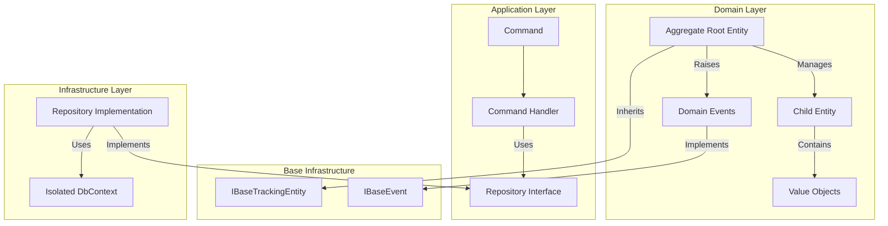
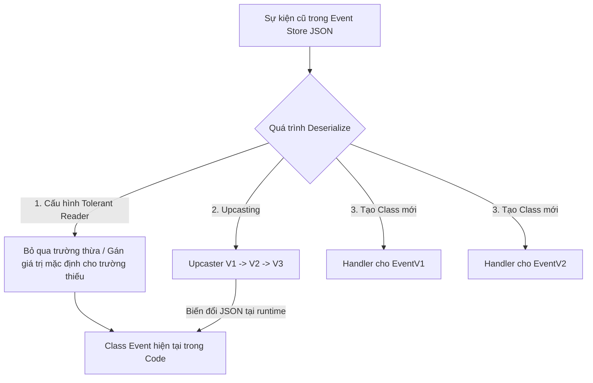
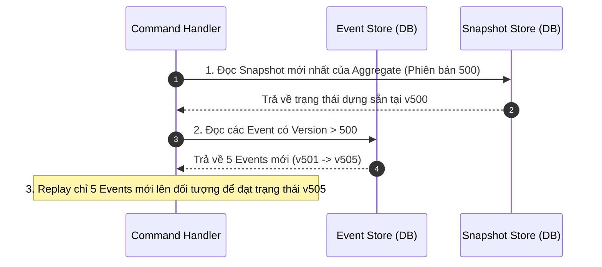

# Hỏi & Đáp: Triển Khai DDD và Event Sourcing trong TreeOfThought

Dưới đây là tài liệu hướng dẫn toàn diện về cách triển khai **Domain-Driven Design (DDD)** và giải quyết các bài toán thực tế liên quan đến **Event Sourcing**, đặc biệt là vấn đề **tiến hóa cấu trúc Sự kiện (Event Schema Evolution)**, **tác động của CQRS sẵn có** và **bài toán tối ưu hiệu năng (Replay millions of events)**.

---

## 🙋‍♂️ Phần 1: Để triển khai DDD tôi cần làm gì?

Triển khai **Domain-Driven Design (DDD)** trong hệ thống **TreeOfThought** không chỉ đơn thuần là áp dụng các mẫu thiết kế code (Design Patterns) mà là một quy trình kết hợp chặt chẽ giữa **Thiết kế Chiến lược (Strategic Design)** và **Thiết kế Chiến thuật (Tactical Design)** trên nền tảng triết lý **KISS** và **DRY**.

### 1. Thiết kế Chiến lược (Strategic Design)

Đây là bước quan trọng nhất nhằm phân chia ranh giới nghiệp vụ và cấu trúc dự án trước khi viết dòng code đầu tiên.

* **Xác định Bounded Context (Ngữ cảnh Ranh giới)**: Mỗi nghiệp vụ mới bắt buộc phải là một **Bounded Context** độc lập và cô lập hoàn toàn (ví dụ: `business-oidc`, `business-files`, `quan-ly-luong`).
  * **Quy tắc đặt tên folder**: Tên folder là tiếng Việt không dấu, phân tách bằng dấu gạch ngang (Kebab-case), ví dụ: `quan-ly-luong-nhan-vien`.
    * **Tài liệu (Docs)**: `TreeOfThought/docs/quan-ly-luong-nhan-vien/`
    * **Backend (BE)**: `TreeOfThought/backend/quan-ly-luong-nhan-vien/`
    * **Frontend (FE)**: `TreeOfThought/frontend/web/projects/tot/quan-ly-luong-nhan-vien/`
* **Định nghĩa Ngôn ngữ Chung (Ubiquitous Language)**: Viết toàn bộ yêu cầu, thuật ngữ, luật lệ nghiệp vụ và các ràng buộc dữ liệu vào file `docs/{ten-nghiep-vu}/whattodo.md`.
* **Vẽ Bản đồ Tích hợp (Context Mapping)**:
  * **Không gọi chéo trực tiếp**: Nghiêm cấm việc Add Reference hoặc gọi trực tiếp code từ module nghiệp vụ này sang module nghiệp vụ khác.
  * **Giao tiếp lỏng (Loose Coupling)**: Giao tiếp liên nghiệp vụ bắt buộc phải đi qua **Command/Event in-memory** (`Core.Infra.Cqrs`) hoặc **Redis Pub/Sub** (`Core.Infra.Redis`).
  * **Cô lập Database**: Mỗi nghiệp vụ sở hữu cơ sở dữ liệu riêng. Connection string phải cấu hình cô lập trong `appsettings.json` với key là tên nghiệp vụ: `"{TenNghiepVu}:Postgresql"`.
  * **Truy vấn Read-Only**: Nếu cần truy vấn dữ liệu từ bảng của module khác, cho phép tạo một `DbContext` phụ ngay tại module hiện tại nhưng chỉ cấu hình ở chế độ **Read-only**.

### 2. Thiết kế Chiến thuật (Tactical Design) tại Backend (.NET)



* **Entities & Aggregate Roots**:
  * Entities là các đối tượng có định danh duy nhất (`Id`). Bắt buộc kế thừa từ `IEntity<TKey>` hoặc `IBaseTrackingEntity<TKey>`.
  * **Rich Domain Model**: Tránh thiết kế thực thể Anemic (chỉ chứa các thuộc tính `get; set;` công khai trống rỗng). Đóng gói các thuộc tính nhạy cảm bằng setter giới hạn (`private` hoặc `protected set`). Viết các hàm nghiệp vụ ngay trong thực thể để kiểm soát trạng thái (ví dụ: `user.Activate()`).
  * **Aggregate Root**: Cổng giao tiếp duy nhất cho toàn bộ khối thực thể con liên quan để đảm bảo tính toàn vẹn nghiệp vụ (Invariants).
* **Value Objects (Đối tượng Giá trị)**:
  * Các đối tượng không có định danh độc lập, được định nghĩa hoàn toàn bởi giá trị của các thuộc tính (ví dụ: `Address`, `Money`).
  * **Bắt buộc Bất biến (Immutable)**: Chỉ cho phép thiết lập giá trị qua constructor, không có public setter.
* **Repositories**: Chỉ tạo Repository cho các **Aggregate Root** để quản lý lưu trữ qua DbContext nghiệp vụ.
* **Domain Events**: Khi Aggregate Root thay đổi trạng thái cốt lõi, phát sinh một Domain Event kế thừa từ `IBaseEvent` để CQRS Handler xử lý các tác vụ phụ bất đồng bộ.

---

## 🙋‍♂️ Phần 2: Vấn đề Event Sourcing?

### 1. Bản chất của Event Sourcing

**Event Sourcing** là một kiến trúc trong đó trạng thái hiện tại của ứng dụng không được lưu trực tiếp bằng cách ghi đè lên dòng dữ liệu hiện tại, mà được **tái tạo hoàn toàn** bằng cách lưu lại chuỗi các sự kiện biến động trạng thái (Event Stream) theo thứ tự thời gian vào một **Event Store** (CSDL chỉ cho phép ghi đè/thêm mới - Append-only).

* *Ví dụ về Tài khoản ngân hàng*:
  * *Lưu trữ truyền thống*: Lưu số dư hiện tại là `100$`.
  * *Event Sourcing*: Lưu chuỗi sự kiện: `AccountOpened` (+0$) -> `MoneyDeposited` (+150$) -> `MoneyWithdrawn` (-50$). Trạng thái hiện tại được tính bằng cách chạy (replay) tất cả các sự kiện này từ đầu.

### 2. Ưu và nhược điểm của Event Sourcing

| Ưu điểm | Nhược điểm |
| :--- | :--- |
| **Audit Log Hoàn Hảo**: Lịch sử biến động dữ liệu được lưu trữ chính xác 100%, không thể bị sửa xóa hay chối bỏ (immutable audit log). | **Độ phức tạp cao**: Việc thiết kế hệ thống, truy vấn dữ liệu hiện tại đòi hỏi kỹ năng lập trình tốt. |
| **Khôi phục trạng thái bất kỳ**: Dễ dàng tái hiện lại trạng thái của hệ thống tại bất kỳ thời điểm nào trong quá khứ để debug hoặc phân tích dữ liệu. | **Hiệu năng Replay**: Khi số lượng sự kiện quá lớn, việc replay từ đầu sẽ chậm (cần áp dụng kỹ thuật **Snapshotting** để lưu trạng thái trung gian). |
| **Tách biệt Đọc/Ghi (CQRS)**: Cực kỳ phù hợp khi kết hợp với CQRS. Phía ghi chỉ cần append sự kiện cực nhanh, phía đọc sử dụng Projections để tạo ra các view CSDL phẳng phục vụ UI. | **Sự tiến hóa của Schema**: Khi nghiệp vụ thay đổi, cấu trúc của các lớp Event (Class Event) thay đổi theo thời gian, dẫn đến xung đột dữ liệu cũ - mới. |

---

## 🙋‍♂️ Phần 3: Nếu đã khai báo class Event và dữ liệu đã đưa vào Event Sourcing, sau này muốn thay đổi cấu trúc class Event thì làm sao?

Đây là thử thách kinh điển và thực tế nhất khi vận hành Event Sourcing. Vì **Event Store là bất biến (Immutable)**, chúng ta **tuyệt đối không được thực hiện lệnh `UPDATE` hoặc `DELETE` dữ liệu Event cũ trong cơ sở dữ liệu** để tránh phá vỡ tính toàn vẹn và lịch sử của hệ thống.

Để giải quyết vấn đề tiến hóa cấu trúc sự kiện (Event Schema Evolution), thế giới phát triển phần mềm áp dụng 4 chiến thuật chuẩn mực dưới đây:



---

### 🚀 Chiến thuật 1: Upcasting (Bộ nâng cấp sự kiện tại Runtime - KHUYÊN DÙNG NHẤT)

Đây là cách giải quyết triệt để, thanh lịch và chuẩn DDD nhất.

* **Cách hoạt động**:
  * Dữ liệu thô (JSON) của Event cũ (ví dụ: phiên bản 1 - V1) được đọc ra từ Event Store.
  * Trước khi chuyển đổi (deserialize) thành đối tượng Class C# trong code, JSON này sẽ đi qua một bộ lọc trung gian gọi là **Upcaster**.
  * Upcaster sẽ thực hiện ánh xạ, thêm bớt thuộc tính trực tiếp trên chuỗi JSON để nâng cấp nó từ cấu trúc V1 lên cấu trúc V2 mới nhất.
  * Sau đó, hệ thống tiến hành deserialize JSON đã nâng cấp thành Class Event phiên bản mới nhất trong mã nguồn.
* **Ví dụ minh họa (C#)**:
  * **V1 JSON trong DB**: `{"UserId": "123", "Name": "Nguyen Van A"}`
  * **Yêu cầu V2**: Tách thuộc tính `Name` thành `FirstName` và `LastName`.
  * **Upcaster Code**:

        ```csharp
        public class UserCreatedUpcaster : IUpcaster
        {
            public JObject Upcast(JObject oldJson, int oldVersion)
            {
                if (oldVersion == 1)
                {
                    var fullName = oldJson["Name"]?.ToString() ?? "";
                    var parts = fullName.Split(' ');
                    oldJson["FirstName"] = parts.FirstOrDefault() ?? "";
                    oldJson["LastName"] = string.Join(" ", parts.Skip(1));
                    oldJson.Remove("Name"); // Xóa thuộc tính cũ
                }
                return oldJson;
            }
        }
        ```

* **Ưu điểm**: Giúp mã nguồn cực kỳ sạch sẽ vì code ứng dụng chỉ cần quan tâm và làm việc với Class Event phiên bản mới nhất. Dữ liệu lịch sử trong DB vẫn giữ nguyên vẹn 100%.

---

### 🚀 Chiến thuật 2: Áp dụng Quy tắc Đọc Khoan Dung (Tolerant Reader)

Áp dụng cho các thay đổi đơn giản và không phá vỡ cấu trúc (Non-breaking changes).

* **Cách hoạt động**:
  * Cấu hình thư viện tuần tự hóa (System.Text.Json hoặc Newtonsoft.Json) hoạt động ở chế độ "khoan dung".
  * **Thêm thuộc tính mới**: Class Event trong code được bổ sung thuộc tính mới nhưng bắt buộc phải có **giá trị mặc định** hoặc cho phép nhận giá trị `null` (Nullable). Khi deserialize Event cũ không có trường này, hệ thống tự động gán giá trị mặc định mà không báo lỗi.
  * **Xóa thuộc tính cũ**: Cấu hình Deserializer bỏ qua các thuộc tính thừa trong JSON không khớp với Class Event hiện tại trong code.
* **Ví dụ minh họa (C#)**:

    ```csharp
    // Cấu hình Newtonsoft.Json để bỏ qua trường thừa
    var settings = new JsonSerializerSettings
    {
        MissingMemberHandling = MissingMemberHandling.Ignore,
        NullValueHandling = NullValueHandling.Ignore
    };
    ```

* **Ưu điểm**: Cực kỳ đơn giản, không tốn công viết code chuyển đổi nếu chỉ là thêm hoặc bớt trường tùy chọn.

---

### 🚀 Chiến thuật 3: Định nghĩa Class Event mới riêng biệt (Versioning qua Tên Class)

Áp dụng khi cấu trúc thay đổi quá sâu sắc và không thể ánh xạ đơn giản từ cấu trúc cũ sang cấu trúc mới.

* **Cách hoạt động**:
  * Giữ nguyên Class cũ trong code và đặt tên rõ ràng là phiên bản 1 (ví dụ: `UserRegistered` hoặc `UserRegisteredV1`).
  * Tạo một Class mới hoàn toàn đại diện cho phiên bản 2 (ví dụ: `UserRegisteredV2`).
  * Hệ thống sẽ duy trì cả hai Class này trong mã nguồn.
  * **Phía Ghi (Write Side)**: Chỉ phát ra sự kiện `UserRegisteredV2`.
  * **Phía Đọc (Read Side / Projections)**: Viết các Event Handler tương ứng cho cả hai sự kiện: `Handle(UserRegisteredV1 ev)` và `Handle(UserRegisteredV2 ev)`.
* **Ưu điểm**: Rất an toàn, trực quan, không có logic chuyển đổi ngầm.
* **Nhược điểm**: Làm phình to số lượng Class Event trong mã nguồn theo thời gian (Tech debt về mặt số lượng Class).

---

### 🚀 Chiến thuật 4: Di chuyển dữ liệu bằng cơ chế Sao chép & Chuyển đổi (Copy-and-Transform Migration)

Áp dụng cho những thay đổi mang tính cách mạng toàn hệ thống, cấu trúc cũ và mới khác biệt hoàn toàn về mặt logic kiến trúc.

* **Cách hoạt động**:
  * Viết một tool/script migration chạy ngầm hoặc ngoại tuyến.
  * Đọc toàn bộ luồng sự kiện từ Event Store cũ.
  * Chuyển đổi các sự kiện cũ thành các sự kiện mới theo logic nghiệp vụ mới.
  * Ghi toàn bộ sự kiện đã chuyển đổi sang một **Event Store mới** (hoặc Stream mới).
  * Chuyển hướng hệ thống sang sử dụng Event Store mới và xóa/lưu trữ Event Store cũ.
* **Ưu điểm**: Giải quyết triệt để và làm sạch hoàn toàn cơ sở dữ liệu Event Store.
* **Nhược điểm**: Rất tốn kém tài nguyên, đòi hỏi hệ thống phải tạm dừng hoạt động (Downtime) và có rủi ro cao về sai lệch dữ liệu nếu logic script migration bị lỗi.

---

## 🙋‍♂️ Phần 4: Việc viết code có phức tạp hơn không? Tôi đang có CQRS design sẵn rồi?

### 💡 Câu trả lời: KHÔNG phức tạp hơn, thậm chí cực kỳ TỰ NHIÊN

Nếu hệ thống của bạn **đã có sẵn thiết kế CQRS** (Command Query Responsibility Segregation) hoạt động tốt, xin chúc mừng: **Bạn đã giải quyết được 80% phần khó nhất của Event Sourcing!**

CQRS và Event Sourcing là cặp bài trùng sinh ra để dành cho nhau. Việc đưa Event Sourcing vào một hệ thống CQRS sẵn có diễn ra cực kỳ mượt mà vì bạn đã tách biệt hoàn toàn luồng Ghi (Write/Command) và luồng Đọc (Read/Query).

#### So sánh sự thay đổi về mặt viết code

| Thành phần | Khi chỉ có CQRS truyền thống | Khi có thêm Event Sourcing | Đánh giá độ phức tạp |
| :--- | :--- | :--- | :--- |
| **1. UI / API** | Gửi Command qua REST API. | Giữ nguyên 100% không đổi. | Không đổi |
| **2. Command Handler** | 1. Load Entity hiện tại từ DB.<br>2. Gọi hàm xử lý nghiệp vụ.<br>3. `DbContext.SaveChanges()`. | 1. Load **Event Stream** của Aggregate đó từ Event Store.<br>2. Replay các event cũ để tái tạo Aggregate lên bộ nhớ.<br>3. Gọi nghiệp vụ phát sinh Event mới.<br>4. Lưu **Event mới** vào Event Store. | Phức tạp nhẹ ở khâu load/save dữ liệu thông qua Repository. |
| **3. Aggregate Root** | Chứa các property và logic nghiệp vụ. Thay đổi property trực tiếp. | Có thêm hàm `Apply(event)` để cập nhật các thuộc tính in-memory khi tái tạo lại đối tượng. | Viết thêm các hàm Apply đơn giản (Ví dụ: `Apply(UserCreated e) { Id = e.UserId; }`). |
| **4. Read Database (Projections)** | Lắng nghe Event từ Message Bus/Redis PubSub để cập nhật Database Đọc. | Giữ nguyên 100%. Các Handler/Projection cũ vẫn nhận Event và cập nhật CSDL truy vấn phẳng như trước. | Không đổi |

#### Kết luận

Nhờ hạ tầng CQRS sẵn có (`Core.Infra.Cqrs`), việc chuyển sang Event Sourcing chỉ đơn giản là **thay đổi cách bạn đọc và lưu dữ liệu ở phía Command Handler** (thay vì dùng EF Core map bảng trực tiếp, bạn lưu chuỗi sự kiện thô). Bạn hoàn toàn kiểm soát được độ phức tạp này một cách cực kỳ tinh gọn.

---

## 🙋‍♂️ Phần 5: Việc build một đối tượng nghiệp vụ lên bộ nhớ để gọi nghiệp vụ có bị quá chậm nếu event lên cả triệu bản ghi?

### 💡 Câu trả lời: TUYỆT ĐỐI KHÔNG! Vì 3 nguyên lý kỹ thuật cốt lõi sau

Nhiều người mới tiếp cận thường lo sợ khi dữ liệu toàn hệ thống lên hàng triệu hoặc hàng tỷ bản ghi thì việc replay sự kiện sẽ làm "sập" bộ nhớ hoặc chạy cực kỳ chậm. Tuy nhiên, trong thực tế sản xuất, điều này không bao giờ xảy ra nhờ các cơ chế tối ưu sau:

---

### 🚀 Nguyên lý 1: Sự kiện được cô lập theo Từng Aggregate Instance (Phạm vi cực nhỏ)

Khi bạn thực hiện một hành động nghiệp vụ (Command), bạn chỉ cần thao tác trên **một thực thể (Aggregate) duy nhất tại một thời điểm** (ví dụ: một User cụ thể, một Folder cụ thể, một Hóa đơn cụ thể).

* **Thực tế dữ liệu**:
  * Hệ thống có thể có **10.000.000 events** tổng cộng cho toàn bộ khách hàng.
  * Nhưng khách hàng `User_A` với ID `999` chỉ có tối đa khoảng **50 đến 100 events** liên quan trực tiếp đến lịch sử của riêng họ (ví dụ: `UserRegistered` -> `AvatarUpdated` -> `PasswordChanged` -> `LoggedIn`).
* **Truy vấn SQL tối ưu**:
    Khi load Aggregate từ Event Store, Repository chỉ thực hiện:

    ```sql
    SELECT * FROM Events WHERE AggregateId = 'User_A_ID' ORDER BY Version ASC;
    ```

    Truy vấn này chỉ lấy ra đúng **50 events** của `User_A` bằng Index chỉ trong **dưới 1 milisecond (ms)**. Việc replay 50 sự kiện trên CPU để dựng lại đối tượng in-memory diễn ra trong nano-giây.

---

### 🚀 Nguyên lý 2: Kỹ thuật Snapshotting (Lưu ảnh chụp trạng thái tức thời)

Đối với các thực thể đặc biệt có tần suất phát sinh sự kiện liên tục và tích lũy hàng ngàn hoặc hàng vạn events (ví dụ: Tài khoản ngân hàng có hàng ngàn giao dịch, thiết bị IoT gửi dữ liệu liên tục), hệ thống áp dụng kỹ thuật **Snapshotting**.



* **Cách hoạt động**:
  * Mỗi khi Aggregate Root đạt mốc $N$ sự kiện (ví dụ: cứ sau 100 events mới), hệ thống sẽ tự động chụp một bức ảnh trạng thái hiện tại (Snapshot) của Aggregate đó và lưu vào bảng `Snapshots` dạng JSON.
  * **Khi cần Rebuild Aggregate**:
        1. Repository tìm **Snapshot mới nhất** của Aggregate đó (ví dụ: Snapshot tại Version 500).
        2. Repository chỉ cần truy vấn thêm các **Events có Version > 500** (ví dụ: từ 501 đến 505).
        3. Replay chỉ **5 sự kiện** mới nhất này lên đối tượng vừa được dựng từ Snapshot.
* **Kết quả**: Dù đối tượng có lịch sử lên tới 1 triệu sự kiện, bạn chỉ mất đúng 1 lần đọc Snapshot và replay tối đa 99 sự kiện mới nhất để đưa đối tượng về trạng thái hiện tại. Tốc độ luôn nhanh và không đổi theo thời gian!

---

### 🚀 Nguyên lý 3: In-Memory Caching (Bộ nhớ đệm Redis / In-Memory)

* Với các Aggregate Root thường xuyên hoạt động hoặc đang trong phiên làm việc tích cực, bạn có thể lưu trữ trạng thái hiện tại đã được dựng hoàn chỉnh vào bộ nhớ đệm **Redis Cache** (`Core.Infra.Redis`) hoặc bộ nhớ trong (In-memory Cache).
* Khi có Command mới đến, hệ thống chỉ cần đọc thẳng Aggregate hoàn chỉnh từ Cache ra mà không cần phải thực hiện Replay sự kiện từ DB, trừ khi Cache bị xóa (Cold Start).
