# Giải pháp Xây dựng Chrome Extension Trợ lý AI (Web Digger) với Gemini API

Tài liệu này trình bày chi tiết giải pháp kiến trúc, giao diện người dùng (UI) và cách thức hoạt động của Chrome Extension dạng **Right Sidebar** (Side Panel) sử dụng **Gemini API** để trò chuyện và tương tác trực tiếp với DOM của tab trình duyệt đang mở.

---

## 1. Kiến Trúc Tổng Quan (Architecture Overview)

Extension sẽ được xây dựng theo chuẩn **Manifest V3** hiện đại nhất. Giao diện Sidebar sẽ dùng API `chrome.sidePanel` chính thức của Chrome thay vì inject iframe vào trang web (giúp tránh lỗi Content Security Policy - CSP của các trang web bên thứ ba và mang lại trải nghiệm mượt mà, độc lập).

### Sơ đồ luồng hoạt động:

```mermaid
sequenceDiagram
    participant User as Người dùng (Side Panel)
    participant SP_JS as Side Panel JS
    participant Chrome as Chrome Extension APIs
    participant CDP as Chrome DevTools Protocol
    participant Page as Webpage DOM (Active Tab)
    participant Gemini as Gemini API (Google Server)

    User->>SP_JS: Gửi tin nhắn / Yêu cầu hành động
    rect rgb(20, 20, 30)
        Note over SP_JS, Gemini: Vòng lặp Tool Calling (Function Calling)
        SP_JS->>Gemini: Gửi prompt + Lịch sử + Danh sách 10 Tools (REST API)
        Gemini->>SP_JS: Yêu cầu gọi Tool (ví dụ: find_elements_by_text)
        SP_JS->>CDP: chrome.debugger.sendCommand("Runtime.evaluate")
        CDP->>Page: Thực thi JS trực tiếp trong execution context trang
        Page->>CDP: Trả về danh sách kết quả (elements, attributes, text...)
        CDP->>SP_JS: Trả kết quả
        alt Nhiều kết quả trùng khớp
            SP_JS->>User: Hiển thị danh sách lựa chọn để xác nhận
            User->>SP_JS: Chọn phần tử muốn tương tác
        end
        SP_JS->>Gemini: Gửi ngược kết quả Tool Response
    end
    Gemini->>SP_JS: Trả về câu trả lời văn bản cuối cùng
    SP_JS->>User: Hiển thị câu trả lời và cập nhật trạng thái UI
```


---

## 2. Cấu Trúc Thư Mục Dự Án (Project Directory Structure)

Dự án sẽ được thiết kế gọn nhẹ, không dùng bundler (như Webpack/Vite) để giảm dung lượng file, tải nhanh và dễ dàng cài đặt cục bộ (Developer Mode):

```
chrome-extensions-web-digger/
├── manifest.json            # File cấu hình Extension Manifest V3
├── background.js            # Service worker (xử lý sự kiện click icon để mở side panel)
├── sidepanel/
│   ├── sidepanel.html       # Giao diện Sidebar chính (HTML5)
│   ├── sidepanel.css        # CSS phong cách Glassmorphism, Premium Dark Mode
│   └── sidepanel.js         # Logic chat, gọi Gemini API và tương tác DOM qua CDP
├── icons/                   # Chứa các file icon (hoặc lược bỏ để Chrome dùng icon mặc định)
│   ├── icon-16.png
│   ├── icon-48.png
│   └── icon-128.png
├── howtodo.md               # File tài liệu giải pháp này
└── whattodo.md              # File yêu cầu của người dùng
```

---

## 3. Cấu hình chi tiết Manifest V3 (`manifest.json`)

Chúng ta khai báo các quyền tối giản nhưng đầy đủ để can thiệp trực tiếp vào trang web đang hoạt động:
- `sidePanel`: Để kích hoạt và hiển thị sidebar bên phải.
- `tabs`: Để truy vấn thông tin tab hiện tại (URL, tiêu đề) phục vụ ngữ cảnh đọc trang.
- `scripting`: Để tiêm code (DOM manipulation) động vào active tab.
- `storage`: Để ghi nhớ API Key, Model Name, giới hạn số tin nhắn hội thoại (Max Messages) và lịch sử chat.
- `debugger`: **Bắt buộc** để sử dụng Chrome DevTools Protocol (CDP) - tương tác DOM cấp độ developer.
- `host_permissions`: Bắt buộc sử dụng `<all_urls>` để cho phép gọi API Gemini và tương tác DOM trên mọi trang web.

```json
{
  "manifest_version": 3,
  "name": "Gemini Web Digger Assistant",
  "version": "1.0.0",
  "description": "Trợ lý AI Gemini hỗ trợ chat, đọc nội dung và tương tác trực tiếp với website đang mở.",
  "permissions": [
    "sidePanel",
    "tabs",
    "scripting",
    "storage",
    "debugger"
  ],
  "host_permissions": [
    "<all_urls>"
  ],
  "background": {
    "service_worker": "background.js"
  },
  "action": {
    "default_title": "Mở trợ lý Gemini"
  },
  "side_panel": {
    "default_path": "sidepanel/sidepanel.html"
  }
}
```

---

## 4. Thiết Kế Giao Diện UI/UX Cao Cấp (`sidepanel.html` & `sidepanel.css`)

Trải nghiệm người dùng sẽ được tối ưu hóa với giao diện **Sleek Glassmorphic Dark Mode**, sử dụng font **Outfit** hiện đại từ Google Fonts.

### Các thành phần chính trên giao diện:
1. **Header Config Panel (Mở rộng/Thu gọn):**
   - Input nhập **API Key** (loại password kèm icon ẩn/hiển thị để bảo mật).
   - Select chọn **Model Name** (mặc định sẵn `gemini-2.5-flash` cực nhanh, `gemini-2.5-pro` thông minh, hoặc tùy chọn nhập Model tùy biến).
   - Nút **Start / Save Settings** để kiểm tra kết nối, lưu vào `chrome.storage.local` và mở khóa khung chat.
2. **Chat Container:**
   - Khung hiển thị các tin nhắn cuộn mượt mà.
   - Tin nhắn phân biệt rõ ràng: **User** (bong bóng gradient xanh lam-tím bên phải) và **Gemini** (bong bóng tối giản xám đậm bên trái).
   - **Visual Action Status:** Hiển thị bong bóng trạng thái động khi Gemini đang thực hiện hành động.
   - **Disambiguation UI:** Khi Gemini tìm thấy nhiều element khớp, hiển thị danh sách chọn lựa để người dùng xác nhận.
3. **Input Area:**
   - Textarea tự động tăng chiều cao theo số dòng.
   - Nút **Clear Chat** để reset nhanh lịch sử.
   - Nút **Send** (biểu tượng mũi tên bay) có hiệu ứng hover mượt mà.

---

## 5. ✨ Phương Án Nâng Cấp: Dùng Chrome Debugger Như Developer (F12 DevTools)

### 5.1. Triết Lý Thiết Kế

Thay vì chỉ thực thi `click()` và `value = ...` đơn giản, AI sẽ **suy nghĩ và hành động như một lập trình viên** đang dùng DevTools:

| Cách thông thường | Cách "Developer" |
|---|---|
| `el.value = 'text'` | Dispatch `keydown` → `keypress` → `input` → `keyup` cho từng ký tự |
| `el.click()` | Tính toán tọa độ element → `Input.dispatchMouseEvent` (mousedown → mouseup → click) |
| Tìm theo selector cứng | Tìm theo text, aria-label, placeholder, XPath |
| Lấy 40 elements | Lọc thông minh, hiểu cấu trúc form, section, context |
| Bỏ qua khi nhiều kết quả | **Hỏi người dùng chọn** khi có nhiều kết quả |

### 5.2. Bộ 10 Tools CDP Nâng Cấp

Thay vì 4 tools cũ, nay sẽ có **10 tools** phân cấp theo mức độ phức tạp:

#### **Nhóm 1: Nhận thức (Perception)**
1. **`read_page_content`** - Đọc title, URL, inner text của trang (giới hạn 50k ký tự)
2. **`get_page_structure`** - Đọc cấu trúc DOM cơ bản (headings, sections, forms) để hiểu layout trang
3. **`take_screenshot`** - Chụp ảnh trang web để AI "nhìn thấy" giao diện trực quan

#### **Nhóm 2: Tìm kiếm thông minh (Smart Finding)**
4. **`find_elements_by_text`** - Tìm element theo **nội dung chữ** (partial match), trả về danh sách nếu nhiều kết quả → AI sẽ hỏi người dùng
5. **`find_interactive_elements`** - Liệt kê tất cả element tương tác đang visible với CSS selector tối ưu
6. **`get_element_details`** - Lấy toàn bộ chi tiết của 1 element (attributes, styles, position, parent context)

#### **Nhóm 3: Hành động chính xác (Precise Actions)**
7. **`simulate_click`** - Click element theo selector với CDP `Input.dispatchMouseEvent` (realistic, bypass JS guards)
8. **`simulate_typing`** - Gõ phím từng ký tự với `Input.insertText` (kích hoạt đúng React/Vue/Angular state)
9. **`simulate_key_press`** - Nhấn phím đặc biệt: `Enter`, `Tab`, `Escape`, `ArrowDown`, `ArrowUp`
10. **`scroll_to_element`** - Cuộn trang đến element được chỉ định bằng CSS selector

### 5.3. Luồng Tìm Kiếm Có Disambiguation

Khi người dùng nói *"click vào nút Đăng ký"*, AI sẽ:

```
1. find_elements_by_text(text="Đăng ký")
   → Kết quả: 3 elements khớp
     [0] BUTTON id="register-btn" trong form#registration
     [1] A href="/signup" trong nav.main-nav
     [2] SPAN class="cta-text" trong section.hero

2. AI trả lời: "Tôi tìm thấy 3 kết quả cho 'Đăng ký':
   1️⃣ Nút trong form Đăng ký (khuyến nghị)
   2️⃣ Link điều hướng /signup trong menu
   3️⃣ Text trong banner trang chủ
   Bạn muốn tôi thao tác với phần tử nào?"

3. Người dùng chọn → AI gọi simulate_click với selector chính xác
```

### 5.4. Realistic Input Simulation

Thay vì `el.value = text` (bỏ qua event handlers của React/Vue):

```javascript
// Cách cũ - KHÔNG hoạt động với React, Vue, Angular
el.value = 'Hello World';

// Cách mới - CDP Input.insertText (như người thật gõ bàn phím)
await chrome.debugger.sendCommand(target, "Input.insertText", {
  text: "Hello World"
});
// → Kích hoạt đúng tất cả event handlers, state updates, validations
```

### 5.5. Realistic Mouse Click

```javascript
// Lấy tọa độ element từ DOM
const rect = el.getBoundingClientRect();
const centerX = rect.x + rect.width / 2;
const centerY = rect.y + rect.height / 2;

// Dispatch chuỗi sự kiện chuột đầy đủ qua CDP
await chrome.debugger.sendCommand(target, "Input.dispatchMouseEvent", {
  type: "mousePressed", x: centerX, y: centerY, button: "left", clickCount: 1
});
await chrome.debugger.sendCommand(target, "Input.dispatchMouseEvent", {
  type: "mouseReleased", x: centerX, y: centerY, button: "left", clickCount: 1
});
```

### 5.6. Screenshot Tool (AI "Nhìn" Trang Web)

```javascript
const response = await chrome.debugger.sendCommand(target, "Page.captureScreenshot", {
  format: "jpeg", quality: 60, captureBeyondViewport: false
});
// response.data = base64 JPEG → gửi cho Gemini Vision để AI hiểu giao diện
```

---

## 6. Cập Nhật System Prompt - AI Tư Duy Như Developer

```
Bạn là một lập trình viên giỏi đang dùng Chrome DevTools (F12) để tương tác với website.
Bạn có mindset của một developer:
- Luôn INSPECT element trước khi hành động (dùng find_interactive_elements hoặc find_elements_by_text)
- Khi tìm thấy nhiều element trùng khớp → LUÔN hỏi người dùng chọn cái nào, đừng tự đoán
- Ưu tiên selector theo id > name > aria-label > placeholder > text content > class
- Với form React/Vue/Angular: PHẢI dùng simulate_typing (không dùng input_element_value) để trigger state
- Nếu action thất bại: thử scroll_to_element trước, sau đó thử lại
- Sau mỗi action quan trọng: đọc lại trạng thái để xác nhận thành công
- Giải thích rõ từng bước đang làm như trong terminal log
```

---

## 7. Chi Tiết Code Triển Khai (`sidepanel.js`)

### 7.1. Hàm CDP Core

```javascript
// Hàm lõi gọi CDP - attach debugger, chạy lệnh, detach
async function cdpEvaluate(tabId, codeString) {
  const target = { tabId };
  try {
    await chrome.debugger.attach(target, "1.3");
  } catch (e) {
    if (!e.message.includes("Already attached")) throw e;
  }
  try {
    const res = await chrome.debugger.sendCommand(target, "Runtime.evaluate", {
      expression: codeString,
      returnByValue: true,
      awaitPromise: true
    });
    if (res.exceptionDetails) {
      throw new Error(res.exceptionDetails.exception?.description || "CDP Error");
    }
    return res.result.value;
  } finally {
    try { await chrome.debugger.detach(target); } catch (_) {}
  }
}

// Gọi lệnh CDP bất kỳ (không chỉ Runtime.evaluate)
async function cdpCommand(tabId, method, params = {}) {
  const target = { tabId };
  try {
    await chrome.debugger.attach(target, "1.3");
  } catch (e) {
    if (!e.message.includes("Already attached")) throw e;
  }
  try {
    return await chrome.debugger.sendCommand(target, method, params);
  } finally {
    try { await chrome.debugger.detach(target); } catch (_) {}
  }
}
```

### 7.2. Tool: `find_elements_by_text` (Disambiguation)

```javascript
async function executeFindElementsByText(tabId, text, elementType = 'any') {
  const code = `(() => {
    const needle = ${JSON.stringify(text)}.toLowerCase().trim();
    const typeFilter = ${JSON.stringify(elementType)};
    const results = [];
    const selector = typeFilter === 'any' 
      ? 'a, button, input, label, h1, h2, h3, span, div, p, li, td, th, [role]'
      : typeFilter;
    document.querySelectorAll(selector).forEach(el => {
      const rect = el.getBoundingClientRect();
      if (rect.width === 0 || rect.height === 0) return;
      const elText = (el.innerText || el.value || el.placeholder || el.getAttribute('aria-label') || '').toLowerCase();
      if (!elText.includes(needle)) return;
      let sel = '';
      if (el.id) sel = '#' + el.id;
      else if (el.getAttribute('data-testid')) sel = '[data-testid="' + el.getAttribute('data-testid') + '"]';
      else if (el.name) sel = el.tagName.toLowerCase() + '[name="' + el.name + '"]';
      else {
        sel = el.tagName.toLowerCase();
        const classes = Array.from(el.classList).slice(0,2).join('.');
        if (classes) sel += '.' + classes;
      }
      const parent = el.closest('form, section, nav, main, header, footer, aside') || el.parentElement;
      results.push({
        tagName: el.tagName,
        text: (el.innerText || el.value || '').trim().substring(0, 80),
        selector: sel,
        type: el.type || el.getAttribute('role') || '',
        context: parent ? (parent.id || parent.tagName + '.' + Array.from(parent.classList).slice(0,2).join('.')) : '',
        rect: { x: Math.round(rect.x), y: Math.round(rect.y), w: Math.round(rect.width), h: Math.round(rect.height) }
      });
    });
    return results.slice(0, 10);
  })()`;
  return await cdpEvaluate(tabId, code);
}
```

### 7.3. Tool: `simulate_typing` (CDP Input.insertText)

```javascript
async function executeSimulateTyping(tabId, selector, text) {
  // Bước 1: Focus vào element bằng JS
  await cdpEvaluate(tabId, `(() => {
    const el = document.querySelector(${JSON.stringify(selector)});
    if (!el) throw new Error('Element not found: ${selector}');
    el.focus();
    el.click();
    // Clear existing value
    el.value = '';
    el.dispatchEvent(new Event('input', { bubbles: true }));
  })()`);
  
  // Bước 2: Gõ text bằng CDP Input.insertText (trigger React/Vue state)
  const target = { tabId };
  try {
    await chrome.debugger.attach(target, "1.3");
  } catch (e) {
    if (!e.message.includes("Already attached")) throw e;
  }
  try {
    await chrome.debugger.sendCommand(target, "Input.insertText", { text });
    // Trigger change event sau khi gõ xong
    await chrome.debugger.sendCommand(target, "Runtime.evaluate", {
      expression: `(() => {
        const el = document.querySelector(${JSON.stringify(selector)});
        if (el) { el.dispatchEvent(new Event('change', { bubbles: true })); }
      })()`,
      returnByValue: true
    });
    return { success: true, typed: text };
  } catch (e) {
    return { success: false, error: e.message };
  } finally {
    try { await chrome.debugger.detach(target); } catch (_) {}
  }
}
```

### 7.4. Tool: `simulate_click` (CDP Mouse Events)

```javascript
async function executeSimulateClick(tabId, selector) {
  // Lấy tọa độ thực của element
  const rectResult = await cdpEvaluate(tabId, `(() => {
    const el = document.querySelector(${JSON.stringify(selector)});
    if (!el) return null;
    el.scrollIntoView({ behavior: 'instant', block: 'center' });
    const rect = el.getBoundingClientRect();
    return { x: rect.x + rect.width / 2, y: rect.y + rect.height / 2, found: true };
  })()`);
  
  if (!rectResult || !rectResult.found) {
    return { success: false, error: `Không tìm thấy: ${selector}` };
  }
  
  const { x, y } = rectResult;
  const target = { tabId };
  try {
    await chrome.debugger.attach(target, "1.3");
  } catch (e) {
    if (!e.message.includes("Already attached")) throw e;
  }
  try {
    // Simulate full mouse event sequence
    await chrome.debugger.sendCommand(target, "Input.dispatchMouseEvent", {
      type: "mouseMoved", x, y
    });
    await chrome.debugger.sendCommand(target, "Input.dispatchMouseEvent", {
      type: "mousePressed", x, y, button: "left", clickCount: 1
    });
    await chrome.debugger.sendCommand(target, "Input.dispatchMouseEvent", {
      type: "mouseReleased", x, y, button: "left", clickCount: 1
    });
    return { success: true };
  } catch (e) {
    return { success: false, error: e.message };
  } finally {
    try { await chrome.debugger.detach(target); } catch (_) {}
  }
}
```

### 7.5. Tool: `simulate_key_press`

```javascript
async function executeSimulateKeyPress(tabId, key) {
  const keyMap = {
    'Enter': { code: 'Enter', keyCode: 13 },
    'Tab': { code: 'Tab', keyCode: 9 },
    'Escape': { code: 'Escape', keyCode: 27 },
    'ArrowDown': { code: 'ArrowDown', keyCode: 40 },
    'ArrowUp': { code: 'ArrowUp', keyCode: 38 },
    'Backspace': { code: 'Backspace', keyCode: 8 },
    'Space': { code: 'Space', keyCode: 32, text: ' ' }
  };
  const keyInfo = keyMap[key] || { code: key, keyCode: 0 };
  const target = { tabId };
  try {
    await chrome.debugger.attach(target, "1.3");
  } catch (e) {
    if (!e.message.includes("Already attached")) throw e;
  }
  try {
    await chrome.debugger.sendCommand(target, "Input.dispatchKeyEvent", {
      type: "keyDown", key, code: keyInfo.code, windowsVirtualKeyCode: keyInfo.keyCode
    });
    if (keyInfo.text) {
      await chrome.debugger.sendCommand(target, "Input.insertText", { text: keyInfo.text });
    }
    await chrome.debugger.sendCommand(target, "Input.dispatchKeyEvent", {
      type: "keyUp", key, code: keyInfo.code, windowsVirtualKeyCode: keyInfo.keyCode
    });
    return { success: true, key };
  } catch (e) {
    return { success: false, error: e.message };
  } finally {
    try { await chrome.debugger.detach(target); } catch (_) {}
  }
}
```

### 7.6. Tool: `take_screenshot`

```javascript
async function executeTakeScreenshot(tabId) {
  const target = { tabId };
  try {
    await chrome.debugger.attach(target, "1.3");
  } catch (e) {
    if (!e.message.includes("Already attached")) throw e;
  }
  try {
    const result = await chrome.debugger.sendCommand(target, "Page.captureScreenshot", {
      format: "jpeg", quality: 55
    });
    return { 
      success: true, 
      base64: result.data,
      description: "Ảnh chụp màn hình trang web hiện tại (base64 JPEG)"
    };
  } catch (e) {
    return { success: false, error: e.message };
  } finally {
    try { await chrome.debugger.detach(target); } catch (_) {}
  }
}
```

---

## 8. Vòng Lặp Gọi Gemini API Hỗ Trợ Multimodal (Screenshot + Text)

Khi AI gọi tool `take_screenshot`, ảnh base64 sẽ được đính kèm vào lượt gọi tiếp theo như một **image part** trong Gemini multimodal request - giúp AI "nhìn" được giao diện web thực tế để đưa ra quyết định chính xác hơn.

```javascript
// Khi tool response chứa screenshot, đính kèm như inline_data
toolResponseParts.push({
  functionResponse: {
    name: 'take_screenshot',
    response: {
      screenshot_description: "Đây là ảnh chụp màn hình trang web hiện tại"
    }
  }
});

// Đồng thời đính kèm image part vào user content tiếp theo
if (screenshotBase64) {
  requestBody.contents.push({
    role: "user",
    parts: [
      { text: "Đây là ảnh chụp màn hình trang web hiện tại để bạn phân tích:" },
      { inline_data: { mime_type: "image/jpeg", data: screenshotBase64 } }
    ]
  });
}
```

---

## 9. Hướng Dẫn Phát Triển, Cài Đặt Local và Đăng Ký Chrome Web Store

### 9.1. Cách Cài Đặt Chạy Thử Nghiệm Local (Developer Mode)

1. Tải toàn bộ thư mục code `chrome-extensions-web-digger` về máy tính của bạn.
2. Mở trình duyệt Google Chrome và truy cập vào đường dẫn: `chrome://extensions/`.
3. Bật công tắc **Developer mode** (Chế độ dành cho nhà phát triển) ở góc trên cùng bên phải màn hình.
4. Nhấp vào nút **Load unpacked** (Tải thư mục đã giải nén) ở góc trên cùng bên trái.
5. Chọn thư mục `chrome-extensions-web-digger` vừa tải về.
6. Extension sẽ được nạp ngay lập tức. Bạn hãy click vào biểu tượng Extension hình mảnh ghép trên thanh công cụ của Chrome, ghim (pin) extension lên.
7. Nhấp vào biểu tượng của Extension, Sidebar bên phải sẽ trượt ra cực kỳ đẹp mắt. Hãy nhập API Key, chọn model và bắt đầu trải nghiệm!

> **Lưu ý:** Chrome sẽ hiển thị banner **"Chrome is being controlled by automated test software"** khi debugger đang attach. Đây là hành vi bình thường. Debugger tự động detach ngay sau mỗi lệnh để giảm thiểu thời gian banner xuất hiện.

### 9.2. Cách Đóng Gói và Publish Lên Chrome Web Store

1. **Tạo File `CHROMEWEBSTORE.md`:** Chứa mô tả Store bằng Tiếng Việt và Tiếng Anh.
2. **Khai Báo Lý Do Xin Quyền (Permissions Justification):**
   - Đội ngũ kiểm duyệt của Google rất khắt khe với các quyền `scripting`, `debugger` và `<all_urls>`.
   - Văn bản giải trình:
     > *"Quyền 'debugger' được sử dụng để thực thi Chrome DevTools Protocol (CDP) nhằm tương tác với DOM của trang web hiện tại theo lệnh trực tiếp từ người dùng (điền form, click nút, đọc nội dung). Extension không ghi âm, không chụp màn hình tự động và không truyền dữ liệu nếu không có lệnh tường minh từ người dùng."*
3. **Chính Sách Quyền Riêng Tư (Privacy Policy):** Cam kết chỉ lưu trữ API Key và lịch sử chat cục bộ trong thiết bị (`chrome.storage.local`).
4. **Đóng Gói File ZIP:**
   - Nén thư mục dự án thành file `.zip`.
   - **Loại bỏ** `.git/`, `whattodo.md`, `howtodo.md`, `CHROMEWEBSTORE.md` ra khỏi file zip.
5. **Nộp Hồ Sơ Trên Chrome Developer Dashboard:**
   - Truy cập [Google Chrome Developer Console](https://chrome.google.com/webstore/devconsole).
   - Tạo Extension mới, tải file ZIP lên.

---

## ✅ Tóm Tắt Thay Đổi So Với Phiên Bản Cũ

| Tính năng | Phiên bản cũ (4 tools) | Phiên bản mới (10 tools) |
|---|---|---|
| Số tools | 4 | 10 |
| Tìm element | Chỉ theo selector | Theo text/label/placeholder + selector |
| Nhiều kết quả | Lấy cái đầu tiên | **Hỏi người dùng** chọn |
| Click | `el.click()` | CDP `Input.dispatchMouseEvent` (realistic) |
| Gõ chữ | `el.value = text` | CDP `Input.insertText` (React/Vue compatible) |
| Phím đặc biệt | Không có | `Enter`, `Tab`, `Escape`, `ArrowDown/Up` |
| Nhìn trang | Chỉ text | **Screenshot** base64 → Gemini Vision |
| AI tư duy | Basic Q&A | **Developer mindset**: inspect → plan → act → verify |
