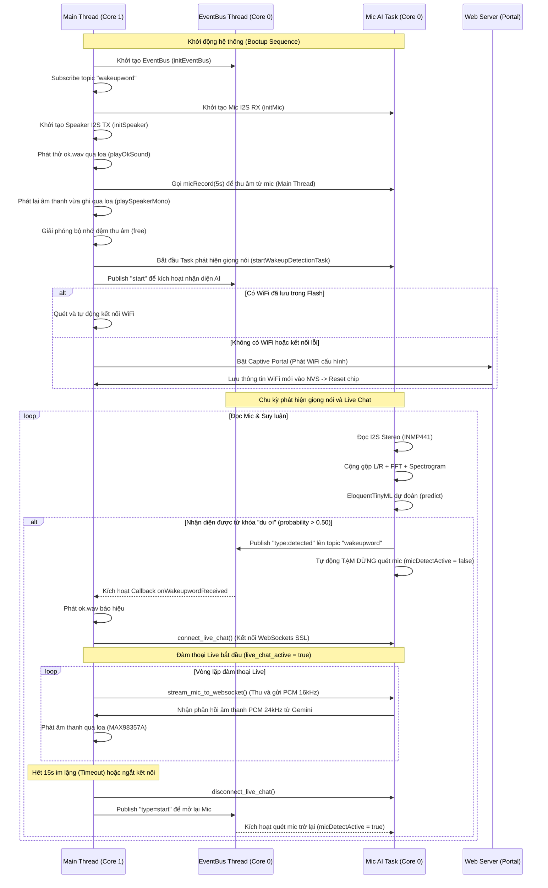

# Hướng dẫn Kiến trúc và Cách vận hành (How-To-Do) - ESP32 OS

Tài liệu này đặc tả kiến trúc thiết kế, sơ đồ luồng dữ liệu và cách hoạt động của hệ điều hành thu nhỏ dành cho ESP32-S3 (ESP32 OS).

---

## 1. Bản đồ Phân chia File & Kiến trúc Mô-đun

Dự án được cấu trúc dạng đa file (multi-tab) trong Arduino IDE, giúp phân tách các nhiệm vụ nghiệp vụ độc lập:

```
esp32os/
├── esp32os.ino          # File chạy chính (Main entry), khởi động luồng và điều phối chung
├── esp32wifi.ino        # Trình quản lý kết nối WiFi (Auto-connect 5 mạng gần nhất + Fallback)
├── esp32uiconfig.ino    # Giao diện Web cấu hình mạng (Captive Portal, Glassmorphism UI)
├── esp32eventbus.ino    # Bus sự kiện trung tâm (Asynchronous EventBus, Singleton, chạy Core 0)
├── esp32mic.ino         # Mô-đun xử lý Mic INMP441 (I2S RX, FFT, tạo Spectrogram & Suy luận AI)
└── esp32speaker.ino     # Mô-đun điều khiển Loa MAX98357A (I2S TX, giải mã và phát âm thanh)
```

---

## 2. Luồng Vận hành Hệ thống (Workflow)



---

## 3. Chi tiết Thiết kế các Mô-đun

### A. Bus sự kiện (`esp32eventbus.ino`)
* Chạy như một **Singleton** trên một Task FreeRTOS độc lập tại Core 0.
* Cung cấp cơ chế giao tiếp bất đồng bộ giữa các Thread để tránh chặn (block) Thread chính:
  * `publish(topic, payload)`: Gửi sự kiện đến các subscriber.
  * `subscribe(topic, subName, callback)`: Đăng ký lắng nghe sự kiện trên một topic.
  * `enqueue(queueName, payload)` / `dequeue(queueName)`: Hàng đợi FIFO để trao đổi gói tin.
  * `set(key, value)` / `get(key)`: Lưu trữ trạng thái dùng chung.

### B. Thu âm & Nhận diện Giọng nói (`esp32mic.ino`)
* Chạy bất đồng bộ trên Core 0 thông qua `wakeup_detection_task` để tránh làm chậm Main Loop.
* **Đọc đệm I2S siêu ngắn (20ms/block)**: Cho phép truyền trực tiếp tín hiệu ra loa (`playSpeaker`) với độ trễ cực thấp (<20ms) và ổn định cao, hoàn toàn loại bỏ tiếng rè rẹt do hụt bộ đệm.
* **Lọc nhiễu & Đệm xoay vòng (Circular Buffer)**:
  * Thu âm từ Mic INMP441 (mặc định lấy dữ liệu kênh Trái để tránh tiếng xào xào nhiễu khi chỉ dùng 1 mic hoặc 2 mic đấu song song bị lỏng chân) sử dụng cấu hình tự động nhận diện độ rộng bit (cả 16-bit và 32-bit slot width).
  * Tách 16 bit có nghĩa nhất (MSB) nếu chạy ở chế độ 32-bit bằng cách dịch phải 16 bit (`>> 16`) arithmetically để chuyển về dạng mẫu signed 16-bit PCM. Nếu chạy ở chế độ 16-bit, dữ liệu được đọc trực tiếp không cần dịch bit.
  * Tích lũy mẫu mono liên tục vào bộ đệm xoay vòng `loop_audio_buffer` kích thước **16000 mẫu (1.0 giây)**.
* **Xử lý TFLite Micro khớp chuẩn Python**:
  * Chu kỳ suy luận được đặt cố định **20ms một lần** (mỗi 320 mẫu mới), khớp tần suất suy luận với Python.
  * **Khử sai lệch DC (DC Offset Removal)**: Tính giá trị trung bình (mean) của toàn bộ 16000 mẫu trong bộ đệm và trừ đi từ mỗi mẫu. Bước này bắt buộc phải có để loại bỏ nhiễu DC sinh ra từ cảm ứng phần cứng, khớp với tín hiệu sạch từ môi trường kiểm thử của Python.
  * **Chuẩn hóa biên độ (Peak Normalization)**: Tìm trị tuyệt đối biên độ lớn nhất (`max_val`) của toàn bộ 16000 mẫu âm thanh đã khử DC trong cửa sổ 1.0 giây và chia tỷ lệ các mẫu cho `max_val` để biên độ luôn nằm trong khoảng `[-1.0, 1.0]`. Giải quyết bài toán chênh lệch âm lượng thu âm thực tế.
  * Trích xuất cửa sổ trượt (Overlap STFT) với `FRAME_LENGTH = 480` và `FRAME_STEP = 320` tạo ra đúng **49 hàng** phổ (Spectrogram) cho mô hình.
  * **Cửa sổ Hann (Hann Windowing)**: Áp dụng thủ công cửa sổ Hann kích thước $N=480$ trên mỗi khung trước khi đệm zero-padding lên 512 mẫu để chạy FFT, khớp 100% với hàm toán học `tf.signal.stft` mặc định của TensorFlow. Thu thập **257 cột tần số đầu tiên** cho mỗi hàng phổ.
  * **Lượng tử hóa tuyến tính (Linear Quantization)**: Dữ liệu được lượng tử hóa tuyến tính sang khoảng `[-128, 127]` dựa theo tham số `scale` và `zero_point` đầu vào của mô hình.
  * **Hợp tác đa nhiệm (RTOS Yield)**: Chèn lệnh `vTaskDelay` 1ms định kỳ (sau mỗi 10 hàng FFT và trước khi predict) để nhường quyền điều phối cho Task Idle trên Core 0, triệt tiêu hoàn toàn lỗi kích hoạt Watchdog khi chạy tính toán nặng.
* **Giao thức điều khiển qua EventBus (Control Protocol)**:
  * Khi phát hiện từ khóa "du ơi", luồng AI sẽ tự động gán `micDetectActive = false` để **tạm dừng nhận dạng**, tránh trùng lặp.
  * Lắng nghe liên tục trên topic `wakeupword` để nhận lệnh điều khiển:
    * **Kích hoạt lại AI**: Khi nhận bản tin chứa `type=start` (hoặc `type:start`, `start`), hệ thống sẽ bật lại AI (`micDetectActive = true`).
    * **Tắt/Tạm dừng AI**: Khi nhận bản tin chứa `type=stop` hoặc `type=pending` (hoặc định dạng dấu hai chấm `:stop`, `:pending`, hoặc chuỗi đơn `stop`, `pending`), hệ thống sẽ dừng xử lý AI (`micDetectActive = false`).


### C. Phát âm thanh (`esp32speaker.ino`)
* Khởi tạo Driver I2S Output (TX) trên cổng độc lập `I2S_NUM_1` với tần số phát mẫu **16kHz Stereo**.
* Cung cấp hàm `playSpeaker(samples, count)` phục vụ phát âm thanh PCM thô.
* **Tối ưu hóa âm lượng lớn nhất**:
  * **Phần mềm (Software)**: Tích hợp hệ số nhân âm lượng `#define SPEAKER_VOLUME_BOOST 2.5f` kết hợp bộ cắt biên độ (clamping) để tránh tràn số, nâng biên độ lên gấp 2.5 lần.
  * **Phần cứng (Hardware)**: Hướng dẫn nối chân **GAIN** của MAX98357A xuống **GND** (cho mức Gain 12dB) hoặc qua **điện trở 100kΩ xuống GND** (cho mức Gain cực đại 15dB) để âm thanh phát ra loa to rõ nhất.
* **Hardware Loopback Test**: Trong quá trình quét mic, toàn bộ dữ liệu Stereo đọc được từ mic sẽ ngay lập tức được ghi thẳng sang Loa giúp người dùng nghe trực tiếp âm thanh thu được để căn chỉnh độ nhạy phần cứng và kiểm tra kết nối vật lý.

### D. Quản lý mạng WiFi (`esp32wifi.ino` & `esp32uiconfig.ino`)
* **Lưu trữ NVS**: Sử dụng thư viện `Preferences` để duy trì danh sách mạng. Tự động dịch chuyển cấu trúc để lưu trữ **5 mạng WiFi đã kết nối gần nhất** theo dạng hàng đợi ưu tiên (mạng mới lưu có mức ưu tiên kết nối cao nhất).
* **Cơ chế Fallback**: Khi khởi động, nếu bộ nhớ Flash chưa lưu mạng nào, nó sẽ sử dụng mạng dự phòng cấu hình sẵn là `"Tang 1 OMT"` / `"Omt070110"`.
* Nếu tất cả kết nối thất bại, ESP32 sẽ phát WiFi `esp32os_dunp` và khởi tạo Captive Portal (DNS Hijacking). Mọi truy cập web từ thiết bị kết nối sẽ được tự động điều hướng về trang chủ cấu hình kính mờ (Glassmorphism UI) để nhập thông tin mạng mới.

### E. Tự kiểm tra Phần cứng (Self-test)
* Thực hiện tuần tự trên Thread chính (`setup()` trên Core 1) ngay sau khi khởi tạo phần cứng để xác thực đường dẫn âm thanh trước khi chạy AI:
  1. **Kiểm tra Loa (I2S TX)**: Gọi `playOkSound()` để giải mã và phát trực tiếp dữ liệu âm thanh `ok.wav` lưu trong bộ nhớ Flash. Nếu người dùng nghe thấy tiếng nhạc khởi động tức là cổng I2S TX, bộ khuếch đại MAX98357A và loa đều hoạt động bình thường.
  2. **Kiểm tra Mic (I2S RX)**: Gọi `micRecordWav(5, &wav_size)` để ghi âm 5 giây âm thanh từ hai mic INMP441, trộn mono và trả ra dưới dạng file WAV hoàn chỉnh (bao gồm 44-byte WAV header ở đầu).
     * Hệ thống ưu tiên cấp phát vùng nhớ 160KB + 44 byte trên **PSRAM** bằng hàm `heap_caps_malloc(MALLOC_CAP_SPIRAM)`. Nếu board không có PSRAM hoặc không được cấu hình bật, hệ thống sẽ tự động hạ cấp xuống ghi âm 2 giây trên RAM nội bộ (Internal DRAM) để tránh tràn bộ nhớ.
     * Sau khi ghi âm kết thúc, hàm sẽ tự động điền các thông tin của file WAV tiêu chuẩn (RIFF, fmt, data chunk, sample rate 16000Hz, mono, 16-bit) vào 44 byte đầu tiên của bộ đệm.
  3. **Phát lại và Giải phóng**: Gọi `playSpeakerWav(wav_buf, wav_size)` để phát lại file WAV vừa ghi được qua loa. Hàm này sẽ tự động bỏ qua 44 byte WAV header và phát dữ liệu mono PCM còn lại ra loa tương tự như cách hoạt động của `playOkSound()`. Ngay sau khi phát xong, hệ thống gọi `playSilence(1000)` để ghi 1 giây âm thanh im lặng (dữ liệu 0) vào bộ đệm I2S, giúp xả sạch (flush) bộ đệm DMA của loa và dừng triệt để hiện tượng lặp tiếng/vọng tiếng do bộ đệm I2S bị đọng dữ liệu cũ. Cuối cùng, gọi `free(wav_buf)` ở main thread để giải phóng toàn bộ vùng đệm WAV, trả lại dung lượng RAM sạch cho hệ thống.

### F. Trợ lý ảo đàm thoại Live với Gemini (`esp32mic.ino` & `esp32speaker.ino`)
* **Kiến trúc thời gian thực thời gian thực hai chiều**:
  * Khi từ khóa "du ơi" được phát hiện, hệ thống ngay lập tức kết nối tới endpoint WebSocket của Gemini Live API (`wss://generativelanguage.googleapis.com/ws/google.ai.generativelanguage.v1alpha.GenerativeService.BidiGenerateContent`).
  * Sử dụng thư viện `WebSocketsClient` với giao thức SSL để bảo mật và `ArduinoJson` để đóng/mở gói tin trao đổi.
* **Xử lý luồng Microphone & Loa**:
  * **Đầu vào (Mic)**: Thu thập dữ liệu PCM 32-bit Stereo từ cổng I2S RX, chuyển đổi sang PCM 16-bit Mono (16kHz), mã hóa Base64 và đóng gói JSON gửi lên websocket.
  * **Đầu ra (Loa)**: Gemini trả về luồng âm thanh PCM 24kHz Mono dạng Base64. ESP32 giải mã, nâng biên độ bằng `SPEAKER_VOLUME_BOOST`, nhân bản thành Stereo và phát trực tiếp ra loa I2S TX với tần số lấy mẫu là 24kHz (sử dụng hàm thay đổi tần số linh hoạt `i2s_set_sample_rate`).
  * **Khử nhiễu vọng phản hồi (Echo Suppression)**: Khi loa đang phát, micro sẽ tạm dừng gửi gói tin lên API trong vòng 500ms. Sau khi hết thời gian chặn, hệ thống sẽ thực hiện xả sạch (drain) bộ đệm DMA của micro trước khi gửi để tránh lặp tiếng trả lời của chatbot.
* **Timeout im lặng (Inactivity Timeout)**: Sau 15 giây không có dữ liệu trao đổi âm thanh từ người dùng hoặc mô hình, hệ thống sẽ tự động gọi `disconnect_live_chat()`, khôi phục loa về 16kHz, và mở lại chế độ chờ Wake-word ngoại tuyến.

---

## 4. Hướng dẫn Gỡ lỗi (Troubleshooting)

1. **Kiểm tra hoạt động của Mic & Loa**:
    * Xem log `I2S Bytes Read` trên Serial Monitor. Nếu luôn bằng `0`, hãy kiểm tra lại kết nối chân `SCK` (GPIO 4) và `WS` (GPIO 5).
    * Nói vào mic và quan sát `Spectrogram Max Amp`. Nếu số này dao động chứng tỏ Mic thu âm tốt. Nếu luôn bằng `0.00000` kèm cảnh báo im lặng, kiểm tra dây dữ liệu `SD` (GPIO 6) và nguồn của Mic.
    * **⚠️ Cảnh báo chân cắm trên ESP32-S3 N16R8 (R8 là 8MB Octal PSRAM)**: Do chế độ **OPI PSRAM** bắt buộc phải sử dụng các chân **GPIO 15, 16, 17** để truyền nhận dữ liệu với chip RAM ngoài của board, bạn tuyệt đối **không** được đấu mic (SCK, WS) hay loa (LRC) vào cụm chân này. Nếu đấu nhầm, I2S sẽ không thể thu âm (tiếng phát ra xào xào) và CPU sẽ bị stall liên tục làm thời gian phát chậm đi rất nhiều. Phải đấu đúng sang: Mic (SCK=4, WS=5, SD=6) và Loa (LRC=7, BCLK=14, DIN=13).
2. **Loa có tiếng xè xè hoặc rè**:
   * Đảm bảo nguồn cấp cho mạch `MAX98357A` đấu vào chân **5V** thay vì **3.3V**. Dòng điện tiêu thụ từ loa khi phát âm thanh rất lớn, dùng chung đường 3.3V với MCU và Mic sẽ gây sụt áp đột ngột và sinh nhiễu.
3. **Lỗi `wifi:Expected to init 4 rx buffer, actual is 0` / Treo Hotspot cấu hình**:
   * **Nguyên nhân**: Biên dịch nhưng tắt PSRAM trong cài đặt. Mảng TFLite Arena (180KB) bị đẩy vào bộ nhớ RAM nội bộ (DRAM) làm cạn kiệt Heap dành cho driver WiFi và mạng.
   * **Cách xử lý**: Vào **Tools -> PSRAM** trong Arduino IDE và chuyển từ **Disabled** sang **OPI PSRAM** (bắt buộc chọn OPI cho dòng N16R8). Hệ thống sẽ tự động chuyển mảng AI ra RAM ngoài, giải phóng hoàn toàn DRAM nội bộ giúp hệ thống hoạt động ổn định.
