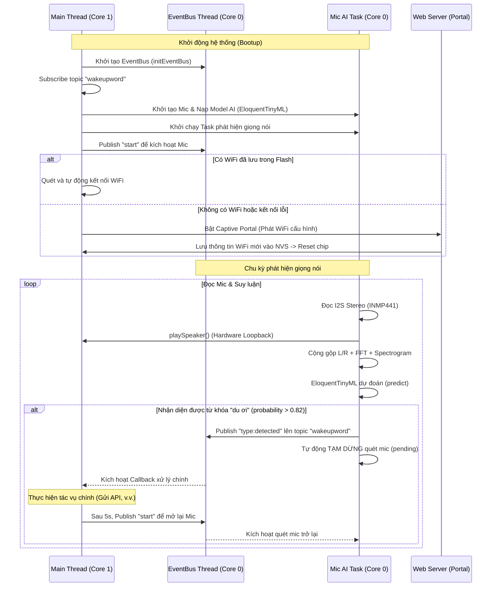

# Hướng dẫn Kiến trúc và Cách vận hành (How-To-Do) - ESP32 OS

Tài liệu này đặc tả kiến trúc thiết kế, sơ đồ luồng dữ liệu và cách hoạt động của hệ điều hành thu nhỏ dành cho ESP32-S3 (ESP32 OS).

---

## 1. Bản đồ Phân chia File & Kiến trúc Mô-đun

Dự án được cấu trúc dạng đa file (multi-tab) trong Arduino IDE, giúp phân tách các nhiệm vụ nghiệp vụ độc lập:

```
esp32os/
├── esp32os.ino          # File chạy chính (Main entry), khởi động luồng và điều phối chung
├── esp32wifi.ino        # Trình quản lý kết nối WiFi (Auto-connect 5 mạng gần nhất + Fallback)
├── esp32uiconfig.ino    # Giao diện Web cấu hình mạng (Captive Portal, Glassmorphism UI)
├── esp32eventbus.ino    # Bus sự kiện trung tâm (Asynchronous EventBus, Singleton, chạy Core 0)
├── esp32mic.ino         # Mô-đun xử lý Mic INMP441 (I2S RX, FFT, tạo Spectrogram & Suy luận AI)
└── esp32speaker.ino     # Mô-đun điều khiển Loa MAX98357A (I2S TX, giải mã và phát âm thanh)
```

---

## 2. Luồng Vận hành Hệ thống (Workflow)



---

## 3. Chi tiết Thiết kế các Mô-đun

### A. Bus sự kiện (`esp32eventbus.ino`)
* Chạy như một **Singleton** trên một Task FreeRTOS độc lập tại Core 0.
* Cung cấp cơ chế giao tiếp bất đồng bộ giữa các Thread để tránh chặn (block) Thread chính:
  * `publish(topic, payload)`: Gửi sự kiện đến các subscriber.
  * `subscribe(topic, subName, callback)`: Đăng ký lắng nghe sự kiện trên một topic.
  * `enqueue(queueName, payload)` / `dequeue(queueName)`: Hàng đợi FIFO để trao đổi gói tin.
  * `set(key, value)` / `get(key)`: Lưu trữ trạng thái dùng chung.

### B. Thu âm & Nhận diện Giọng nói (`esp32mic.ino`)
* Chạy bất đồng bộ trên Core 0 thông qua `wakeup_detection_task` để tránh làm chậm Main Loop.
* **Đọc đệm I2S siêu ngắn (20ms/block)**: Cho phép truyền trực tiếp tín hiệu ra loa (`playSpeaker`) với độ trễ cực thấp (<20ms) và ổn định cao, hoàn toàn loại bỏ tiếng rè rẹt do hụt bộ đệm.
* **Lọc nhiễu & Đệm xoay vòng (Circular Buffer)**:
  * Thu âm Stereo từ 2 Mic INMP441 (kênh Trái đấu GND, kênh Phải đấu 3.3V) và trộn mono:
    $$\text{Mixed Sample} = \frac{\text{Left} + \text{Right}}{2}$$
    Giúp tăng SNR thêm 3dB và triệt tiêu nhiễu ngẫu nhiên.
  * Tích lũy mẫu mono liên tục vào bộ đệm xoay vòng `loop_audio_buffer` kích thước **16000 mẫu (1.0 giây)**.
* **Xử lý TFLite Micro khớp chuẩn Python**:
  * Chu kỳ suy luận được đặt cố định **100ms một lần** (sau khi tích lũy đủ 1600 mẫu mới), giúp tối ưu hóa hiệu năng CPU và khớp tần suất suy luận với Python.
  * **Chuẩn hóa biên độ (Peak Normalization)**: Tìm trị tuyệt đối biên độ lớn nhất (`max_val`) của toàn bộ 16000 mẫu âm thanh trong cửa sổ 1.0 giây và chia tỷ lệ các mẫu cho `max_val` để biên độ luôn nằm trong khoảng `[-1.0, 1.0]`. Giải quyết bài toán chênh lệch âm lượng thu âm thực tế.
  * Trích xuất cửa sổ trượt (Overlap STFT) với `FRAME_LENGTH = 480` và `FRAME_STEP = 320` tạo ra đúng **49 hàng** phổ (Spectrogram) cho mô hình.
  * **Cửa sổ Hann (Hann Windowing)**: Áp dụng thủ công cửa sổ Hann kích thước $N=480$ trên mỗi khung trước khi đệm zero-padding lên 512 mẫu để chạy FFT, khớp 100% với hàm toán học `tf.signal.stft` mặc định của TensorFlow. Thu thập **257 cột tần số đầu tiên** cho mỗi hàng phổ.
  * **Lượng tử hóa tuyến tính (Linear Quantization)**: Dữ liệu được lượng tử hóa tuyến tính sang khoảng `[-128, 127]` dựa theo tham số `scale` và `zero_point` đầu vào của mô hình.
  * **Hợp tác đa nhiệm (RTOS Yield)**: Chèn lệnh `vTaskDelay` 1ms định kỳ (sau mỗi 10 hàng FFT và trước khi predict) để nhường quyền điều phối cho Task Idle trên Core 0, triệt tiêu hoàn toàn lỗi kích hoạt Watchdog khi chạy tính toán nặng.


### C. Phát âm thanh (`esp32speaker.ino`)
* Khởi tạo Driver I2S Output (TX) trên cổng độc lập `I2S_NUM_1` với tần số phát mẫu **16kHz Stereo**.
* Cung cấp hàm `playSpeaker(samples, count)` phục vụ phát âm thanh PCM thô.
* **Hardware Loopback Test**: Trong quá trình quét mic, toàn bộ dữ liệu Stereo đọc được từ mic sẽ ngay lập tức được ghi thẳng sang Loa giúp người dùng nghe trực tiếp âm thanh thu được để căn chỉnh độ nhạy phần cứng và kiểm tra kết nối vật lý.

### D. Quản lý mạng WiFi (`esp32wifi.ino` & `esp32uiconfig.ino`)
* **Lưu trữ NVS**: Sử dụng thư viện `Preferences` để duy trì danh sách mạng. Tự động dịch chuyển cấu trúc để lưu trữ **5 mạng WiFi đã kết nối gần nhất** theo dạng hàng đợi ưu tiên (mạng mới lưu có mức ưu tiên kết nối cao nhất).
* **Cơ chế Fallback**: Khi khởi động, nếu bộ nhớ Flash chưa lưu mạng nào, nó sẽ sử dụng mạng dự phòng cấu hình sẵn là `"Tang 1 OMT"` / `"Omt070110"`.
* Nếu tất cả kết nối thất bại, ESP32 sẽ phát WiFi `esp32os_dunp` và khởi tạo Captive Portal (DNS Hijacking). Mọi truy cập web từ thiết bị kết nối sẽ được tự động điều hướng về trang chủ cấu hình kính mờ (Glassmorphism UI) để nhập thông tin mạng mới.

---

## 4. Hướng dẫn Gỡ lỗi (Troubleshooting)

1. **Kiểm tra hoạt động của Mic & Loa**:
   * Xem log `I2S Bytes Read` trên Serial Monitor. Nếu luôn bằng `0`, hãy kiểm tra lại kết nối chân `SCK` (GPIO 16) và `WS` (GPIO 17).
   * Nói vào mic và quan sát `Spectrogram Max Amp`. Nếu số này dao động chứng tỏ Mic thu âm tốt. Nếu luôn bằng `0.00000` kèm cảnh báo im lặng, kiểm tra dây dữ liệu `SD` (GPIO 18) và nguồn của Mic.
2. **Loa có tiếng xè xè hoặc rè**:
   * Đảm bảo nguồn cấp cho mạch `MAX98357A` đấu vào chân **5V** thay vì **3.3V**. Dòng điện tiêu thụ từ loa khi phát âm thanh rất lớn, dùng chung đường 3.3V với MCU và Mic sẽ gây sụt áp đột ngột và sinh nhiễu.
3. **Lỗi `wifi:Expected to init 4 rx buffer, actual is 0` / Treo Hotspot cấu hình**:
   * **Nguyên nhân**: Biên dịch nhưng tắt PSRAM trong cài đặt. Mảng TFLite Arena (180KB) bị đẩy vào bộ nhớ RAM nội bộ (DRAM) làm cạn kiệt Heap dành cho driver WiFi và mạng.
   * **Cách xử lý**: Vào **Tools -> PSRAM** trong Arduino IDE và chuyển từ **Disabled** sang **OPI PSRAM** (hoặc **QSPI PSRAM** tùy dòng board). Hệ thống sẽ tự động chuyển mảng AI ra RAM ngoài, giải phóng hoàn toàn DRAM nội bộ giúp hệ thống hoạt động ổn định.
