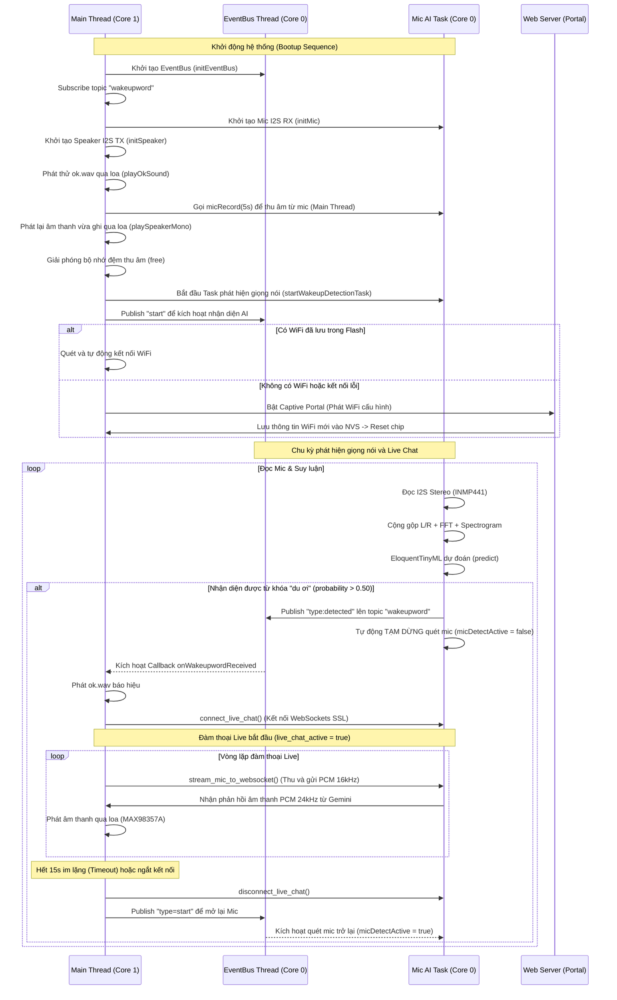

# Hướng dẫn Kiến trúc và Cách vận hành (How-To-Do) - ESP32 OS

Tài liệu này đặc tả kiến trúc thiết kế, sơ đồ luồng dữ liệu và cách hoạt động của hệ điều hành thu nhỏ dành cho ESP32-S3 (ESP32 OS).

---

## 1. Bản đồ Phân chia File & Kiến trúc Mô-đun

Dự án được cấu trúc dạng đa file (multi-tab) trong Arduino IDE, giúp phân tách các nhiệm vụ nghiệp vụ độc lập:

```
esp32os/
├── esp32os.ino                 # File chạy chính (Main entry), khởi động luồng và điều phối chung
├── esp32wifi.ino               # Trình quản lý kết nối WiFi (Auto-connect 5 mạng gần nhất + Fallback)
├── esp32uiconfig.ino           # Giao diện Web cấu hình mạng (Captive Portal, Glassmorphism UI)
├── esp32eventbus.ino           # Bus sự kiện trung tâm (Asynchronous EventBus, Singleton, chạy Core 0)
├── esp32firebase.ino           # Trình đọc ghi Google Firebase Firestore (Chạy qua REST API + EventBus)
├── esp32mic_no_wakeword.ino    # Mô-đun thu Mic & stream WebSocket tới local Hub (Không dùng TFLite)
├── esp32mic.ino                # Mô-đun cũ nhận diện Wake-word TFLite (Legacy / Backup)
├── esp32speaker.ino            # Mô-đun điều khiển Loa MAX98357A (I2S TX, giải mã và phát âm thanh)
└── esp32display.ino            # Mô-đun hiển thị Dashboard & Cảm ứng trên màn hình 2.8" TFT ILI9341
```

---

## 2. Luồng Vận hành Hệ thống (Workflow)


```mermaid
sequenceDiagram
    participant Main as Main Thread (Core 1)
    participant Bus as EventBus Thread (Core 0)
    participant Mic as Mic AI Task (Core 0)
    participant Web as Web Server (Portal)

    Note over Main, Mic: Khởi động hệ thống (Bootup Sequence)
    Main->>Bus: Khởi tạo EventBus (initEventBus)
    Main->>Main: Subscribe topic "wakeupword"
    Main->>Mic: Khởi tạo Mic I2S RX (initMic)
    Main->>Main: Khởi tạo Speaker I2S TX (initSpeaker)
    Main->>Main: Phát thử ok.wav qua loa (playOkSound)
    Main->>Mic: Gọi micRecord(5s) để thu âm từ mic (Main Thread)
    Main->>Main: Phát lại âm thanh vừa ghi qua loa (playSpeakerMono)
    Main->>Main: Giải phóng bộ nhớ đệm thu âm (free)
    Main->>Mic: Bắt đầu Task phát hiện giọng nói (startWakeupDetectionTask)
    Main->>Bus: Publish "start" để kích hoạt nhận diện AI

    alt Có WiFi đã lưu trong Flash
        Main->>Main: Quét và tự động kết nối WiFi
    else Không có WiFi hoặc kết nối lỗi
        Main->>Web: Bật Captive Portal (Phát WiFi cấu hình)
        Web->>Main: Lưu thông tin WiFi mới vào NVS -> Reset chip
    end

    Note over Mic, Bus: Chu kỳ phát hiện giọng nói và Live Chat
    loop Đọc Mic & Suy luận
        Mic->>Mic: Đọc I2S Stereo (INMP441)
        Mic->>Mic: Cộng gộp L/R + FFT + Spectrogram
        Mic->>Mic: EloquentTinyML dự đoán (predict)
        alt Nhận diện được từ khóa "du ơi" (probability > 0.50)
            Mic->>Bus: Publish "type:detected" lên topic "wakeupword"
            Mic->>Mic: Tự động TẠM DỪNG quét mic (micDetectActive = false)
            Bus-->>Main: Kích hoạt Callback onWakeupwordReceived
            Main->>Main: Phát ok.wav báo hiệu
            Main->>Mic: connect_live_chat() (Kết nối WebSockets SSL)
            Note over Main, Mic: Đàm thoại Live bắt đầu (live_chat_active = true)
            loop Vòng lặp đàm thoại Live
                Main->>Mic: stream_mic_to_websocket() (Thu và gửi PCM 16kHz)
                Mic->>Main: Nhận phản hồi âm thanh PCM 24kHz từ Gemini
                Main->>Main: Phát âm thanh qua loa (MAX98357A)
            end
            Note over Main: Hết 15s im lặng (Timeout) hoặc ngắt kết nối
            Main->>Mic: disconnect_live_chat()
            Main->>Bus: Publish "type=start" để mở lại Mic
            Bus-->>Mic: Kích hoạt quét mic trở lại (micDetectActive = true)
        end
    end
```

---

## 3. Chi tiết Thiết kế các Mô-đun

### A. Bus sự kiện (`esp32eventbus.ino`)
* Chạy như một **Singleton** trên một Task FreeRTOS độc lập tại Core 0.
* Cung cấp cơ chế giao tiếp bất đồng bộ giữa các Thread để tránh chặn (block) Thread chính:
  * `publish(topic, payload)`: Gửi sự kiện đến các subscriber.
  * `subscribe(topic, subName, callback)`: Đăng ký lắng nghe sự kiện trên một topic.
  * `enqueue(queueName, payload)` / `dequeue(queueName)`: Hàng đợi FIFO để trao đổi gói tin.
  * `set(key, value)` / `get(key)`: Lưu trữ trạng thái dùng chung.

### B. Thu âm & Stream âm thanh (`esp32mic_no_wakeword.ino` - Cập nhật 20)
* **Loại bỏ TFLite Wake-word để tối ưu tài nguyên**:
  * Mô-đun không nạp mô hình TFLite, không chạy STFT FFT và không cấp phát mảng Arena 300KB.
  * **Giải phóng >300KB RAM/PSRAM** và **>1.4MB bộ nhớ Flash**, giúp hệ thống nhẹ, mát, phản hồi tức thì và dành bộ nhớ cho các tác vụ khác (màn hình, NFC, Bluetooth, v.v.).
* **Thu âm I2S RX thời gian thực (Real-time Streaming)**:
  * Thu âm từ 2 mic INMP441 (Stereo 32-bit slot width, 16kHz) qua FreeRTOS Task `mic_recording_task` trên Core 1.
  * Tách 16-bit MSB và trộn kênh Trái/Phải (Stereo -> Mono 16kHz).
  * Đẩy các frame PCM vào hàng đợi không khóa `mic_queue`.
* **Truyền nhận nhị phân qua WebSocket tới `esp32_hub.py`**:
  * Tại `loopGeminiLive()`, ESP32 lấy các gói PCM từ `mic_queue` và gửi nhị phân (`webSocket.sendBIN`) trực tiếp lên server local Hub.
  * Máy chủ `esp32_hub.py` đảm nhận toàn bộ việc kết nối Gemini Live, lưu lịch sử SQLite và nhận diện giọng nói (Server-side VAD).
* **Khử nhiễu vọng phản hồi (Echo Suppression)**:
  * Khi loa đang phát âm thanh phản hồi từ Hub hoặc trong 500ms sau khi loa vừa phát xong, micro tự động bỏ qua (discard) dữ liệu thu từ I2S và xả sạch hàng đợi `mic_queue` để tránh phản hồi vòng lặp (echo loop).
* **Tự động kết nối & Duy trì liên lạc (Auto-reconnect)**:
  * Khi WiFi kết nối thành công, ESP32 tự động thiết lập kết nối WebSocket tới local Hub. Nếu kết nối bị ngắt, hệ thống sẽ tự động thử kết nối lại sau mỗi 5 giây.
* **Hỗ trợ kiểm tra phần cứng (Self-Test)**:
  * Cung cấp hàm `micRecordWav(seconds, &out_wav_size)` ghi âm 1s WAV định dạng tiêu chuẩn để `micSelfTest()` kiểm tra mic và loa ngay lúc khởi động mạch.

*(Mô-đun cũ `esp32mic.ino` sử dụng TFLite offline và FFT vẫn được lưu trữ làm tham khảo và có thể bật lại bằng cờ `#define USE_TFLITE_MIC`).*


### C. Phát âm thanh (`esp32speaker.ino`)
* Khởi tạo Driver I2S Output (TX) trên cổng độc lập `I2S_NUM_1` với tần số phát mẫu **16kHz Stereo**.
* Cung cấp hàm `playSpeaker(samples, count)` phục vụ phát âm thanh PCM thô.
* **Tối ưu hóa âm lượng lớn nhất**:
  * **Phần mềm (Software)**: Tích hợp hệ số nhân âm lượng `#define SPEAKER_VOLUME_BOOST 1.5f` kết hợp bộ cắt biên độ (clamping) để tránh tràn số, nâng biên độ lên gấp 2.5 lần.
  * **Phần cứng (Hardware)**: Hướng dẫn nối chân **GAIN** của MAX98357A xuống **GND** (cho mức Gain 12dB) hoặc qua **điện trở 100kΩ xuống GND** (cho mức Gain cực đại 15dB) để âm thanh phát ra loa to rõ nhất.
* **Hardware Loopback Test**: Trong quá trình quét mic, toàn bộ dữ liệu Stereo đọc được từ mic sẽ ngay lập tức được ghi thẳng sang Loa giúp người dùng nghe trực tiếp âm thanh thu được để căn chỉnh độ nhạy phần cứng và kiểm tra kết nối vật lý.

### D. Quản lý mạng WiFi (`esp32wifi.ino` & `esp32uiconfig.ino`)
* **Lưu trữ NVS**: Sử dụng thư viện `Preferences` để duy trì danh sách mạng. Tự động dịch chuyển cấu trúc để lưu trữ **5 mạng WiFi đã kết nối gần nhất** theo dạng hàng đợi ưu tiên (mạng mới lưu có mức ưu tiên kết nối cao nhất).
* **Cơ chế Fallback**: Khi khởi động, nếu bộ nhớ Flash chưa lưu mạng nào, nó sẽ sử dụng mạng dự phòng cấu hình sẵn là `"Tang 1 OMT"` / `"Omt070110"`.
* Nếu tất cả kết nối thất bại, ESP32 sẽ phát WiFi `esp32os_dunp` và khởi tạo Captive Portal (DNS Hijacking). Mọi truy cập web từ thiết bị kết nối sẽ được tự động điều hướng về trang chủ cấu hình kính mờ (Glassmorphism UI) để nhập thông tin mạng mới.
* **Nút Reset Config - Factory Reset (nhấn giữ 10 giây)**:
  * **Kiến trúc: `buttonPollingTask` (FreeRTOS task)**:
    * Task chạy độc lập trên **Core 0**, priority 1, đọc `digitalRead(GPIO 9)` mỗi **50ms**. Nút nhấn ngoài được kết nối giữa chân GPIO 9 và chân GND.
    * **Guard 1 - Startup delay**: Task ngủ 2 giây (`vTaskDelay(2000ms)`) sau khi khởi động để ổn định điện áp tránh nhiễu khởi động.
    * **Guard 2 - Xác nhận nhấn liên tiếp**: Cần **3 lần đọc LOW liên tiếp** (= 150ms duy trì LOW) mới xác nhận là nhấn thật, giúp chống nhiễu tiếp điểm (debounce).
  * **Phản hồi theo tiến độ giữ**:
    * **5 giây**: 1 tiếng bíp thấp 440Hz ("tiếp tục giữ").
    * **8 giây**: 2 tiếng bíp cao 660Hz ("sắp xong").
    * **10 giây**: Phát chuỗi 3 âm đi xuống (C6 -> G5 -> C5) báo hiệu factory reset.
  * **Factory Reset thực thi trong Task** (không cần qua `loop()`):
    1. Xóa sạch toàn bộ phân vùng Flash NVS bằng hàm `nvs_flash_erase()` (xóa toàn bộ wifi-creds, gemini-config, firebase-cfg, hub-config).
    2. Khởi tạo lại phân vùng NVS trống bằng hàm `nvs_flash_init()`.
    3. Gọi `ESP.restart()` để khởi động lại chip.
  * Sau khi restart, boot sequence tìm thấy không có credentials, `connectWiFi()` thất bại, tự động gọi `startAP()` để mở hotspot cấu hình.
  * **Cấu hình ESP32 Hub từ xa**:
    * Cho phép người dùng nhập trực tiếp địa chỉ Host hoặc IP và số cổng (Port) của ESP32 Hub cục bộ qua giao diện cấu hình Captive Portal (Web UI).
    * Thông tin này được lưu trữ trong namespace NVS **`hub-config`** (chứa khóa `"host"` kiểu chuỗi và `"port"` kiểu số nguyên).
    * Khi khởi động, các cấu hình này được nạp tự động vào biến toàn cục `hub_host` và `hub_port`. Trường hợp không thể đọc địa chỉ IP của Hub từ Firestore (do Firebase Project ID trống), ESP32 sẽ tự động sử dụng cấu hình Hub đã lưu này làm địa chỉ kết nối dự phòng (fallback).


### E. Tự kiểm tra Phần cứng (Self-test)
* Thực hiện tuần tự trên Thread chính (`setup()` trên Core 1) ngay sau khi khởi tạo phần cứng để xác thực đường dẫn âm thanh trước khi chạy AI:
  1. **Kiểm tra Loa (I2S TX)**: Gọi `playOkSound()` để giải mã và phát trực tiếp dữ liệu âm thanh `ok.wav` lưu trong bộ nhớ Flash. Nếu người dùng nghe thấy tiếng nhạc khởi động tức là cổng I2S TX, bộ khuếch đại MAX98357A và loa đều hoạt động bình thường.
  2. **Kiểm tra Mic (I2S RX)**: Gọi `micRecordWav(5, &wav_size)` để ghi âm 5 giây âm thanh từ hai mic INMP441, trộn mono và trả ra dưới dạng file WAV hoàn chỉnh (bao gồm 44-byte WAV header ở đầu).
     * Hệ thống ưu tiên cấp phát vùng nhớ 160KB + 44 byte trên **PSRAM** bằng hàm `heap_caps_malloc(MALLOC_CAP_SPIRAM)`. Nếu board không có PSRAM hoặc không được cấu hình bật, hệ thống sẽ tự động hạ cấp xuống ghi âm 2 giây trên RAM nội bộ (Internal DRAM) để tránh tràn bộ nhớ.
     * Sau khi ghi âm kết thúc, hàm sẽ tự động điền các thông tin của file WAV tiêu chuẩn (RIFF, fmt, data chunk, sample rate 16000Hz, mono, 16-bit) vào 44 byte đầu tiên của bộ đệm.
  3. **Phát lại và Giải phóng**: Gọi `playSpeakerWav(wav_buf, wav_size)` để phát lại file WAV vừa ghi được qua loa. Hàm này sẽ tự động bỏ qua 44 byte WAV header và phát dữ liệu mono PCM còn lại ra loa tương tự như cách hoạt động của `playOkSound()`. Ngay sau khi phát xong, hệ thống gọi `playSilence(1000)` để ghi 1 giây âm thanh im lặng (dữ liệu 0) vào bộ đệm I2S, giúp xả sạch (flush) bộ đệm DMA của loa và dừng triệt để hiện tượng lặp tiếng/vọng tiếng do bộ đệm I2S bị đọng dữ liệu cũ. Cuối cùng, gọi `free(wav_buf)` ở main thread để giải phóng toàn bộ vùng đệm WAV, trả lại dung lượng RAM sạch cho hệ thống.

### F. Trợ lý ảo đàm thoại Live qua local Hub (`esp32mic.ino` & `esp32speaker.ino`)
* **Kiến trúc luồng âm thanh thông qua local `esp32_hub`**:
  * Khi từ khóa "du ơi" được phát hiện, hệ thống sẽ tạm ngắt nhận dạng AI cục bộ và kết nối tới endpoint WebSocket của local hub (`ws://<HUB_IP>:<PORT>/ws`).
  * **Xử lý bất đồng bộ đa luồng (Async FreeRTOS Tasks & Queues)**:
    * **Đầu vào (Mic - `mic_recording_task`)**: Thu thập dữ liệu PCM 32-bit Stereo từ I2S RX, chuyển đổi thành PCM 16-bit Mono (16kHz), sau đó đưa vào hàng đợi `mic_queue`.
    * **WebSocket (Main Loop - `loopGeminiLive()`)**: Đọc từ `mic_queue` và stream dữ liệu mono PCM thô dưới dạng nhị phân (`webSocket.sendBIN`) trực tiếp lên local hub.
    * **VAD (Voice Activity Detection)**: Khi đang stream, nếu mic thu nhận được tín hiệu âm thanh có biên độ đỉnh `peak > 1500` (có âm thanh người dùng nói), hệ thống sẽ cập nhật `last_interaction_time` để làm mới thời gian đàm thoại.
    * **Đầu ra (Loa - `audio_playback_task`)**: Nhận dữ liệu nhị phân PCM 24kHz Mono từ WebSocket của hub, chuyển đổi thành Stereo và đẩy vào `audio_play_queue`. Task phát sẽ liên tục lấy dữ liệu từ hàng đợi và phát qua I2S TX với tốc độ 24kHz.
  * **Khử nhiễu vọng phản hồi (Echo Suppression)**: Khi loa đang phát hoặc có dữ liệu trong hàng đợi phát, micro sẽ tự động bỏ qua (discard) dữ liệu thu từ I2S và xả sạch hàng đợi `mic_queue` để tránh phản hồi vòng lặp (echo loop).
  * **Timeout im lặng (Inactivity Timeout)**: Sau 60 giây nếu cả người dùng không nói (không có âm thanh mic `peak > 1500`) và loa không phát âm thanh, hệ thống sẽ tự động gọi `disconnect_live_chat()`, khôi phục loa về tần số 16kHz, và mở lại chế độ chờ Wake-word ngoại tuyến.

### G. Google Firebase Firestore Client (`esp32firebase.ino`)
* **Không dùng thư viện nặng**: Sử dụng trực tiếp `WiFiClientSecure` và `HTTPClient` gốc để gọi REST API của Firestore, tránh xung đột bộ nhớ và watchdog với TensorFlow Lite / Gemini WebSockets.
* **Tự động cấu hình kết nối động (Dynamic IP Discovery)**:
  * **Đọc IP**: Khi kết nối, ESP32 gọi `get_hub_ip_from_firestore()` đọc tài liệu `esp32hub/config` trên Firestore nhằm tìm địa chỉ IP và Port hiện tại của local hub, nếu không thấy sẽ sử dụng IP cấu hình tĩnh dự phòng ở `dunp_config.h`.
  * **Xóa tài liệu**: Khi kết nối WebSocket tới hub thành công, ESP32 sẽ gọi `delete_hub_ip_from_firestore()` để xóa config trên Firestore nhằm tối ưu hóa chi phí database.
  * **Cập nhật động**: Nếu kết nối bằng IP dự phòng, ESP32 sẽ định kỳ 10 giây kiểm tra Firestore. Khi thấy có IP mới, nó sẽ tự động ngắt kết nối và khởi động lại WebSocket để chuyển sang IP mới.
* **Tự động chuyển đổi định dạng JSON (JSON Mapping)**:
  * Khi ghi: Hàm `flatJsonToFirestore(flatJson)` tự động chuyển đổi JSON phẳng sang định dạng phân cấp của Firestore REST API.
  * Khi đọc: Hàm `firestoreToFlatJson(firestoreJson)` chuyển đổi ngược lại sang JSON phẳng.
* **Đọc ghi bất đồng bộ qua EventBus**:
  * Đăng ký nhận sự kiện ghi trên topic `firebase/write`.
  * Đăng ký nhận sự kiện đọc trên topic `firebase/read`. Kết quả đọc được sẽ được publish ngược lại lên topic `firebase/read/result` dưới dạng JSON phẳng.

### H. Màn hình Dashboard Cấu hình & Live Voice Chat (`esp32display.ino` - Cập nhật 21 & 22)
* **Khởi tạo & Điều khiển Màn hình 2.8" ILI9341**:
  * Điều khiển qua chuẩn giao tiếp SPI (SCK=40, MOSI=38, MISO=41, CS=21, DC=42, RST=2, BL=20).
  * Chạy ở chế độ xoay ngang (Landscape 320x240, `tft.setRotation(1)`).
  * Nạp dữ liệu hiệu chuẩn cảm ứng XPT2046 `calData` (CS=39, IRQ=47).
* **Trực quan hóa thông số cấu hình (Chế độ Dashboard)**:
  * **WiFi & Mạng**: Trạng thái kết nối, SSID, địa chỉ IP mạng LAN, mức sóng RSSI, địa chỉ MAC, số lượng mạng đã lưu trữ trong NVS.
  * **ESP32 Hub & Gemini**: Địa chỉ Hub WebSocket (`ws://<host>:<port>/ws`), trạng thái phiên đàm thoại (CONNECTED / CONNECTING / STANDBY), tên Model Gemini, trạng thái API Key.
  * **Firebase & Hệ thống**: Firebase Project ID, Firestore Document Path, dung lượng RAM Heap & PSRAM thời gian thực.
* **Hiển thị Văn bản Đàm thoại Thời gian thực & Vẽ Tiếng Việt có dấu Unicode UTF-8 (Cập nhật 22)**:
  * **Bộ phân tích và vẽ dấu Tiếng Việt (`parseNextVnChar` & `drawVietnameseChar`)**: 
    * Tự động phân tích các ký tự Unicode UTF-8 đa byte tiếng Việt thành bộ ba: `(Ký tự gốc, Mũ/Nón, Dấu thanh)`.
    * Hỗ trợ đầy đủ tất cả các mũ và dấu: Mũ circumflex `â, ê, ô`, Trăng `ă`, Râu `ơ, ư`, Gạch `đ/Đ` và toàn bộ 5 thanh điệu tiếng Việt (Sắc `/`, Huyền `\`, Hỏi `?`, Ngã `~`, Nặng `.`).
    * Trực tiếp vẽ các dấu thanh và nón lên đúng tọa độ pixel của chữ cái tương ứng trên màn hình TFT ILI9341, giúp hiển thị **Tiếng Việt có dấu hoàn chỉnh** (như `Chào bạn, tôi là Du...`) mà không làm vỡ font hay phát sinh ký tự rác `?`.
  * **Bộ tự động ngắt dòng thông minh (`drawWrappedVietnameseText`)**: Tính toán chính xác độ rộng theo từng từ tiếng Việt có dấu và tự động xuống dòng mượt mà trong khung hiển thị.
  * **Tối ưu hóa hiển thị Bất đồng bộ & Chống nghẽn Audio (Throttled Frame Rendering)**:
    * Khi nhận text chunk từ WebSocket, hệ thống chỉ cập nhật buffer và bật cờ `model_text_dirty = true` mà không gọi vẽ SPI đồng bộ, tránh làm nghẽn bus và giật âm thanh.
    * Giao diện Live Chat được vẽ lại mượt mà với tần số ~10-12 FPS (mỗi 90ms) và chỉ xóa/vẽ lại khung chữ bên trong (`fillRect(10, 106, 300, 102)`), giảm 90% tải bus SPI.
    * Hàng đợi âm thanh `audio_play_queue` được nâng lên 48 packets kết hợp 12 DMA buffers (300ms cushion) và ưu tiên FreeRTOS Priority 5 giúp âm thanh phát ra loa trong trẻo, mượt mà, không bị giật/lag.
  * **Giao diện Live Chat**:
    * Khi người dùng nói (`event == "user_transcription"`): Màn hình tự động chuyển sang chế độ Chat, hiển thị câu nói tiếng Việt có dấu của người dùng tại Card "BAN (USER)".
    * Khi AI Du trả lời (`event == "model_transcription"`): Text được stream và hiển thị mượt mà trên Card "DU (TRO LY AO)".
    * Trạng thái phiên đàm thoại được gắn nhãn trên Header Bar: `[DANG NGHE]`, `[DU TRA LOI]`, `[NGAT LOI]`, `[HOAN TAT]`.
* **Tối ưu hóa Âm thanh Phát Loa Liền mạch & Phát âm chuẩn tên "Du" (Cập nhật 23)**:
  * **Chuẩn hóa phát âm tên "Du" (Dờ u Du)**:
    * Bổ sung chỉ dẫn ngữ âm chi tiết trong `system_instruction` của Gemini Live API: Tên trợ lý là "Du" (D trong "du lịch", "dịu dàng", phát âm âm /z/ hoặc /j/ tiếng Việt miền Bắc chuẩn, tuyệt đối không phát âm thành "Đu" / âm Đ).
  * **Loại bỏ hoàn toàn độ trễ nhân tạo (Artificial Sleep Elimination)**:
    * Loại bỏ lệnh `asyncio.sleep` trong vòng lặp chuyển tiếp âm thanh của `mic/esp32_hub.py`, truyền trực tiếp và ngay lập tức từng chunk 2048 bytes (42.6ms) xuống ESP32.
  * **Cơ chế Jitter Buffer & Zero-Gap I2S Loop**:
    * Trong `esp32mic_no_wakeword.ino` và `esp32mic.ino`, bổ sung bộ đệm pre-fill jitter buffer (chờ tích lũy tối thiểu 2 gói trước khi bắt đầu xả vào DMA).
    * Loại bỏ `vTaskDelay(1)` sau mỗi lần ghi I2S, cho phép `audio_playback_task` ghi liền mạch không có bất kỳ khoảng trống nano-giây nào giữa các chunk.
* **Đồng bộ 24kHz Toàn diện & Tối ưu Giao tiếp Súc tích, Hiển thị Dấu '...' Chờ đợi (Cập nhật 24)**:
  * **Đồng bộ Tần số Lấy mẫu 24,000 Hz (24kHz)**: Toàn bộ cấu hình phần cứng I2S speaker trên ESP32 (`SPEAKER_SAMPLING_RATE`) được thiết lập cố định 24kHz, đảm bảo giọng nữ "Aoede" của Gemini Live phát ra đúng 100% tốc độ thực, giữ trọn vẹn chất giọng trong sáng, ngọt ngào và tự nhiên của người thật.
  * **Chỉ thị Phản hồi Cực kỳ Súc tích**: Cấu hình `system_instruction` yêu cầu trợ lý trả lời ngắn gọn, cô đọng (từ 1–2 câu ngắn), đi thẳng vào vấn đề và đủ ý nghĩa.
  * **Giao diện & Console Sạch sẽ**:
    * Chỉ hiển thị câu hỏi của người dùng và câu trả lời tương ứng.
    * Khi người dùng vừa dứt lời và hệ thống đang xử lý câu trả lời, màn hình TFT và Console sẽ hiển thị dấu ba chấm (`...`) biểu thị trạng thái đang suy nghĩ, sau đó tự động thay thế bằng nội dung trả lời hoàn chỉnh.
    * Lọc bỏ hoàn toàn các log debug và thông tin thừa trên màn hình console.

---

## 4. Hướng dẫn Gỡ lỗi (Troubleshooting)

1. **Kiểm tra hoạt động của Mic & Loa**:
    * Xem log `I2S Bytes Read` trên Serial Monitor. Nếu luôn bằng `0`, hãy kiểm tra lại kết nối chân `SCK` (GPIO 4) và `WS` (GPIO 5).
    * Nói vào mic và quan sát `Spectrogram Max Amp`. Nếu số này dao động chứng tỏ Mic thu âm tốt. Nếu luôn bằng `0.00000` kèm cảnh báo im lặng, kiểm tra dây dữ liệu `SD` (GPIO 6) và nguồn của Mic.
    * **⚠️ Cảnh báo chân cắm trên ESP32-S3 N16R8 (R8 là 8MB Octal PSRAM)**: Do chế độ **OPI PSRAM** bắt buộc phải sử dụng các chân **GPIO 15, 16, 17** để truyền nhận dữ liệu với chip RAM ngoài của board, bạn tuyệt đối **không** được đấu mic (SCK, WS) hay loa (LRC) vào cụm chân này. Nếu đấu nhầm, I2S sẽ không thể thu âm (tiếng phát ra xào xào) và CPU sẽ bị stall liên tục làm thời gian phát chậm đi rất nhiều. Phải đấu đúng sang: Mic (SCK=4, WS=5, SD=6) và Loa (LRC=7, BCLK=14, DIN=13).
2. **Loa có tiếng xè xè hoặc rè**:
   * Đảm bảo nguồn cấp cho mạch `MAX98357A` đấu vào chân **5V** thay vì **3.3V**. Dòng điện tiêu thụ từ loa khi phát âm thanh rất lớn, dùng chung đường 3.3V với MCU và Mic sẽ gây sụt áp đột ngột và sinh nhiễu.
3. **Lỗi `wifi:Expected to init 4 rx buffer, actual is 0` / Treo Hotspot cấu hình**:
   * **Nguyên nhân**: Biên dịch nhưng tắt PSRAM trong cài đặt. Mảng TFLite Arena (180KB) bị đẩy vào bộ nhớ RAM nội bộ (DRAM) làm cạn kiệt Heap dành cho driver WiFi và mạng.
   * **Cách xử lý**: Vào **Tools -> PSRAM** trong Arduino IDE và chuyển từ **Disabled** sang **OPI PSRAM** (bắt buộc chọn OPI cho dòng N16R8). Hệ thống sẽ tự động chuyển mảng AI ra RAM ngoài, giải phóng hoàn toàn DRAM nội bộ giúp hệ thống hoạt động ổn định.
