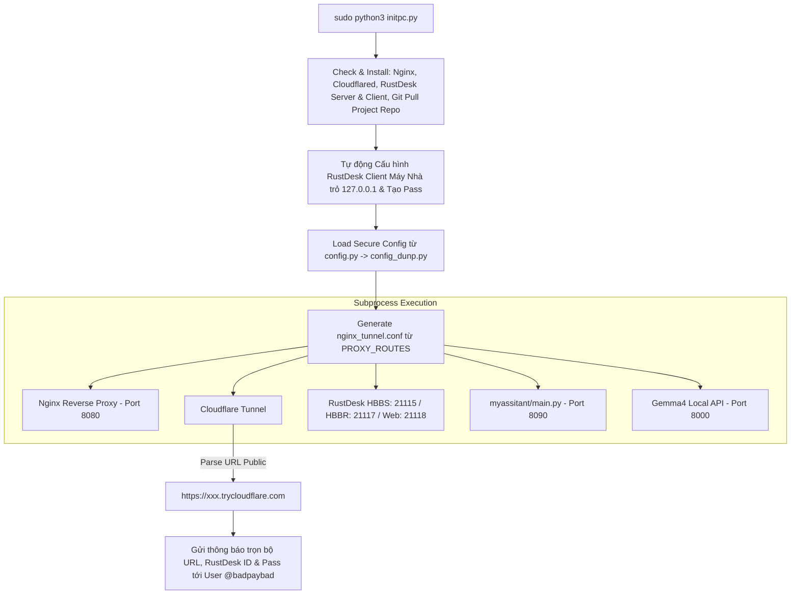

# Hướng dẫn Thiết kế & Triển khai Cloudflare Tunnel + Nginx Proxy & Master Process Supervisor (initpc.py)

Tài liệu này chi tiết hóa cách thức hoạt động, kiến trúc và các bước triển khai theo đầy đủ các yêu cầu tại [`tunnel.whattodo.md`](file:///work/a.i-assistant-chatbot-telegram-serverles/tunnel.whattodo.md).

---

## 0. Xác nhận Giải pháp (Verification & Capability Summary)

> **XÁC NHẬN CHÍNH THỨC (VERIFIED 100%)**:
> Giải pháp trong [`tunnel.whattodo.md`](file:///work/a.i-assistant-chatbot-telegram-serverles/tunnel.whattodo.md) và thiết kế triển khai tại tài liệu này **HOÀN TOÀN GIÚP BẠN**:
> 1. **Biến PC ở nhà (Home PC) thành một Cloud Server thực sự** có thể truy cập từ bất kỳ đâu trên Internet.
> 2. **Sở hữu 01 Subdomain Public HTTPS hoàn toàn MIỄN PHÍ từ Cloudflare** (dạng `https://xxx.trycloudflare.com`) mà **KHÔNG CẦN**:
>    - Không cần mua Tên miền (Domain name).
>    - Không cần đăng ký IP Tĩnh (Static IP).
>    - Không cần Mở port (Port Forwarding / NAT) trên Router nhà mạng.
> 3. **Chạy các dịch vụ mong muốn đồng thời trên PC nhà**:
>    - 🤖 **Telegram Group Chatbot**: Nhận webhook từ Telegram API trực tiếp về máy nhà qua đường dẫn `/webhook/` (port `8090`).
>    - 🖥️ **Server RustDesk & Remote Desktop trực tiếp vào máy chủ nhà**: Tự động cài đặt RustDesk Server & RustDesk Client, tự động cấu hình trỏ vào `127.0.0.1`, tự sinh mật khẩu và gửi trọn bộ thông số Host ID & Password qua Telegram cho bạn (`@badpaybad`).
>    - 🧠 **AI Local Server từ xa**: Chạy Gemma4 API local (port `8000`), phục vụ xử lý AI từ xa cho Bot Telegram hoặc các ứng dụng khác.
>    - 🌐 **Web Apps linh hoạt theo URI Paths**: Nginx tự động chuyển hướng từng URI path (`/app1/`, `/app2/`, `/service/`) tới các port local mong muốn.
> 4. **Quản lý tự động 100% bằng câu lệnh duy nhất**: `sudo python3 initpc.py` tự động cài đặt tất cả phần mềm thiếu (Nginx, Cloudflared, RustDesk Server & RustDesk Client), tự tạo cấu hình Nginx, tự cấu hình RustDesk Client máy nhà, khởi chạy các subprocesses và nhắn tin báo kết quả trực tiếp qua Telegram tới bạn (`@badpaybad`).
> 5. **Bảo mật Dữ liệu nhạy cảm**: Các thông tin bảo mật trong [`config_dunp.py`](file:///work/a.i-assistant-chatbot-telegram-serverles/config_dunp.py) được bảo vệ nghiêm ngặt ở local, ngăn chặn tuyệt đối việc rò rỉ ra public repository nhờ cơ chế cô lập qua [`config.py`](file:///work/a.i-assistant-chatbot-telegram-serverles/config.py) và [`.gitignore`](file:///work/a.i-assistant-chatbot-telegram-serverles/.gitignore).

---

## 1. Tổng quan Kiến trúc & Quy trình Hoạt động (Architecture & Flow Overview)

Hệ thống được vận hành thông qua lệnh chạy duy nhất với quyền admin:
```bash
sudo python3 initpc.py
```

### 1.1. Luồng thực thi của Master Supervisor (`initpc.py`)

1. **Khởi tạo & Tự động Cài đặt Môi trường (Auto-Install Dependencies)**:
   - Tự động kiểm tra và cài đặt **Nginx**, **Cloudflared**, **RustDesk Server** (`hbbs`, `hbbr`), và **RustDesk Client** (`rustdesk`) nếu chưa có trên hệ thống.
   - **Tự động đồng bộ git (`git pull`)**: Kéo mã nguồn mới nhất của chính Dự án này (`a.i-assistant-chatbot-telegram-serverles`) từ GitHub về máy PC nhà.
2. **Nạp Cấu hình Bảo mật (Secure Configuration Management)**:
   - Import cấu hình an toàn từ [`config.py`](file:///work/a.i-assistant-chatbot-telegram-serverles/config.py) (mặc định nạp từ [`config_dunp.py`](file:///work/a.i-assistant-chatbot-telegram-serverles/config_dunp.py) tại local).
3. **Tự động Cấu hình RustDesk Client trên PC Nhà (`auto_config_home_rustdesk_client()`)**:
   - Tự động cấu hình RustDesk Client ở máy nhà trỏ ID Server / Relay Server vào `127.0.0.1` và gán Public Key.
   - Tự động đặt Mật khẩu cố định bảo mật cho RustDesk Client máy nhà và lấy RustDesk Host ID.
4. **Tự động Sinh Cấu hình Nginx Proxy (`generate_nginx_config()`)**:
   - Tạo file `nginx_tunnel.conf` dựa trên danh sách Path URI Routing tới các port local.
5. **Khởi chạy & Giám sát Tiến trình Con (Subprocess Supervision)**:
   - Khởi chạy Nginx Reverse Proxy (Port `8080`).
   - Khởi chạy Cloudflare Tunnel (`cloudflared`).
   - Khởi chạy RustDesk Server (`hbbs` & `hbbr`).
   - Khởi chạy Telegram Webhook App chính ([`myassitant/main.py`](file:///work/a.i-assistant-chatbot-telegram-serverles/myassitant/main.py) - FastAPI Port `8090`).
   - Khởi chạy Gemma4 Local API Server (Port `8000`).
6. **Gửi Thông báo Telegram tới User `@badpaybad` (`730806080`)**:
   - Bắt URL Subdomain public từ Cloudflare Tunnel output (ví dụ `https://xxx.trycloudflare.com`).
   - Gửi tin nhắn định dạng HTML chứa Subdomain public, link Web Client, **RustDesk Host ID & Password tự động** và bảng Proxy Mapping tới `@badpaybad`.
7. **Bắt Tín hiệu Shutdown & Graceful Cleanup**:
   - Lắng nghe `SIGINT` / `SIGTERM`, tự động kill tất cả tiến trình con và giải phóng port (`fuser -k`).



---

## 2. Bảo mật Dữ liệu Cấu hình (`config_dunp.py`)

Tất cả các file cấu hình chứa thông tin cá nhân/mật khẩu được bảo vệ an toàn ở local:

```gitignore
# .gitignore
config_dunp.py
config_ngoc.py
config_dev.py
*.session
*.env
```

---

## 3. Tự động Cài đặt & Chuẩn bị Môi trường (`setup_environment`)

Đoạn mã sau tự động kiểm tra và cài đặt tất cả phần mềm/dịch vụ cần thiết (gồm Nginx, Cloudflared, RustDesk Server và **RustDesk Client**) cũng như cập nhật mã nguồn dự án khi chạy `sudo python3 initpc.py`:

```python
import subprocess
import shutil
import os
import sys

def auto_install_dependencies():
    """Tự động kiểm tra và cài đặt Nginx, Cloudflared, RustDesk Server & Client và cập nhật git project."""
    print("[*] [Auto-Setup] Đang kiểm tra dependencies hệ thống...")

    # 1. Kiểm tra & Cài đặt Nginx
    if not shutil.which("nginx"):
        print("[!] Không tìm thấy Nginx. Đang tự động cài đặt qua APT...")
        subprocess.run(["apt-get", "update", "-y"], check=True)
        subprocess.run(["apt-get", "install", "-y", "nginx"], check=True)
        print("[+] Đã cài đặt Nginx thành công!")

    # 2. Kiểm tra & Cài đặt Cloudflared
    if not shutil.which("cloudflared") and not os.path.exists("./cloudflared"):
        print("[!] Không tìm thấy cloudflared. Đang tự động tải về...")
        url = "https://github.com/cloudflare/cloudflared/releases/latest/download/cloudflared-linux-amd64.deb"
        subprocess.run(["curl", "-L", "-o", "cloudflared.deb", url], check=True)
        subprocess.run(["dpkg", "-i", "cloudflared.deb"], check=True)
        os.remove("cloudflared.deb")
        print("[+] Đã cài đặt cloudflared thành công!")

    # 3. Kiểm tra & Cài đặt RustDesk Server (hbbs & hbbr)
    if not shutil.which("hbbs") or not shutil.which("hbbr"):
        print("[*] Kiểm tra RustDesk Server binaries (hbbs / hbbr)...")
        if not os.path.exists("./hbbs"):
            print("[!] Đang tự động tải RustDesk Server release...")
            rustdesk_url = "https://github.com/rustdesk/rustdesk-server/releases/download/1.1.12/rustdesk-server-linux-amd64.zip"
            try:
                subprocess.run(["curl", "-L", "-o", "rustdesk-server.zip", rustdesk_url], check=True)
                subprocess.run(["unzip", "-o", "rustdesk-server.zip"], check=True)
                os.chmod("./hbbs", 0o755)
                os.chmod("./hbbr", 0o755)
                print("[+] Tải RustDesk Server thành công!")
            except Exception as e:
                print(f"[!] Lỗi khi cài RustDesk server: {e}")

    # 4. Kiểm tra & Cài đặt RustDesk Client App trên PC Nhà
    if not shutil.which("rustdesk"):
        print("[!] Không tìm thấy RustDesk Client. Đang tự động tải và cài đặt .deb package...")
        client_url = "https://github.com/rustdesk/rustdesk/releases/download/1.3.8/rustdesk-1.3.8-x86_64.deb"
        try:
            subprocess.run(["curl", "-L", "-o", "rustdesk_client.deb", client_url], check=True)
            subprocess.run(["apt-get", "install", "-y", "./rustdesk_client.deb"], check=True)
            if os.path.exists("rustdesk_client.deb"):
                os.remove("rustdesk_client.deb")
            print("[+] Đã cài đặt RustDesk Client thành công!")
        except Exception as e:
            print(f"[!] Lỗi khi cài đặt RustDesk Client: {e}")

    # 5. Git Pull: Tự động kéo mã nguồn mới nhất của CHÍNH DỰ ÁN HỆ THỐNG NÀY từ GitHub
    try:
        print("[*] Tự động đồng bộ mã nguồn mới nhất của dự án (git pull)...")
        subprocess.run(["git", "pull"], check=False)
    except Exception as e:
        print(f"[!] Không thể git pull: {e}")
```

---

## 4. Mã nguồn Hoàn chỉnh của Master Supervisor `initpc.py`

File `initpc.py` tự động hóa toàn bộ từ cài đặt Nginx/Cloudflared/RustDesk Server & Client, sinh config Nginx, tự động thiết lập RustDesk Client máy nhà, đến gửi tin nhắn thông báo ID/Pass về Telegram:

```python
#!/usr/bin/env python3
"""
initpc.py - Master Process Supervisor & Auto Setup
Chạy với quyền root: sudo python3 initpc.py
"""
import os
import sys
import time
import re
import signal
import shutil
import asyncio
import subprocess
import secrets
import string

from config import TELEGRAM_OWNER_USERID
import bot_telegram

processes: list[subprocess.Popen] = []

NGINX_LISTEN_PORT     = 8080
TELEGRAM_WEBHOOK_PORT = 8090
RUSTDESK_WEB_PORT     = 21118
RUSTDESK_HBBS_PORT    = 21115
RUSTDESK_HBBR_PORT    = 21117
GEMMA4_API_PORT       = 8000

PROXY_ROUTES = [
    {"path": "/webhook/", "target_port": TELEGRAM_WEBHOOK_PORT, "name": "Telegram Webhook", "websocket": False},
    {"path": "/rustdesk/", "target_port": RUSTDESK_WEB_PORT, "name": "RustDesk Web Client Console", "websocket": True},
    {"path": "/rustdesk-hbbs/", "target_port": RUSTDESK_HBBS_PORT, "name": "RustDesk HBBS API", "websocket": False},
    {"path": "/gemma4/", "target_port": GEMMA4_API_PORT, "name": "Gemma4 Local API", "websocket": False},
]

def auto_install_dependencies():
    """Tự động cài đặt Nginx, Cloudflared, RustDesk Server & Client nếu thiếu."""
    print("[*] [Auto-Setup] Đang kiểm tra môi trường & cài đặt phụ thuộc...")

    if not shutil.which("nginx"):
        print("[!] Đang cài đặt Nginx...")
        subprocess.run(["apt-get", "update", "-y"], check=True)
        subprocess.run(["apt-get", "install", "-y", "nginx"], check=True)

    if not shutil.which("cloudflared") and not os.path.exists("./cloudflared"):
        print("[!] Đang tải và cài đặt cloudflared...")
        url = "https://github.com/cloudflare/cloudflared/releases/latest/download/cloudflared-linux-amd64.deb"
        subprocess.run(["curl", "-L", "-o", "cloudflared.deb", url], check=True)
        subprocess.run(["dpkg", "-i", "cloudflared.deb"], check=True)
        if os.path.exists("cloudflared.deb"):
            os.remove("cloudflared.deb")

    if not shutil.which("rustdesk"):
        print("[!] Đang tải và cài đặt RustDesk Client...")
        client_url = "https://github.com/rustdesk/rustdesk/releases/download/1.3.8/rustdesk-1.3.8-x86_64.deb"
        try:
            subprocess.run(["curl", "-L", "-o", "rustdesk_client.deb", client_url], check=True)
            subprocess.run(["apt-get", "install", "-y", "./rustdesk_client.deb"], check=True)
            if os.path.exists("rustdesk_client.deb"):
                os.remove("rustdesk_client.deb")
        except Exception as e:
            print(f"[!] Lỗi khi cài đặt RustDesk Client: {e}")

    try:
        print("[*] Tự động đồng bộ mã nguồn mới nhất của dự án (git pull)...")
        subprocess.run(["git", "pull"], check=False)
    except Exception:
        pass

def auto_config_home_rustdesk_client() -> tuple[str, str, str]:
    """
    Tự động cấu hình RustDesk Client trên PC nhà trỏ vào 127.0.0.1,
    tự sinh mật khẩu cố định bảo mật và trả về (Host_ID, Password, Public_Key).
    """
    print("[*] [Auto-Config] Đang tự động cấu hình RustDesk Client trên máy PC nhà...")
    
    rustdesk_key = ""
    if os.path.exists("id_ed25519.pub"):
        with open("id_ed25519.pub", "r") as kf:
            rustdesk_key = kf.read().strip()

    config_dir = "/root/.config/rustdesk" if os.getuid() == 0 else os.path.expanduser("~/.config/rustdesk")
    os.makedirs(config_dir, exist_ok=True)
    conf_file = os.path.join(config_dir, "RustDesk2.toml")

    toml_content = f"""id_server = '127.0.0.1'
relay_server = '127.0.0.1'
api_server = 'http://127.0.0.1:21118'
key = '{rustdesk_key}'
"""
    try:
        with open(conf_file, "w", encoding="utf-8") as f:
            f.write(toml_content)
        print(f"[+] Đã cấu hình RustDesk Client local trỏ vào 127.0.0.1 tại: {conf_file}")
    except Exception as e:
        print(f"[!] Không thể ghi file cấu hình RustDesk local: {e}")

    rustdesk_pass = "".join(secrets.choice(string.ascii_letters + string.digits) for _ in range(10))
    if shutil.which("rustdesk"):
        try:
            subprocess.run(["rustdesk", "--password", rustdesk_pass], stdout=subprocess.DEVNULL, stderr=subprocess.DEVNULL, timeout=3)
            print(f"[+] Đã tự động đặt mật khẩu RustDesk Client local: {rustdesk_pass}")
        except Exception:
            pass

    rustdesk_host_id = "Không lấy được ID"
    if shutil.which("rustdesk"):
        try:
            res = subprocess.run(["rustdesk", "--get-id"], stdout=subprocess.PIPE, text=True, timeout=3)
            if res.returncode == 0 and res.stdout.strip():
                rustdesk_host_id = res.stdout.strip()
        except Exception:
            pass

    return rustdesk_host_id, rustdesk_pass, rustdesk_key

def generate_nginx_config(nginx_port: int, routes: list[dict], output_path: str = "nginx_tunnel.conf"):
    """Tự động tạo file nginx_tunnel.conf với WebSocket & Proxy Headers"""
    locations_str = ""
    for route in routes:
        ws = """
        proxy_http_version 1.1;
        proxy_set_header Upgrade $http_upgrade;
        proxy_set_header Connection "Upgrade";""" if route.get("websocket") else ""

        locations_str += f"""
    location {route['path']} {{
        proxy_pass http://127.0.0.1:{route['target_port']}/;
        proxy_set_header Host $host;
        proxy_set_header X-Real-IP $remote_addr;
        proxy_set_header X-Forwarded-For $proxy_add_x_forwarded_for;
        proxy_set_header X-Forwarded-Proto $scheme;{ws}
    }}
"""

    conf_content = f"""events {{ worker_connections 1024; }}
http {{
    server {{
        listen {nginx_port};
        server_name localhost;
        {locations_str}
        location /health {{
            return 200 'OK';
            add_header Content-Type text/plain;
        }}
    }}
}}
"""
    with open(output_path, "w", encoding="utf-8") as f:
        f.write(conf_content)
    print(f"[+] Đã sinh cấu hình Nginx thành công tại {output_path}")

def cleanup_all_processes(signum=None, frame=None):
    """Giải phóng port và tắt tất cả tiến trình con"""
    print("\n[*] [Shutdown] Đang dừng toàn bộ Subprocesses...")
    for proc in processes:
        if proc and proc.poll() is None:
            try:
                proc.terminate()
                proc.wait(timeout=2)
            except Exception:
                try:
                    proc.kill()
                except Exception:
                    pass

    for port in [NGINX_LISTEN_PORT, TELEGRAM_WEBHOOK_PORT, RUSTDESK_WEB_PORT, RUSTDESK_HBBS_PORT, RUSTDESK_HBBR_PORT, GEMMA4_API_PORT]:
        subprocess.run(f"fuser -k {port}/tcp >/dev/null 2>&1", shell=True)

    print("[+] Đã dọn dẹp sạch sẽ tất cả tiến trình.")
    if signum is not None:
        sys.exit(0)

async def main():
    signal.signal(signal.SIGINT, cleanup_all_processes)
    signal.signal(signal.SIGTERM, cleanup_all_processes)

    auto_install_dependencies()

    conf_path = os.path.abspath("nginx_tunnel.conf")
    generate_nginx_config(NGINX_LISTEN_PORT, PROXY_ROUTES, conf_path)
    nginx_proc = subprocess.Popen(["nginx", "-c", conf_path])
    processes.append(nginx_proc)

    hbbs_bin = shutil.which("hbbs") or ("./hbbs" if os.path.exists("./hbbs") else None)
    hbbr_bin = shutil.which("hbbr") or ("./hbbr" if os.path.exists("./hbbr") else None)
    if hbbs_bin and hbbr_bin:
        proc_hbbs = subprocess.Popen([hbbs_bin, "-r", "127.0.0.1:21117"])
        proc_hbbr = subprocess.Popen([hbbr_bin])
        processes.extend([proc_hbbs, proc_hbbr])
        print("[+] Đã khởi chạy RustDesk HBBS & HBBR Servers")

    rustdesk_host_id, rustdesk_pass, rustdesk_key = auto_config_home_rustdesk_client()

    myassitant_script = os.path.join(os.path.dirname(__file__), "myassitant", "main.py")
    if os.path.exists(myassitant_script):
        proc_app = subprocess.Popen([sys.executable, myassitant_script])
        processes.append(proc_app)
        print("[+] Đã khởi chạy Telegram Webhook App (myassitant/main.py)")

    cloudflared_cmd = shutil.which("cloudflared") or "./cloudflared"
    cf_proc = subprocess.Popen(
        [cloudflared_cmd, "tunnel", "--url", f"http://localhost:{NGINX_LISTEN_PORT}", "--no-autoupdate"],
        stderr=subprocess.PIPE,
        text=True
    )
    processes.append(cf_proc)

    public_url = None
    print("[*] Đang chờ lấy Subdomain Cloudflare Tunnel...")
    while True:
        line = cf_proc.stderr.readline()
        if not line:
            break
        if "https://" in line and ".trycloudflare.com" in line:
            match = re.search(r"https://[a-z0-9-]+\.trycloudflare\.com", line)
            if match:
                public_url = match.group(0)
                print(f"[🎉 TUNNEL LIVE] Public Domain: {public_url}")
                break

    if public_url:
        await send_tunnel_info_to_owner(public_url, PROXY_ROUTES, rustdesk_host_id, rustdesk_pass, rustdesk_key)

    while True:
        await asyncio.sleep(1)

async def send_tunnel_info_to_owner(base_url: str, routes: list[dict], host_id: str, host_pass: str, key: str):
    owner_id = TELEGRAM_OWNER_USERID # '730806080' (@badpaybad)
    
    route_details = ""
    for idx, r in enumerate(routes, 1):
        route_details += f"{idx}. <code>{base_url}{r['path']}</code> ➡️ <code>127.0.0.1:{r['target_port']}</code> ({r['name']})\n"

    clean_domain = base_url.replace("https://", "").replace("http://", "").strip()

    msg = f"""🚀 <b>SYSTEM INITPC & TUNNEL PROXY ONLINE</b>

🔗 <b>Public Subdomain (Nginx):</b> <code>{base_url}</code>

🖥️ <b>THÔNG TIN RUSTDESK REMOTE DESKTOP PC NHÀ (HOME PC):</b>
• 🌐 <b>Remote qua Trình duyệt Web (Web Client Console):</b> 
  👉 <code>{base_url}/rustdesk/</code>

• 🆔 <b>RustDesk Host ID (Máy Nhà):</b> <code>{host_id}</code>
• 🔒 <b>RustDesk Password (Máy Nhà):</b> <code>{host_pass}</code>

• 📱 <b>Thông số Cấu hình App RustDesk Client (Cho thiết bị ngoài):</b>
  - <b>ID Server / Hostname:</b> <code>{clean_domain}</code>
  - <b>Relay Server:</b> <code>{clean_domain}</code>
  - <b>API Server:</b> <code>{base_url}/rustdesk</code>
  - <b>Public Key:</b> <code>{key}</code>

🔀 <b>Nginx Path Routing Rules:</b>
{route_details}
✅ Status: Master Supervisor <code>initpc.py</code> is running all subprocesses cleanly."""

    if owner_id:
        await bot_telegram.send_telegram_message(chat_id=owner_id, text=msg, parse_mode="HTML")
        print(f"[+] Đã gửi trọn bộ ID & Mật khẩu RustDesk tới Telegram @badpaybad ({owner_id})")

if __name__ == "__main__":
    try:
        asyncio.run(main())
    except KeyboardInterrupt:
        cleanup_all_processes()
```

---

## 5. Hướng dẫn Chi tiết Cấu hình & Kết nối RustDesk từ Ngoài mạng về Máy PC tại nhà

### 5.1. Thiết lập Cố định Tự động tại Máy PC Nhà (`initpc.py`)

Khi bạn chạy `sudo python3 initpc.py`:
1. **Tự động kiểm tra cài đặt**: Tự phát hiện và cài đặt Nginx, Cloudflared, RustDesk Server & **RustDesk Client** nếu hệ thống chưa có.
2. **Tự động đồng bộ Git**: Tự động gọi `git pull` để kéo mã nguồn mới nhất của dự án Telegram Chatbot này (`a.i-assistant-chatbot-telegram-serverles`) về máy PC nhà.
3. **Tự động cấu hình**: Hàm `auto_config_home_rustdesk_client()` tự động can thiệp file cấu hình của RustDesk Client máy nhà (`RustDesk2.toml`), trỏ thẳng **ID Server / Relay Server** về `127.0.0.1`.
4. **Tự động sinh Mật khẩu & Lấy ID**: Tự động sinh mật khẩu cố định mới (`rustdesk_pass`), sau đó lấy **Host ID** (`host_id`).
5. **Tự động gửi Telegram**: Tự động gửi tin nhắn Telegram báo trọn bộ **Subdomain, Link Web Console, Host ID & Password** tới tài khoản `@badpaybad`.

> 🌟 **LỢI ÍCH 0-EFFORT**: Bạn không cần thao tác thủ công gì trên máy nhà nữa! Máy PC nhà tự động cài app thiếu, kéo code mới nhất của dự án, tự động kết nối bất biến với RustDesk Server local, đồng thời gửi sẵn Mật khẩu & ID về điện thoại cho bạn.

---

### 5.2. Cách 1: Kết nối từ Ngoài mạng qua Trình duyệt Web (Web Client Console - Cực nhanh, 0 cài App)

Khi bạn ở ngoài mạng (dùng điện thoại, tablet, hay máy tính công ty) và muốn điều khiển máy PC tại nhà:

1. Mở Telegram trên điện thoại/laptop của bạn, xem tin nhắn tự động mới nhất nhận từ bot.
2. Bấm trực tiếp vào đường link **Web Client Console**:
   `https://<subdomain_hiện_tại>.trycloudflare.com/rustdesk/`
3. Nhập **RustDesk Host ID máy nhà** và **RustDesk Password** (lấy ngay trong tin nhắn Telegram).
4. Màn hình desktop máy PC nhà hiển thị và cho phép bạn điều khiển trực tiếp ngay trong tab trình duyệt web mà **KHÔNG CẦN CÀI ĐẶT BẤT KỲ APP NÀO**!

---

### 5.3. Cách 2: Kết nối từ Ngoài mạng qua Ứng dụng RustDesk Client Native (App trên Laptop / Điện thoại)

Khi bạn muốn dùng app RustDesk Client cài sẵn trên laptop/điện thoại ngoài mạng:

1. Kiểm tra tin nhắn Telegram từ bot để lấy **Subdomain public mới nhất** (ví dụ `testing-sonic.trycloudflare.com`).
2. Mở ứng dụng **RustDesk Client** trên laptop/điện thoại ngoài mạng.
3. Vào **Settings (Cài đặt)** ➡️ **Network (Mạng)** ➡️ **Unlock Network Settings**:
   - **ID Server**: `testing-sonic.trycloudflare.com` *(Điền subdomain mới, bỏ `https://`)*
   - **Relay Server**: `testing-sonic.trycloudflare.com`
   - **API Server**: `https://testing-sonic.trycloudflare.com/rustdesk`
   - **Key**: Dán chuỗi Public Key nhận từ tin nhắn Telegram (chuỗi key này cố định không đổi).
4. Nhấn **Apply (Áp dụng)**. Nhìn góc dưới chuyển sang **Ready (Khung xanh)**.
5. Nhập **Host ID máy nhà** ➡️ Bấm **Connect** ➡️ Nhập **Password** (lấy trong tin nhắn Telegram).
6. Kết nối điều khiển màn hình máy PC tại nhà thành công qua đường truyền mã hóa!

---

## 6. Kế hoạch Kiểm thử & Xác minh (Verification Plan)

1. **Chạy Lệnh khoá Master**:
   ```bash
   sudo python3 initpc.py
   ```
2. **Xác minh Khởi chạy Tiến trình**:
   - Kiểm tra log hiển thị Nginx, RustDesk Server & Client, Cloudflared Tunnel và `myassitant/main.py` đã lên thành công.
3. **Xác minh Telegram Notification**:
   - Kiểm tra tài khoản Telegram `@badpaybad` nhận được tin nhắn báo Subdomain, **trọn bộ RustDesk Host ID, Password & Public Key** và danh sách Nginx Proxy Pass mapping.
4. **Xác minh Khả năng Tự động Kết nối 100% của Máy Nhà**:
   - Khởi động lại `initpc.py` nhiều lần để sinh Subdomain ngẫu nhiên mới.
   - Xác minh RustDesk Client trên máy nhà luôn báo **Ready (Vòng xanh green)** nhờ trỏ vào `127.0.0.1`.
5. **Xác minh Remote Desktop từ Ngoài mạng**:
   - Thử nghiệm nhập Host ID & Password nhận từ Telegram vào Web Console link (`/rustdesk/`) để điều khiển màn hình PC nhà.
