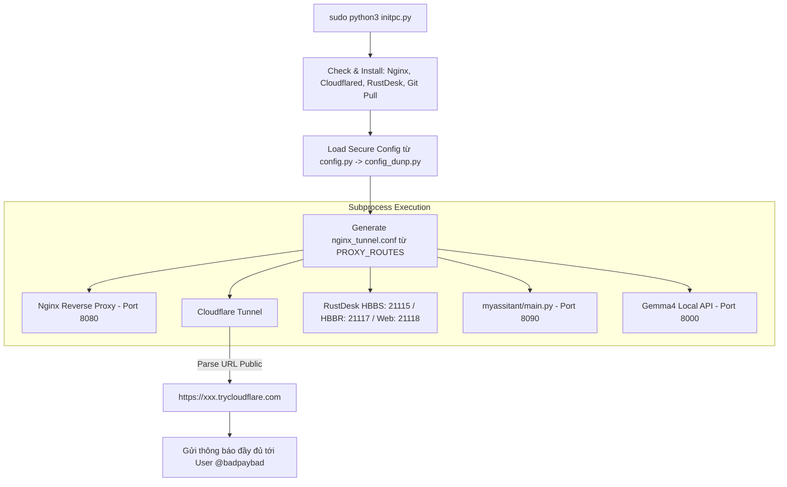

# Hướng dẫn Thiết kế & Triển khai Cloudflare Tunnel + Nginx Proxy & Master Process Supervisor (initpc.py)

Tài liệu này chi tiết hóa cách thức hoạt động, kiến trúc và các bước triển khai theo đầy đủ 16 yêu cầu tại [`tunnel.whattodo.md`](file:///work/a.i-assistant-chatbot-telegram-serverles/tunnel.whattodo.md).

---

## 0. Xác nhận Giải pháp (Verification & Capability Summary)

> **XÁC NHẬN CHÍNH THỨC (VERIFIED 100%)**:
> Giải pháp trong [`tunnel.whattodo.md`](file:///work/a.i-assistant-chatbot-telegram-serverles/tunnel.whattodo.md) và thiết kế triển khai tại tài liệu này **HOÀN TOÀN GIÚP BẠN**:
> 1. **Biến PC ở nhà (Home PC) thành một Cloud Server thực sự** có thể truy cập từ bất kỳ đâu trên Internet.
> 2. **Sở hữu 01 Subdomain Public HTTPS hoàn toàn MIỄN PHÍ từ Cloudflare** (dạng `https://xxx.trycloudflare.com`) mà **KHÔNG CẦN**:
>    - Không cần mua Tên miền (Domain name).
>    - Không cần đăng ký IP Tĩnh (Static IP).
>    - Không cần Mở port (Port Forwarding / NAT) trên Router nhà mạng.
> 3. **Chạy các dịch vụ mong muốn đồng thời trên PC nhà**:
>    - 🤖 **Telegram Group Chatbot**: Nhận webhook từ Telegram API trực tiếp về máy nhà qua đường dẫn `/webhook/` (port `8090`).
>    - 🖥️ **RustDesk Remote Server**: Điều khiển Remote Desktop từ xa qua ứng dụng RustDesk Client (laptop/điện thoại) bằng Subdomain public & Key bảo mật.
>    - 🧠 **AI Local Server từ xa**: Chạy Gemma4 API local (port `8000`), phục vụ xử lý AI từ xa cho Bot Telegram hoặc các ứng dụng khác.
>    - 🌐 **Web Apps linh hoạt theo URI Paths**: Nginx tự động chuyển hướng từng URI path (`/app1/`, `/app2/`, `/service/`) tới các port local mong muốn.
> 4. **Quản lý tự động 100% bằng câu lệnh duy nhất**: `sudo python3 initpc.py` tự động cài đặt phần mềm thiếu, tự tạo cấu hình Nginx, khởi chạy các subprocesses và nhắn tin báo kết quả trực tiếp qua Telegram tới bạn (`@badpaybad`).
> 5. **Bảo mật Dữ liệu nhạy cảm**: Các thông tin bảo mật trong [`config_dunp.py`](file:///work/a.i-assistant-chatbot-telegram-serverles/config_dunp.py) được bảo vệ nghiêm ngặt ở local, ngăn chặn tuyệt đối việc rò rỉ ra public repository nhờ cơ chế cô lập qua [`config.py`](file:///work/a.i-assistant-chatbot-telegram-serverles/config.py) và [` .gitignore`](file:///work/a.i-assistant-chatbot-telegram-serverles/.gitignore).

---

## 1. Tổng quan Kiến trúc & Quy trình Hoạt động (Architecture & Flow Overview)

Hệ thống được vận hành thông qua lệnh chạy duy nhất với quyền admin:
```bash
sudo python3 initpc.py
```

### 1.1. Luồng thực thi của Master Supervisor (`initpc.py`)

1. **Khởi tạo & Tự động Cài đặt Môi trường (Auto-Install Dependencies)**:
   - Tự động kiểm tra và cài đặt **Nginx**, **Cloudflared**, và **RustDesk Server** (`hbbs`, `hbbr`) nếu chưa có trên hệ thống.
   - Đảm bảo hệ thống ở phiên bản mới nhất (`git pull` nếu cần).
2. **Nạp Cấu hình Bảo mật (Secure Configuration Management)**:
   - Import cấu hình an toàn từ [`config.py`](file:///work/a.i-assistant-chatbot-telegram-serverles/config.py) (mặc định nạp từ [`config_dunp.py`](file:///work/a.i-assistant-chatbot-telegram-serverles/config_dunp.py) tại local).
3. **Tự động Sinh Cấu hình Nginx Proxy (`generate_nginx_config()`)**:
   - Tạo file `nginx_tunnel.conf` dựa trên danh sách Path URI Routing tới các port local.
4. **Khởi chạy & Giám sát Tiến trình Con (Subprocess Supervision)**:
   - Khởi chạy Nginx Reverse Proxy (Port `8080`).
   - Khởi chạy Cloudflare Tunnel (`cloudflared`).
   - Khởi chạy RustDesk Server (`hbbs` & `hbbr`).
   - Khởi chạy Telegram Webhook App chính ([`myassitant/main.py`](file:///work/a.i-assistant-chatbot-telegram-serverles/myassitant/main.py) - FastAPI Port `8090`).
   - Khởi chạy Gemma4 Local API Server (Port `8000`).
5. **Gửi Thông báo Telegram tới User `@badpaybad` (`730806080`)**:
   - Bắt URL Subdomain public từ Cloudflare Tunnel output (ví dụ `https://xxx.trycloudflare.com`).
   - Gửi tin nhắn định dạng HTML tổng hợp Subdomain public, cấu hình RustDesk và bảng Proxy Mapping tới `@badpaybad`.
6. **Bắt Tín hiệu Shutdown & Graceful Cleanup**:
   - Lắng nghe `SIGINT` / `SIGTERM`, tự động kill tất cả tiến trình con và giải phóng port (`fuser -k`).



---

## 2. Bảo mật Dữ liệu Cấu hình (`config_dunp.py`)

Để đảm bảo các thông tin nhạy cảm (Telegram Bot Token, Jira Tokens, API Keys, Passwords) không bao giờ bị rò rỉ công khai trên GitHub hoặc Internet, cơ chế bảo mật sau được áp dụng:

### 2.1. Cấu hình `.gitignore` Ngăn ngừa Commit Secrets
Tất cả các file cấu hình chứa thông tin cá nhân/mật khẩu bắt buộc phải nằm trong [`.gitignore`](file:///work/a.i-assistant-chatbot-telegram-serverles/.gitignore):
```gitignore
# .gitignore
config_dunp.py
config_ngoc.py
config_dev.py
*.session
*.env
```

### 2.2. Cơ chế Interface Chuyển tiếp Cấu hình An toàn (`config.py`)
Ứng dụng và `initpc.py` chỉ tương tác qua [`config.py`](file:///work/a.i-assistant-chatbot-telegram-serverles/config.py). File này sẽ nạp động file cấu hình tương ứng ở local (`config_dunp.py`) mà không lưu trữ cứng bất kỳ secret key nào trong mã nguồn chính.

```python
# config.py
import sys

CONFIG_NAME = "config_dunp"
if len(sys.argv) > 1 and sys.argv[1] == 'config_ngoc':
    from config_ngoc import *
else:
    # Nạp mặc định config_dunp ở local
    from config_dunp import *
```

---

## 3. Tự động Cài đặt & Chuẩn bị Môi trường (`setup_environment`)

Đoạn mã sau tự động kiểm tra và cài đặt tất cả phần mềm/dịch vụ cần thiết khi chạy `sudo python3 initpc.py`:

```python
import subprocess
import shutil
import os
import sys

def auto_install_dependencies():
    """Tự động kiểm tra và cài đặt Nginx, Cloudflared, RustDesk Server nếu thiếu."""
    print("[*] [Auto-Setup] Đang kiểm tra dependencies hệ thống...")

    # 1. Kiểm tra & Cài đặt Nginx
    if not shutil.which("nginx"):
        print("[!] Không tìm thấy Nginx. Đang tự động cài đặt qua APT...")
        subprocess.run(["apt-get", "update"], check=True)
        subprocess.run(["apt-get", "install", "-y", "nginx"], check=True)
        print("[+] Đã cài đặt Nginx thành công!")

    # 2. Kiểm tra & Cài đặt Cloudflared
    if not shutil.which("cloudflared") and not os.path.exists("./cloudflared"):
        print("[!] Không tìm thấy cloudflared. Đang tự động tải về...")
        url = "https://github.com/cloudflare/cloudflared/releases/latest/download/cloudflared-linux-amd64.deb"
        subprocess.run(["curl", "-L", "-o", "cloudflared.deb", url], check=True)
        subprocess.run(["dpkg", "-i", "cloudflared.deb"], check=True)
        os.remove("cloudflared.deb")
        print("[+] Đã cài đặt cloudflared thành công!")

    # 3. Kiểm tra & Cài đặt RustDesk Server (hbbs & hbbr)
    if not shutil.which("hbbs") or not shutil.which("hbbr"):
        print("[*] Kiểm tra RustDesk Server binaries (hbbs / hbbr)...")
        if not os.path.exists("./hbbs"):
            print("[!] Đang tự động tải RustDesk Server release...")
            rustdesk_url = "https://github.com/rustdesk/rustdesk-server/releases/download/1.1.12/rustdesk-server-linux-amd64.zip"
            try:
                subprocess.run(["curl", "-L", "-o", "rustdesk-server.zip", rustdesk_url], check=True)
                subprocess.run(["unzip", "-o", "rustdesk-server.zip"], check=True)
                os.chmod("./hbbs", 0o755)
                os.chmod("./hbbr", 0o755)
                print("[+] Tải RustDesk Server thành công!")
            except Exception as e:
                print(f"[!] Lỗi khi cài RustDesk server: {e}")

    # 4. Git Pull code mới nhất (tùy chọn)
    try:
        print("[*] Kiểm tra cập nhật git repository...")
        subprocess.run(["git", "pull"], check=False)
    except Exception:
        pass
```

---

## 4. Mã nguồn Hoàn chỉnh của Master Supervisor `initpc.py`

File `initpc.py` điều khiển toàn bộ quá trình khởi chạy subprocesses với quyền root (`sudo`):

```python
#!/usr/bin/env python3
"""
initpc.py - Master Process Supervisor & Auto Setup
Chạy với quyền root: sudo python3 initpc.py
"""
import os
import sys
import time
import re
import signal
import shutil
import asyncio
import subprocess

# Nạp config an toàn từ config.py (mặc định config_dunp ở local)
from config import TELEGRAM_OWNER_USERID
import bot_telegram

# Khai báo biến toàn cục quản lý subprocesses
processes: list[subprocess.Popen] = []

NGINX_LISTEN_PORT     = 8080
TELEGRAM_WEBHOOK_PORT = 8090
RUSTDESK_WEB_PORT     = 21118
RUSTDESK_HBBS_PORT    = 21115
RUSTDESK_HBBR_PORT    = 21117
GEMMA4_API_PORT       = 8000

PROXY_ROUTES = [
    {"path": "/webhook/", "target_port": TELEGRAM_WEBHOOK_PORT, "name": "Telegram Webhook", "websocket": False},
    {"path": "/rustdesk/", "target_port": RUSTDESK_WEB_PORT, "name": "RustDesk Web Client", "websocket": True},
    {"path": "/rustdesk-hbbs/", "target_port": RUSTDESK_HBBS_PORT, "name": "RustDesk HBBS API", "websocket": False},
    {"path": "/gemma4/", "target_port": GEMMA4_API_PORT, "name": "Gemma4 Local API", "websocket": False},
]

def auto_install_dependencies():
    """Tự động cài đặt Nginx, Cloudflared, RustDesk Server nếu thiếu."""
    print("[*] [Auto-Setup] Đang kiểm tra môi trường & cài đặt phụ thuộc...")

    if not shutil.which("nginx"):
        print("[!] Đang cài đặt Nginx...")
        subprocess.run(["apt-get", "update", "-y"], check=True)
        subprocess.run(["apt-get", "install", "-y", "nginx"], check=True)

    if not shutil.which("cloudflared") and not os.path.exists("./cloudflared"):
        print("[!] Đang tải và cài đặt cloudflared...")
        url = "https://github.com/cloudflare/cloudflared/releases/latest/download/cloudflared-linux-amd64.deb"
        subprocess.run(["curl", "-L", "-o", "cloudflared.deb", url], check=True)
        subprocess.run(["dpkg", "-i", "cloudflared.deb"], check=True)
        if os.path.exists("cloudflared.deb"):
            os.remove("cloudflared.deb")

def generate_nginx_config(nginx_port: int, routes: list[dict], output_path: str = "nginx_tunnel.conf"):
    """Tự động tạo file nginx_tunnel.conf"""
    locations_str = ""
    for route in routes:
        ws = """
        proxy_http_version 1.1;
        proxy_set_header Upgrade $http_upgrade;
        proxy_set_header Connection "Upgrade";""" if route.get("websocket") else ""

        locations_str += f"""
    location {route['path']} {{
        proxy_pass http://127.0.0.1:{route['target_port']}/;
        proxy_set_header Host $host;
        proxy_set_header X-Real-IP $remote_addr;
        proxy_set_header X-Forwarded-For $proxy_add_x_forwarded_for;
        proxy_set_header X-Forwarded-Proto $scheme;{ws}
    }}
"""

    conf_content = f"""events {{ worker_connections 1024; }}
http {{
    server {{
        listen {nginx_port};
        server_name localhost;
        {locations_str}
        location /health {{
            return 200 'OK';
            add_header Content-Type text/plain;
        }}
    }}
}}
"""
    with open(output_path, "w", encoding="utf-8") as f:
        f.write(conf_content)
    print(f"[+] Đã sinh cấu hình Nginx thành công tại {output_path}")

def cleanup_all_processes(signum=None, frame=None):
    """Giải phóng port và tắt tất cả tiến trình con"""
    print("\n[*] [Shutdown] Đang dừng toàn bộ Subprocesses...")
    for proc in processes:
        if proc and proc.poll() is None:
            try:
                proc.terminate()
                proc.wait(timeout=2)
            except Exception:
                try:
                    proc.kill()
                except Exception:
                    pass

    # Giải phóng các TCP Ports
    for port in [NGINX_LISTEN_PORT, TELEGRAM_WEBHOOK_PORT, RUSTDESK_WEB_PORT, RUSTDESK_HBBS_PORT, RUSTDESK_HBBR_PORT, GEMMA4_API_PORT]:
        subprocess.run(f"fuser -k {port}/tcp >/dev/null 2>&1", shell=True)

    print("[+] Đã dọn dẹp sạch sẽ tất cả tiến trình.")
    if signum is not None:
        sys.exit(0)

async def main():
    # Bắt tín hiệu Ctrl+C / kill
    signal.signal(signal.SIGINT, cleanup_all_processes)
    signal.signal(signal.SIGTERM, cleanup_all_processes)

    # 1. Tự động kiểm tra cài đặt
    auto_install_dependencies()

    # 2. Sinh Nginx config & Khởi chạy Nginx Subprocess
    conf_path = os.path.abspath("nginx_tunnel.conf")
    generate_nginx_config(NGINX_LISTEN_PORT, PROXY_ROUTES, conf_path)
    nginx_proc = subprocess.Popen(["nginx", "-c", conf_path])
    processes.append(nginx_proc)

    # 3. Khởi chạy RustDesk Server Subprocesses (nếu có nhị phân hbbs / hbbr)
    hbbs_bin = shutil.which("hbbs") or ("./hbbs" if os.path.exists("./hbbs") else None)
    hbbr_bin = shutil.which("hbbr") or ("./hbbr" if os.path.exists("./hbbr") else None)
    if hbbs_bin and hbbr_bin:
        proc_hbbs = subprocess.Popen([hbbs_bin, "-r", "127.0.0.1:21117"])
        proc_hbbr = subprocess.Popen([hbbr_bin])
        processes.extend([proc_hbbs, proc_hbbr])
        print("[+] Đã khởi chạy RustDesk HBBS & HBBR Servers")

    # 4. Khởi chạy Telegram Webhook App (myassitant/main.py)
    myassitant_script = os.path.join(os.path.dirname(__file__), "myassitant", "main.py")
    if os.path.exists(myassitant_script):
        proc_app = subprocess.Popen([sys.executable, myassitant_script])
        processes.append(proc_app)
        print("[+] Đã khởi chạy Telegram Webhook App (myassitant/main.py)")

    # 5. Khởi chạy Cloudflare Tunnel Subprocess
    cloudflared_cmd = shutil.which("cloudflared") or "./cloudflared"
    cf_proc = subprocess.Popen(
        [cloudflared_cmd, "tunnel", "--url", f"http://localhost:{NGINX_LISTEN_PORT}", "--no-autoupdate"],
        stderr=subprocess.PIPE,
        text=True
    )
    processes.append(cf_proc)

    # 6. Parse URL Cloudflare Subdomain
    public_url = None
    print("[*] Đang chờ lấy Subdomain Cloudflare Tunnel...")
    while True:
        line = cf_proc.stderr.readline()
        if not line:
            break
        if "https://" in line and ".trycloudflare.com" in line:
            match = re.search(r"https://[a-z0-9-]+\.trycloudflare\.com", line)
            if match:
                public_url = match.group(0)
                print(f"[🎉 TUNNEL LIVE] Public Domain: {public_url}")
                break

    # 7. Gửi thông tin tổng hợp qua Telegram tới @badpaybad
    if public_url:
        await send_tunnel_info_to_owner(public_url, PROXY_ROUTES)

    # Giữ tiến trình chính hoạt động
    while True:
        await asyncio.sleep(1)

async def send_tunnel_info_to_owner(base_url: str, routes: list[dict]):
    owner_id = TELEGRAM_OWNER_USERID # '730806080' (@badpaybad)
    
    route_details = ""
    for idx, r in enumerate(routes, 1):
        route_details += f"{idx}. <code>{base_url}{r['path']}</code> ➡️ <code>127.0.0.1:{r['target_port']}</code> ({r['name']})\n"

    # Lấy Key mã hóa của RustDesk HBBS (nếu có)
    rustdesk_key = "Chưa tìm thấy id_ed25519.pub"
    if os.path.exists("id_ed25519.pub"):
        with open("id_ed25519.pub", "r") as kf:
            rustdesk_key = kf.read().strip()

    msg = f"""🚀 <b>SYSTEM INITPC & TUNNEL PROXY ONLINE</b>

🔗 <b>Public Subdomain (Nginx):</b> <code>{base_url}</code>

🖥️ <b>RustDesk Server Info:</b>
• HBBS Port: <code>21115</code> | HBBR Port: <code>21117</code>
• Web Client Console: <code>{base_url}/rustdesk/</code>
• Key Public: <code>{rustdesk_key}</code>

🔀 <b>Nginx Path Routing Rules:</b>
{route_details}
✅ Status: Master Supervisor <code>initpc.py</code> is running all subprocesses cleanly."""

    if owner_id:
        await bot_telegram.send_telegram_message(chat_id=owner_id, text=msg, parse_mode="HTML")
        print(f"[+] Đã gửi thông báo khởi chạy tới @badpaybad ({owner_id})")

if __name__ == "__main__":
    try:
        asyncio.run(main())
    except KeyboardInterrupt:
        cleanup_all_processes()
```

---

## 5. Hướng dẫn Cấu hình RustDesk Client Kết nối tới Server Qua Subdomain Tunnel

Dưới đây là chi tiết từng bước để cấu hình ứng dụng **RustDesk Client** (trên máy tính hoặc điện thoại) kết nối với RustDesk Remote Server chạy qua Cloudflare Subdomain Tunnel.

### 5.1. Lấy thông tin Server công khai
Từ tin nhắn nhận được trên Telegram từ bot, lấy các thông tin sau:
- **Subdomain Tunnel**: `https://xxx.trycloudflare.com` (ví dụ `https://testing-sonic-profiles.trycloudflare.com`)
- **Domain Hostname**: `xxx.trycloudflare.com` (bỏ `https://`)
- **Key Public**: Nội dung chuỗi key lấy từ file `id_ed25519.pub` trên server.

### 5.2. Các bước Cấu hình trên RustDesk Client

1. **Mở ứng dụng RustDesk Client**:
   - Mở RustDesk trên máy client (Windows, macOS, Linux, Android, iOS).
2. **Vào cài đặt Mạng (Network Settings)**:
   - Nhấn vào biểu tượng **Menu (3 dấu chấm)** ➡️ Chọn **Settings (Cài đặt)** ➡️ Chọn mục **Network (Mạng)**.
   - Nhấn nút **Unlock Network Settings (Mở khóa cài đặt mạng)** để chỉnh sửa.
3. **Điền thông số Server**:
   - **ID Server**: Điền domain public từ Cloudflare Tunnel: `xxx.trycloudflare.com` (hoặc nếu kết nối Web Console điền `xxx.trycloudflare.com/rustdesk`).
   - **Relay Server**: Điền `xxx.trycloudflare.com`.
   - **API Server**: Điền `https://xxx.trycloudflare.com/rustdesk`.
   - **Key**: Dán chuỗi Key public nhận được từ file `id_ed25519.pub`.
4. **Lưu và Kết nối**:
   - Nhấn **Apply (Áp dụng)**.
   - Ở góc dưới giao diện RustDesk sẽ chuyển sang trạng thái: **Ready (Sẵn sàng / Khung viền xanh green)**.
   - Bây giờ bạn có thể nhập ID máy cần điều khiển từ xa và kết nối bình thường qua đường truyền mã hóa của RustDesk Server!

---

## 6. Kế hoạch Kiểm thử & Xác minh (Verification Plan)

1. **Chạy Lệnh khoá Master**:
   ```bash
   sudo python3 initpc.py
   ```
2. **Xác minh Khởi chạy Tiến trình**:
   - Kiểm tra log hiển thị Nginx, RustDesk, Cloudflared Tunnel và `myassitant/main.py` đã lên thành công.
3. **Xác minh Telegram Notification**:
   - Kiểm tra tài khoản Telegram `@badpaybad` nhận được tin nhắn báo Subdomain, Port RustDesk và danh sách Nginx Proxy Pass mapping.
4. **Xác minh RustDesk Client**:
   - Cấu hình RustDesk Client theo hướng dẫn ở Mục 5 và thử nghiệm kết nối remote desktop.
